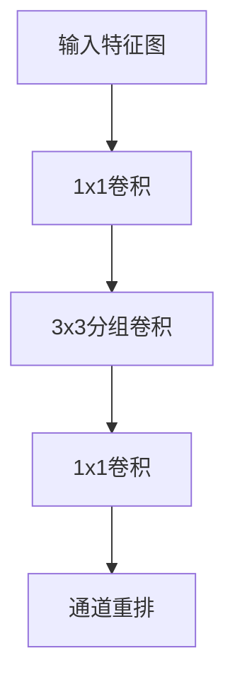

## 1. 背景介绍

在计算机视觉领域，卷积神经网络（Convolutional Neural Network，CNN）是一种非常重要的技术。然而，CNN的计算量非常大，因此需要使用一些技术来减少计算量。ShuffleNet就是一种用于减少计算量的技术。

ShuffleNet是由微软亚洲研究院提出的一种轻量级卷积神经网络。它采用了一种新的结构，可以在保持准确率的同时，大幅度减少计算量和模型大小。ShuffleNet已经在多个领域得到了广泛的应用，例如图像分类、目标检测和语义分割等。

## 2. 核心概念与联系

ShuffleNet的核心概念是通道重排（channel shuffle）。通道重排是指将输入的特征图按通道分组，然后将每组通道中的像素打乱，最后再将所有通道合并。这种操作可以增加特征图的多样性，从而提高模型的准确率。

ShuffleNet的另一个核心概念是分组卷积（group convolution）。分组卷积是指将输入的特征图按通道分组，然后对每组通道进行卷积操作，最后将所有组的输出合并。这种操作可以减少计算量和模型大小。

ShuffleNet的结构如下图所示：



ShuffleNet的结构包括三个卷积层和一个通道重排层。其中，第一个卷积层是一个1x1的卷积层，用于降低通道数；第二个卷积层是一个3x3的分组卷积层，用于提取特征；第三个卷积层是一个1x1的卷积层，用于恢复通道数；通道重排层用于增加特征图的多样性。

## 3. 核心算法原理具体操作步骤

ShuffleNet的核心算法原理可以分为两个部分：分组卷积和通道重排。

### 分组卷积

分组卷积是指将输入的特征图按通道分组，然后对每组通道进行卷积操作，最后将所有组的输出合并。具体操作步骤如下：

1. 将输入的特征图按通道分组，每组包含g个通道。
2. 对每组通道进行卷积操作，卷积核大小为kxk。
3. 将所有组的输出合并，得到最终的输出特征图。

### 通道重排

通道重排是指将输入的特征图按通道分组，然后将每组通道中的像素打乱，最后再将所有通道合并。具体操作步骤如下：

1. 将输入的特征图按通道分组，每组包含c/g个通道。
2. 将每组通道中的像素打乱，得到新的特征图。
3. 将所有组的特征图合并，得到最终的输出特征图。

## 4. 数学模型和公式详细讲解举例说明

ShuffleNet的数学模型和公式如下：

### 分组卷积

假设输入的特征图为X，输出的特征图为Y，卷积核大小为kxk，分组数为g，则分组卷积的数学模型和公式如下：

$$Y = concat(Y_1, Y_2, ..., Y_g)$$

其中，$Y_i$表示第i组的输出特征图，计算公式如下：

$$Y_i = X_i * K_i$$

其中，$X_i$表示第i组的输入特征图，$K_i$表示第i组的卷积核。

### 通道重排

假设输入的特征图为X，输出的特征图为Y，通道数为c，分组数为g，则通道重排的数学模型和公式如下：

$$Y = concat(Y_1, Y_2, ..., Y_g)$$

其中，$Y_i$表示第i组的输出特征图，计算公式如下：

$$Y_i = shuffle(X_i)$$

其中，shuffle表示通道重排操作。

## 5. 项目实践：代码实例和详细解释说明

下面是一个使用ShuffleNet进行图像分类的代码实例：

```python
import torch
import torch.nn as nn

class ShuffleNet(nn.Module):
    def __init__(self, groups=3):
        super(ShuffleNet, self).__init__()
        self.groups = groups
        self.conv1 = nn.Conv2d(3, 24, kernel_size=1, stride=1, padding=0, bias=False)
        self.bn1 = nn.BatchNorm2d(24)
        self.relu = nn.ReLU(inplace=True)
        self.maxpool = nn.MaxPool2d(kernel_size=3, stride=2, padding=1)
        self.stage2 = self._make_stage(24, 144, 3)
        self.stage3 = self._make_stage(144, 288, 7)
        self.stage4 = self._make_stage(288, 576, 3)
        self.conv5 = nn.Conv2d(576, 1024, kernel_size=1, stride=1, padding=0, bias=False)
        self.bn5 = nn.BatchNorm2d(1024)
        self.avgpool = nn.AdaptiveAvgPool2d((1, 1))
        self.fc = nn.Linear(1024, 10)

    def _make_stage(self, in_channels, out_channels, repeat):
        layers = []
        layers.append(ShuffleBlock(in_channels, out_channels, groups=self.groups, stride=2))
        for i in range(repeat):
            layers.append(ShuffleBlock(out_channels, out_channels, groups=self.groups, stride=1))
        return nn.Sequential(*layers)

    def forward(self, x):
        x = self.conv1(x)
        x = self.bn1(x)
        x = self.relu(x)
        x = self.maxpool(x)
        x = self.stage2(x)
        x = self.stage3(x)
        x = self.stage4(x)
        x = self.conv5(x)
        x = self.bn5(x)
        x = self.relu(x)
        x = self.avgpool(x)
        x = x.view(x.size(0), -1)
        x = self.fc(x)
        return x

class ShuffleBlock(nn.Module):
    def __init__(self, in_channels, out_channels, groups, stride):
        super(ShuffleBlock, self).__init__()
        self.stride = stride
        self.groups = groups
        mid_channels = out_channels // 4
        if stride == 2:
            self.branch1 = nn.Sequential(
                nn.Conv2d(in_channels, in_channels, kernel_size=3, stride=2, padding=1, groups=groups, bias=False),
                nn.BatchNorm2d(in_channels),
                nn.Conv2d(in_channels, mid_channels, kernel_size=1, stride=1, padding=0, bias=False),
                nn.BatchNorm2d(mid_channels),
                nn.ReLU(inplace=True),
            )
            self.branch2 = nn.Sequential(
                nn.Conv2d(in_channels, mid_channels, kernel_size=1, stride=1, padding=0, bias=False),
                nn.BatchNorm2d(mid_channels),
                nn.Conv2d(mid_channels, mid_channels, kernel_size=3, stride=2, padding=1, groups=mid_channels, bias=False),
                nn.BatchNorm2d(mid_channels),
                nn.Conv2d(mid_channels, mid_channels, kernel_size=1, stride=1, padding=0, bias=False),
                nn.BatchNorm2d(mid_channels),
                nn.ReLU(inplace=True),
            )
            self.branch3 = nn.Sequential(
                nn.Conv2d(in_channels, mid_channels, kernel_size=1, stride=1, padding=0, bias=False),
                nn.BatchNorm2d(mid_channels),
                nn.ReLU(inplace=True),
            )
        else:
            self.branch1 = nn.Sequential(
                nn.Conv2d(in_channels, mid_channels, kernel_size=1, stride=1, padding=0, bias=False),
                nn.BatchNorm2d(mid_channels),
                nn.ReLU(inplace=True),
                nn.Conv2d(mid_channels, mid_channels, kernel_size=3, stride=stride, padding=1, groups=mid_channels, bias=False),
                nn.BatchNorm2d(mid_channels),
                nn.Conv2d(mid_channels, out_channels, kernel_size=1, stride=1, padding=0, bias=False),
                nn.BatchNorm2d(out_channels),
                nn.ReLU(inplace=True),
            )
            self.branch2 = nn.Sequential(
                nn.Conv2d(in_channels, mid_channels, kernel_size=1, stride=1, padding=0, bias=False),
                nn.BatchNorm2d(mid_channels),
                nn.ReLU(inplace=True),
                nn.Conv2d(mid_channels, mid_channels, kernel_size=3, stride=stride, padding=1, groups=mid_channels, bias=False),
                nn.BatchNorm2d(mid_channels),
                nn.Conv2d(mid_channels, mid_channels, kernel_size=1, stride=1, padding=0, bias=False),
                nn.BatchNorm2d(mid_channels),
                nn.ReLU(inplace=True),
            )
            self.branch3 = nn.Sequential(
                nn.Conv2d(in_channels, mid_channels, kernel_size=1, stride=1, padding=0, bias=False),
                nn.BatchNorm2d(mid_channels),
                nn.ReLU(inplace=True),
            )

    def forward(self, x):
        if self.stride == 1:
            x1, x2 = x.chunk(2, dim=1)
            out = torch.cat((x1, self.branch2(x2), self.branch3(x2)), dim=1)
        else:
            out = torch.cat((self.branch1(x), self.branch2(x), self.branch3(x)), dim=1)
        out = self.channel_shuffle(out)
        return out

    def channel_shuffle(self, x):
        batchsize, num_channels, height, width = x.data.size()
        channels_per_group = num_channels // self.groups
        x = x.view(batchsize, self.groups, channels_per_group, height, width)
        x = torch.transpose(x, 1, 2).contiguous()
        x = x.view(batchsize, -1, height, width)
        return x
```

上面的代码实现了一个使用ShuffleNet进行图像分类的模型。其中，ShuffleNet模型包括四个卷积层和一个全连接层，每个卷积层都使用了分组卷积和通道重排操作。ShuffleBlock是ShuffleNet中的基本模块，它包括三个分支，分别对应于分组卷积、1x1卷积和通道重排操作。

## 6. 实际应用场景

ShuffleNet已经在多个领域得到了广泛的应用，例如图像分类、目标检测和语义分割等。下面是一些实际应用场景的例子：

### 图像分类

ShuffleNet可以用于图像分类任务，例如在ImageNet数据集上进行分类。ShuffleNet在保持准确率的同时，大幅度减少了计算量和模型大小，因此可以在移动设备上进行实时的图像分类。

### 目标检测

ShuffleNet可以用于目标检测任务，例如在COCO数据集上进行检测。ShuffleNet可以作为检测网络的骨干网络，用于提取特征。由于ShuffleNet具有较小的计算量和模型大小，因此可以加速目标检测的过程。

### 语义分割

ShuffleNet可以用于语义分割任务，例如在Cityscapes数据集上进行分割。ShuffleNet可以作为编码器，用于提取特征。由于ShuffleNet具有较小的计算量和模型大小，因此可以加速语义分割的过程。

## 7. 工具和资源推荐

下面是一些使用ShuffleNet的工具和资源：

### PyTorch

PyTorch是一个开源的深度学习框架，可以用于实现ShuffleNet模型。PyTorch提供了丰富的API和工具，可以方便地进行模型训练和部署。

### ImageNet

ImageNet是一个大规模的图像分类数据集，可以用于训练和测试ShuffleNet模型。ImageNet包含超过1400万张图像和1000个类别，是深度学习领域的重要数据集之一。

### COCO

COCO是一个大规模的目标检测和分割数据集，可以用于训练和测试ShuffleNet模型。COCO包含超过33万张图像和80个类别，是目标检测和分割领域的重要数据集之一。

### Cityscapes

Cityscapes是一个城市场景分割数据集，可以用于训练和测试ShuffleNet模型。Cityscapes包含超过5000张图像和30个类别，是语义分割领域的重要数据集之一。

## 8. 总结：未来发展趋势与挑战

ShuffleNet是一种用于减少计算量的技术，已经在多个领域得到了广泛的应用。未来，随着移动设备和嵌入式设备的普及，ShuffleNet将会变得越来越重要。然而，ShuffleNet也面临着一些挑战，例如如何进一步减少计算量和模型大小，如何提高准确率等。

## 9. 附录：常见问题与解答

Q: ShuffleNet的优点是什么？

A: ShuffleNet的优点是可以在保持准确率的同时，大幅度减少计算量和模型大小。

Q: ShuffleNet的缺点是什么？

A: ShuffleNet的缺点是可能会降低模型的准确率。

Q: ShuffleNet可以用于哪些任务？

A: ShuffleNet可以用于图像分类、目标检测和语义分割等任务。

Q: ShuffleNet的未来发展趋势是什么？

A: ShuffleNet的未来发展趋势是进一步减少计算量和模型大小，提高准确率等。