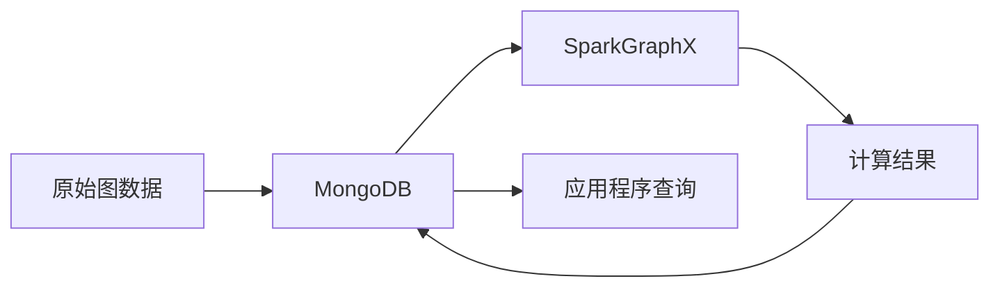

# SparkGraphX与MongoDB比较

## 1. 背景介绍
### 1.1 大数据处理的重要性
在当今大数据时代,海量数据的高效处理和分析已成为各行各业的关键需求。无论是互联网、金融、医疗还是科研领域,都面临着如何从海量数据中挖掘有价值信息的挑战。
### 1.2 图数据库与图计算引擎的兴起
传统的关系型数据库在处理高度关联的复杂数据时,效率较低且表达能力有限。近年来,图数据库和图计算引擎应运而生,为处理图结构化数据提供了高效的解决方案。
### 1.3 SparkGraphX与MongoDB的定位
SparkGraphX是一个分布式图计算引擎,基于Spark平台构建,适用于大规模图数据的并行计算。而MongoDB是一个文档型NoSQL数据库,支持灵活的数据模型和丰富的查询功能,在存储和查询图数据方面有独特优势。

## 2. 核心概念与联系
### 2.1 图的基本概念
图由顶点(Vertex)和边(Edge)组成。顶点表示实体对象,边表示实体之间的关系。一个顶点可以与多个其他顶点相连,形成复杂的关联网络。
### 2.2 SparkGraphX的核心抽象
- Graph:由一组顶点(VertexRDD)和一组边(EdgeRDD)组成的分布式数据集。
- VertexRDD:包含顶点 ID 和顶点属性。
- EdgeRDD:包含源顶点 ID、目标顶点 ID 和边属性。
- Pregel API:基于 BSP 模型的图计算编程模型,支持迭代计算。
### 2.3 MongoDB的文档模型
- 文档:MongoDB中的基本数据单元,以BSON格式存储,支持嵌套的层次结构。
- 集合:文档的逻辑容器,类似关系型数据库中的表。
- 嵌入式文档:在一个文档内嵌套另一个文档,表达多对一或一对多关系。
- 引用:通过存储其他文档的 ID 来建立文档间的关联。
### 2.4 SparkGraphX与MongoDB的互补性
SparkGraphX侧重于图数据的计算和分析,而MongoDB擅长图数据的存储和查询。将两者结合使用,可以构建完整的图数据处理流程:使用MongoDB存储原始图数据,借助SparkGraphX进行复杂的图计算,再将计算结果回写到MongoDB供应用程序查询使用。



## 3. 核心算法原理具体操作步骤
### 3.1 SparkGraphX的Pregel API
Pregel是Google提出的大规模图计算框架,SparkGraphX的Pregel API在其基础上进行了改进和实现。
#### 3.1.1 Pregel的基本思想
- 将图划分为多个分区,每个分区分配给一个处理单元。
- 通过迭代的方式对图进行计算,每次迭代称为一个超步(Superstep)。
- 在每个超步中,处理单元并行地对所负责的顶点进行计算,并通过消息传递与其他顶点通信。
- 当所有顶点都达到终止条件时,计算结束。
#### 3.1.2 Pregel API的核心方法
- initialMsg:初始化消息,在第一个超步中发送给所有顶点。
- vprog:定义每个顶点在每个超步中的计算逻辑。
- sendMsg:发送消息给其他顶点。
- mergeMsg:定义如何合并发送给同一顶点的多个消息。
#### 3.1.3 使用Pregel API的基本步骤
1. 定义图的顶点和边的数据类型。
2. 加载图数据并构建Graph对象。
3. 调用Graph.pregel方法,传入initialMsg、vprog、sendMsg和mergeMsg等参数。
4. 迭代执行图计算,直到达到终止条件。
5. 获取计算结果,可以是顶点的最终状态或聚合值。
### 3.2 MongoDB的图数据建模
#### 3.2.1 使用嵌入式文档表示图
- 每个文档表示一个顶点,包含顶点的属性和邻接顶点的列表。
- 邻接顶点可以直接嵌入到文档中,形成树状结构。
- 适合边多且查询局部性强的场景,如社交网络。
#### 3.2.2 使用引用建立顶点间关联
- 在一个集合中存储所有顶点,每个文档表示一个顶点。
- 在另一个集合中存储所有边,每个文档包含源顶点ID、目标顶点ID和边属性。
- 通过ID引用建立顶点间的关联。
- 适合边少且需要频繁更新的场景,如电商推荐。
#### 3.2.3 混合使用嵌入式文档和引用
- 对于一对多关系,可以在"一"方嵌入"多"方的列表。
- 对于多对多关系,使用独立的边集合,通过ID引用关联顶点。
- 根据查询模式选择合适的建模方式,兼顾查询性能和更新性能。

## 4. 数学模型和公式详细讲解举例说明
### 4.1 图的数学表示
图 $G$ 由顶点集 $V$ 和边集 $E$ 组成,记作 $G=(V,E)$。对于无向图,若顶点 $v_i$ 和 $v_j$ 之间存在边,则 $(v_i,v_j)\in E$;对于有向图,若存在从 $v_i$ 指向 $v_j$ 的边,则 $(v_i,v_j)\in E$。
### 4.2 图的矩阵表示
设图 $G$ 有 $n$ 个顶点,可以用一个 $n\times n$ 的邻接矩阵 $A$ 来表示图的结构:

$$
A_{ij}=\begin{cases}
1, & \text{if $(v_i,v_j)\in E$} \\
0, & \text{otherwise}
\end{cases}
$$

对于带权图,$A_{ij}$ 的值为边 $(v_i,v_j)$ 的权重。
### 4.3 PageRank算法
PageRank是一种经典的链接分析算法,用于评估网页的重要性。设一个有 $n$ 个网页的网络,PageRank值用一个 $n$ 维向量 $\mathbf{r}$ 表示,初始时 $\mathbf{r}=(\frac{1}{n},\ldots,\frac{1}{n})^T$。PageRank的计算公式为:

$$
\mathbf{r}=\alpha A^T\mathbf{r}+(1-\alpha)\mathbf{u}
$$

其中 $A$ 为归一化的邻接矩阵,$\alpha$ 为阻尼因子(通常取0.85),$\mathbf{u}$ 为均匀分布向量。通过迭代计算直到 $\mathbf{r}$ 收敛,即可得到每个网页的PageRank值。
### 4.4 标签传播算法
标签传播算法(Label Propagation)是一种基于图的半监督学习算法,用于在部分标记数据的基础上预测未标记数据的标签。设有 $n$ 个数据点,其中 $l$ 个有标签, $u=n-l$ 个无标签。令 $Y_L\in\mathbb{R}^{l\times c}$ 为有标签数据的标签矩阵,$Y_U\in\mathbb{R}^{u\times c}$ 为无标签数据的标签矩阵,$c$ 为标签类别数。标签传播的迭代公式为:

$$
Y_U^{(t+1)}=D_{UU}^{-1}S_{UL}Y_L
$$

其中 $D_{UU}$ 为无标签数据之间的度矩阵,$S_{UL}$ 为无标签数据与有标签数据之间的相似度矩阵。通过迭代更新 $Y_U$,直到收敛或达到最大迭代次数,即可得到无标签数据的预测标签。

## 5. 项目实践:代码实例和详细解释说明
### 5.1 使用SparkGraphX进行PageRank计算
```scala
import org.apache.spark.graphx._

// 加载边数据
val edges = sc.textFile("data/edges.txt").map { line =>
  val fields = line.split(" ")
  Edge(fields(0).toLong, fields(1).toLong, 1.0)
}

// 构建图
val graph = Graph.fromEdges(edges, 1.0)

// 调用pageRank API
val ranks = graph.pageRank(0.0001).vertices

// 输出结果
ranks.join(graph.vertices).map {
  case (id, (rank, _)) => (id, rank)
}.collect.foreach(println)
```
说明:
- 从文件中加载边数据,构建Edge RDD。
- 使用Graph.fromEdges方法从Edge RDD构建图。
- 调用Graph.pageRank方法计算PageRank值,设置容差为0.0001。
- 将顶点的PageRank值与顶点属性join,并输出结果。
### 5.2 使用MongoDB进行图数据查询
```javascript
// 查询指定顶点的所有邻接顶点
db.vertices.aggregate([
  { $match: { _id: "A" } },
  { $graphLookup: {
      from: "vertices",
      startWith: "$neighbors",
      connectFromField: "neighbors",
      connectToField: "_id",
      as: "adjacentVertices"
  }}
])

// 查询两个顶点之间的最短路径
db.edges.aggregate([
  { $match: {
      $or: [
        { src: "A", dst: "D" },
        { src: "D", dst: "A" }
      ]
  }},
  { $graphLookup: {
      from: "edges",
      startWith: "$dst",
      connectFromField: "dst",
      connectToField: "src",
      as: "path",
      maxDepth: 10
  }},
  { $match: {
      "path.src": "D"
  }},
  { $project: {
      _id: 0,
      path: "$path.src"
  }}
])
```
说明:
- 使用$graphLookup操作符进行图遍历查询。
- 在vertices集合中查询指定顶点的所有邻接顶点,通过neighbors字段关联。
- 在edges集合中查询两个顶点之间的最短路径,通过src和dst字段关联,限制最大深度为10。
- 使用$project操作符控制输出字段,仅返回路径上的顶点ID。

## 6. 实际应用场景
### 6.1 社交网络分析
- 使用SparkGraphX构建用户关系图,挖掘社区结构、影响力等特征。
- 使用MongoDB存储用户属性和交互记录,支持实时的个性化推荐。
### 6.2 金融风控
- 使用SparkGraphX构建企业关联图,分析潜在风险传导路径。
- 使用MongoDB存储企业基本信息和交易记录,实现灵活的多维度查询。
### 6.3 知识图谱
- 使用SparkGraphX进行大规模知识图谱的计算和挖掘,如实体链接、关系抽取等。
- 使用MongoDB存储知识图谱的实体、关系和属性,支持复杂的语义查询。
### 6.4 交通路网分析
- 使用SparkGraphX对交通路网进行建模和分析,优化线路规划、预测拥堵等。
- 使用MongoDB存储路段、站点等地理信息,支持空间索引和地理位置查询。

## 7. 工具和资源推荐
### 7.1 SparkGraphX相关资源
- 官方文档:http://spark.apache.org/docs/latest/graphx-programming-guide.html
- GraphFrames项目:基于DataFrame的图处理库,提供更高级的图算法。
- Neo4j Connector:支持在SparkGraphX和Neo4j图数据库之间传输数据。
### 7.2 MongoDB相关资源
- 官方文档:https://docs.mongodb.com/
- MongoDB Compass:官方的GUI工具,支持可视化的数据查询和管理。
- MongoDB Charts:基于MongoDB数据的可视化图表工具。
- Mongoose:流行的Node.js ODM库,简化MongoDB的操作。

## 8. 总结:未来发展趋势与挑战
### 8.1 融合图计算与图数据库
随着图数据规模的增长和应用场景的丰富,单一的图计算引擎或图数据库已难以满足所有需求。未来,图计算引擎与图数据库的深度融合将成为必然趋势,以发挥两者的协同优势。
### 8.2 支持动态图和流图
现实世界中的图数据通常是动态变化的,如社交网络中