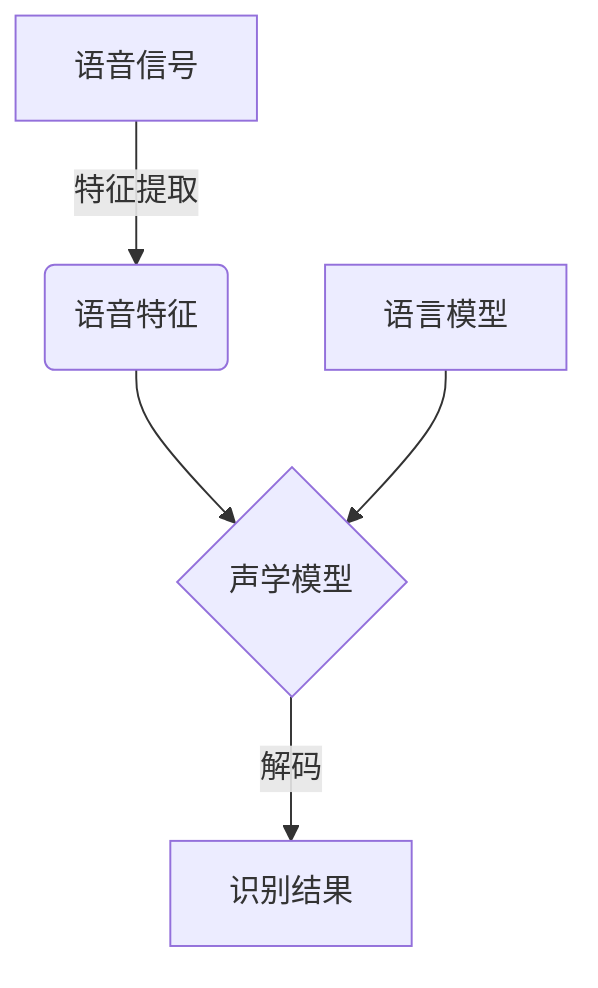

# Speech Recognition原理与代码实例讲解

## 1.背景介绍

随着人工智能技术的不断发展,语音识别(Speech Recognition)已经广泛应用于各个领域,如智能助手、语音输入法、会议记录等。语音识别技术使人机交互更加自然、高效,极大地提高了生活和工作效率。本文将深入探讨语音识别的核心原理、算法实现以及实际应用场景,为读者提供全面的理解。

## 2.核心概念与联系

语音识别的核心概念包括:

1. **语音信号**:语音信号是一种时变的模拟信号,需要先进行数字化处理。
2. **特征提取**:从语音信号中提取有效的特征参数,如梅尔频率倒谱系数(MFCC)等。
3. **声学模型**:描述语音特征与语音单元(如音素)之间的映射关系。
4. **语言模型**:描述语言序列的统计规律,用于提高识别准确率。
5. **解码器**:根据声学模型和语言模型,搜索出最可能的语音转录结果。

这些概念相互关联,共同构成了语音识别系统的核心。



## 3.核心算法原理具体操作步骤

### 3.1 语音信号预处理

1. **采样**:将连续的模拟语音信号转换为离散的数字信号。
2. **预加重**:提高高频部分的能量,补偿高频部分在传输过程中的衰减。
3. **分帧**:将语音信号划分为若干个短时间帧,每帧进行单独处理。
4. **加窗**:减少帧间的discontinuity,常用汉明窗。
5. **傅里叶变换**:将时域信号转换到频域,准备提取频域特征。

### 3.2 特征提取

MFCC(Mel Frequency Cepstral Coefficients)是最常用的语音特征参数:

1. **梅尔滤波**:将频率从线性尺度映射到梅尔尺度,模拟人耳听觉感知。
2. **取对数**:模拟人耳对响度的对数感知。
3. **离散余弦变换**:将对数谱系数压缩为低维特征向量。

### 3.3 声学建模

声学模型描述语音特征与语音单元(如音素)之间的映射关系,常用的模型有:

1. **高斯混合模型(GMM)**:使用高斯混合分布对每个音素的概率密度进行建模。
2. **深神经网络(DNN)**:使用深层神经网络直接从语音特征预测音素后验概率。

### 3.4 语言建模

语言模型描述语言序列的统计规律,提高识别准确率:

1. **N-gram模型**:基于N个词的历史计算当前词的概率。
2. **神经语言模型**:使用递归神经网络或变换器模型直接对句子进行建模。

### 3.5 解码搜索

解码器根据声学模型和语言模型,搜索出最可能的语音转录结果:

1. **维特比(Viterbi)算法**:用于小词汇量任务,搜索最可能的状态序列。
2. **束搜索(Beam Search)**:通过设置束宽限制搜索空间,用于大词汇量任务。

## 4.数学模型和公式详细讲解举例说明

### 4.1 声学模型

声学模型的目标是估计给定语音特征序列$X$对应的词序列$W$的概率$P(X|W)$。根据贝叶斯公式:

$$P(W|X) = \frac{P(X|W)P(W)}{P(X)}$$

其中$P(W)$是语言模型给出的先验概率。由于分母$P(X)$对所有$W$是相同的,我们只需要最大化$P(X|W)P(W)$。

对于GMM-HMM声学模型,我们有:

$$P(X|W) = \prod_{t=1}^{T}\sum_{j=1}^{N}c_jN(\mathbf{o}_t|\boldsymbol{\mu}_j,\boldsymbol{\Sigma}_j)$$

其中$N(\mathbf{o}_t|\boldsymbol{\mu}_j,\boldsymbol{\Sigma}_j)$是第$j$个高斯混合成分在时间$t$的输出概率,$c_j$是对应的混合系数。

对于DNN声学模型,我们使用神经网络直接估计音素后验概率:

$$P(s_t|X) = \text{DNN}(\mathbf{o}_t)$$

其中$s_t$是时间$t$的音素标签,$\mathbf{o}_t$是对应的语音特征向量。

### 4.2 语言模型

N-gram语言模型的基本思想是将一个词序列$W$的概率分解为基于前$N-1$个词来预测当前词的条件概率的乘积:

$$P(W) = \prod_{i=1}^{M}P(w_i|w_{i-N+1},\ldots,w_{i-1})$$

其中$M$是序列长度。通过计数平滑等技术来估计这些条件概率。

神经语言模型则使用神经网络直接对整个序列建模,例如使用LSTM:

$$P(W) = \prod_{i=1}^{M}P(w_i|w_1,\ldots,w_{i-1})$$
$$P(w_i|w_1,\ldots,w_{i-1}) = \text{LSTM}(w_1,\ldots,w_{i-1})$$

### 4.3 解码搜索

Viterbi算法用于在HMM模型中搜索最可能的状态序列。设$\delta_t(j)$为部分观测序列$\mathbf{o}_1,\ldots,\mathbf{o}_t$产生并在时间$t$处于状态$j$的最大概率,则有:

$$\delta_{t+1}(j) = \max_i[\delta_t(i)a_{ij}]b_j(\mathbf{o}_{t+1})$$

其中$a_{ij}$是状态转移概率,$b_j(\mathbf{o}_{t+1})$是发射概率。通过动态规划求解$\delta_T(j)$的最大值即可得到最优路径。

束搜索算法通过设置束宽$w$来限制搜索空间,降低计算复杂度。在每个时间步,只保留$w$个概率最大的部分假设路径,剪枝掉其余路径。

## 5.项目实践:代码实例和详细解释说明

下面是一个使用Python和Kaldi工具包构建的简单语音识别系统的示例代码:

```python
import kaldi_io
from kaldiio import WriteHelper

# 加载声学模型
am_rxfilename = 'final.mdl'
am_rxspec = 'scp:am.scp'
am = kaldi_io.model.LatticeFasterBatchedDecoderRecipe.read_model(am_rxfilename, am_rxspec)

# 加载语言模型
lm_rxfilename = 'lm.arpa'
lm = kaldi_io.model.ConstArpaLmDeterministicFst.read_model(lm_rxfilename)

# 加载特征
feats_rspecifier = 'scp:feats.scp'
feats = kaldi_io.util.apply_transforms('feats', feats_rspecifier)

# 解码
decoder = kaldi_io.model.LatticeFasterDecoderRecipe(am, lm)
with WriteHelper('ark,t:output.txt') as writer:
    for utterance_id, feature in feats:
        lattice = decoder.decode(feature)
        best_path = lattice.get_best_path(True)
        writer(utterance_id, best_path)
```

这个示例首先加载声学模型和语言模型,然后从特征文件中读取语音特征。接着使用Kaldi的`LatticeFasterDecoderRecipe`解码器进行解码,得到最优路径作为识别结果。

需要注意的是,这只是一个最小示例,实际系统中还需要进行数据预处理、特征提取、模型训练等步骤。Kaldi提供了完整的工具链,支持构建生产级的语音识别系统。

## 6.实际应用场景

语音识别技术在现实生活中有着广泛的应用,包括但不限于:

1. **智能助手**:如苹果Siri、谷歌助手、亚马逊Alexa等,通过语音交互提供查询、控制等服务。
2. **语音输入法**:替代传统键盘输入,提高输入效率。
3. **会议记录**:自动将会议内容转录为文字记录。
4. **语音导航**:驾车时通过语音指令进行导航操作。
5. **无人值守**:如银行语音助手、呼叫中心语音服务等。
6. **辅助通信**:帮助失聪、失语人士进行交流。
7. **多媒体字幕**:自动为视频、影片生成字幕。

随着技术不断进步,语音识别的应用场景将越来越广泛,给我们的生活和工作带来极大便利。

## 7.工具和资源推荐

对于想要学习和实践语音识别技术的读者,这里推荐一些有用的工具和资源:

1. **Kaldi**: 一个成熟的开源语音识别工具包,提供完整的工具链。
2. **CMU Sphinx**: 卡内基梅隆大学开发的语音识别引擎。
3. **DeepSpeech**: Mozilla开源的基于深度学习的语音识别引擎。
4. **CSAIL**: MIT的语音与语言处理课程资源。
5. **VoiceBase**: 提供语音识别API和云服务的公司。
6. **Towards Data Science**: 一个分享数据科学知识的在线社区,有很多语音识别相关的文章。

利用这些资源,读者可以快速入门语音识别领域,掌握实践技能。

## 8.总结:未来发展趋势与挑战

语音识别技术仍在快速发展中,未来可期的发展趋势包括:

1. **端到端模型**:直接从语音信号到文本转录,避免传统系统的多个模块和误差传递。
2. **多语种支持**:支持更多语种,特别是资源缺乏语种。
3. **情景识别**:整合视觉、语义等信息,提高识别准确性。
4. **个性化模型**:针对不同场景、说话人等训练个性化模型。
5. **在线学习**:持续学习新数据,不断提升模型性能。
6. **压缩模型**:在保证精度的情况下,压缩模型尺寸以适应移动端等设备。

与此同时,语音识别也面临一些挑战,如噪声环境、口音差异、领域数据缺乏等,需要通过算法创新和数据扩充等方法来解决。

展望未来,语音识别技术必将越来越智能、泛在、人性化,为人类生活带来全新的体验。

## 9.附录:常见问题与解答

1. **语音识别的准确率有多高?**

语音识别的准确率因任务复杂程度而有很大差异。在清晰无噪声的环境下,识别单词或短语的准确率可达95%以上。但在嘈杂环境、口音差异等情况下,准确率会大幅下降。提高准确率是语音识别领域的一个永恒主题。

2. **语音识别需要大量数据吗?**

是的,语音识别系统需要大量高质量的语音数据进行训练,尤其是深度学习模型。数据越多,模型的泛化能力越强。但对于资源缺乏的语种,如何利用少量数据训练出有效模型也是一个重要研究方向。

3. **语音识别系统如何处理噪声?**

噪声是语音识别的一大挑战。常用的方法包括:噪声检测和降噪预处理、鲁棒特征提取、基于深度学习的语音增强等。此外,收集包含噪声的数据进行训练,也可以提高模型的鲁棒性。

4. **语音识别与语音合成有什么关系?**

语音识别和语音合成是语音处理领域的两个不同任务。语音识别是将语音转录为文本,而语音合成则是将文本转换为语音。两者有一些共同的基础知识,如声学建模等,但也有很多不同之处。

5. **语音识别系统如何支持多语种?**

支持多语种是语音识别的一个重要目标。通常需要为每种语言训练单独的声学模型和语言模型。跨语种迁移学习和少样本适应等技术也可以帮助快速构