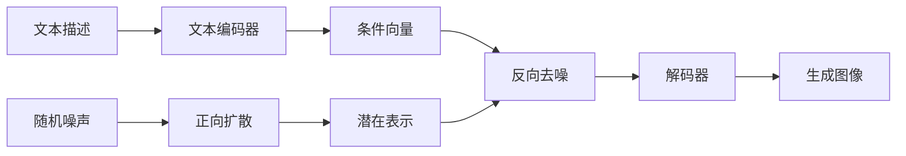

# Stable Diffusion原理与代码实例讲解

## 1.背景介绍

### 1.1 什么是Stable Diffusion

Stable Diffusion是由Stability AI公司开发的一种基于扩散模型的文本到图像(Text-to-Image)的人工智能生成模型。它可以根据给定的文本描述生成高质量、高分辨率的图像。Stable Diffusion的一大特点是可以在消费级的GPU上进行训练和推理，大大降低了使用门槛。

### 1.2 Stable Diffusion的发展历程

- 2022年8月，Stability AI发布了Stable Diffusion v1模型和代码，引起了广泛关注。
- 2022年11月，Stability AI发布了Stable Diffusion v2模型，生成效果进一步提升。
- 2023年3月，Stability AI开源了Stable Diffusion的训练代码，允许用户在自己的数据集上进行微调。

### 1.3 Stable Diffusion的应用场景

- 游戏、电影、动画等领域的概念设计和创意生成
- 时尚、家居、工业设计等领域的设计灵感生成 
- 广告、营销等领域的图像素材快速生成
- 医学影像分析、天体物理模拟等科研领域

## 2.核心概念与联系

### 2.1 扩散模型(Diffusion Model)

扩散模型是一类生成模型，通过迭代地添加高斯噪声并去噪，从随机噪声开始逐步生成高质量的图像。扩散模型主要包含正向扩散过程和反向去噪过程两个阶段。

### 2.2 潜在空间(Latent Space)

潜在空间是一个低维度的隐空间，可以看作是图像的压缩表示。扩散模型在潜在空间中对图像进行建模和操作，然后再通过解码器映射回像素空间得到最终的图像。

### 2.3 文本编码器(Text Encoder)

文本编码器负责将输入的文本描述映射为潜在空间中的条件向量，为图像生成提供语义指导。Stable Diffusion使用了基于Transformer的CLIP文本编码器。

### 2.4 自注意力(Self-Attention)

自注意力机制能够建模输入序列内部的长距离依赖关系，在Transformer等模型中被广泛使用。Stable Diffusion的U-Net主干网络中大量使用了自注意力层。

### 2.5 概念联系图

下面是Stable Diffusion核心概念之间的联系Mermaid流程图：



## 3.核心算法原理具体操作步骤

### 3.1 正向扩散过程

1. 从原始图像 $x_0$ 开始，迭代地添加高斯噪声，得到一系列越来越嘈杂的图像 $x_1, x_2, ..., x_T$。
2. 噪声添加公式：$x_t = \sqrt{\alpha_t} x_{t-1} + \sqrt{1 - \alpha_t} \epsilon_t$
   - $\alpha_t$ 是噪声系数，控制每一步添加的噪声量
   - $\epsilon_t$ 是从标准正态分布采样的噪声
3. 重复步骤2，直到得到纯噪声图像 $x_T$

### 3.2 反向去噪过程

1. 从纯噪声图像 $x_T$ 开始，迭代地去除噪声，得到一系列越来越清晰的图像 $\hat{x}_{T-1}, \hat{x}_{T-2}, ..., \hat{x}_0$。
2. 去噪过程通过神经网络 $\epsilon_\theta$ 估计噪声，然后从噪声图像中减去噪声：

$$
\begin{aligned}
\hat{x}_{t-1} &= \frac{1}{\sqrt{\alpha_t}} \left( x_t - \frac{1 - \alpha_t}{\sqrt{1 - \bar{\alpha}_t}} \epsilon_\theta(x_t, c, t) \right) \\
\hat{x}_{t-1} &= x_t - \frac{1 - \alpha_t}{\sqrt{1 - \bar{\alpha}_t}} \epsilon_\theta(x_t, c, t)
\end{aligned}
$$

其中，$c$ 是文本条件向量，$\bar{\alpha}_t = \prod_{s=1}^t \alpha_s$。

3. 重复步骤2，直到得到最终的生成图像 $\hat{x}_0$

### 3.3 训练过程

训练扩散模型的目标是学习神经网络 $\epsilon_\theta$，使其能够从噪声图像 $x_t$ 估计出噪声 $\epsilon$。损失函数为估计噪声与真实噪声的均方误差(MSE)：

$$
L = \mathbb{E}_{x_0, \epsilon, t} \left[ \| \epsilon - \epsilon_\theta(x_t, c, t) \|^2 \right]
$$

其中，$x_0$ 是原始图像，$\epsilon$ 是添加的噪声，$t$ 是扩散步数，$c$ 是文本条件向量。

## 4.数学模型和公式详细讲解举例说明

### 4.1 正向扩散过程数学模型

正向扩散过程可以看作是一个马尔可夫链，每一步的状态只依赖于前一步的状态。给定扩散步数 $t$，可以直接从原始图像 $x_0$ 采样得到噪声图像 $x_t$：

$$
q(x_t|x_0) = \mathcal{N}(x_t; \sqrt{\bar{\alpha}_t} x_0, (1 - \bar{\alpha}_t) \mathbf{I})
$$

其中，$\bar{\alpha}_t = \prod_{s=1}^t \alpha_s$，$\mathbf{I}$ 是单位矩阵。

例如，假设原始图像为 $x_0 = [1, 2, 3]$，噪声系数为 $\alpha_1 = 0.9, \alpha_2 = 0.8$，则有：

$$
\begin{aligned}
\bar{\alpha}_1 &= \alpha_1 = 0.9 \\
\bar{\alpha}_2 &= \alpha_1 \alpha_2 = 0.72 \\
q(x_1|x_0) &= \mathcal{N}(x_1; \sqrt{0.9} [1, 2, 3], 0.1 \mathbf{I}) \\
q(x_2|x_0) &= \mathcal{N}(x_2; \sqrt{0.72} [1, 2, 3], 0.28 \mathbf{I})
\end{aligned}
$$

### 4.2 反向去噪过程数学模型

反向去噪过程的目标是从噪声图像 $x_t$ 恢复出原始图像 $x_0$。根据贝叶斯定理，可以得到后验分布：

$$
p_\theta(x_{t-1}|x_t) = \frac{p_\theta(x_t|x_{t-1}) p_\theta(x_{t-1})}{p_\theta(x_t)}
$$

其中，$p_\theta(x_t|x_{t-1})$ 是扩散模型的生成分布，$p_\theta(x_{t-1})$ 是先验分布，通常假设为标准正态分布。

在实践中，我们通过神经网络 $\epsilon_\theta$ 来估计噪声，然后从噪声图像中减去噪声得到去噪后的图像：

$$
\hat{x}_{t-1} = \frac{1}{\sqrt{\alpha_t}} \left( x_t - \frac{1 - \alpha_t}{\sqrt{1 - \bar{\alpha}_t}} \epsilon_\theta(x_t, c, t) \right)
$$

例如，假设 $x_2 = [4, 5, 6]$，噪声系数为 $\alpha_2 = 0.8$，$\bar{\alpha}_2 = 0.72$，神经网络估计的噪声为 $\epsilon_\theta(x_2, c, 2) = [1, 1, 1]$，则去噪后的图像为：

$$
\begin{aligned}
\hat{x}_1 &= \frac{1}{\sqrt{0.8}} \left( [4, 5, 6] - \frac{1 - 0.8}{\sqrt{1 - 0.72}} [1, 1, 1] \right) \\
&= [3.04, 4.04, 5.04]
\end{aligned}
$$

## 5.项目实践：代码实例和详细解释说明

下面是使用PyTorch实现Stable Diffusion的核心代码，包括正向扩散、反向去噪和训练过程：

```python
import torch
import torch.nn as nn

class DiffusionModel(nn.Module):
    def __init__(self, noise_schedule, text_encoder, unet):
        super().__init__()
        self.noise_schedule = noise_schedule
        self.text_encoder = text_encoder
        self.unet = unet
    
    def forward(self, x, t, c):
        # 正向扩散过程
        noise = torch.randn_like(x)
        sqrt_alpha_bar = torch.sqrt(self.noise_schedule.alpha_bars[t])
        sqrt_one_minus_alpha_bar = torch.sqrt(1 - self.noise_schedule.alpha_bars[t])
        x_t = sqrt_alpha_bar * x + sqrt_one_minus_alpha_bar * noise
        
        # 估计噪声
        c = self.text_encoder(c)
        noise_pred = self.unet(x_t, t, c)
        
        return noise, noise_pred
    
    def sample(self, shape, c, steps=50):
        # 从纯噪声开始采样
        x_t = torch.randn(shape)
        
        # 反向去噪过程
        for t in range(steps - 1, -1, -1):
            t_batch = torch.tensor([t] * shape[0], device=x_t.device)
            noise_pred = self.unet(x_t, t_batch, c)
            alpha_t = self.noise_schedule.alphas[t]
            alpha_bar_t = self.noise_schedule.alpha_bars[t]
            x_t = (x_t - (1 - alpha_t) / torch.sqrt(1 - alpha_bar_t) * noise_pred) / torch.sqrt(alpha_t)
        
        return x_t
    
    def train_step(self, x_0, c):
        # 随机选择扩散步数
        t = torch.randint(0, self.noise_schedule.num_steps, (x_0.shape[0],), device=x_0.device)
        
        # 正向扩散得到噪声图像
        noise, noise_pred = self.forward(x_0, t, c)
        
        # 计算损失函数
        loss = nn.functional.mse_loss(noise_pred, noise)
        
        return loss
```

代码解释：

1. `DiffusionModel` 类定义了扩散模型，包含噪声时间表 `noise_schedule`、文本编码器 `text_encoder` 和U-Net主干网络 `unet`。
2. `forward` 方法实现了正向扩散过程，根据噪声时间表和随机噪声得到噪声图像 `x_t`，然后使用U-Net估计噪声。
3. `sample` 方法实现了反向去噪采样过程，从纯噪声开始，迭代地去除噪声，最终得到生成图像。
4. `train_step` 方法定义了一次训练迭代，随机选择扩散步数，进行正向扩散得到噪声图像和噪声估计，然后计算均方误差损失函数。

在实际使用中，还需要定义噪声时间表 `noise_schedule`、文本编码器 `text_encoder` 和U-Net网络 `unet`，并加载预训练权重。然后就可以使用 `sample` 方法根据文本提示生成图像，或者使用 `train_step` 方法在自己的数据集上进行微调。

## 6.实际应用场景

Stable Diffusion 可以应用于以下场景：

### 6.1 游戏、电影、动画等领域的概念设计和创意生成

- 快速生成大量不同风格的概念图，供艺术家参考和细化
- 根据剧本或脚本生成故事插图和分镜头，辅助前期策划

### 6.2 时尚、家居、工业设计等领域的设计灵感生成

- 根据文字描述生成各种服装、家具、产品的设计方案，激发设计灵感
- 自动生成不同色彩搭配和材质组合，帮助设计师快速迭代

### 6.3 广告、营销等领域的图像素材快速生成

- 根据文案自动生成多样化的广告图片，提高制作效率
- 自动生成不同风格的品牌插画和视觉元素，丰富营销内容

### 6.4 医学影像分析、天体物理模拟等科研领域

- 根据医学报告自动生成医学插图，辅助医生诊断和患者沟通
- 根据物理方