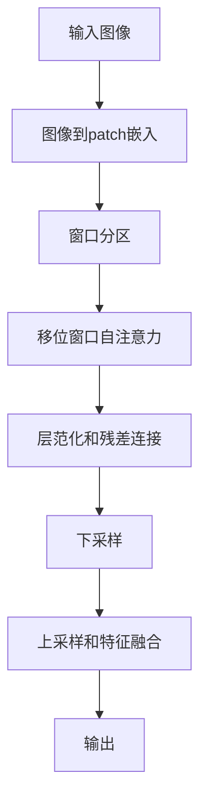

# SwinTransformer在图像增强中的应用

## 1.背景介绍

随着深度学习技术的不断发展,视觉任务的性能也在不断提升。卷积神经网络(CNN)在图像处理领域取得了巨大的成功,但其固有的局限性也逐渐暴露出来。例如,CNN难以有效捕捉长程依赖关系,并且计算效率较低。为了解决这些问题,Transformer被引入到计算机视觉领域,展现出了优异的性能。

作为一种全新的注意力机制模型,Transformer能够直接建模长程依赖关系,并通过自注意力机制来捕获全局信息。然而,标准的Transformer结构在处理高分辨率图像时存在计算复杂度高、内存消耗大等问题。为了解决这个难题,SwinTransformer被提出,它是第一个专门为计算机视觉任务设计的Transformer模型。

## 2.核心概念与联系

### 2.1 Transformer

Transformer最初被设计用于自然语言处理(NLP)任务,是一种基于注意力机制的序列到序列模型。与RNN和CNN不同,Transformer完全依赖于注意力机制来捕获输入和输出之间的全局依赖关系。

Transformer的核心组件是多头自注意力机制和位置编码。多头自注意力机制允许模型关注整个输入序列的不同表示,而位置编码则为序列中的每个元素赋予位置信息。

### 2.2 视觉Transformer(ViT)

视觉Transformer(ViT)是将Transformer直接应用于图像的尝试。ViT将图像分割为一系列patches(图像块),并将这些patches线性映射到一个向量序列,作为Transformer的输入。ViT在图像分类等任务上表现出色,证明了Transformer在计算机视觉领域的潜力。

### 2.3 SwinTransformer

尽管ViT取得了不错的成绩,但它在处理高分辨率图像时仍然存在计算复杂度高、内存消耗大的问题。为了解决这一难题,SwinTransformer被提出。

SwinTransformer的核心思想是将图像分割为非重叠的窗口,在窗口内计算自注意力,而在窗口之间则通过移位窗口自注意力(Shifted Window Attention)来建立联系。这种分而治之的策略大大降低了计算复杂度,同时保留了捕获长程依赖关系的能力。

## 3.核心算法原理具体操作步骤

### 3.1 图像到patch嵌入

与ViT类似,SwinTransformer首先将输入图像分割为一系列非重叠的patches(图像块)。每个patch通过一个线性投影层映射到一个固定维度的向量,形成patch嵌入序列。

### 3.2 窗口分区

SwinTransformer将patch嵌入序列划分为多个非重叠的窗口。在每个窗口内,计算标准的多头自注意力,以建模patch之间的关系。这种局部计算大大降低了计算复杂度。

### 3.3 移位窗口自注意力

为了在窗口之间建立联系,SwinTransformer引入了移位窗口自注意力(Shifted Window Attention)机制。具体来说,在每个Transformer块的开始,将patch嵌入序列按照一定的移位步长进行循环移位,从而使得每个窗口都包含了一些新的patch。这种移位操作确保了不同窗口之间的信息交换,并且保留了注意力机制的优势。

### 3.4 层范化和残差连接

在每个Transformer块中,SwinTransformer采用了层范化(Layer Normalization)和残差连接(Residual Connection)。层范化有助于加速训练收敛,而残差连接则有利于梯度反向传播,缓解了深度模型的梯度消失问题。

### 3.5 上采样和特征融合

对于下采样操作,SwinTransformer采用了标准的卷积操作。而在上采样时,SwinTransformer使用了一种特殊的移位窗口反卷积(Shifted Window Reverse Convolution)。这种操作不仅可以恢复特征图的分辨率,还能够融合来自不同尺度的特征信息。

上述步骤可以用下面的流程图来总结:



## 4.数学模型和公式详细讲解举例说明

### 4.1 多头自注意力

多头自注意力是Transformer的核心组件之一,它允许模型同时关注输入序列的不同表示子空间。具体来说,给定一个查询向量$\mathbf{q}$、键向量$\mathbf{K}$和值向量$\mathbf{V}$,多头自注意力的计算过程如下:

$$\begin{aligned}
\text{MultiHead}(\mathbf{Q}, \mathbf{K}, \mathbf{V}) &= \text{Concat}(\text{head}_1, \ldots, \text{head}_h)\mathbf{W}^O\\
\text{where}\  \text{head}_i &= \text{Attention}(\mathbf{QW}_i^Q, \mathbf{KW}_i^K, \mathbf{VW}_i^V)
\end{aligned}$$

其中,$\mathbf{W}_i^Q \in \mathbb{R}^{\frac{d_\text{model}}{h} \times d_k}$、$\mathbf{W}_i^K \in \mathbb{R}^{\frac{d_\text{model}}{h} \times d_k}$和$\mathbf{W}_i^V \in \mathbb{R}^{\frac{d_\text{model}}{h} \times d_v}$分别是查询、键和值的线性投影矩阵。$\text{Attention}(\cdot)$函数计算缩放点积注意力:

$$\text{Attention}(\mathbf{Q}, \mathbf{K}, \mathbf{V}) = \text{softmax}\left(\frac{\mathbf{QK}^\top}{\sqrt{d_k}}\right)\mathbf{V}$$

其中,$\sqrt{d_k}$是用于缩放点积的因子,以防止内积值过大导致softmax函数的梯度较小。

### 4.2 移位窗口自注意力

移位窗口自注意力是SwinTransformer的核心创新之一。具体来说,给定一个patch嵌入序列$\mathbf{X} \in \mathbb{R}^{N \times C}$,其中$N$是patch的数量,$C$是patch嵌入的维度。我们将$\mathbf{X}$划分为$M$个非重叠的窗口$\{\mathbf{X}_m^{(0)}\}_{m=1}^M$,其中$\mathbf{X}_m^{(0)} \in \mathbb{R}^{n \times C}$,而$n$是每个窗口中patch的数量。

在每个Transformer块的开始,我们对窗口进行循环移位:

$$\mathbf{X}_m^{(1)} = \text{shift}(\mathbf{X}_m^{(0)})$$

其中,$\text{shift}(\cdot)$是一个循环移位操作,它将窗口中的patch按照一定的步长进行移位。移位后的窗口$\{\mathbf{X}_m^{(1)}\}_{m=1}^M$被送入多头自注意力模块进行计算:

$$\mathbf{Y}_m = \text{MultiHead}(\mathbf{X}_m^{(1)}\mathbf{W}_Q, \mathbf{X}_m^{(1)}\mathbf{W}_K, \mathbf{X}_m^{(1)}\mathbf{W}_V)$$

其中,$\mathbf{W}_Q$、$\mathbf{W}_K$和$\mathbf{W}_V$分别是查询、键和值的线性投影矩阵。最后,我们对移位后的窗口进行反移位操作,得到最终的输出:

$$\mathbf{Z} = \text{reverse\_shift}(\{\mathbf{Y}_m\}_{m=1}^M)$$

通过这种移位窗口自注意力机制,SwinTransformer能够在窗口之间建立联系,同时保持了较低的计算复杂度。

## 5.项目实践:代码实例和详细解释说明

以下是使用PyTorch实现SwinTransformer的核心模块的示例代码:

```python
import torch
import torch.nn as nn

class WindowAttention(nn.Module):
    def __init__(self, dim, window_size, num_heads):
        super().__init__()
        self.dim = dim
        self.window_size = window_size  
        self.num_heads = num_heads
        self.scale = (dim // num_heads) ** -0.5

        self.qkv = nn.Linear(dim, dim * 3, bias=True)
        self.attn_drop = nn.Dropout(0.0)
        self.proj = nn.Linear(dim, dim)
        self.proj_drop = nn.Dropout(0.0)

        self.softmax = nn.Softmax(dim=-1)

    def forward(self, x, mask=None):
        B, N, C = x.shape
        qkv = self.qkv(x).reshape(B, N, 3, self.num_heads, C // self.num_heads).permute(2, 0, 3, 1, 4)
        q, k, v = qkv[0], qkv[1], qkv[2]

        q = q * self.scale
        attn = (q @ k.transpose(-2, -1))

        if mask is not None:
            nW = mask.shape[0]
            attn = attn.view(B // nW, nW, self.num_heads, N, N) + mask.unsqueeze(1).unsqueeze(0)
            attn = attn.view(-1, self.num_heads, N, N)
        attn = self.softmax(attn)
        attn = self.attn_drop(attn)

        x = (attn @ v).transpose(1, 2).reshape(B, N, C)
        x = self.proj(x)
        x = self.proj_drop(x)
        return x

class ShiftedWindowAttention(WindowAttention):
    def __init__(self, dim, window_size, num_heads, shift_size=0):
        super().__init__(dim, window_size, num_heads)
        self.shift_size = shift_size

    def forward(self, x, mask=None):
        B, N, C = x.shape
        window_size = self.window_size
        shift_size = self.shift_size
        
        if shift_size > 0:
            shifted_x = torch.roll(x, shifts=(-shift_size, -shift_size), dims=(1, 2))
        else:
            shifted_x = x

        # Partition windows
        x_windows = window_partition(shifted_x, window_size)  
        x_windows = x_windows.view(-1, window_size * window_size, C)  

        # Window attention
        attn_windows = self.forward(x_windows, mask)  

        # Merge windows
        attn_windows = attn_windows.view(-1, window_size, window_size, C)
        shifted_x = window_reverse(attn_windows, window_size, B, N)  

        # Reverse cyclic shift
        if shift_size > 0:
            x = torch.roll(shifted_x, shifts=(shift_size, shift_size), dims=(1, 2))
        else:
            x = shifted_x
        return x
```

上面的代码实现了SwinTransformer中的窗口注意力(WindowAttention)和移位窗口注意力(ShiftedWindowAttention)模块。

- `WindowAttention`模块实现了标准的多头自注意力机制,用于在每个窗口内计算自注意力。
- `ShiftedWindowAttention`模块继承自`WindowAttention`,它在计算自注意力之前,先对输入进行循环移位操作,以引入跨窗口的信息交换。

这两个模块是SwinTransformer的核心组件,它们共同实现了移位窗口自注意力机制。在实际应用中,这些模块会被集成到SwinTransformer的Transformer块中,与其他组件(如层范化和残差连接)一起构建完整的模型。

## 6.实际应用场景

SwinTransformer已经在多个计算机视觉任务中取得了卓越的表现,包括图像分类、目标检测、语义分割等。以下是一些具体的应用场景:

### 6.1 图像分类

在ImageNet数据集上,SwinTransformer在Top-1准确率上达到了88.7%的性能,超过了当时最先进的卷积神经网络模型。这证明了SwinTransformer在图像分类任务上的优异表现。

### 6.2 目标检测

SwinTransformer也被应用于目标检测任务,例如在COCO数据集上,它取得了58.7%的AP性能,超过了当时最先进的基于CNN的目标检测模型。

### 6.3 语义分割

在ADE20K语义分割数据集上,SwinTransformer取得了55.3%的mIoU分数,展现了其在像素级密集预测任务上的优异能力。

### 6.4 其他应用

除了上述任务外,SwinTransformer还