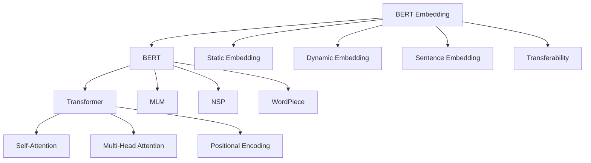

# Transformer大模型实战 BERT 嵌入的生成

## 1.背景介绍

### 1.1 Transformer模型的发展历程

Transformer模型自2017年由Google提出以来，迅速成为自然语言处理(NLP)领域的研究热点。它摒弃了传统的RNN和CNN等序列模型,转而采用自注意力机制(Self-Attention)来捕捉文本中的长距离依赖关系,大大提升了模型的并行计算效率和泛化能力。

### 1.2 BERT模型的诞生与影响

2018年,Google在Transformer的基础上进一步提出了BERT(Bidirectional Encoder Representations from Transformers)模型。BERT采用了双向Transformer编码器结构,通过Masked Language Model和Next Sentence Prediction两个预训练任务,在大规模无标注语料上进行预训练,可以学习到更加通用和鲁棒的语言表征。BERT一经推出便在多个NLP任务上取得了SOTA的效果,掀起了预训练语言模型的研究热潮。

### 1.3 BERT在下游任务中的应用

得益于其强大的语义理解和语言建模能力,BERT在文本分类、序列标注、阅读理解、机器翻译等诸多NLP任务中得到了广泛应用。通过在特定任务数据上进行微调(Fine-tuning),BERT可以快速适应不同的应用场景,极大地降低了任务适配的成本。然而,对于一些对效率要求较高的在线服务,BERT的推理速度仍然是一个瓶颈。

### 1.4 BERT嵌入生成的意义

为了进一步提升BERT的推理效率,一种可行的思路是预先生成BERT词向量/句向量嵌入(Embedding),将其保存并用于下游任务。这样可以避免每次推理都需要运行耗时的BERT前向计算,从而大幅提升推理速度。此外,预生成的BERT嵌入还可以方便地与其他特征进行融合,用于构建更加复杂的模型。因此,探索高效的BERT嵌入生成方法具有重要的研究价值和实用意义。

## 2.核心概念与联系

### 2.1 Transformer的核心概念

- Transformer:一种基于自注意力机制的序列到序列模型框架。
- Self-Attention:通过计算序列内部不同位置之间的注意力权重,捕捉长距离依赖关系。
- Multi-Head Attention:将输入进行多次线性变换后,并行计算多个注意力函数,增强模型的表达能力。
- 位置编码(Positional Encoding):为每个输入位置添加一个固定的位置向量,引入序列的位置信息。

### 2.2 BERT的核心概念

- BERT:基于双向Transformer编码器的预训练语言模型。
- MLM(Masked Language Model):通过随机Mask输入的部分Token,预测这些位置的原始Token,学习上下文信息。
- NSP(Next Sentence Prediction):预测两个句子在原文中是否相邻,学习句间关系。
- WordPiece:一种基于统计的子词切分算法,可以缓解OOV问题。

### 2.3 BERT嵌入的核心概念

- 静态词嵌入:预先生成的词向量,在使用时保持不变。如Word2Vec、GloVe等。
- 动态词嵌入:根据上下文动态调整的词向量,如BERT、ELMo等。 
- 句嵌入:将句子映射到固定维度向量空间的方法,如平均词嵌入、[CLS]向量等。
- 可迁移性:预训练嵌入在不同任务上的适用性和效果提升能力。

### 2.4 各概念之间的联系



从上面的概念联系图可以看出,Transformer是BERT的核心组件,Self-Attention、Multi-Head Attention和Positional Encoding是Transformer的关键技术。而MLM、NSP和WordPiece则是BERT预训练的核心任务和切分算法。BERT Embedding继承了BERT强大的语义理解能力,同时兼具静态词嵌入的高效性和动态词嵌入的上下文相关性。此外,BERT Embedding还可以用于构建句嵌入,具有较好的可迁移性。

## 3.核心算法原理具体操作步骤

### 3.1 BERT模型的前向计算流程

1. 将输入文本进行WordPiece切分,映射为词典中的Token ID序列。
2. 在Token序列的首尾分别添加[CLS]和[SEP]特殊Token。
3. 将Token ID序列转换为WordPiece Embedding,并与Position Embedding、Segment Embedding相加作为输入。
4. 将输入通过多层Transformer Encoder进行编码,得到每个位置的隐层状态。
5. 取[CLS]位置的隐层状态作为整个输入序列的语义表征,用于下游任务。

### 3.2 生成BERT词嵌入的步骤

1. 加载预训练的BERT模型和词典文件。
2. 构建待嵌入的词语列表,并转换为WordPiece Token列表。
3. 将每个Token输入BERT模型,计算其隐层状态。可选的层包括:
   - 最后一层的隐层状态
   - 最后几层隐层状态的平均值或加权和
   - 所有层隐层状态的平均值或加权和
4. 将每个Token的隐层状态作为其对应的词嵌入向量。
5. 将词嵌入向量保存为文件,用于后续任务。

### 3.3 生成BERT句嵌入的步骤

1. 加载预训练的BERT模型和词典文件。
2. 将输入句子进行WordPiece切分,转换为Token ID序列。
3. 在序列首尾添加[CLS]和[SEP]特殊Token。
4. 将序列输入BERT模型进行前向计算,得到每个位置的隐层状态。
5. 根据需要,选取合适的句嵌入生成方式:
   - 取[CLS]位置的隐层状态作为句嵌入
   - 对所有Token的隐层状态做池化操作(如平均、最大)得到定长句嵌入
6. 将句嵌入向量保存为文件,用于后续任务。

## 4.数学模型和公式详细讲解举例说明

### 4.1 Transformer的数学模型

Transformer的核心是Self-Attention机制,其数学表达式为:

$$
Attention(Q,K,V) = softmax(\frac{QK^T}{\sqrt{d_k}})V
$$

其中,$Q$,$K$,$V$分别表示Query,Key,Value矩阵,$d_k$为Key向量的维度。

在Multi-Head Attention中,上述过程被并行执行$h$次,然后将结果拼接起来:

$$
MultiHead(Q,K,V) = Concat(head_1,...,head_h)W^O \\
head_i = Attention(QW_i^Q, KW_i^K, VW_i^V)
$$

其中,$W_i^Q$,$W_i^K$,$W_i^V$,$W^O$为可学习的线性变换矩阵。

### 4.2 BERT的数学模型

BERT的预训练损失函数由MLM和NSP两部分组成:

$$
\mathcal{L} = \mathcal{L}_{MLM} + \mathcal{L}_{NSP}
$$

MLM任务的损失函数为:

$$
\mathcal{L}_{MLM} = -\sum_{i\in\mathcal{M}}\log p(w_i|w_{/i})
$$

其中,$\mathcal{M}$为被Mask的Token位置集合,$w_i$为位置$i$的原始Token,$w_{/i}$为其他位置的Token。

NSP任务的损失函数为:

$$
\mathcal{L}_{NSP} = -\log p(y|s_1,s_2)
$$

其中,$y\in\{0,1\}$表示两个句子$s_1$,$s_2$是否相邻,$p(y|s_1,s_2)$为BERT对相邻关系的预测概率。

### 4.3 BERT嵌入的数学表示

给定Token序列$\{w_1,...,w_n\}$,其WordPiece Embedding为$\{x_1,...,x_n\}$,Position Embedding为$\{p_1,...,p_n\}$,Segment Embedding为$\{s_1,...,s_n\}$,则BERT的输入表示为:

$$
h_0 = \{x_1+p_1+s_1,...,x_n+p_n+s_n\}
$$

经过$L$层Transformer Encoder后,第$l$层的隐层状态为:

$$
h_l = Transformer_l(h_{l-1}), l\in[1,L]
$$

则第$i$个Token的词嵌入可以表示为:

$$
e(w_i) = h_L[i] \quad or \quad \frac{1}{L}\sum_{l=1}^L h_l[i]
$$

整个句子的嵌入可以表示为:

$$
e(s) = h_L[CLS] \quad or \quad \frac{1}{n}\sum_{i=1}^n h_L[i] \quad or \quad \max_{i=1}^n h_L[i]
$$

## 5.项目实践：代码实例和详细解释说明

下面以Python为例,演示如何使用Hugging Face的Transformers库生成BERT词嵌入和句嵌入。

### 5.1 安装依赖库

```bash
pip install transformers torch
```

### 5.2 加载预训练BERT模型

```python
from transformers import BertTokenizer, BertModel

tokenizer = BertTokenizer.from_pretrained('bert-base-uncased')
model = BertModel.from_pretrained('bert-base-uncased')
```

这里加载了BERT Base Uncased版本的Tokenizer和Model。

### 5.3 生成BERT词嵌入

```python
def get_word_embedding(word):
    input_ids = torch.tensor(tokenizer.encode(word)).unsqueeze(0)  
    outputs = model(input_ids)
    last_hidden_states = outputs[0]  
    word_embedding = last_hidden_states[0][1:-1].mean(dim=0)
    return word_embedding.detach().numpy()
    
word = "apple"
word_embedding = get_word_embedding(word)
print(f"Word embedding of '{word}': {word_embedding}")
```

这里定义了一个`get_word_embedding`函数,输入一个单词,输出其BERT词嵌入向量。具体步骤为:

1. 将单词转换为Token ID序列,并添加批次维度。
2. 将Token ID序列输入BERT模型,得到最后一层隐层状态。
3. 去除[CLS]和[SEP]对应的隐层状态,对剩余部分在Token维度上做平均,得到定长词嵌入。
4. 将词嵌入转换为NumPy数组返回。

### 5.4 生成BERT句嵌入

```python
def get_sentence_embedding(sentence):
    input_ids = torch.tensor(tokenizer.encode(sentence)).unsqueeze(0)
    outputs = model(input_ids)
    last_hidden_states = outputs[0]
    sentence_embedding = last_hidden_states[0][0]  # Take [CLS] token embedding as sentence embedding
    return sentence_embedding.detach().numpy()

sentence = "I love eating apples."
sentence_embedding = get_sentence_embedding(sentence)
print(f"Sentence embedding of '{sentence}': {sentence_embedding}")
```

这里定义了一个`get_sentence_embedding`函数,输入一个句子,输出其BERT句嵌入向量。具体步骤为:

1. 将句子转换为Token ID序列,并添加批次维度。
2. 将Token ID序列输入BERT模型,得到最后一层隐层状态。
3. 取[CLS]位置的隐层状态作为整个句子的嵌入表示。
4. 将句嵌入转换为NumPy数组返回。

以上代码演示了使用Hugging Face的Transformers库生成BERT词嵌入和句嵌入的基本流程。在实际应用中,还可以根据需要对嵌入结果进行后处理,如归一化、降维等。

## 6.实际应用场景

BERT嵌入可以应用于以下几个典型场景:

### 6.1 文本分类

1. 将训练集和测试集中的文本转换为BERT句嵌入。
2. 将句嵌入作为特征,训练分类器模型如逻辑回归、支持向量机等。
3. 在测试集上评估分类器性能。

### 6.2 语义搜索

1. 将查询语句和候选文档转换为BERT句嵌入。 
2. 计算查询嵌入与每个文档