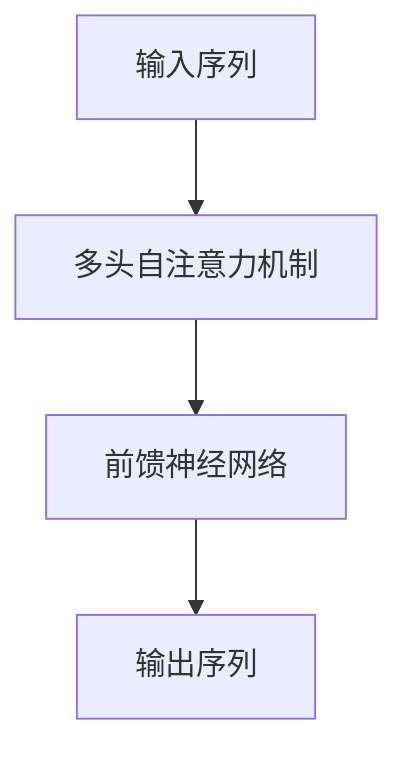
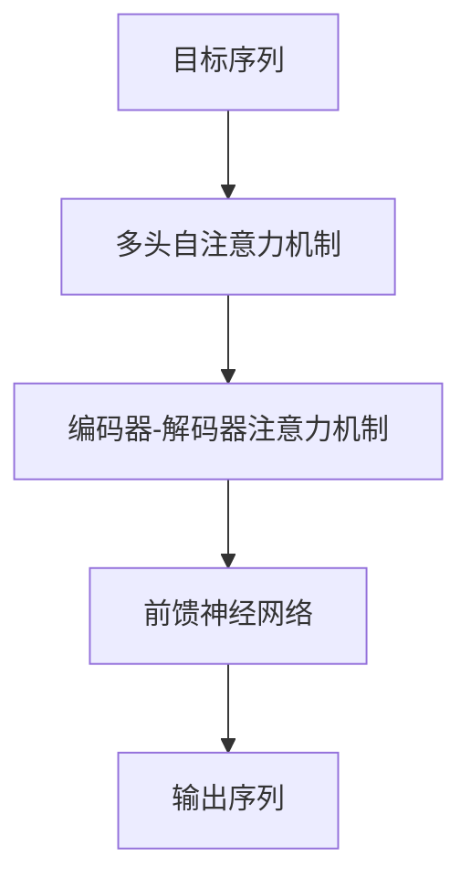
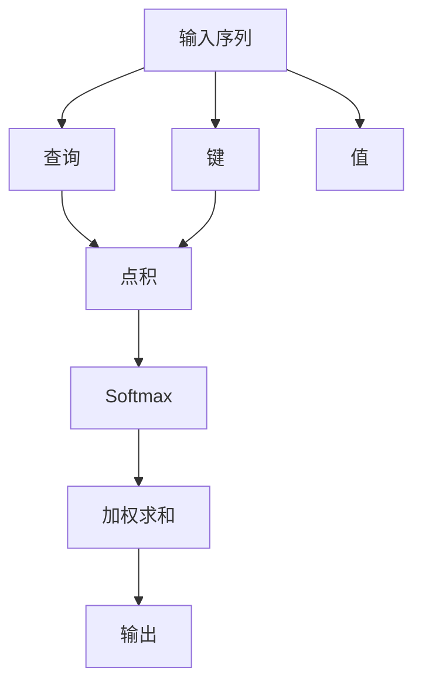

# Transformer大模型实战 ktrain库

## 1.背景介绍

在过去的几年里，Transformer模型已经成为自然语言处理（NLP）领域的主流。自从Vaswani等人在2017年提出Transformer模型以来，它在多个NLP任务中表现出了卓越的性能。Transformer模型的核心思想是基于自注意力机制（Self-Attention），它能够捕捉序列中不同位置的依赖关系，从而在处理长序列时表现出色。

然而，尽管Transformer模型在理论上非常强大，实际应用中仍然面临许多挑战。为了简化Transformer模型的应用，ktrain库应运而生。ktrain是一个轻量级的Python库，旨在帮助用户快速构建、训练和部署深度学习模型，特别是Transformer模型。

## 2.核心概念与联系

在深入探讨ktrain库之前，我们需要理解一些核心概念和它们之间的联系。

### 2.1 Transformer模型

Transformer模型是基于自注意力机制的深度学习模型。它由编码器和解码器两部分组成，每部分都包含多个层。每一层由多头自注意力机制和前馈神经网络组成。

### 2.2 自注意力机制

自注意力机制是Transformer模型的核心。它通过计算输入序列中每个位置的注意力权重，捕捉序列中不同位置之间的依赖关系。

### 2.3 ktrain库

ktrain是一个基于TensorFlow和Keras的高层次API库，旨在简化深度学习模型的构建、训练和部署。它提供了许多便捷的功能，使得用户可以快速上手并应用Transformer模型。

### 2.4 核心联系

Transformer模型和自注意力机制是ktrain库的基础。ktrain库通过封装这些复杂的底层实现，提供了简洁易用的API，使得用户可以专注于模型的应用而不是底层细节。

## 3.核心算法原理具体操作步骤

在这一部分，我们将详细介绍Transformer模型的核心算法原理和具体操作步骤。

### 3.1 编码器

编码器由多个相同的层组成，每一层包含两个子层：多头自注意力机制和前馈神经网络。



### 3.2 解码器

解码器的结构与编码器类似，但每一层多了一个额外的子层，用于接收编码器的输出。



### 3.3 自注意力机制

自注意力机制通过计算查询（Query）、键（Key）和值（Value）之间的点积，得到注意力权重，然后加权求和得到输出。



## 4.数学模型和公式详细讲解举例说明

在这一部分，我们将详细讲解Transformer模型的数学模型和公式，并通过举例说明其应用。

### 4.1 自注意力机制公式

自注意力机制的核心公式如下：

$$
\text{Attention}(Q, K, V) = \text{softmax}\left(\frac{QK^T}{\sqrt{d_k}}\right)V
$$

其中，$Q$ 是查询矩阵，$K$ 是键矩阵，$V$ 是值矩阵，$d_k$ 是键的维度。

### 4.2 多头自注意力机制

多头自注意力机制通过并行计算多个自注意力机制，然后将结果拼接起来：

$$
\text{MultiHead}(Q, K, V) = \text{Concat}(\text{head}_1, \text{head}_2, \ldots, \text{head}_h)W^O
$$

其中，$\text{head}_i = \text{Attention}(QW_i^Q, KW_i^K, VW_i^V)$，$W_i^Q$、$W_i^K$ 和 $W_i^V$ 是可学习的权重矩阵。

### 4.3 前馈神经网络

每个编码器和解码器层中的前馈神经网络由两个线性变换和一个激活函数组成：

$$
\text{FFN}(x) = \text{max}(0, xW_1 + b_1)W_2 + b_2
$$

其中，$W_1$ 和 $W_2$ 是权重矩阵，$b_1$ 和 $b_2$ 是偏置向量。

### 4.4 举例说明

假设我们有一个输入序列 $X = [x_1, x_2, x_3]$，我们首先计算查询、键和值矩阵：

$$
Q = XW^Q, \quad K = XW^K, \quad V = XW^V
$$

然后计算注意力权重：

$$
\text{Attention}(Q, K, V) = \text{softmax}\left(\frac{QK^T}{\sqrt{d_k}}\right)V
$$

最后，通过多头自注意力机制和前馈神经网络得到输出。

## 5.项目实践：代码实例和详细解释说明

在这一部分，我们将通过一个具体的项目实例，展示如何使用ktrain库构建和训练Transformer模型。

### 5.1 安装ktrain库

首先，我们需要安装ktrain库：

```bash
pip install ktrain
```

### 5.2 导入必要的库

```python
import ktrain
from ktrain import text
```

### 5.3 加载数据集

我们将使用IMDb电影评论数据集进行情感分析：

```python
dataset = text.datasets.IMDB()
(x_train, y_train), (x_test, y_test) = dataset.load_data()
```

### 5.4 构建Transformer模型

使用ktrain库构建Transformer模型非常简单：

```python
model = text.text_classifier('transformer', (x_train, y_train), preproc=preproc)
```

### 5.5 训练模型

我们可以使用ktrain库提供的fit方法训练模型：

```python
learner = ktrain.get_learner(model, train_data=(x_train, y_train), val_data=(x_test, y_test), batch_size=6)
learner.fit_onecycle(2e-5, 1)
```

### 5.6 评估模型

训练完成后，我们可以评估模型的性能：

```python
learner.validate(val_data=(x_test, y_test))
```

## 6.实际应用场景

Transformer模型和ktrain库在多个实际应用场景中表现出色。以下是一些典型的应用场景：

### 6.1 文本分类

Transformer模型在文本分类任务中表现出色，例如情感分析、垃圾邮件检测等。

### 6.2 机器翻译

Transformer模型在机器翻译任务中取得了显著的进展，例如英语到法语的翻译。

### 6.3 文本生成

Transformer模型在文本生成任务中也表现出色，例如自动生成新闻文章、对话系统等。

### 6.4 问答系统

Transformer模型在问答系统中表现出色，例如基于文本的问答、知识图谱问答等。

## 7.工具和资源推荐

在这一部分，我们将推荐一些有助于理解和应用Transformer模型和ktrain库的工具和资源。

### 7.1 官方文档

ktrain库的官方文档是了解其功能和用法的最佳资源：

- [ktrain官方文档](https://github.com/amaiya/ktrain)

### 7.2 在线课程

一些在线课程可以帮助你更深入地理解Transformer模型和ktrain库：

- [Coursera: Natural Language Processing with Attention Models](https://www.coursera.org/learn/nlp-sequence-models)

### 7.3 开源项目

一些开源项目可以帮助你更好地理解和应用Transformer模型和ktrain库：

- [Hugging Face Transformers](https://github.com/huggingface/transformers)

## 8.总结：未来发展趋势与挑战

Transformer模型和ktrain库在NLP领域取得了显著的进展，但仍然面临一些挑战和未来的发展趋势。

### 8.1 计算资源

Transformer模型的训练和推理需要大量的计算资源，如何优化计算资源的使用是一个重要的研究方向。

### 8.2 模型压缩

如何在保证模型性能的前提下，压缩模型的大小和计算复杂度，是一个重要的研究方向。

### 8.3 多模态学习

将Transformer模型应用于多模态学习，例如图像和文本的联合处理，是一个重要的发展趋势。

### 8.4 可解释性

如何提高Transformer模型的可解释性，使其决策过程更加透明，是一个重要的研究方向。

## 9.附录：常见问题与解答

在这一部分，我们将解答一些使用ktrain库和Transformer模型时常见的问题。

### 9.1 如何处理数据预处理？

ktrain库提供了便捷的数据预处理功能，可以自动处理文本数据的分词、向量化等操作。

### 9.2 如何调整模型超参数？

ktrain库提供了简单的API，可以方便地调整模型的超参数，例如学习率、批量大小等。

### 9.3 如何部署模型？

ktrain库提供了便捷的模型部署功能，可以将训练好的模型部署到生产环境中。

### 9.4 如何处理大规模数据？

对于大规模数据，建议使用分布式训练和数据并行技术，以提高训练效率。

### 9.5 如何提高模型性能？

可以通过调整模型结构、优化超参数、使用更大的预训练模型等方法，提高模型性能。

---

作者：禅与计算机程序设计艺术 / Zen and the Art of Computer Programming