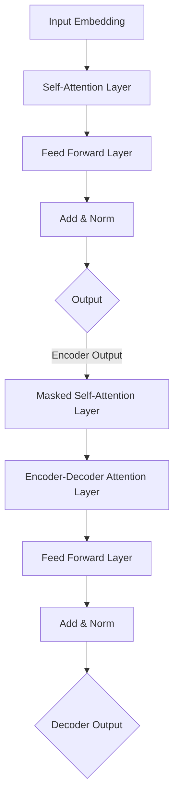

# Transformer大模型实战 探讨BERT库

## 1. 背景介绍
### 1.1 Transformer模型的发展历程
### 1.2 BERT模型的诞生与意义
### 1.3 BERT模型的广泛应用

## 2. 核心概念与联系
### 2.1 Transformer模型
#### 2.1.1 Transformer的网络结构
#### 2.1.2 自注意力机制
#### 2.1.3 位置编码
### 2.2 BERT模型  
#### 2.2.1 BERT的网络结构
#### 2.2.2 预训练任务
##### 2.2.2.1 Masked Language Model(MLM)
##### 2.2.2.2 Next Sentence Prediction(NSP)
#### 2.2.3 微调与下游任务
### 2.3 Transformer与BERT的关系

## 3. 核心算法原理具体操作步骤
### 3.1 Transformer的编码器
#### 3.1.1 输入嵌入
#### 3.1.2 自注意力层
#### 3.1.3 前馈神经网络层 
#### 3.1.4 残差连接与层归一化
### 3.2 Transformer的解码器
#### 3.2.1 Masked自注意力层
#### 3.2.2 编码-解码注意力层
#### 3.2.3 前馈神经网络层
#### 3.2.4 残差连接与层归一化
### 3.3 BERT的预训练
#### 3.3.1 输入表示
#### 3.3.2 Masked Language Model
#### 3.3.3 Next Sentence Prediction
### 3.4 BERT的微调
#### 3.4.1 下游任务的输入表示
#### 3.4.2 微调策略

## 4. 数学模型和公式详细讲解举例说明
### 4.1 自注意力机制
#### 4.1.1 缩放点积注意力
$$Attention(Q,K,V) = softmax(\frac{QK^T}{\sqrt{d_k}})V$$
#### 4.1.2 多头注意力
$$MultiHead(Q,K,V) = Concat(head_1,...,head_h)W^O$$
$$head_i=Attention(QW_i^Q, KW_i^K, VW_i^V)$$
### 4.2 前馈神经网络
$$FFN(x)=max(0, xW_1 + b_1)W_2 + b_2$$
### 4.3 层归一化
$$y=\frac{x-\mu}{\sqrt{\sigma^2+\epsilon}}\cdot\gamma+\beta$$

## 5. 项目实践：代码实例和详细解释说明
### 5.1 使用Transformers库加载BERT模型
```python
from transformers import BertTokenizer, BertModel
tokenizer = BertTokenizer.from_pretrained('bert-base-uncased')
model = BertModel.from_pretrained('bert-base-uncased')
```
### 5.2 编码文本输入
```python
text = "BERT is a powerful language model."
encoded_input = tokenizer(text, return_tensors='pt')
output = model(**encoded_input)
```
### 5.3 提取BERT特征
```python
last_hidden_states = output.last_hidden_state
pooler_output = output.pooler_output
```
### 5.4 微调BERT模型
```python
from transformers import BertForSequenceClassification
model = BertForSequenceClassification.from_pretrained('bert-base-uncased', num_labels=2)
```

## 6. 实际应用场景
### 6.1 文本分类
### 6.2 命名实体识别
### 6.3 问答系统
### 6.4 文本摘要
### 6.5 机器翻译

## 7. 工具和资源推荐
### 7.1 Transformers库
### 7.2 Hugging Face社区
### 7.3 BERT官方Github仓库
### 7.4 Google Research的BERT博客
### 7.5 相关论文和教程

## 8. 总结：未来发展趋势与挑战
### 8.1 更大更强的预训练模型
### 8.2 多模态Transformer模型
### 8.3 模型压缩与加速
### 8.4 可解释性与鲁棒性
### 8.5 面向特定领域的预训练模型

## 9. 附录：常见问题与解答
### 9.1 BERT和GPT系列模型的区别？
### 9.2 如何选择合适的BERT模型？ 
### 9.3 BERT的最佳微调实践？
### 9.4 如何处理BERT的过拟合问题？
### 9.5 BERT在推理阶段的加速方法？

Transformer模型自2017年提出以来，迅速成为自然语言处理领域的研究热点。其强大的特征提取和建模能力，使其在机器翻译、文本分类、问答系统等任务上取得了显著的性能提升。而BERT(Bidirectional Encoder Representations from Transformers)作为Transformer的重要变体，更是将预训练语言模型的性能推向了新的高度。

BERT模型采用了Transformer编码器结构，通过自注意力机制和前馈神经网络，能够高效地建模文本序列中的长距离依赖关系。同时，BERT引入了两个创新的预训练任务，即Masked Language Model(MLM)和Next Sentence Prediction(NSP)，使其能够学习到更加丰富和通用的语言表示。

MLM随机地Mask掉输入序列中的一些Token，然后训练模型来预测这些被Mask掉的Token。这使得BERT能够学习到词汇之间的上下文关系，捕捉到更加细粒度的语义信息。而NSP则通过判断两个句子在原文中是否相邻，来学习句子之间的逻辑关系，提升模型在下游任务中的推理能力。

在实际应用中，我们可以方便地使用Transformers等开源库来加载预训练的BERT模型，并根据具体任务进行微调。通过在BERT的基础上添加任务特定的输出层，并使用少量的标注数据进行训练，就能在文本分类、命名实体识别、阅读理解等任务上取得优异的效果。

BERT的成功激发了研究者们的进一步探索。如今，更大规模的预训练模型如GPT-3不断涌现，将语言模型的性能推向新的高度。多模态Transformer模型如ViLBERT等，也在图像描述、视觉问答等任务上展现出了巨大的潜力。

然而，BERT这样的大型语言模型也面临着诸多挑战。模型的巨大参数量使得训练和推理的计算开销居高不下，因此模型压缩与加速技术的研究备受关注。此外，如何提升模型的可解释性与鲁棒性，如何设计面向特定领域的预训练模型，也是当前的研究热点。

总之，Transformer与BERT为自然语言处理领域带来了革命性的变革。它们强大的语言理解和生成能力，正在不断拓展人工智能的边界。相信通过研究者们的不断探索和创新，Transformer大模型必将在更广阔的应用场景中大放异彩。



作者：禅与计算机程序设计艺术 / Zen and the Art of Computer Programming