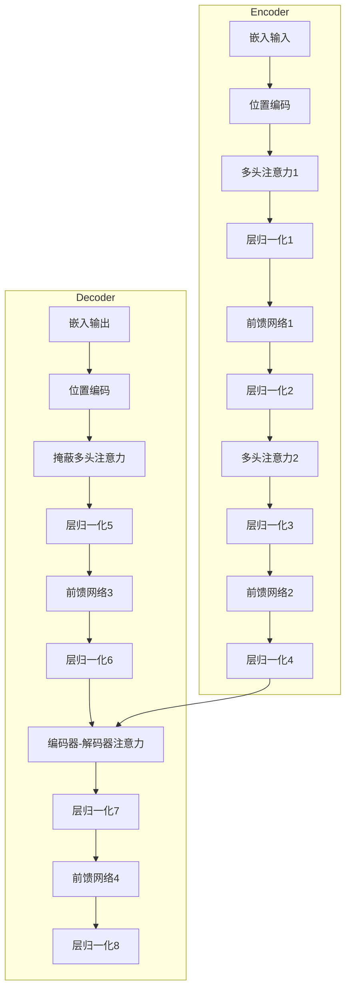

# Transformer大模型实战 汉语的BERT模型

## 1.背景介绍

在自然语言处理(NLP)领域,Transformer模型是一种革命性的新型神经网络架构,它完全依赖于注意力机制来捕捉输入序列中的长程依赖关系,而无需使用循环神经网络(RNN)或卷积神经网络(CNN)。自2017年被提出以来,Transformer模型在机器翻译、文本生成、阅读理解等多个任务中展现出卓越的性能,成为NLP领域的主流模型之一。

BERT(Bidirectional Encoder Representations from Transformers)是一种基于Transformer的预训练语言模型,它通过在大规模无标注语料库上进行双向预训练,学习到了通用的语义表示,可以有效地迁移到下游的NLP任务中。自2018年发布以来,BERT模型在众多NLP任务中创造了新的最佳性能记录,成为NLP领域最成功和最广泛使用的预训练语言模型之一。

本文将重点介绍BERT模型在汉语NLP任务中的实战应用,包括BERT模型的核心概念、算法原理、数学模型、代码实现、实际应用场景等内容,旨在为读者提供全面而深入的技术指导。

## 2.核心概念与联系

### 2.1 Transformer模型

Transformer模型是一种全新的基于注意力机制的序列到序列(Seq2Seq)模型,它完全放弃了RNN和CNN结构,使用多头自注意力(Multi-Head Attention)机制来捕捉输入序列中的长程依赖关系。Transformer模型主要由编码器(Encoder)和解码器(Decoder)两个部分组成。

编码器的主要作用是将输入序列映射为一系列连续的向量表示,而解码器则根据编码器的输出,一个元素一个元素地生成输出序列。在机器翻译任务中,编码器处理源语言序列,解码器则生成目标语言序列。

### 2.2 BERT模型

BERT是一种基于Transformer的双向编码器表示,它通过在大规模无标注语料库上进行双向预训练,学习到了通用的语义表示,可以有效地迁移到下游的NLP任务中。

BERT的核心创新之处在于使用了"Masked Language Model"(掩蔽语言模型)的预训练目标,通过随机遮蔽部分输入Token,并要求模型基于上下文预测被遮蔽的Token,从而学习到双向的语义表示。与传统的单向语言模型(如Word2Vec、ELMo)不同,BERT能够同时利用左右上下文的信息。

此外,BERT还使用了"Next Sentence Prediction"(下一句预测)的辅助训练目标,以捕捉句子间的关系表示。

预训练完成后,BERT可以通过简单的微调(Fine-tuning)在各种下游NLP任务上取得优异的性能表现。

## 3.核心算法原理具体操作步骤

### 3.1 Transformer模型架构

Transformer模型主要由编码器(Encoder)和解码器(Decoder)两部分组成,编码器映射输入序列为向量表示,解码器则根据编码器输出生成目标序列。



编码器由多个相同的层组成,每一层包含两个子层:

1. 多头自注意力(Multi-Head Attention)子层
2. 全连接前馈网络(Position-wise Feed-Forward)子层

解码器也由多个相同的层组成,每一层包含三个子层:

1. 掩蔽多头自注意力(Masked Multi-Head Attention)子层
2. 编码器-解码器注意力(Encoder-Decoder Attention)子层 
3. 全连接前馈网络(Position-wise Feed-Forward)子层

### 3.2 注意力机制(Attention Mechanism)

注意力机制是Transformer模型的核心,它能够捕捉输入序列中任意两个位置之间的依赖关系。

给定一个查询(Query)向量q、键(Key)向量集合K和值(Value)向量集合V,注意力机制首先计算查询向量与每个键向量之间的相似性得分,得到一个注意力权重向量。然后,将注意力权重向量与值向量集合进行加权求和,得到注意力输出向量。

$$\begin{aligned}
\text{Attention}(Q, K, V) &= \text{softmax}(\frac{QK^T}{\sqrt{d_k}})V \\
&= \sum_{i=1}^n \alpha_i V_i \\
\alpha_i &= \frac{\exp(q_i \cdot k_i)}{\sum_{j=1}^n \exp(q_j \cdot k_j)}
\end{aligned}$$

其中,$d_k$是缩放因子,用于防止点积过大导致softmax函数梯度较小。

多头注意力(Multi-Head Attention)机制则是将注意力机制并行运行多次,每次使用不同的线性投影,最后将多个注意力输出向量拼接起来。

### 3.3 BERT 预训练

BERT的预训练过程包括两个任务:

1. **Masked Language Model(掩蔽语言模型)**

   在输入序列中随机选择15%的Token进行遮蔽,其中80%使用[MASK]标记,10%保持不变,剩余10%用随机Token替换。模型的目标是基于上下文预测被遮蔽的Token。

2. **Next Sentence Prediction(下一句预测)** 

   对于成对的输入序列,50%的时候第二个序列是第一个序列的下一个句子,另外50%则是随机的句子。模型需要预测两个序列是否相邻。

BERT的预训练使用了Transformer的编码器结构,通过上述两个任务学习到了通用的双向语义表示,为下游任务的微调奠定了基础。

## 4.数学模型和公式详细讲解举例说明

### 4.1 注意力计算

注意力机制的核心是计算查询(Query)向量与键(Key)向量之间的相似性得分,生成注意力权重向量。

给定一个查询向量$\boldsymbol{q} \in \mathbb{R}^{d_q}$和一组键向量$\boldsymbol{K} = [\boldsymbol{k}_1, \boldsymbol{k}_2, \ldots, \boldsymbol{k}_n]$,其中$\boldsymbol{k}_i \in \mathbb{R}^{d_k}$,注意力权重向量$\boldsymbol{\alpha} = [\alpha_1, \alpha_2, \ldots, \alpha_n]$计算如下:

$$\alpha_i = \frac{\exp(\boldsymbol{q} \cdot \boldsymbol{k}_i)}{\sum_{j=1}^n \exp(\boldsymbol{q} \cdot \boldsymbol{k}_j)}$$

其中,$\boldsymbol{q} \cdot \boldsymbol{k}_i$表示查询向量与第$i$个键向量的点积。

为了防止点积过大导致softmax函数梯度较小,通常会对点积进行缩放:

$$\alpha_i = \frac{\exp(\frac{\boldsymbol{q} \cdot \boldsymbol{k}_i}{\sqrt{d_k}})}{\sum_{j=1}^n \exp(\frac{\boldsymbol{q} \cdot \boldsymbol{k}_j}{\sqrt{d_k}})}$$

其中,$d_k$是键向量的维度,用作缩放因子。

最终,注意力输出向量是值向量$\boldsymbol{V} = [\boldsymbol{v}_1, \boldsymbol{v}_2, \ldots, \boldsymbol{v}_n]$的加权和,其中$\boldsymbol{v}_i \in \mathbb{R}^{d_v}$:

$$\text{Attention}(\boldsymbol{q}, \boldsymbol{K}, \boldsymbol{V}) = \sum_{i=1}^n \alpha_i \boldsymbol{v}_i$$

### 4.2 多头注意力

多头注意力机制是将注意力机制并行运行多次,每次使用不同的线性投影,最后将多个注意力输出向量拼接起来。

具体来说,给定查询向量$\boldsymbol{Q}$、键向量集合$\boldsymbol{K}$和值向量集合$\boldsymbol{V}$,它们首先通过线性投影分别变换为$\boldsymbol{Q}_i$、$\boldsymbol{K}_i$和$\boldsymbol{V}_i$,其中$i=1,2,\ldots,h$表示头(Head)的编号,共有$h$个头。

对于第$i$个头,注意力输出为:

$$\text{head}_i = \text{Attention}(\boldsymbol{Q}_i, \boldsymbol{K}_i, \boldsymbol{V}_i)$$

最终,多头注意力输出是所有头的注意力输出的拼接:

$$\text{MultiHead}(\boldsymbol{Q}, \boldsymbol{K}, \boldsymbol{V}) = \text{Concat}(\text{head}_1, \text{head}_2, \ldots, \text{head}_h)\boldsymbol{W}^O$$

其中,$\boldsymbol{W}^O$是一个可训练的线性变换矩阵,用于将拼接后的向量映射回模型的维度空间。

多头注意力机制通过捕捉不同的子空间表示,增强了模型对输入序列的建模能力。

### 4.3 位置编码

由于Transformer模型完全放弃了RNN和CNN结构,因此需要一种方法来注入序列的位置信息。BERT采用了基于正弦和余弦函数的位置编码方式:

$$\begin{aligned}
\text{PE}_{(pos, 2i)} &= \sin\left(\frac{pos}{10000^{\frac{2i}{d_\text{model}}}}\right) \\
\text{PE}_{(pos, 2i+1)} &= \cos\left(\frac{pos}{10000^{\frac{2i}{d_\text{model}}}}\right)
\end{aligned}$$

其中,$\text{PE}_{(pos, i)}$表示位置$pos$的第$i$个维度,$d_\text{model}$是模型的隐层维度。

位置编码向量与Token的嵌入向量相加,从而将位置信息注入到模型中。

## 5.项目实践:代码实例和详细解释说明

以下是使用PyTorch实现BERT模型的简化版本代码,包括多头注意力机制和位置编码部分。

```python
import math
import torch
import torch.nn as nn

# 多头注意力
class MultiHeadAttention(nn.Module):
    def __init__(self, d_model, num_heads):
        super(MultiHeadAttention, self).__init__()
        self.d_model = d_model
        self.num_heads = num_heads
        self.head_dim = d_model // num_heads

        self.q_linear = nn.Linear(d_model, d_model)
        self.k_linear = nn.Linear(d_model, d_model)
        self.v_linear = nn.Linear(d_model, d_model)
        self.out_linear = nn.Linear(d_model, d_model)

    def attention(self, q, k, v, mask=None):
        scores = torch.matmul(q, k.transpose(-2, -1)) / math.sqrt(self.head_dim)
        if mask is not None:
            scores = scores.masked_fill(mask == 0, -1e9)
        attn_weights =