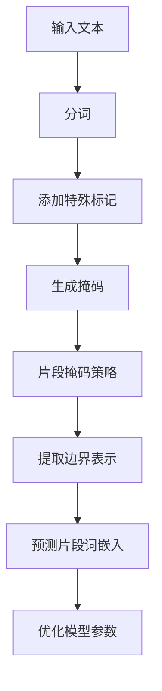

# Transformer大模型实战 深入了解SpanBERT

## 1.背景介绍

在自然语言处理（NLP）领域，Transformer模型自2017年问世以来，迅速成为了主流的架构。其自注意力机制和并行处理能力使得它在各种任务中表现出色。BERT（Bidirectional Encoder Representations from Transformers）作为Transformer家族中的一员，通过双向编码器的预训练方法，极大地提升了NLP任务的性能。然而，BERT在处理某些特定任务时仍存在一些局限性。为了解决这些问题，SpanBERT应运而生。

SpanBERT是BERT的一个变种，专注于改进对文本片段（span）的表示能力。它在预训练阶段引入了新的目标函数，使得模型在处理涉及片段的任务（如问答系统、命名实体识别等）时表现更为优异。

## 2.核心概念与联系

### 2.1 Transformer架构

Transformer架构由编码器和解码器组成，每个编码器和解码器包含多个层，每层由自注意力机制和前馈神经网络组成。其核心思想是通过自注意力机制捕捉输入序列中各个位置之间的依赖关系。

### 2.2 BERT模型

BERT模型是基于Transformer编码器的双向预训练模型。其主要创新点在于使用了双向Transformer来捕捉上下文信息，并通过掩码语言模型（Masked Language Model, MLM）和下一句预测（Next Sentence Prediction, NSP）进行预训练。

### 2.3 SpanBERT模型

SpanBERT在BERT的基础上进行了改进，主要包括以下几点：
- **Span Boundary Objective (SBO)**：在预训练阶段，SpanBERT引入了新的目标函数，专注于预测文本片段的边界。
- **Span Masking**：与BERT的单词掩码不同，SpanBERT采用了片段掩码策略，使得模型能够更好地学习片段级别的表示。

## 3.核心算法原理具体操作步骤

### 3.1 数据预处理

在数据预处理阶段，SpanBERT与BERT类似，需要对输入文本进行分词、添加特殊标记（如[CLS]和[SEP]）以及生成掩码。

### 3.2 片段掩码策略

SpanBERT采用片段掩码策略，即在输入序列中随机选择若干个连续的片段进行掩码。具体步骤如下：
1. 随机选择若干个起始位置。
2. 从每个起始位置开始，随机选择一个长度的片段进行掩码。

### 3.3 Span Boundary Objective (SBO)

在预训练阶段，SpanBERT引入了SBO目标函数。具体操作步骤如下：
1. 对于每个掩码片段，提取其边界位置的表示。
2. 使用边界位置的表示来预测片段中每个单词的原始词嵌入。

### 3.4 训练过程

SpanBERT的训练过程与BERT类似，采用自监督学习的方法，通过最大化SBO目标函数和MLM目标函数的联合概率来优化模型参数。



## 4.数学模型和公式详细讲解举例说明

### 4.1 掩码语言模型（MLM）

BERT和SpanBERT都采用了掩码语言模型（MLM）作为预训练目标之一。其目标是通过上下文信息预测被掩码的单词。具体公式如下：

$$
L_{MLM} = - \sum_{i \in M} \log P(x_i | x_{\backslash M})
$$

其中，$M$表示被掩码的单词集合，$x_i$表示第$i$个单词，$x_{\backslash M}$表示去除掩码单词后的上下文。

### 4.2 Span Boundary Objective (SBO)

SpanBERT引入了SBO目标函数，用于预测片段中每个单词的原始词嵌入。具体公式如下：

$$
L_{SBO} = - \sum_{(i, j) \in S} \log P(x_i | x_j, x_k)
$$

其中，$S$表示被掩码的片段集合，$x_i$表示片段中的单词，$x_j$和$x_k$表示片段的边界单词。

### 4.3 联合目标函数

SpanBERT的预训练目标是最大化MLM和SBO目标函数的联合概率。具体公式如下：

$$
L = L_{MLM} + \lambda L_{SBO}
$$

其中，$\lambda$是一个超参数，用于平衡MLM和SBO目标函数的权重。

## 5.项目实践：代码实例和详细解释说明

### 5.1 环境准备

首先，确保你的环境中安装了必要的库，如Transformers和PyTorch。

```bash
pip install transformers torch
```

### 5.2 数据预处理

使用Transformers库中的Tokenizer进行分词和生成掩码。

```python
from transformers import BertTokenizer

tokenizer = BertTokenizer.from_pretrained('bert-base-uncased')
text = "This is a sample text for SpanBERT."
tokens = tokenizer.tokenize(text)
input_ids = tokenizer.convert_tokens_to_ids(tokens)
```

### 5.3 片段掩码策略

实现片段掩码策略。

```python
import random

def span_masking(input_ids, mask_prob=0.15, max_span_length=5):
    masked_input_ids = input_ids.copy()
    num_to_mask = int(len(input_ids) * mask_prob)
    spans = []
    
    while num_to_mask > 0:
        span_length = random.randint(1, max_span_length)
        start_index = random.randint(0, len(input_ids) - span_length)
        spans.append((start_index, start_index + span_length))
        num_to_mask -= span_length
    
    for start, end in spans:
        for i in range(start, end):
            masked_input_ids[i] = tokenizer.mask_token_id
    
    return masked_input_ids, spans

masked_input_ids, spans = span_masking(input_ids)
```

### 5.4 模型训练

使用Transformers库中的BertForMaskedLM进行模型训练。

```python
from transformers import BertForMaskedLM, AdamW

model = BertForMaskedLM.from_pretrained('bert-base-uncased')
optimizer = AdamW(model.parameters(), lr=5e-5)

inputs = torch.tensor([masked_input_ids])
labels = torch.tensor([input_ids])

model.train()
outputs = model(inputs, labels=labels)
loss = outputs.loss
loss.backward()
optimizer.step()
```

## 6.实际应用场景

### 6.1 问答系统

SpanBERT在问答系统中表现出色，特别是在需要识别和提取文本片段的任务中。通过引入SBO目标函数，SpanBERT能够更准确地预测答案片段的边界，从而提高问答系统的准确性。

### 6.2 命名实体识别（NER）

命名实体识别任务需要识别文本中的实体名称，如人名、地名等。SpanBERT通过片段掩码策略和SBO目标函数，能够更好地捕捉实体边界，提高NER任务的性能。

### 6.3 关系抽取

关系抽取任务需要从文本中识别实体之间的关系。SpanBERT通过改进片段表示能力，能够更准确地识别和抽取实体关系。

## 7.工具和资源推荐

### 7.1 Transformers库

Transformers库是一个强大的NLP工具库，支持多种预训练模型，包括BERT和SpanBERT。它提供了丰富的API，方便用户进行模型训练和推理。

### 7.2 Hugging Face Model Hub

Hugging Face Model Hub是一个预训练模型的在线仓库，用户可以方便地下载和使用各种预训练模型，包括SpanBERT。

### 7.3 PyTorch

PyTorch是一个流行的深度学习框架，支持动态计算图和自动微分。它与Transformers库无缝集成，方便用户进行模型训练和推理。

## 8.总结：未来发展趋势与挑战

SpanBERT通过引入片段掩码策略和SBO目标函数，显著提升了对文本片段的表示能力。然而，随着NLP技术的不断发展，仍有许多挑战需要解决。例如，如何进一步提升模型的泛化能力，如何在低资源环境中进行有效的预训练等。

未来，随着计算资源的不断提升和算法的不断优化，SpanBERT及其变种有望在更多的实际应用场景中发挥重要作用。

## 9.附录：常见问题与解答

### 9.1 SpanBERT与BERT的主要区别是什么？

SpanBERT在BERT的基础上进行了改进，主要包括片段掩码策略和Span Boundary Objective (SBO)目标函数。这些改进使得SpanBERT在处理涉及文本片段的任务时表现更为优异。

### 9.2 如何选择合适的片段长度进行掩码？

片段长度的选择可以根据具体任务和数据集进行调整。一般来说，较短的片段适用于细粒度的任务，如命名实体识别；较长的片段适用于粗粒度的任务，如问答系统。

### 9.3 SpanBERT的训练时间和资源需求如何？

SpanBERT的训练时间和资源需求与BERT相似，主要取决于数据集的大小和模型的复杂度。一般来说，较大的数据集和较复杂的模型需要更多的训练时间和计算资源。

---

作者：禅与计算机程序设计艺术 / Zen and the Art of Computer Programming