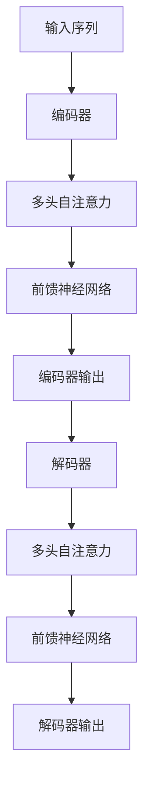

# Transformer大模型实战 芬兰语的FinBERT模型

## 1.背景介绍

在自然语言处理（NLP）领域，Transformer模型已经成为了主流架构。自从Vaswani等人于2017年提出Transformer以来，这种架构在多个NLP任务中表现出了卓越的性能。BERT（Bidirectional Encoder Representations from Transformers）是基于Transformer的一个重要模型，它通过双向编码器来捕捉上下文信息，极大地提升了语言理解的能力。

然而，BERT的原始版本主要针对英语进行了训练。对于其他语言，尤其是低资源语言，直接使用原始BERT模型可能效果不佳。因此，针对特定语言的BERT变体应运而生。本文将深入探讨FinBERT，这是一种专门针对芬兰语的BERT模型。

## 2.核心概念与联系

### 2.1 Transformer架构

Transformer架构由编码器和解码器组成，每个部分都包含多个层。每一层由多头自注意力机制和前馈神经网络组成。其核心思想是通过自注意力机制捕捉序列中各个位置之间的依赖关系。



### 2.2 BERT模型

BERT模型是基于Transformer编码器的双向表示模型。它通过掩码语言模型（Masked Language Model, MLM）和下一句预测（Next Sentence Prediction, NSP）进行预训练，从而捕捉上下文信息。

### 2.3 FinBERT模型

FinBERT是针对芬兰语的BERT变体。它在大量芬兰语文本上进行了预训练，能够更好地理解和处理芬兰语的语法和语义。

## 3.核心算法原理具体操作步骤

### 3.1 数据预处理

在训练FinBERT之前，需要对芬兰语文本进行预处理。主要步骤包括：

1. **分词**：将文本分割成单词或子词。
2. **去除停用词**：去除常见但无意义的词汇。
3. **词干提取**：将单词还原为词干形式。

### 3.2 模型架构

FinBERT的架构与原始BERT相同，主要包括以下部分：

1. **输入嵌入**：将输入文本转换为嵌入向量。
2. **多头自注意力**：捕捉序列中各个位置之间的依赖关系。
3. **前馈神经网络**：对注意力输出进行进一步处理。
4. **输出层**：生成最终的表示向量。

### 3.3 训练过程

1. **预训练**：在大规模芬兰语语料库上进行MLM和NSP任务的预训练。
2. **微调**：在特定任务（如情感分析、文本分类等）上进行微调。

## 4.数学模型和公式详细讲解举例说明

### 4.1 自注意力机制

自注意力机制的核心公式如下：

$$
\text{Attention}(Q, K, V) = \text{softmax}\left(\frac{QK^T}{\sqrt{d_k}}\right)V
$$

其中，$Q$、$K$、$V$分别表示查询、键和值矩阵，$d_k$是键的维度。

### 4.2 掩码语言模型

掩码语言模型的目标是预测被掩码的单词。损失函数为：

$$
L_{MLM} = -\sum_{i=1}^{N} \log P(x_i | x_{\text{masked}})
$$

其中，$x_i$表示被掩码的单词，$x_{\text{masked}}$表示掩码后的输入序列。

### 4.3 下一句预测

下一句预测的目标是判断两段文本是否连续。损失函数为：

$$
L_{NSP} = -\sum_{i=1}^{N} \left[y_i \log P(y_i | x_i) + (1 - y_i) \log (1 - P(y_i | x_i))\right]
$$

其中，$y_i$表示标签，$x_i$表示输入序列。

## 5.项目实践：代码实例和详细解释说明

### 5.1 环境配置

首先，确保安装了必要的库：

```bash
pip install transformers torch
```

### 5.2 数据准备

下载并预处理芬兰语语料库：

```python
from transformers import BertTokenizer

tokenizer = BertTokenizer.from_pretrained('bert-base-multilingual-cased')
text = "Tämä on esimerkki suomenkielisestä tekstistä."
tokens = tokenizer.tokenize(text)
print(tokens)
```

### 5.3 模型训练

使用Hugging Face的Transformers库进行模型训练：

```python
from transformers import BertForMaskedLM, Trainer, TrainingArguments

model = BertForMaskedLM.from_pretrained('bert-base-multilingual-cased')

training_args = TrainingArguments(
    output_dir='./results',
    num_train_epochs=3,
    per_device_train_batch_size=8,
    save_steps=10_000,
    save_total_limit=2,
)

trainer = Trainer(
    model=model,
    args=training_args,
    train_dataset=train_dataset,
    eval_dataset=eval_dataset,
)

trainer.train()
```

### 5.4 模型微调

在特定任务上进行微调：

```python
from transformers import BertForSequenceClassification

model = BertForSequenceClassification.from_pretrained('bert-base-multilingual-cased', num_labels=2)

trainer = Trainer(
    model=model,
    args=training_args,
    train_dataset=train_dataset,
    eval_dataset=eval_dataset,
)

trainer.train()
```

## 6.实际应用场景

### 6.1 情感分析

FinBERT可以用于分析芬兰语文本的情感倾向，例如社交媒体评论、客户反馈等。

### 6.2 文本分类

在新闻分类、主题识别等任务中，FinBERT能够提供高效的文本分类能力。

### 6.3 机器翻译

FinBERT可以作为机器翻译系统的一部分，提升芬兰语到其他语言的翻译质量。

## 7.工具和资源推荐

### 7.1 Hugging Face Transformers

Hugging Face的Transformers库是训练和使用BERT模型的强大工具，支持多种语言和任务。

### 7.2 TensorFlow和PyTorch

这两个深度学习框架提供了丰富的工具和库，支持自定义模型的训练和部署。

### 7.3 数据集

推荐使用CC100、Wikipedia等大规模芬兰语语料库进行预训练。

## 8.总结：未来发展趋势与挑战

### 8.1 发展趋势

随着NLP技术的不断进步，针对特定语言的BERT变体将越来越多。多语言模型的研究也将进一步推动跨语言理解和翻译的进步。

### 8.2 挑战

1. **数据稀缺**：低资源语言的数据稀缺问题仍然存在，需要更多的语料库和标注数据。
2. **计算资源**：训练大规模模型需要大量的计算资源，对于小型研究团队和个人来说是一个挑战。

## 9.附录：常见问题与解答

### Q1: 如何选择预训练模型？

选择预训练模型时，应根据任务需求和语言特点进行选择。对于芬兰语任务，FinBERT是一个不错的选择。

### Q2: 如何处理数据不平衡问题？

可以通过数据增强、重采样等方法来处理数据不平衡问题。

### Q3: 如何提升模型性能？

可以通过增加训练数据、调整模型超参数、使用更复杂的模型架构等方法来提升模型性能。

---

作者：禅与计算机程序设计艺术 / Zen and the Art of Computer Programming