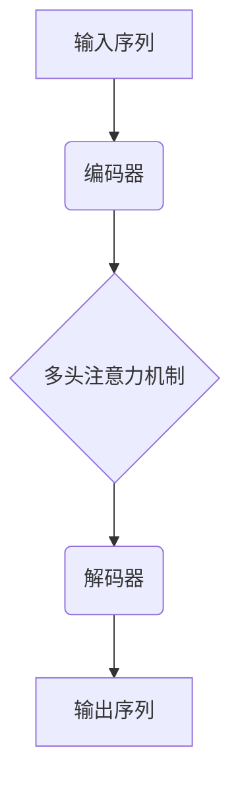
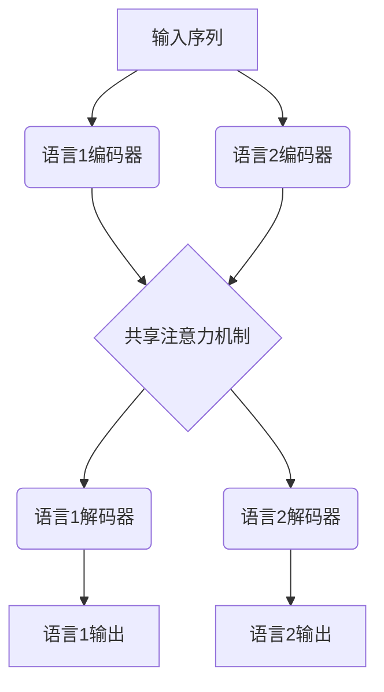

# Transformer大模型实战 语码混用和音译的影响

## 1.背景介绍

随着人工智能技术的不断发展,Transformer模型在自然语言处理领域取得了卓越的成就。作为一种全新的基于注意力机制的神经网络架构,Transformer模型展现出了强大的语言建模能力,在机器翻译、文本生成、语音识别等任务中表现出色。然而,在实际应用场景中,我们常常会遇到语码混用(code-mixing)和音译(code-switching)的情况,这给Transformer模型带来了新的挑战。

语码混用是指在同一句话或语篇中混合使用两种或多种语言的现象。例如,在某些双语社区,人们经常在对话中无缝切换英语和其他语言。音译则是指在语音中插入另一种语言的词汇或短语。这两种现象在多语种环境中非常普遍,但对于大多数自然语言处理模型来说,处理这种语言混合是一个巨大的挑战。

## 2.核心概念与联系

### 2.1 Transformer模型

Transformer是一种基于注意力机制的序列到序列(Sequence-to-Sequence)模型,由编码器(Encoder)和解码器(Decoder)两部分组成。编码器将输入序列映射为一系列连续的向量表示,解码器则根据这些向量表示生成输出序列。

Transformer模型的核心是多头注意力机制(Multi-Head Attention),它允许模型同时关注输入序列的不同部分,捕捉长距离依赖关系。与传统的基于循环神经网络(RNN)或卷积神经网络(CNN)的模型相比,Transformer模型具有更好的并行计算能力,可以更有效地利用GPU资源,因此在处理长序列时表现更加出色。



### 2.2 语码混用和音译

语码混用和音译是多语种环境下的一种普遍现象,它们给自然语言处理带来了新的挑战。语码混用指在同一句话或语篇中混合使用两种或多种语言,而音译则是在语音中插入另一种语言的词汇或短语。

这两种现象的出现,使得语言模型需要同时处理多种语言,并能够灵活地在不同语言之间切换。传统的基于单一语言的语言模型很难有效地处理这种情况,因为它们无法很好地捕捉不同语言之间的语义和语法差异。

## 3.核心算法原理具体操作步骤

为了更好地处理语码混用和音译的情况,研究人员提出了一些基于Transformer模型的改进方法。这些方法主要包括以下几个步骤:

### 3.1 数据预处理

首先需要对训练数据进行预处理,标记出语码混用和音译的位置。一种常见的方法是使用语言标识符(Language ID,LID)对每个词进行标注,指示它属于哪种语言。另一种方法是使用特殊的标记符(如<lang>)来明确标记语言切换的位置。

### 3.2 构建混合语言词表

接下来,需要构建一个包含所有相关语言的混合语言词表(Mixed-Language Vocabulary)。这个词表不仅包含每种语言的词汇,还包含一些特殊的标记符,用于表示语言切换等信息。

### 3.3 修改Transformer架构

为了更好地捕捉不同语言之间的差异,需要对Transformer模型的架构进行一些修改。一种常见的方法是为每种语言引入独立的编码器和解码器,并在适当的位置共享参数。另一种方法是在编码器或解码器中引入语言特征(Language Feature),以帮助模型区分不同的语言。



### 3.4 联合训练

最后,需要在混合语言数据集上对修改后的Transformer模型进行联合训练。在训练过程中,模型需要同时学习不同语言的语义和语法知识,并能够灵活地在它们之间切换。一些常见的训练技巧包括:

- 使用语言对抗训练(Language Adversarial Training),强制模型学习语言不变性特征
- 引入语言标识符损失(Language ID Loss),鼓励模型正确预测每个词的语言
- 采用多任务学习(Multi-Task Learning),同时优化多个相关任务的目标函数

通过这些步骤,Transformer模型可以更好地处理语码混用和音译的情况,为多语种环境下的自然语言处理任务提供更好的解决方案。

## 4.数学模型和公式详细讲解举例说明

在处理语码混用和音译时,Transformer模型需要引入一些新的机制来捕捉不同语言之间的差异。下面我们将详细介绍一些常见的数学模型和公式。

### 4.1 语言标识符损失

为了鼓励模型正确预测每个词的语言,我们可以引入语言标识符损失(Language ID Loss)。设$y_i$为第$i$个词的语言标识符,$\hat{y}_i$为模型预测的语言标识符,则语言标识符损失可以定义为:

$$\mathcal{L}_\text{LID} = -\sum_{i=1}^N y_i \log \hat{y}_i$$

其中$N$是序列长度。这个损失函数会惩罚模型对语言标识符的错误预测,从而促使模型学习不同语言的特征。

### 4.2 语言对抗训练

语言对抗训练(Language Adversarial Training)的目标是让模型学习语言不变性特征,即对于相同的输入,无论使用哪种语言,模型的输出应该是一致的。

具体来说,我们可以定义一个判别器(Discriminator)$D$,它试图根据模型的输出$\hat{y}$来判断输入序列使用的是哪种语言。与此同时,编码器(Encoder)$E$和解码器(Decoder)$G$则试图欺骗判别器,使其无法正确判断语言。这构成了一个对抗过程,可以用以下公式表示:

$$\min_E \max_D \mathbb{E}_{x, y}[\log D(E(x), y)] + \mathbb{E}_{x, \hat{y}}[\log(1 - D(G(\hat{y}), x))]$$

其中$x$是输入序列,$y$是目标序列,$\hat{y}$是模型生成的序列。通过这种对抗训练,模型可以学习到语言不变性特征,从而更好地处理语码混用和音译。

### 4.3 多任务学习

多任务学习(Multi-Task Learning)是一种同时优化多个相关任务的训练范式。在处理语码混用和音译时,我们可以将语言模型训练与其他相关任务(如机器翻译、语言生成等)联合起来,共享底层的编码器和解码器参数。

设有$M$个任务,每个任务的损失函数为$\mathcal{L}_m$,则多任务学习的目标函数可以表示为:

$$\mathcal{L}_\text{MTL} = \sum_{m=1}^M \lambda_m \mathcal{L}_m$$

其中$\lambda_m$是每个任务的权重系数,可以根据任务的重要性进行调整。通过这种方式,模型可以同时学习多种语言的知识,提高泛化能力。

以上是一些常见的数学模型和公式,它们为处理语码混用和音译提供了有效的支持。在实际应用中,研究人员还可以根据具体任务和数据集,设计出更加精细的模型和损失函数。

## 5.项目实践:代码实例和详细解释说明

为了更好地理解如何使用Transformer模型处理语码混用和音译,我们将提供一个基于PyTorch的代码示例,并对关键部分进行详细解释。

### 5.1 数据预处理

首先,我们需要对训练数据进行预处理,标记出语码混用和音译的位置。在这个示例中,我们使用特殊的标记符<lang>来表示语言切换。

```python
import re

def preprocess(text):
    # 使用正则表达式匹配语言切换位置
    pattern = re.compile(r'<lang\d+>')
    matches = pattern.finditer(text)

    # 插入语言标记符
    processed = []
    start = 0
    for match in matches:
        processed.append(text[start:match.start()])
        processed.append(match.group())
        start = match.end()
    processed.append(text[start:])

    return ' '.join(processed)
```

### 5.2 构建混合语言词表

接下来,我们需要构建一个包含所有相关语言的混合语言词表。我们使用PyTorch的`torchtext`库来构建词表。

```python
from torchtext.vocab import build_vocab_from_iterator

def build_vocab(data):
    # 构建词表
    vocab = build_vocab_from_iterator(data, specials=['<unk>', '<pad>', '<bos>', '<eos>'])
    vocab.set_default_index(vocab['<unk>'])
    return vocab
```

### 5.3 修改Transformer架构

为了处理语码混用和音译,我们需要对Transformer模型的架构进行一些修改。在这个示例中,我们为每种语言引入独立的编码器和解码器,并在适当的位置共享参数。

```python
import torch.nn as nn

class MultilingualTransformer(nn.Module):
    def __init__(self, num_langs, encoder, decoder, shared_layers):
        super().__init__()
        self.num_langs = num_langs
        self.encoders = nn.ModuleList([encoder for _ in range(num_langs)])
        self.decoders = nn.ModuleList([decoder for _ in range(num_langs)])
        self.shared_layers = shared_layers

    def forward(self, src, tgt, src_lang, tgt_lang):
        encoder = self.encoders[src_lang]
        decoder = self.decoders[tgt_lang]
        memory = encoder(src, self.shared_layers)
        output = decoder(tgt, memory, self.shared_layers)
        return output
```

在这个模型中,我们维护了一个编码器列表`self.encoders`和一个解码器列表`self.decoders`,每种语言对应一个编码器和解码器。在前向传播时,我们根据输入序列和目标序列的语言,选择相应的编码器和解码器,并共享底层的`shared_layers`。

### 5.4 联合训练

最后,我们需要在混合语言数据集上对修改后的Transformer模型进行联合训练。在这个示例中,我们使用语言标识符损失和标准的交叉熵损失进行训练。

```python
import torch.nn.functional as F

def train(model, data, optimizer, criterion, device):
    model.train()
    total_loss = 0
    for src, tgt, src_lang, tgt_lang in data:
        src = src.to(device)
        tgt = tgt.to(device)
        optimizer.zero_grad()
        output = model(src, tgt, src_lang, tgt_lang)
        loss = criterion(output.view(-1, output.size(-1)), tgt.view(-1))
        loss.backward()
        optimizer.step()
        total_loss += loss.item()
    return total_loss / len(data)
```

在这个训练循环中,我们将源序列`src`、目标序列`tgt`、源语言`src_lang`和目标语言`tgt_lang`传递给模型,获取模型的输出`output`。然后,我们使用交叉熵损失函数`criterion`计算损失,并反向传播梯度进行参数更新。

通过上述步骤,我们可以在混合语言数据集上训练Transformer模型,使其能够更好地处理语码混用和音译的情况。

## 6.实际应用场景

语码混用和音译在多语种环境中非常普遍,因此能够有效处理这两种现象的自然语言处理模型具有广泛的应用前景。下面是一些典型的应用场景:

### 6.1 社交媒体分析

在社交媒体上,人们经常在对话中混合使用多种语言。能够处理语码混用和音译的模型可以更好地理解这些对话的语义,从而提高情感分析、主题检测等任务的性能。

### 6.2 多语种客户服务

在提供多语种客户服务时,语码混用和音译是一种常见的现象。使用相应的模型可以更好地理解客户的需求,提高服务质量。

### 6.3 教育领