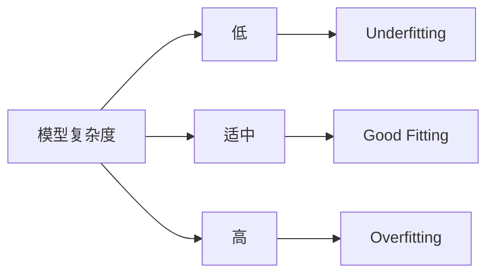

# Underfitting 原理与代码实战案例讲解

## 1. 背景介绍

### 1.1 机器学习中的偏差与方差

在机器学习中,我们经常会遇到模型性能不佳的问题。造成这一问题的主要原因通常有两个:高偏差(High Bias)和高方差(High Variance)。高偏差意味着模型过于简单,无法很好地捕捉数据的内在规律;高方差则意味着模型过于复杂,对训练数据过拟合(Overfitting),泛化性能差。

Underfitting 就是高偏差的一种典型情况。当模型过于简单,无法很好地拟合训练数据时,就会出现 Underfitting。此时模型的训练误差和测试误差都很大。

### 1.2 Underfitting 的危害

Underfitting 会导致模型性能不佳,预测结果与真实值相差较大。在实际应用中,这可能意味着:

- 推荐系统推荐的商品与用户兴趣相差甚远
- 广告系统投放的广告与用户需求不符
- 信用评分系统给出的评分与用户的实际信用状况不符
- ......

因此,了解 Underfitting 的原理,学会诊断和解决 Underfitting 问题,对于构建高质量的机器学习模型至关重要。

## 2. 核心概念与联系

### 2.1 偏差(Bias)与方差(Variance)

偏差和方差是机器学习中两个非常重要的概念。它们反映了模型的两个基本特性:

- 偏差:描述了模型的预测值与真实值之间的差异。偏差越大,模型越简单,拟合能力越差。
- 方差:描述了模型预测结果的变化范围。方差越大,模型越复杂,过拟合风险越高。

下图直观地展示了偏差和方差的概念:


理想的模型应该在偏差和方差之间取得平衡,即"Bias-Variance Tradeoff"。

### 2.2 Underfitting、Overfitting 与 Good Fitting

根据偏差和方差的高低,我们可以将模型的拟合情况分为三种:

- Underfitting:高偏差,低方差。模型过于简单,无法很好地捕捉数据的内在规律。
- Overfitting:低偏差,高方差。模型过于复杂,过度拟合训练数据,泛化性能差。
- Good Fitting:低偏差,低方差。模型复杂度适中,很好地平衡了偏差和方差。

它们之间的关系可以用下图表示:



## 3. 核心算法原理与具体操作步骤

### 3.1 如何诊断 Underfitting?

诊断 Underfitting 主要看三个指标:

1. 训练误差(Training Error):Underfitting 的模型在训练集上的误差就很大。
2. 测试误差(Testing Error):Underfitting 的模型在测试集上的误差也很大。  
3. 训练误差与测试误差之差:Underfitting 的模型在训练集和测试集上的误差接近。

我们可以绘制学习曲线(Learning Curve)来直观地判断是否出现了 Underfitting:


图中训练误差和测试误差都很高,且非常接近,呈现出一种"高原"状,这是 Underfitting 的典型特征。

### 3.2 如何解决 Underfitting?

解决 Underfitting 的思路很直观:增加模型复杂度,提高拟合能力。具体可以采取以下措施:

1. 增加模型参数:对于神经网络,可以增加网络的层数和每层的神经元数量;对于决策树,可以增加树的深度和叶子节点数量。

2. 增加特征数量:添加更多的特征,为模型提供更多的信息。特别是一些复杂的非线性特征,可以大大提升模型的拟合能力。

3. 减少正则化:正则化的目的是限制模型复杂度,防止过拟合。如果模型出现了 Underfitting,可以适当减少正则化强度,如减小 L1/L2 正则项的系数。

4. 训练更长时间:有时模型出现 Underfitting 只是因为训练不充分。可以增加训练的轮数(Epoch),给模型更多的时间去学习数据的规律。

5. 更换模型:如果以上措施都无效,可能是当前模型的结构本身不适合这个问题。此时需要更换一个更加复杂和强大的模型,如用神经网络替代线性模型。

## 4. 数学模型和公式详细讲解举例说明

### 4.1 线性回归中的 Underfitting

我们以最简单的线性回归模型为例,解释 Underfitting 的数学原理。

假设我们的数据集 $D = \{(x_1,y_1), (x_2,y_2), ..., (x_N,y_N)\}$,其中 $x_i$ 为特征向量,$y_i$ 为标量。线性回归模型试图学习一个线性函数:

$$
\hat{y} = w^Tx + b
$$

其中 $w$ 为权重向量,$b$ 为偏置项。模型的目标是最小化均方误差(MSE):

$$
MSE = \frac{1}{N}\sum_{i=1}^{N}(y_i - \hat{y}_i)^2 = \frac{1}{N}\sum_{i=1}^{N}(y_i - w^Tx_i - b)^2
$$

当数据呈现明显的非线性关系时,线性模型就会出现 Underfitting。此时无论如何调整 $w$ 和 $b$,都无法很好地拟合数据。

例如,假设真实的数据分布是一个二次函数:

$$
y = x^2 + \epsilon
$$

其中 $\epsilon$ 为噪声项。但我们错误地使用了线性模型去拟合,就会得到一条直线,与数据的真实分布相差很大,出现严重的 Underfitting。

### 4.2 决策树中的 Underfitting

决策树通过递归地划分特征空间,生成一系列的 if-then 规则来进行预测。树的每个节点对应一个划分规则,每个叶子节点对应一个预测值。

决策树的复杂度主要由两个因素决定:

1. 树的深度(Depth):树的最大层数。深度越大,树越复杂。
2. 叶子节点数量(Number of Leaf Nodes):树的叶子节点总数。叶子节点越多,树越复杂。

当树的深度和叶子节点数量都很小时,决策树就会出现 Underfitting。这意味着树过于简单,划分的区域太少且太粗糙,无法很好地拟合数据的真实分布。

例如,对于下图中的非线性分类问题,如果决策树的深度被限制为1,就只能进行一次划分,得到两个叶子节点。这样的树明显太简单,无法准确划分出两个类别,出现了明显的 Underfitting。


## 5. 项目实践:代码实例和详细解释说明

下面我们用 Python 实现一个简单的线性回归模型,并演示 Underfitting 的情况。

### 5.1 生成非线性数据集

首先我们生成一个二次函数的数据集,加入少量高斯噪声:

```python
import numpy as np
import matplotlib.pyplot as plt

np.random.seed(42)

x = np.random.rand(100, 1)
y = 4*(x**2) + 2 + np.random.randn(100, 1)

plt.scatter(x, y)
plt.show()
```

### 5.2 定义线性回归模型

我们使用 Pytorch 定义一个简单的线性回归模型:

```python
import torch
import torch.nn as nn

class LinearRegression(nn.Module):
    def __init__(self):
        super().__init__()
        self.linear = nn.Linear(1, 1)  
    
    def forward(self, x):
        return self.linear(x)
```

这里 `nn.Linear(1, 1)` 定义了一个输入维度和输出维度都是1的全连接层,即 $\hat{y} = wx + b$。

### 5.3 训练模型

接下来我们训练这个线性模型:

```python
model = LinearRegression()
criterion = nn.MSELoss()
optimizer = torch.optim.SGD(model.parameters(), lr=0.01)

x_train = torch.from_numpy(x).float()
y_train = torch.from_numpy(y).float()

num_epochs = 100
for epoch in range(num_epochs):
    inputs = x_train
    targets = y_train

    optimizer.zero_grad()
    outputs = model(inputs)
    loss = criterion(outputs, targets)
    loss.backward()
    optimizer.step()

    if (epoch+1) % 10 == 0:
        print(f'Epoch [{epoch+1}/{num_epochs}], Loss: {loss.item():.4f}')
```

### 5.4 可视化结果

最后我们将线性模型的预测结果与真实数据进行可视化对比:

```python
predicted = model(x_train).detach().numpy()

plt.plot(x_train, y_train, 'ro', label='Original data')
plt.plot(x_train, predicted, label='Fitted line')
plt.legend()
plt.show()
```

结果如下图所示:


可以看到,线性模型完全无法拟合这个二次函数的数据,出现了严重的 Underfitting。这验证了我们之前的理论分析。

要解决这个问题,我们需要使用一个更加复杂的非线性模型,如多项式回归或者神经网络。限于篇幅,这里就不再展开了。

## 6. 实际应用场景

Underfitting 在很多实际应用中都可能出现,下面列举几个典型场景:

### 6.1 推荐系统

假设我们要建立一个电影推荐系统,根据用户的历史观影记录和评分来预测他们对新电影的喜好程度。

如果我们只使用用户的基本属性(如年龄、性别)作为特征,而忽略了他们的观影历史,那么得到的模型就会非常简单,无法准确刻画用户的个性化偏好,出现严重的 Underfitting,推荐质量很差。

### 6.2 广告点击率预测

在在线广告系统中,我们需要预测用户点击某个广告的概率,以便决定是否向他展示这个广告。

如果模型只考虑了广告的基本属性(如尺寸、位置),而忽略了用户的历史行为和广告的内容相关性,就会出现 Underfitting。这样的模型无法准确区分不同广告对不同用户的吸引力,点击率预测偏差很大。

### 6.3 医疗诊断

在医疗诊断中,我们希望根据患者的各项生理指标来预测他们是否患有某种疾病。

如果诊断模型只使用了很少的几个指标,如年龄和血压,而忽略了其他重要指标,就会出现 Underfitting。这样的模型过于简单,无法准确刻画疾病的复杂特征,导致误诊率很高。

### 6.4 自然语言处理

在自然语言处理中,我们经常需要进行文本分类,如情感分析、主题识别等。

如果分类模型只考虑了单词的出现频率,而忽略了单词的顺序和上下文信息,就会出现 Underfitting。这样的模型无法捕捉文本的语义特征,分类准确率很低。

## 7. 工具和资源推荐

- Scikit-Learn: 机器学习算法的 Python 实现,适合快速搭建和测试模型。
- Pytorch/Tensorflow: 深度学习框架,支持更加复杂和灵活的模型结构。
- Matplotlib: Python 数据可视化库,方便直观地判断模型的拟合效果。
- Kaggle: 全球最大的数据科学社区,提供海量的数据集和机器学习竞赛。
- 吴恩达的机器学习课程: Coursera 上的经