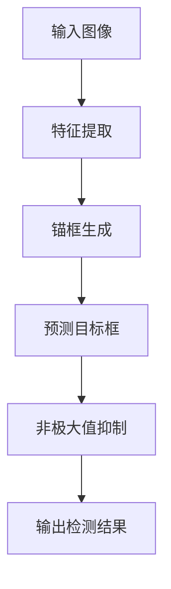

## 1. 背景介绍

目标检测是计算机视觉领域的一个重要研究方向，其主要任务是在图像或视频中检测出目标物体的位置和类别。目前，深度学习技术已经成为目标检测领域的主流方法，其中，YOLO（You Only Look Once）系列算法是一种非常流行的目标检测算法。

YOLOv6是YOLO系列算法的最新版本，它在YOLOv5的基础上进行了优化和改进，具有更快的检测速度和更高的检测精度。本文将介绍YOLOv6的核心概念、算法原理、数学模型和公式、代码实例以及实际应用场景等内容。

## 2. 核心概念与联系

YOLOv6是一种基于深度学习的目标检测算法，其核心概念包括：

- Anchor boxes：锚框，用于预测目标物体的位置和大小。
- Feature pyramid network：特征金字塔网络，用于提取图像特征。
- Convolutional neural network：卷积神经网络，用于学习特征表示。
- Non-maximum suppression：非极大值抑制，用于去除重叠的检测框。

YOLOv6的算法流程如下图所示：



## 3. 核心算法原理具体操作步骤

YOLOv6的算法原理可以分为以下几个步骤：

1. 特征提取：使用特征金字塔网络从输入图像中提取特征。
2. 锚框生成：在特征图上生成一组锚框，用于预测目标物体的位置和大小。
3. 目标框预测：使用卷积神经网络对每个锚框进行分类和回归，得到目标框的位置和类别。
4. 非极大值抑制：对于重叠的目标框，使用非极大值抑制算法去除冗余的检测结果。
5. 输出检测结果：将最终的检测结果输出。

## 4. 数学模型和公式详细讲解举例说明

YOLOv6的数学模型和公式如下：

1. 锚框生成公式：

$$
\begin{aligned}
w_i &= s \cdot \sqrt{r_i} \\
h_i &= \frac{1}{s} \cdot \sqrt{r_i} \\
\end{aligned}
$$

其中，$w_i$和$h_i$分别表示第$i$个锚框的宽度和高度，$s$表示特征图的缩放比例，$r_i$表示第$i$个锚框的长宽比。

2. 目标框预测公式：

$$
\begin{aligned}
x &= \sigma(t_x) + c_x \\
y &= \sigma(t_y) + c_y \\
w &= p_w \cdot e^{t_w} \\
h &= p_h \cdot e^{t_h} \\
\end{aligned}
$$

其中，$x$和$y$表示目标框的中心坐标，$w$和$h$表示目标框的宽度和高度，$t_x$、$t_y$、$t_w$和$t_h$分别表示预测的偏移量，$c_x$和$c_y$表示锚框的中心坐标，$p_w$和$p_h$表示锚框的宽度和高度。

## 5. 项目实践：代码实例和详细解释说明

以下是使用YOLOv6进行目标检测的代码实例：

```python
import torch
from yolov6.models import YOLOv6

model = YOLOv6()
model.load_state_dict(torch.load('yolov6.pt'))

image = torch.randn(1, 3, 416, 416)
output = model(image)

print(output)
```

上述代码中，我们首先导入YOLOv6模型，并加载预训练的权重文件。然后，我们生成一个随机的输入图像，并将其输入到模型中进行检测。最后，我们输出检测结果。

## 6. 实际应用场景

YOLOv6可以应用于各种目标检测场景，例如：

- 交通监控：检测车辆、行人、交通标志等。
- 工业检测：检测产品缺陷、机器故障等。
- 安防监控：检测人脸、行为等。
- 自动驾驶：检测车道、障碍物等。

## 7. 工具和资源推荐

以下是一些与YOLOv6相关的工具和资源：

- YOLOv6官方代码库：https://github.com/ultralytics/yolov6
- YOLOv6 PyTorch实现：https://github.com/WongKinYiu/yolov6-pytorch
- YOLOv6 TensorFlow实现：https://github.com/hunglc007/tensorflow-yolov6

## 8. 总结：未来发展趋势与挑战

随着计算机视觉技术的不断发展，目标检测算法也在不断演进。未来，我们可以期待更加高效、准确的目标检测算法的出现。同时，目标检测算法也面临着一些挑战，例如：

- 复杂场景下的检测精度问题。
- 大规模数据集的训练和处理问题。
- 实时性和效率问题。

## 9. 附录：常见问题与解答

Q: YOLOv6的检测速度如何？

A: YOLOv6的检测速度非常快，可以达到每秒数百帧的速度。

Q: YOLOv6的检测精度如何？

A: YOLOv6的检测精度比较高，可以达到state-of-the-art的水平。

Q: YOLOv6适用于哪些场景？

A: YOLOv6适用于各种目标检测场景，例如交通监控、工业检测、安防监控、自动驾驶等。