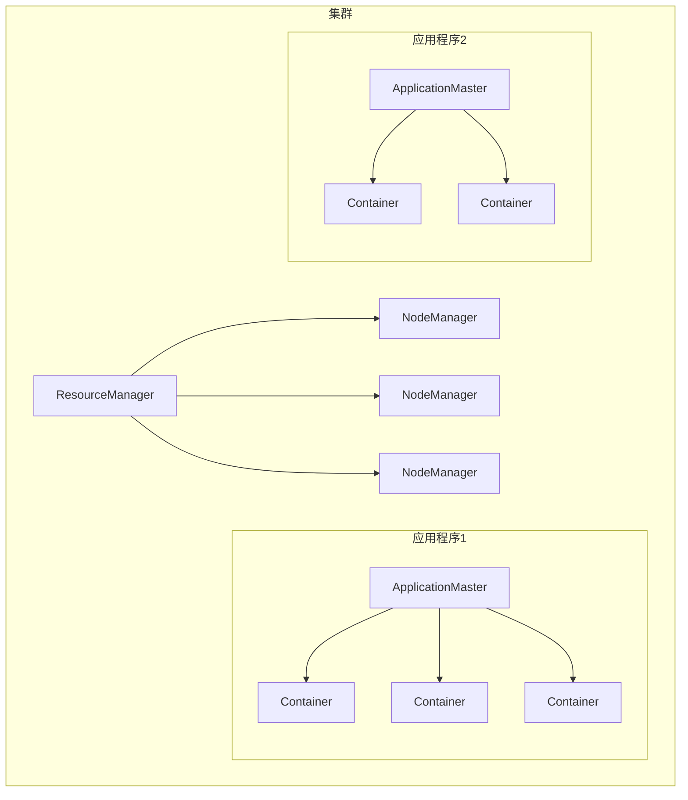
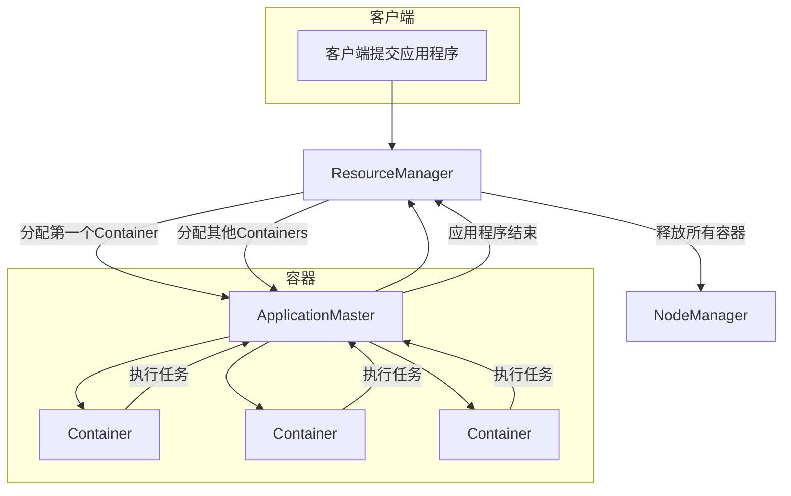

# Yarn 原理与代码实例讲解

## 1.背景介绍

在大规模分布式系统中，资源管理和任务调度是一个关键的基础设施组件。Apache Hadoop YARN (Yet Another Resource Negotiator) 作为 Hadoop 的新一代资源管理和任务调度框架,旨在解决 MapReduce 1.0 中存在的可扩展性、集群利用率和多租户支持等问题。YARN 将资源管理和任务调度/监控分离,提供了一个通用的资源管理和调度框架,支持在同一个集群上运行多种类型的分布式应用程序。

## 2.核心概念与联系

YARN 的核心概念包括 ResourceManager、NodeManager、ApplicationMaster、Container 等,它们共同构建了一个高效、可扩展的分布式计算平台。

### 2.1 ResourceManager (RM)

ResourceManager 是整个 YARN 系统的核心组件,负责全局资源管理和调度。它包含两个主要组件:Scheduler 和 ApplicationsManager。

- Scheduler: 根据集群资源情况和应用程序优先级等因素,为应用程序分配资源容器。常用调度器有 FIFO、Fair Scheduler 和 Capacity Scheduler 等。
- ApplicationsManager: 负责接收新的应用程序提交,并与相应的 ApplicationMaster 进行通信协调应用程序执行。

### 2.2 NodeManager (NM)  

NodeManager 运行在集群的每个节点上,负责管理单个节点上的资源使用。主要职责包括:

1. 定期向 ResourceManager 发送心跳和节点资源使用报告。
2. 根据 ResourceManager 分配启动/终止容器。
3. 监控容器资源使用和运行状态。

### 2.3 ApplicationMaster (AM)

每个应用程序在首次获得资源后,会启动一个 ApplicationMaster 进程。AM 负责应用程序整个生命周期的管理,包括:

1. 向 RM 申请资源容器运行任务。
2. 监控任务运行状态并进行容错。
3. 与 YARN 通信并提供应用程序状态。

### 2.4 Container

Container 是 YARN 中表示资源的基本单位,描述了 CPU、内存等可以被分配的资源。AM 会根据应用程序需求向 RM 申请一组容器,然后在容器中运行具体的任务进程。

这些核心概念相互协作,构建了 YARN 对资源的统一抽象和管理。下面是一个简化的 YARN 架构流程图:



## 3.核心算法原理具体操作步骤

YARN 的核心工作原理可以概括为以下几个步骤:

1. **应用程序提交**: 客户端向 ResourceManager 提交一个新的应用程序,RM 为该应用程序分配一个 ApplicationID 并启动 ApplicationMaster 进程。

2. **资源申请**: ApplicationMaster 根据应用程序的资源需求向 ResourceManager 申请资源容器。

3. **资源分配**: ResourceManager 的 Scheduler 根据集群资源情况和应用程序优先级等因素,选择合适的 NodeManager 并指示它们启动容器。

4. **任务执行**: ApplicationMaster 在分配到的容器中启动具体的任务进程,并监控它们的执行状态。如果任务失败,AM 会重新申请容器运行该任务。

5. **资源释放**: 应用程序执行完成后,AM 会向 RM 发送指令释放所有容器资源。

6. **应用程序结束**: RM 监控到应用程序结束,相应的 AM 也终止运行。

下面是 YARN 应用程序执行的流程图:



## 4.数学模型和公式详细讲解举例说明

在 YARN 的资源调度过程中,涉及到一些数学模型和公式,用于量化资源使用情况、评估调度器性能等。

### 4.1 资源模型

YARN 将集群资源抽象为一个具有多个维度的有限资源向量。常见的资源维度包括:

- 内存 (Memory)
- CPU 
- GPU
- 磁盘空间
- 网络带宽

假设集群总资源为 $R = (R_1, R_2, ..., R_d)$,其中 $R_i$ 表示第 i 个资源维度的总量。一个容器请求 $r = (r_1, r_2, ..., r_d)$ 代表对各个维度资源的需求。

### 4.2 资源局部性

为了提高数据局部性,YARN 会尽量将任务调度到存储输入数据的节点上。定义一个任务的数据局部性得分为:

$$
s = \sum\limits_{i=1}^{n}w_i \times \frac{data_i}{total\_data}
$$

其中 $n$ 是输入数据块数量, $data_i$ 是第 i 个数据块的大小, $total\_data$ 是所有输入数据的总大小, $w_i$ 是对应数据块的权重系数。得分越高,表示数据局部性越好。

### 4.3 公平性指标

对于支持多租户的调度器 (如 Fair Scheduler),需要评估其资源分配的公平性。常用的指标是最小最大公平度 (min-max fairness):  

$$
F_{min-max}(A_1, A_2, ..., A_n) = \min\limits_{1 \leq i \leq n}\frac{A_i}{\sum\limits_{j=1}^{n}A_j}
$$

其中 $A_i$ 表示分配给第 i 个租户的资源量。该指标的取值范围为 $[0, \frac{1}{n}]$,值越大表示公平性越好。

### 4.4 容量调度模型

Capacity Scheduler 使用一个层次结构的队列模型管理资源,每个队列被分配一定的资源容量。设总资源为 $C$,第 i 个队列的资源配额为 $q_i$,则有:

$$
\sum\limits_{i=1}^{n}q_i \leq C \qquad \text{且} \qquad 0 \leq q_i \leq 1
$$

当一个队列中的应用程序资源需求超过其配额时,可以"借用"其他队列的空闲资源,从而提高集群资源利用率。

## 5.项目实践:代码实例和详细解释说明

下面通过一个简单的 YARN 客户端示例,演示如何提交并运行一个分布式应用程序。

### 5.1 项目依赖

```xml
<dependency>
    <groupId>org.apache.hadoop</groupId>
    <artifactId>hadoop-yarn-client</artifactId>
    <version>${hadoop.version}</version>
</dependency>
<dependency>
    <groupId>org.apache.hadoop</groupId>
    <artifactId>hadoop-common</artifactId>
    <version>${hadoop.version}</version>
</dependency>
```

### 5.2 客户端代码

```java
// 创建YarnClient实例
YarnClient yarnClient = YarnClient.createYarnClient();
yarnClient.init(conf);
yarnClient.start();

// 创建应用程序提交上下文
YarnClientApplication app = yarnClient.createApplication();
GetNewApplicationResponse appResponse = app.getNewApplicationResponse();

// 设置应用程序运行环境
ApplicationSubmissionContext appContext = app.getApplicationSubmissionContext();
AppMasterParams params = new AppMasterParams(...); // 设置AM参数
appContext.setApplicationName("MyApp");
appContext.setApplicationType("YARN"); 
appContext.setAMContainerSpec(amContainer);
appContext.setUnmanagedAM(false);
appContext.setAppMasterParams(params);

// 提交应用程序
yarnClient.submitApplication(appContext);

// 监控应用程序状态
ApplicationReport appReport = yarnClient.getApplicationReport(appResponse.getApplicationId());
YarnApplicationState appState = appReport.getYarnApplicationState();

yarnClient.close();
```

上述代码首先创建一个 YarnClient 实例,用于与 YARN 集群进行交互。然后构建 ApplicationSubmissionContext 对象,设置应用程序名称、类型、ApplicationMaster 运行环境等参数。

接下来调用 submitApplication 方法提交应用程序,YARN 会为该应用程序分配一个 ApplicationId 并启动 ApplicationMaster 进程。客户端可以通过 getApplicationReport 方法监控应用程序的运行状态。

### 5.3 ApplicationMaster 示例

ApplicationMaster 进程启动后,需要向 ResourceManager 申请运行任务所需的容器资源。下面是一个简单的 AM 实现:

```java
public class MyAppMaster extends ApplicationMaster {

    public static void main(String[] args) {
        MyAppMaster appMaster = new MyAppMaster();
        appMaster.run();
    }

    private void run() {
        // 向RM申请容器资源
        for (int i = 0; i < totalContainers; i++) {
            ContainerRequest containerAsk = new ContainerRequest(
                containerResource, null, null, RM_REQUEST_PRIORITY);
            amRMClient.addContainerRequest(containerAsk);
        }

        // 获取分配的容器
        for (int i = 0; i < totalContainers; i++) {
            ContainerStatus containerStatus = null;
            while (containerStatus == null) {
                containerStatus = amRMClient.getContainerStatusForAttempt(containerId);
            }
            // 在容器中启动任务
            launchTask(containerStatus);
        }
    }

    private void launchTask(ContainerStatus containerStatus) {
        // 设置任务运行命令和环境
        ContainerLaunchContext launchContext = ContainerLaunchContext.newInstance(
            null, null, commands, null, null, null);

        // 启动容器运行任务
        nmClient.startContainerAsync(containerStatus.getContainerId(), launchContext);
    }
}
```

AM 首先向 ResourceManager 申请一组容器,然后在获取到容器资源后,设置任务运行命令和环境参数,调用 startContainerAsync 方法在容器中启动具体的任务进程。

通过以上示例,我们可以看到 YARN 客户端和 ApplicationMaster 是如何与资源管理框架进行交互的。在实际项目中,开发人员可以基于 YARN 构建定制化的分布式计算应用程序。

## 6.实际应用场景

YARN 作为一个通用的资源管理和调度框架,可以支持多种类型的分布式应用程序在同一个集群上运行,主要应用场景包括:

1. **大数据分析**: 支持在 YARN 上运行 MapReduce、Spark、Flink 等大数据分析框架,用于海量数据的批处理和流式计算。

2. **机器学习**: 利用 YARN 管理的计算资源,可以高效地执行分布式机器学习算法训练,如 TensorFlow on YARN。

3. **流处理**: 流处理系统如 Apache Storm、Apache Kafka 等可以在 YARN 上运行,实现低延迟、高吞吐的实时数据处理。

4. **数据库和存储**: 分布式数据库和存储系统如 Apache HBase、Apache Kudu 等可以作为 YARN 上的应用程序运行,并利用 YARN 进行资源管理。

5. **通用分布式计算**: YARN 可以作为构建通用分布式计算框架的资源管理层,用户可以开发自定义的分布式应用程序在 YARN 上运行。

6. **混合工作负载**: YARN 支持在同一个集群上混合运行不同类型的应用程序,实现资源共享和隔离,提高集群利用率。

YARN 的设计理念是将通用的资源管理功能从上层计算框架中解耦出来,使得开发人员可以专注于实现自己的分布式计算逻辑,而不必重复构建资源管理组件。这种松耦合的设计大大提高了系统的扩展性和灵活性。

## 7.工具和资源推荐

对于希望深入