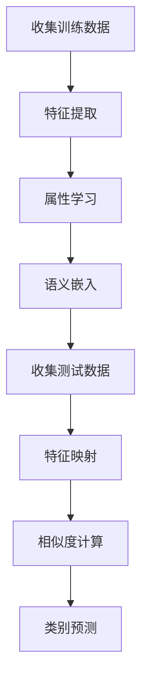

# Zero-Shot Learning原理与代码实例讲解

## 1.背景介绍

在人工智能和机器学习领域，传统的监督学习方法依赖于大量标注数据来训练模型。然而，获取和标注大量数据既耗时又昂贵。为了解决这一问题，Zero-Shot Learning（零样本学习，简称ZSL）应运而生。ZSL的目标是使模型能够识别从未见过的类别，仅通过学习类别的描述或属性。这种方法在处理稀有类别、动态类别变化以及数据标注困难的场景中具有显著优势。

## 2.核心概念与联系

### 2.1 什么是Zero-Shot Learning

Zero-Shot Learning是一种机器学习方法，旨在使模型能够识别从未见过的类别。其核心思想是通过学习类别的描述或属性，使模型能够推断出新类别的特征。

### 2.2 关键概念

- **属性（Attributes）**：描述类别特征的高层次语义信息。例如，动物的颜色、形状、大小等。
- **语义嵌入（Semantic Embedding）**：将类别描述映射到一个高维向量空间，使得相似类别的向量距离较近。
- **训练集（Seen Classes）**：模型在训练过程中见过的类别。
- **测试集（Unseen Classes）**：模型在训练过程中未见过的类别。

### 2.3 Zero-Shot Learning与其他学习方法的联系

ZSL与传统的监督学习、半监督学习和迁移学习有着密切的联系。与监督学习不同，ZSL不需要对所有类别进行标注；与半监督学习不同，ZSL完全不依赖于未见类别的标注数据；与迁移学习类似，ZSL也利用了已知类别的信息来推断未知类别。

## 3.核心算法原理具体操作步骤

### 3.1 数据准备

1. **收集训练数据**：包括已知类别的样本及其属性描述。
2. **收集测试数据**：包括未知类别的样本及其属性描述。

### 3.2 模型训练

1. **特征提取**：从训练数据中提取特征向量。
2. **属性学习**：学习类别的属性向量。
3. **语义嵌入**：将类别描述映射到高维向量空间。

### 3.3 模型推断

1. **特征映射**：将测试样本映射到高维向量空间。
2. **相似度计算**：计算测试样本与各类别属性向量的相似度。
3. **类别预测**：根据相似度最高的类别进行预测。

以下是一个Mermaid流程图，展示了Zero-Shot Learning的核心算法流程：



## 4.数学模型和公式详细讲解举例说明

### 4.1 属性学习

假设我们有 $n$ 个已知类别，每个类别有 $m$ 个属性。我们可以用一个矩阵 $A \in \mathbb{R}^{n \times m}$ 来表示这些属性，其中 $A_{ij}$ 表示第 $i$ 个类别的第 $j$ 个属性。

### 4.2 语义嵌入

我们将类别描述映射到一个高维向量空间。假设 $f(x)$ 是一个映射函数，将类别描述 $x$ 映射到向量空间。我们可以用一个矩阵 $W \in \mathbb{R}^{m \times d}$ 来表示这个映射，其中 $d$ 是向量空间的维度。

$$
f(x) = W \cdot x
$$

### 4.3 相似度计算

对于一个测试样本 $y$，我们首先将其映射到向量空间，然后计算其与各类别属性向量的相似度。相似度可以用余弦相似度来表示：

$$
\text{sim}(y, c) = \frac{f(y) \cdot f(c)}{\|f(y)\| \|f(c)\|}
$$

### 4.4 类别预测

我们选择相似度最高的类别作为预测结果：

$$
\hat{c} = \arg\max_{c} \text{sim}(y, c)
$$

## 5.项目实践：代码实例和详细解释说明

### 5.1 数据准备

首先，我们需要准备训练数据和测试数据。假设我们有以下数据：

```python
# 训练数据
train_data = [
    {"name": "cat", "features": [0.2, 0.3, 0.5], "attributes": [1, 0, 0]},
    {"name": "dog", "features": [0.4, 0.4, 0.2], "attributes": [0, 1, 0]},
    {"name": "bird", "features": [0.1, 0.1, 0.8], "attributes": [0, 0, 1]}
]

# 测试数据
test_data = [
    {"name": "unknown", "features": [0.3, 0.3, 0.4]}
]
```

### 5.2 模型训练

我们使用简单的线性映射来训练模型：

```python
import numpy as np

# 提取特征和属性
X_train = np.array([d["features"] for d in train_data])
A_train = np.array([d["attributes"] for d in train_data])

# 训练线性映射
W = np.linalg.pinv(X_train).dot(A_train)
```

### 5.3 模型推断

我们使用训练好的模型进行推断：

```python
# 提取测试特征
X_test = np.array([d["features"] for d in test_data])

# 映射到属性空间
A_test = X_test.dot(W)

# 计算相似度
similarities = A_test.dot(A_train.T)

# 预测类别
predicted_indices = np.argmax(similarities, axis=1)
predicted_classes = [train_data[i]["name"] for i in predicted_indices]

print(predicted_classes)
```

### 5.4 代码解释

1. **数据准备**：我们准备了训练数据和测试数据，其中训练数据包括类别的特征和属性，测试数据只包括特征。
2. **模型训练**：我们使用线性映射将特征映射到属性空间。
3. **模型推断**：我们将测试特征映射到属性空间，并计算其与训练类别的相似度，最终预测类别。

## 6.实际应用场景

### 6.1 图像分类

在图像分类任务中，ZSL可以用于识别从未见过的物体。例如，训练模型识别猫、狗和鸟，然后使用ZSL识别狮子、老虎等未见过的动物。

### 6.2 自然语言处理

在自然语言处理任务中，ZSL可以用于处理未见过的词汇或短语。例如，训练模型识别常见的实体，然后使用ZSL识别新出现的实体。

### 6.3 医学诊断

在医学诊断任务中，ZSL可以用于识别罕见疾病。例如，训练模型识别常见疾病，然后使用ZSL识别罕见疾病。

## 7.工具和资源推荐

### 7.1 开源库

- **PyTorch**：一个流行的深度学习框架，支持ZSL的实现。
- **TensorFlow**：另一个流行的深度学习框架，也支持ZSL的实现。

### 7.2 数据集

- **AwA（Animals with Attributes）**：一个常用的ZSL数据集，包含50种动物的属性描述。
- **CUB（Caltech-UCSD Birds-200-2011）**：一个鸟类数据集，包含200种鸟类的属性描述。

### 7.3 论文和书籍

- **《Zero-Shot Learning: A Comprehensive Evaluation of the Good, the Bad and the Ugly》**：一篇详细评估ZSL方法的论文。
- **《Deep Learning》**：一本经典的深度学习书籍，包含ZSL的相关内容。

## 8.总结：未来发展趋势与挑战

### 8.1 未来发展趋势

1. **更强的泛化能力**：未来的ZSL模型将具备更强的泛化能力，能够识别更多未见过的类别。
2. **多模态学习**：结合图像、文本、音频等多种模态的信息，提高ZSL的性能。
3. **实时应用**：在实时应用中，ZSL将发挥更大的作用，如自动驾驶、实时监控等。

### 8.2 挑战

1. **数据稀疏性**：如何在数据稀疏的情况下提高ZSL的性能。
2. **属性描述的准确性**：属性描述的准确性对ZSL的性能有很大影响，如何获取准确的属性描述是一个挑战。
3. **计算复杂度**：随着类别数量的增加，计算相似度的复杂度也会增加，如何优化计算是一个挑战。

## 9.附录：常见问题与解答

### 9.1 什么是Zero-Shot Learning？

Zero-Shot Learning是一种机器学习方法，旨在使模型能够识别从未见过的类别，仅通过学习类别的描述或属性。

### 9.2 Zero-Shot Learning的应用场景有哪些？

ZSL可以应用于图像分类、自然语言处理、医学诊断等领域。

### 9.3 Zero-Shot Learning的核心算法是什么？

ZSL的核心算法包括数据准备、模型训练和模型推断三个步骤。

### 9.4 Zero-Shot Learning的未来发展趋势是什么？

未来的ZSL模型将具备更强的泛化能力，结合多模态信息，并在实时应用中发挥更大的作用。

### 9.5 Zero-Shot Learning面临哪些挑战？

ZSL面临数据稀疏性、属性描述的准确性和计算复杂度等挑战。

---

作者：禅与计算机程序设计艺术 / Zen and the Art of Computer Programming