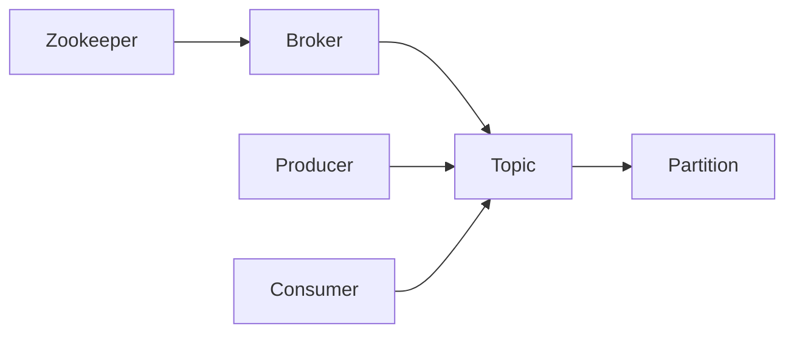

# 【AI大数据计算原理与代码实例讲解】Kafka

## 1. 背景介绍
### 1.1 大数据时代的挑战
随着互联网、物联网、移动互联网等技术的快速发展,数据呈现出爆炸式增长的趋势。据统计,全球每天产生的数据量高达2.5EB(1EB=10^18B)。面对如此海量的数据,传统的数据处理架构已经无法满足实时性、高吞吐量等需求。大数据时代对数据的采集、存储、计算、分析提出了新的挑战。

### 1.2 消息队列的重要性
在大数据系统中,各个子系统、组件之间需要进行高效的数据交换和通信。消息队列(Message Queue)作为一种异步通信机制,在系统架构中扮演着至关重要的角色。它能够实现系统解耦、削峰填谷、数据缓冲等功能,提高系统的可靠性、稳定性和性能。

### 1.3 Kafka的诞生
Kafka最初由LinkedIn公司开发,用于解决该公司内部的海量日志传输问题。2011年,Kafka成为Apache顶级开源项目。经过多年的发展和完善,Kafka已经成为大数据生态系统中不可或缺的消息中间件,被广泛应用于日志聚合、流式计算、事件溯源等领域。

## 2. 核心概念与联系
### 2.1 Broker
Broker是Kafka集群的组成单元,负责消息的存储和转发。每个Broker都有一个唯一的ID,可以配置多个Broker组成Kafka集群,实现负载均衡和高可用。

### 2.2 Topic 
Topic是Kafka的消息类别,生产者将消息发送到特定的Topic,消费者从Topic中拉取消息。每个Topic可以划分为多个Partition,以实现并行处理和水平扩展。

### 2.3 Partition
Partition是Topic的物理分区,每个Partition对应一个目录,消息以追加写的方式存储在Partition中。Partition可以分布在不同的Broker上,实现负载均衡。每个Partition中的消息都有一个唯一的offset,表示消息在Partition中的位置。

### 2.4 Producer
Producer是消息的生产者,负责将消息发送到Kafka的Topic中。Producer可以指定消息的Key和Partition,也可以让Kafka自动选择Partition。

### 2.5 Consumer
Consumer是消息的消费者,负责从Kafka的Topic中拉取消息。Consumer通过指定offset来确定从哪里开始消费。多个Consumer可以组成Consumer Group,共同消费一个Topic,实现消费者之间的负载均衡。

### 2.6 Zookeeper
Zookeeper是一个分布式协调服务,Kafka依赖Zookeeper来实现Broker的注册发现、Controller选举、元数据存储等功能。

### 2.7 关系图
下面是Kafka核心概念之间的关系图(使用Mermaid绘制):



## 3. 核心算法原理具体操作步骤
### 3.1 生产者发送消息
1. 生产者创建ProducerRecord对象,指定Topic、Partition(可选)、Key(可选)和Value。 
2. 生产者将ProducerRecord序列化为字节数组。
3. 生产者根据Topic和Partition选择对应的Broker,并将消息发送到Broker。
4. Broker收到消息后,将其追加到Partition的日志文件中,并返回确认信息。
5. 生产者收到Broker的确认信息,完成消息发送。

### 3.2 消费者消费消息
1. 消费者向Broker发送消费请求,并指定Topic、Partition和offset。
2. Broker验证offset的合法性,并返回对应的消息给消费者。
3. 消费者接收到消息后进行反序列化,得到具体的消息内容。
4. 消费者处理消息,并根据需要提交offset。
5. Broker收到offset提交请求后,更新对应的元数据信息。

### 3.3 Partition负载均衡
1. 生产者发送消息时,根据Topic和Key计算Partition。
2. 如果指定了Partition,则直接将消息发送到对应的Partition。
3. 如果未指定Partition,则根据Key的哈希值与Partition数量取模,选择对应的Partition。
4. 如果未指定Key,则使用Round-Robin算法依次选择Partition。

### 3.4 Consumer Group负载均衡
1. 多个Consumer实例组成一个Consumer Group,共同消费一个Topic。
2. 每个Partition只能被一个Consumer实例消费。
3. Consumer实例定期向Coordinator发送心跳,报告自己的消费进度。
4. Coordinator根据心跳信息,动态调整Consumer实例与Partition的对应关系,实现负载均衡。
5. 当有新的Consumer实例加入或退出时,触发Rebalance,重新分配Partition。

## 4. 数学模型和公式详细讲解举例说明
### 4.1 生产者吞吐量模型
生产者的吞吐量可以用以下公式表示:

$$
Producer Throughput = \frac{Message Size \times Batch Size}{Latency}
$$

其中:
- Message Size:单个消息的大小。
- Batch Size:批次大小,即每次发送的消息数量。  
- Latency:发送一个批次的延迟时间。

举例:假设单个消息大小为1KB,批次大小为1000,延迟为100ms,则生产者吞吐量为:

$$
Producer Throughput = \frac{1KB \times 1000}{100ms} = 10MB/s
$$

### 4.2 消费者吞吐量模型 
消费者的吞吐量可以用以下公式表示:

$$
Consumer Throughput = \frac{Message Size \times Batch Size}{Fetch Latency + Processing Latency}
$$

其中:
- Message Size:单个消息的大小。
- Batch Size:批次大小,即每次拉取的消息数量。
- Fetch Latency:拉取一个批次的延迟时间。
- Processing Latency:处理一个批次的延迟时间。

举例:假设单个消息大小为1KB,批次大小为500,拉取延迟为50ms,处理延迟为100ms,则消费者吞吐量为:  

$$
Consumer Throughput = \frac{1KB \times 500}{50ms + 100ms} = 3.33MB/s
$$

### 4.3 Partition数量计算
Partition的数量需要根据生产者和消费者的吞吐量来设置。一般可以使用以下公式计算:

$$
Partition Number = max(Producer Throughput, Consumer Throughput) \times \frac{Retention Period}{Partition Size}
$$

其中:
- Producer Throughput:生产者的吞吐量。
- Consumer Throughput:消费者的吞吐量。
- Retention Period:消息保留时间。
- Partition Size:单个Partition的大小。

举例:假设生产者吞吐量为10MB/s,消费者吞吐量为5MB/s,消息保留时间为7天,单个Partition大小为1GB,则Partition数量为:

$$
Partition Number = max(10MB/s, 5MB/s) \times \frac{7 \times 24 \times 3600s}{1GB} \approx 60
$$

## 5. 项目实践：代码实例和详细解释说明
下面是使用Java实现Kafka生产者和消费者的示例代码:

### 5.1 生产者示例
```java
import org.apache.kafka.clients.producer.*;

public class KafkaProducerExample {
    public static void main(String[] args) {
        // 配置生产者属性
        Properties props = new Properties();
        props.put("bootstrap.servers", "localhost:9092");
        props.put("key.serializer", "org.apache.kafka.common.serialization.StringSerializer");
        props.put("value.serializer", "org.apache.kafka.common.serialization.StringSerializer");
        
        // 创建生产者实例
        Producer<String, String> producer = new KafkaProducer<>(props);
        
        // 发送消息
        for (int i = 0; i < 10; i++) {
            ProducerRecord<String, String> record = new ProducerRecord<>("my-topic", "key-" + i, "value-" + i);
            producer.send(record, (metadata, exception) -> {
                if (exception != null) {
                    System.err.println("发送消息失败: " + exception.getMessage());
                } else {
                    System.out.println("消息发送成功: " + metadata.topic() + "-" + metadata.partition() + "-" + metadata.offset());
                }
            });
        }
        
        // 关闭生产者
        producer.close();
    }
}
```

说明:
1. 首先配置生产者属性,包括Kafka Broker地址、Key和Value的序列化器等。
2. 创建生产者实例KafkaProducer。
3. 创建ProducerRecord对象,指定Topic、Key和Value。
4. 调用producer.send()方法发送消息,并传入回调函数处理发送结果。
5. 发送完消息后,关闭生产者实例。

### 5.2 消费者示例
```java
import org.apache.kafka.clients.consumer.*;

public class KafkaConsumerExample {
    public static void main(String[] args) {
        // 配置消费者属性
        Properties props = new Properties();
        props.put("bootstrap.servers", "localhost:9092");
        props.put("group.id", "my-group");
        props.put("key.deserializer", "org.apache.kafka.common.serialization.StringDeserializer");
        props.put("value.deserializer", "org.apache.kafka.common.serialization.StringDeserializer");
        
        // 创建消费者实例
        Consumer<String, String> consumer = new KafkaConsumer<>(props);
        
        // 订阅Topic
        consumer.subscribe(Collections.singletonList("my-topic"));
        
        // 拉取并消费消息
        while (true) {
            ConsumerRecords<String, String> records = consumer.poll(Duration.ofMillis(100));
            for (ConsumerRecord<String, String> record : records) {
                System.out.println("消费消息: " + record.topic() + "-" + record.partition() + "-" + record.offset() + ": " + record.key() + "-" + record.value());
            }
        }
    }
}
```

说明:
1. 首先配置消费者属性,包括Kafka Broker地址、消费者组ID、Key和Value的反序列化器等。
2. 创建消费者实例KafkaConsumer。
3. 调用consumer.subscribe()方法订阅需要消费的Topic。
4. 在while循环中,不断调用consumer.poll()方法拉取消息,并指定超时时间。
5. 遍历拉取到的消息集合,处理每条消息。

## 6. 实际应用场景
### 6.1 日志聚合
Kafka可以用于收集分布式系统中的日志,将其集中存储和管理。各个服务节点将日志数据发送到Kafka,然后由日志处理系统(如ELK)从Kafka中消费日志进行分析和监控。

### 6.2 流式数据处理
Kafka可以作为流式数据处理系统(如Spark Streaming、Flink)的数据源,提供实时的数据流。流式处理系统从Kafka中消费数据,进行实时计算和分析,并将结果写回Kafka或其他存储系统。

### 6.3 事件溯源
Kafka可以用于实现事件溯源(Event Sourcing)架构。系统将所有的状态变更事件发送到Kafka,并持久化存储。当需要查询某个状态时,可以从头开始重放事件,重建状态。这种架构可以提供更好的数据一致性和可追溯性。

### 6.4 消息系统
Kafka可以作为消息系统,实现系统之间的异步通信。生产者将消息发送到Kafka,消费者从Kafka中拉取消息并进行处理。Kafka提供了消息持久化、多副本容错、水平扩展等特性,保证了消息的可靠传输。

## 7. 工具和资源推荐
### 7.1 Kafka官方文档
Kafka官方文档提供了Kafka的详细介绍、使用指南、API文档等,是学习和使用Kafka的权威资料。
官方文档地址:https://kafka.apache.org/documentation/

### 7.2 Kafka可视化工具
- Kafka Tool:Kafka的GUI管理工具,可以查看Topic、Partition、消息等信息。
- Kafka Manager:Kafka集群管理工具,支持Topic创建、Partition重分配、Broker监控等。
- Kafka Eagle:Kafka集群监控和管理工具,提供实时的集群状态、性能指标等。

### 7.3 Kafka客户端库
- Kafka Java Client:Kafka官方提供的Java客户端库,用于Java应用程序与Kafka交互。
- Kafka Python Client:Kafka的Python客户端库,如kafka-python、confluent-kafka等。
- Kafka Go Client:Kafka的Go客户端库,如sarama、confluent-kafka-go等。

### 7.4 Kafka生态系统
- Kafka Connect:用于在Kafka和其他数据系统之间移动数据的框架。
- Kafka Streams:用于构建实时