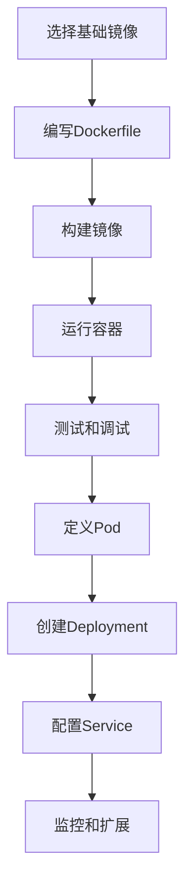

# 【AI大数据计算原理与代码实例讲解】容器

## 1.背景介绍

在当今数据驱动的世界中，人工智能（AI）和大数据已经成为推动技术进步和商业创新的核心力量。AI通过复杂的算法和模型，从大量数据中提取有价值的信息，而大数据则提供了这些算法所需的海量数据。然而，处理和管理这些数据并不是一件简单的事情。容器技术的出现，为AI和大数据计算提供了一种高效、灵活和可扩展的解决方案。

容器是一种轻量级的虚拟化技术，它允许开发者将应用程序及其所有依赖项打包在一个独立的环境中，从而确保应用程序在任何环境中都能一致地运行。容器技术不仅简化了应用程序的部署和管理，还提高了资源利用率和系统的可扩展性。

## 2.核心概念与联系

### 2.1 容器与虚拟机的区别

容器和虚拟机（VM）都是虚拟化技术，但它们在实现方式和使用场景上有显著区别。虚拟机通过虚拟化硬件资源来运行多个操作系统实例，而容器则共享主机操作系统的内核，只虚拟化应用程序层。这使得容器更加轻量级，启动速度更快，资源开销更小。

### 2.2 容器编排

在大规模的AI和大数据计算中，单个容器往往无法满足需求。容器编排工具（如Kubernetes）可以自动化容器的部署、扩展和管理，确保系统的高可用性和可扩展性。

### 2.3 容器与微服务架构

容器技术与微服务架构紧密相关。微服务架构将应用程序拆分为多个独立的服务，每个服务都可以独立部署和扩展。容器为微服务提供了理想的运行环境，使得微服务的开发、测试和部署更加高效。

## 3.核心算法原理具体操作步骤

### 3.1 容器化AI模型的步骤

1. **选择基础镜像**：选择一个适合的基础镜像，如Python、TensorFlow等。
2. **编写Dockerfile**：定义容器的构建过程，包括安装依赖、复制代码、设置环境变量等。
3. **构建镜像**：使用Docker命令构建镜像。
4. **运行容器**：使用构建好的镜像启动容器。
5. **测试和调试**：在容器中运行AI模型，进行测试和调试。

### 3.2 容器编排的步骤

1. **定义Pod**：在Kubernetes中，Pod是最小的部署单元。定义Pod的配置文件，指定容器镜像和资源需求。
2. **创建Deployment**：使用Deployment管理Pod的副本数和更新策略。
3. **配置Service**：定义Service以暴露Pod，提供负载均衡和服务发现。
4. **监控和扩展**：使用Kubernetes的监控和自动扩展功能，根据负载情况动态调整Pod的数量。



## 4.数学模型和公式详细讲解举例说明

在AI和大数据计算中，数学模型和公式是核心。以下是一个简单的线性回归模型的例子：

### 4.1 线性回归模型

线性回归是一种基本的回归分析方法，用于预测因变量 $y$ 与自变量 $x$ 之间的线性关系。其数学模型为：

$$
y = \beta_0 + \beta_1 x + \epsilon
$$

其中，$\beta_0$ 是截距，$\beta_1$ 是斜率，$\epsilon$ 是误差项。

### 4.2 最小二乘法

最小二乘法用于估计线性回归模型中的参数 $\beta_0$ 和 $\beta_1$。其目标是最小化误差平方和：

$$
\min_{\beta_0, \beta_1} \sum_{i=1}^{n} (y_i - (\beta_0 + \beta_1 x_i))^2
$$

通过求解上述优化问题，可以得到参数的估计值：

$$
\hat{\beta_1} = \frac{\sum_{i=1}^{n} (x_i - \bar{x})(y_i - \bar{y})}{\sum_{i=1}^{n} (x_i - \bar{x})^2}
$$

$$
\hat{\beta_0} = \bar{y} - \hat{\beta_1} \bar{x}
$$

### 4.3 实例说明

假设我们有一组数据点 $(x_i, y_i)$，通过最小二乘法可以得到线性回归模型的参数估计值。以下是一个简单的Python代码示例：

```python
import numpy as np

# 样本数据
x = np.array([1, 2, 3, 4, 5])
y = np.array([2, 3, 5, 7, 11])

# 计算参数
x_mean = np.mean(x)
y_mean = np.mean(y)
beta_1 = np.sum((x - x_mean) * (y - y_mean)) / np.sum((x - x_mean) ** 2)
beta_0 = y_mean - beta_1 * x_mean

print(f"回归模型: y = {beta_0:.2f} + {beta_1:.2f}x")
```

## 5.项目实践：代码实例和详细解释说明

### 5.1 Dockerfile 示例

以下是一个简单的Dockerfile示例，用于构建一个运行线性回归模型的容器：

```dockerfile
# 选择基础镜像
FROM python:3.8-slim

# 设置工作目录
WORKDIR /app

# 复制代码文件
COPY . /app

# 安装依赖
RUN pip install numpy

# 运行应用程序
CMD ["python", "linear_regression.py"]
```

### 5.2 构建和运行容器

1. **构建镜像**：

```bash
docker build -t linear-regression .
```

2. **运行容器**：

```bash
docker run --rm linear-regression
```

### 5.3 Kubernetes 配置示例

以下是一个简单的Kubernetes配置文件示例，用于部署线性回归模型的容器：

```yaml
apiVersion: v1
kind: Pod
metadata:
  name: linear-regression-pod
spec:
  containers:
  - name: linear-regression-container
    image: linear-regression
    resources:
      limits:
        memory: "128Mi"
        cpu: "500m"
```

## 6.实际应用场景

### 6.1 数据预处理

在AI和大数据计算中，数据预处理是一个关键步骤。容器技术可以提供一个一致的环境，确保数据预处理过程的可重复性和可靠性。

### 6.2 模型训练

容器技术可以简化AI模型的训练过程。通过容器化模型训练环境，可以确保模型在不同环境中的一致性，并且可以轻松扩展计算资源以加速训练过程。

### 6.3 模型部署

容器技术使得AI模型的部署变得更加简单和高效。通过容器编排工具，可以实现模型的自动化部署、扩展和管理，确保系统的高可用性和可扩展性。

### 6.4 数据分析

在大数据分析中，容器技术可以提供一个灵活的计算环境，支持多种数据分析工具和框架。通过容器化数据分析环境，可以提高数据分析的效率和准确性。

## 7.工具和资源推荐

### 7.1 Docker

Docker是最流行的容器化平台，提供了丰富的工具和资源，支持容器的构建、运行和管理。

### 7.2 Kubernetes

Kubernetes是一个开源的容器编排平台，提供了强大的功能，支持容器的自动化部署、扩展和管理。

### 7.3 TensorFlow

TensorFlow是一个开源的机器学习框架，支持多种AI模型的开发和训练。通过容器化TensorFlow环境，可以简化模型的开发和部署过程。

### 7.4 Jupyter Notebook

Jupyter Notebook是一个交互式的计算环境，支持多种编程语言。通过容器化Jupyter Notebook环境，可以提供一个灵活的开发和测试平台。

## 8.总结：未来发展趋势与挑战

容器技术在AI和大数据计算中的应用前景广阔。随着技术的不断发展，容器技术将进一步提高系统的灵活性、可扩展性和可靠性。然而，容器技术也面临一些挑战，如安全性、网络性能和存储管理等。未来，随着技术的不断进步和完善，这些挑战将逐步得到解决，容器技术将在AI和大数据计算中发挥更加重要的作用。

## 9.附录：常见问题与解答

### 9.1 容器与虚拟机的主要区别是什么？

容器和虚拟机都是虚拟化技术，但它们在实现方式和使用场景上有显著区别。虚拟机通过虚拟化硬件资源来运行多个操作系统实例，而容器则共享主机操作系统的内核，只虚拟化应用程序层。这使得容器更加轻量级，启动速度更快，资源开销更小。

### 9.2 如何选择合适的基础镜像？

选择基础镜像时，应根据应用程序的需求和依赖项来选择。例如，如果应用程序使用Python编写，可以选择Python基础镜像；如果应用程序需要TensorFlow，可以选择TensorFlow基础镜像。

### 9.3 如何确保容器的安全性？

确保容器的安全性可以从以下几个方面入手：
- 使用可信的基础镜像
- 定期更新镜像，修复已知漏洞
- 限制容器的权限，避免容器对主机系统的影响
- 使用容器安全工具，如Docker Security Scanning、Aqua Security等

### 9.4 如何优化容器的性能？

优化容器性能可以从以下几个方面入手：
- 减少镜像体积，避免不必要的依赖项
- 使用多阶段构建，优化构建过程
- 合理配置资源限制，避免资源争用
- 使用高效的存储和网络配置

### 9.5 如何监控和管理容器？

可以使用以下工具和平台来监控和管理容器：
- Docker提供的内置工具，如docker stats、docker logs等
- Kubernetes提供的监控和管理功能，如kubectl、Prometheus等
- 第三方容器监控工具，如Datadog、New Relic等

作者：禅与计算机程序设计艺术 / Zen and the Art of Computer Programming