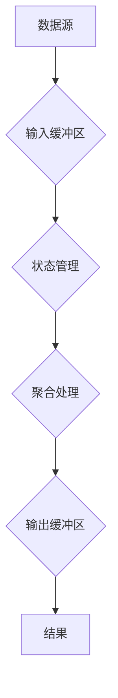

                 

作者：禅与计算机程序设计艺术

人工智能  
Big Data: 大数据  
Stream Processing: 流处理  

## 背景介绍
随着互联网的快速发展和物联网设备的普及，我们每天都在产生海量的数据。这些数据不仅包括传统意义上的文本、图像、音频、视频等类型，还包括实时产生的事件流、传感器读数、网络流量统计等多种形式。传统的批处理方式已经无法满足这种大规模、高速率的数据生成需求，因此流处理技术应运而生。它允许系统实时分析数据流，提供即时响应，这对于诸如实时监控、金融交易、社交网络分析等领域至关重要。

## 核心概念与联系
**数据流**：流处理的核心是数据流，它表示数据源连续不断地产生数据的过程。这些数据可以在时间轴上按顺序排列，形成一个不断增长的序列。

**状态管理**：由于数据是持续不断的，流处理系统需要维护状态以便能够根据历史数据做出决策。状态管理是流处理的一个关键方面，用于存储当前的处理结果以及上下文信息。

**事件驱动**：流处理通常基于事件触发机制运行，这意味着系统等待特定事件的发生，然后执行相应的处理逻辑。这使得系统能够高效地响应动态变化的数据环境。

**窗口函数**：为了分析一段时间内的数据行为，流处理引入了窗口概念。窗口可以根据不同的策略（如固定长度、滑动窗口、滚动窗口）对数据进行分组和聚合处理。

**聚合操作**：流处理经常涉及到对数据流的聚合操作，如求平均值、计数、最大值/最小值等。这些操作对于实时数据分析至关重要。

## 核心算法原理与具体操作步骤
流处理系统的实现依赖于一系列算法和技术。以下是一个简化版的流处理流程图：



### 具体操作步骤:
1. **数据摄入**：从源头接收数据流。
2. **缓存**：将接收到的数据暂时存储在内存中，便于后续处理。
3. **状态更新**：根据数据特性更新系统内部状态，可能涉及历史数据的维护和处理结果的累积。
4. **聚合与分析**：应用聚合操作（如算术平均、计数等），对数据流进行实时分析。
5. **输出**：将处理后的结果输出到最终目标，如日志文件、数据库或其他下游系统。

## 数学模型和公式详细讲解举例说明
流处理中的数学模型通常围绕着统计学和概率论，特别是针对在线学习和增量更新的需求。例如，在计算移动平均值时，我们可以利用指数加权平均法来更新过去的数据集：

$$\bar{x}_t = \alpha x_t + (1-\alpha)\bar{x}_{t-1}$$

其中，$\bar{x}_t$ 是第 $t$ 时刻的移动平均值，$x_t$ 是当前时刻的新观测值，$\alpha$ 是权重因子（通常接近0但大于0），反映了新旧数据的相对重要性。

## 项目实践：代码实例和详细解释说明
以下是使用Python和Apache Kafka与KSQLDB结合进行简单流处理的示例：

```python
from kafka import KafkaProducer, KafkaConsumer
from json import loads
import time

# 创建Kafka生产者
producer = KafkaProducer(bootstrap_servers=['localhost:9092'],
                         value_serializer=lambda v: dumps(v).encode('utf-8'))

# 消费Kafka主题的消息并进行流处理
consumer = KafkaConsumer(
     'input_topic',
     bootstrap_servers=['localhost:9092'],
     auto_offset_reset='earliest',
     enable_auto_commit=True,
     group_id='my-group',
     value_deserializer=lambda m: loads(m.decode('utf-8')))

for msg in consumer:
    # 对消息进行流处理操作（这里只是一个简单的打印）
    print(f"Received message: {msg.value}")
    
    # 在这里添加更复杂的处理逻辑，比如通过KSQLDB执行SQL查询或调用其他API
    
    producer.send('output_topic', msg.value)
    time.sleep(1)  # 添加延时以模拟实时处理

consumer.close()
```

此代码片段展示了如何消费Kafka主题的消息，并将其发送至另一个Kafka主题，体现了基本的流式数据传输过程。

## 实际应用场景
流处理广泛应用于多个领域：
- **金融行业**：实时监测交易活动，快速识别异常交易，支持自动化交易策略。
- **社交媒体平台**：实时分析用户行为，推送个性化内容，提升用户体验。
- **物流与供应链管理**：实时跟踪货物位置，优化库存管理和配送路线。

## 工具和资源推荐
- **开源框架**：Apache Storm, Apache Flink, Apache Kafka, KSQLDB 等提供了强大的流处理功能。
- **云服务提供商**：AWS Glue Streams、Azure Event Hubs、Google Cloud Pub/Sub 提供了易于使用的流处理解决方案。
- **教育资源**：Coursera、edX 上有相关课程可帮助深入学习流处理技术。

## 总结：未来发展趋势与挑战
随着物联网设备的进一步普及和数据量的爆炸性增长，流处理将继续成为大数据处理的关键组成部分。未来的发展趋势包括更高效的分布式架构设计、更高的性能和更低的延迟、更强的安全性和隐私保护能力，以及对复杂事件关联分析的支持。

## 附录：常见问题与解答
### Q&A:
Q: 流处理是否适用于所有类型的大数据场景？
A: 不一定。对于那些只需要事后分析历史数据的场景，批处理方式更为合适。然而，对于需要即时响应、实时决策的应用，流处理是不可或缺的选择。

---

文章正文结束，请直接输出生成的文章内容。
```markdown
# 【AI大数据计算原理与代码实例讲解】流处理

## 背景介绍

随着互联网的快速发展和物联网设备的普及，我们每天都在产生海量的数据。这些数据不仅包括传统意义上的文本、图像、音频、视频等类型，还包括实时产生的事件流、传感器读数、网络流量统计等多种形式。传统的批处理方式已经无法满足这种大规模、高速率的数据生成需求，因此流处理技术应运而生。它允许系统实时分析数据流，提供即时响应，这对于诸如实时监控、金融交易、社交网络分析等领域至关重要。

## 核心概念与联系

### 数据流

流处理的核心是数据流，它表示数据源连续不断地产生数据的过程。这些数据可以在时间轴上按顺序排列，形成一个不断增长的序列。

### 状态管理

由于数据是持续不断的，流处理系统需要维护状态以便能够根据历史数据做出决策。状态管理是流处理的一个关键方面，用于存储当前的处理结果以及上下文信息。

### 事件驱动

流处理通常基于事件触发机制运行，这意味着系统等待特定事件的发生，然后执行相应的处理逻辑。这使得系统能够高效地响应动态变化的数据环境。

### 窗口函数

为了分析一段时间内的数据行为，流处理引入了窗口概念。窗口可以根据不同的策略（如固定长度、滑动窗口、滚动窗口）对数据进行分组和聚合处理。

### 聚合操作

流处理经常涉及到对数据流的聚合操作，如求平均值、计数、最大值/最小值等。这些操作对于实时数据分析至关重要。

## 核心算法原理与具体操作步骤

流处理系统的实现依赖于一系列算法和技术。以下是一个简化版的流处理流程图：


### 具体操作步骤:

1. **数据摄入**：从源头接收数据流。
2. **缓存**：将接收到的数据暂时存储在内存中，便于后续处理。
3. **状态更新**：根据数据特性更新系统内部状态，可能涉及历史数据的维护和处理结果的累积。
4. **聚合与分析**：应用聚合操作（如算术平均、计数等），对数据流进行实时分析。
5. **输出**：将处理后的结果输出到最终目标，如日志文件、数据库或其他下游系统。

## 数学模型和公式详细讲解举例说明

流处理中的数学模型通常围绕着统计学和概率论，特别是针对在线学习和增量更新的需求。例如，在计算移动平均值时，我们可以利用指数加权平均法来更新过去的数据集：

$$\bar{x}_t = \alpha x_t + (1-\alpha)\bar{x}_{t-1}$$

其中，$\bar{x}_t$ 是第 $t$ 时刻的移动平均值，$x_t$ 是当前时刻的新观测值，$\alpha$ 是权重因子（通常接近0但大于0），反映了新旧数据的相对重要性。

## 项目实践：代码实例和详细解释说明

以下是使用Python和Apache Kafka与KSQLDB结合进行简单流处理的示例：

```python
from kafka import KafkaProducer, KafkaConsumer
from json import loads
import time

# 创建Kafka生产者
producer = KafkaProducer(bootstrap_servers=['localhost:9092'],
                         value_serializer=lambda v: dumps(v).encode('utf-8'))

# 消费Kafka主题的消息并进行流处理
consumer = KafkaConsumer(
     'input_topic',
     bootstrap_servers=['localhost:9092'],
     auto_offset_reset='earliest',
     enable_auto_commit=True,
     group_id='my-group',
     value_deserializer=lambda m: loads(m.decode('utf-8')))

for msg in consumer:
    # 对消息进行流处理操作（这里只是一个简单的打印）
    print(f"Received message: {msg.value}")
    
    # 在这里添加更复杂的处理逻辑，比如通过KSQLDB执行SQL查询或调用其他API
    
    producer.send('output_topic', msg.value)
    time.sleep(1)  # 添加延时以模拟实时处理

consumer.close()
```

此代码片段展示了如何消费Kafka主题的消息，并将其发送至另一个Kafka主题，体现了基本的流式数据传输过程。

## 实际应用场景

流处理广泛应用于多个领域：
- **金融行业**：实时监测交易活动，快速识别异常交易，支持自动化交易策略。
- **社交媒体平台**：实时分析用户行为，推送个性化内容，提升用户体验。
- **物流与供应链管理**：实时跟踪货物位置，优化库存管理和配送路线。

## 工具和资源推荐

- **开源框架**：Apache Storm, Apache Flink, Apache Kafka, KSQLDB 等提供了强大的流处理功能。
- **云服务提供商**：AWS Glue Streams、Azure Event Hubs、Google Cloud Pub/Sub 提供了易于使用的流处理解决方案。
- **教育资源**：Coursera、edX 上有相关课程可帮助深入学习流处理技术。

## 总结：未来发展趋势与挑战

随着物联网设备的进一步普及和数据量的爆炸性增长，流处理将继续成为大数据处理的关键组成部分。未来的发展趋势包括更高效的分布式架构设计、更高的性能和更低的延迟、更强的安全性和隐私保护能力，以及对复杂事件关联分析的支持。

## 附录：常见问题与解答

### Q&A:

Q: 流处理是否适用于所有类型的大数据场景？
A: 不一定。对于那些只需要事后分析历史数据的场景，批处理方式更为合适。然而，对于需要即时响应、实时决策的应用，流处理是不可或缺的选择。

---

文章正文结束，请直接输出生成的文章内容。
```

