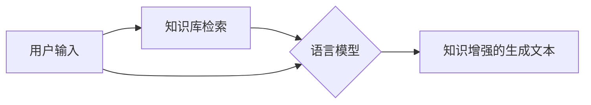

# 【LangChain编程：从入门到实践】RAG技术概述

## 1. 背景介绍
### 1.1 什么是LangChain
LangChain是一个用于开发由语言模型驱动的应用程序的框架。它可以帮助开发人员将语言模型与外部数据源相结合，构建更加强大、知识丰富的应用。

### 1.2 RAG技术的起源与发展
RAG(Retrieval-Augmented Generation)技术起源于对语言模型在开放域对话和问答任务中存在的局限性的研究。传统的语言模型虽然能够生成流畅、连贯的文本，但往往缺乏必要的背景知识，导致生成的内容与事实不符。RAG技术的提出，就是为了解决这一问题，通过引入外部知识库，增强语言模型的知识获取和推理能力。

随着自然语言处理技术的不断发展，RAG技术也在不断完善和改进。从最初的基于TF-IDF的文本检索，到后来引入更加先进的dense retrieval技术；从单纯的知识库检索，到融合多种外部信息源；RAG技术的应用场景和效果都在不断拓展和提升。

## 2. 核心概念与联系
### 2.1 语言模型
语言模型是RAG技术的核心组件之一。它负责根据输入的文本，生成符合语法、语义和逻辑的延续文本。常见的语言模型有GPT、BERT、T5等，它们基于海量文本数据进行预训练，具备强大的语言理解和生成能力。

### 2.2 知识库检索
知识库检索是RAG技术的另一个关键组成部分。它负责从外部知识库中检索与输入相关的背景知识，为语言模型提供必要的上下文信息。知识库可以是结构化的数据库、非结构化的文档集合，甚至是图谱、表格等多模态信息源。

### 2.3 语言模型与知识库的融合
RAG的核心思想就是将语言模型与知识库检索无缝融合，形成一个知识增强的文本生成系统。具体来说，RAG先利用知识库检索获取相关的背景知识，然后将其与原始输入一起feed给语言模型，指导模型生成更加知识丰富、事实准确的文本。

下图展示了RAG技术的基本架构和工作流程：



## 3. 核心算法原理与具体操作步骤
### 3.1 Dense Retrieval
Dense Retrieval是RAG技术中最常用的知识库检索算法。与传统的基于关键词匹配的检索方式不同，Dense Retrieval使用语义向量表示文本，通过向量之间的相似度计算来检索最相关的知识片段。

Dense Retrieval的具体操作步骤如下：
1. 对知识库中的所有文档进行编码，将每个文档映射为一个固定长度的语义向量。常用的文档编码模型有BERT、RoBERTa等。
2. 对用户输入的查询文本也进行编码，得到查询向量。
3. 计算查询向量与所有文档向量之间的相似度，选取Top-K个最相似的文档作为检索结果。相似度的计算可以使用点积、cosine等方式。
4. 将检索到的Top-K个文档传递给下游的语言模型，生成最终的答案。

### 3.2 知识蒸馏
除了Dense Retrieval，知识蒸馏也是RAG中常用的一种技术。它的目的是将知识库中的结构化知识"蒸馏"到语言模型中，使得语言模型能够直接利用这些知识，而无需在每次推理时都进行检索。

知识蒸馏的主要步骤包括：
1. 利用知识库构建训练数据。将知识库中的结构化知识转化为自然语言形式的句子对，作为语言模型的训练样本。
2. 在语言模型上进行微调。使用构建好的训练数据对预训练的语言模型进行微调，使其学会如何利用结构化知识进行问答和对话。
3. 在下游任务中直接使用微调后的语言模型进行推理，无需再进行知识库检索。

## 4. 数学模型和公式详细讲解举例说明
### 4.1 Dense Retrieval中的相似度计算
在Dense Retrieval中，我们需要计算查询向量$q$与每个文档向量$d_i$之间的相似度$sim(q,d_i)$，常用的相似度计算方法有：

1. 点积(Dot Product):
$$sim(q,d_i) = q \cdot d_i = \sum_{j=1}^{n} q_j \times d_{ij}$$

2. 余弦相似度(Cosine Similarity):
$$sim(q,d_i) = \frac{q \cdot d_i}{||q|| \times ||d_i||} = \frac{\sum_{j=1}^{n} q_j \times d_{ij}}{\sqrt{\sum_{j=1}^{n} q_j^2} \times \sqrt{\sum_{j=1}^{n} d_{ij}^2}}$$

其中，$n$表示向量的维度，$q_j$和$d_{ij}$分别表示$q$和$d_i$在第$j$维上的取值。

举例说明：假设我们有一个查询向量$q=[0.1,0.2,0.3]$，以及两个文档向量$d_1=[0.2,0.1,0.3]$，$d_2=[0.4,0.5,0.6]$，分别计算$q$与$d_1$、$d_2$的余弦相似度。

- $q$与$d_1$的余弦相似度：
$$sim(q,d_1)=\frac{0.1\times0.2+0.2\times0.1+0.3\times0.3}{\sqrt{0.1^2+0.2^2+0.3^2} \times \sqrt{0.2^2+0.1^2+0.3^2}}=0.9879$$

- $q$与$d_2$的余弦相似度：  
$$sim(q,d_2)=\frac{0.1\times0.4+0.2\times0.5+0.3\times0.6}{\sqrt{0.1^2+0.2^2+0.3^2} \times \sqrt{0.4^2+0.5^2+0.6^2}}=0.9922$$

可见，$q$与$d_2$的相似度更高，所以如果我们要检索Top-1的结果，应该返回$d_2$。

### 4.2 知识蒸馏中的损失函数
在知识蒸馏中，我们需要让学生模型(语言模型)尽可能地学习教师模型(知识库)的知识。为此，我们通常使用以下损失函数：

1. 交叉熵损失(Cross Entropy Loss):
$$L_{CE}=-\sum_{i=1}^{N} \sum_{j=1}^{C} y_{ij} \log(\hat{y}_{ij})$$

其中，$N$表示训练样本的数量，$C$表示类别的数量，$y_{ij}$表示第$i$个样本属于第$j$个类别的真实概率，$\hat{y}_{ij}$表示学生模型预测的概率。

2. 均方误差损失(Mean Squared Error Loss):
$$L_{MSE}=\frac{1}{N} \sum_{i=1}^{N} (y_i - \hat{y}_i)^2$$

其中，$y_i$表示第$i$个样本的真实值，$\hat{y}_i$表示学生模型的预测值。

我们通过最小化这些损失函数，来使学生模型的预测结果尽可能接近教师模型的结果，从而达到知识蒸馏的目的。

## 5. 项目实践：代码实例和详细解释说明
下面我们通过一个简单的代码实例，来演示如何使用LangChain实现基于Dense Retrieval的RAG。

```python
from langchain.embeddings import OpenAIEmbeddings
from langchain.vectorstores import FAISS
from langchain.text_splitter import CharacterTextSplitter
from langchain.document_loaders import TextLoader
from langchain.chains import RetrievalQA
from langchain.llms import OpenAI

# 加载文档
loader = TextLoader('path/to/doc.txt')
documents = loader.load()

# 切分文档
text_splitter = CharacterTextSplitter(chunk_size=1000, chunk_overlap=0)
texts = text_splitter.split_documents(documents)

# 文档编码
embeddings = OpenAIEmbeddings()
docsearch = FAISS.from_documents(texts, embeddings)

# 初始化检索QA链
qa = RetrievalQA.from_chain_type(
    llm=OpenAI(), 
    chain_type="stuff", 
    retriever=docsearch.as_retriever()
)

# 执行问答
query = "What is the capital of France?"
result = qa.run(query)
print(result)
```

代码解释：
1. 首先，我们加载需要检索的文档，并使用`CharacterTextSplitter`将其切分成多个小段落，每个段落的长度为1000个字符。
2. 然后，我们使用`OpenAIEmbeddings`对每个段落进行编码，得到它们的语义向量表示，并使用`FAISS`将这些向量存储起来，构建一个向量数据库。
3. 接下来，我们初始化一个`RetrievalQA`链，指定使用`OpenAI`作为问答的语言模型，使用`stuff`作为文档处理的方式，使用`docsearch.as_retriever()`作为检索器。
4. 最后，我们输入一个问题`query`，调用`qa.run(query)`执行问答，得到最终的答案`result`并打印出来。

以上就是一个简单的RAG问答系统的实现。实际应用中，我们还可以使用更加强大的语言模型和更加复杂的文档处理方式，来进一步提高问答的效果。

## 6. 实际应用场景
RAG技术可以应用于多种实际场景，包括：

1. 智能客服：利用RAG构建的问答系统，可以自动回答客户的常见问题，提供24小时不间断的客服服务，减轻人工客服的压力。
2. 个人助理：RAG可以用于开发智能的个人助理应用，根据用户的问题，从各种知识源中检索相关信息，提供有针对性的回答和建议。
3. 医疗诊断：将医学知识库与RAG相结合，可以辅助医生进行疾病诊断和治疗方案的制定，提高诊断的准确性和效率。
4. 教育问答：学生在学习过程中经常会遇到各种问题，使用RAG可以为他们提供智能的答疑服务，帮助他们更好地理解和掌握知识。
5. 金融分析：RAG可以用于分析金融新闻、公司报告等文本数据，回答有关市场趋势、投资策略等方面的问题，为投资者提供决策支持。

总的来说，RAG技术可以让各行各业的人们更加便捷地获取所需的知识和信息，提高工作和生活的效率。

## 7. 工具和资源推荐
如果您对RAG技术感兴趣，想要进一步学习和实践，以下是一些推荐的工具和资源：

1. LangChain：一个用于构建由语言模型驱动的应用程序的强大框架，提供了丰富的工具和组件，可以帮助您快速搭建RAG系统。
2. Hugging Face Transformers：一个流行的自然语言处理库，提供了多种预训练的语言模型，可以用于文本编码和生成。
3. Elasticsearch：一个开源的分布式搜索和分析引擎，可以用于构建高效的文档检索系统。
4. FAISS：Facebook开源的一个用于高效相似性搜索和密集向量聚类的库，在RAG中常用于文档语义向量的存储和检索。
5. 《Retrieval-Augmented Generation for Knowledge-Intensive NLP Tasks》：RAG技术的原始论文，详细介绍了其动机、原理和实现方法。
6. 《Retrieval Augmented Language Model Pre-Training》：一篇介绍如何将知识检索与语言模型预训练相结合的论文，对知识增强型语言模型的研究具有重要意义。

## 8. 总结：未来发展趋势与挑战
RAG技术的出现，为知识密集型自然语言处理任务的发展开辟了新的道路。通过将语言模型与知识检索相结合，RAG可以生成更加知识丰富、事实准确的文本，在智能问答、对话系统等领域具有广阔的应用前景。

未来，RAG技术可能会向以下几个方向发展：
1. 多模态RAG：将文