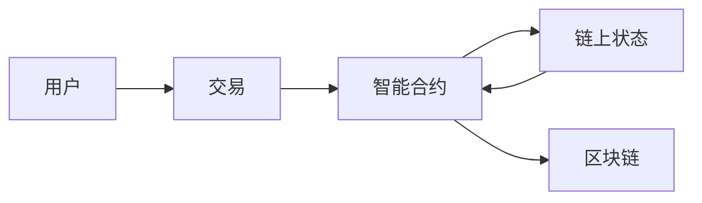

## 1.背景介绍

随着区块链技术的发展，编程语言也在不断的创新和演变。LangChain是一种新型的区块链编程语言，它以其独特的设计理念和强大的功能，正在引领区块链编程的新潮流。本文将详细介绍LangChain编程语言，包括其背景、核心概念、原理、应用等内容，希望能对想要入门LangChain的读者有所帮助。

## 2.核心概念与联系

LangChain的设计理念是让开发者能够更简单、更安全地编写区块链程序。其核心概念包括以下几点：

- **智能合约**：LangChain中的智能合约是一种自动执行的程序，它可以在区块链上执行预定的任务。
- **链上状态**：链上状态是区块链上的数据，它可以被智能合约读取和修改。
- **交易**：交易是触发智能合约执行的事件，它包含了执行智能合约所需的所有信息。

这三个概念构成了LangChain的基本运行模型：用户发起交易，触发智能合约执行，智能合约读取和修改链上状态，然后将结果保存在区块链上。



## 3.核心算法原理具体操作步骤

LangChain的核心算法原理主要包括智能合约的执行和交易的处理。这两个过程是密切相关的，我们将分别进行详细介绍。

### 3.1 智能合约的执行

智能合约的执行是LangChain的核心功能。智能合约是一种可以在区块链上自动执行的程序，它可以读取和修改链上状态。智能合约的执行步骤如下：

1. 用户发起交易，指定要执行的智能合约和参数。
2. LangChain收到交易后，验证交易的合法性。
3. 如果交易合法，LangChain加载智能合约，将交易的参数作为输入，执行智能合约。
4. 智能合约执行过程中，可以读取和修改链上状态。
5. 智能合约执行完毕，将结果保存在区块链上。

### 3.2 交易的处理

交易是触发智能合约执行的事件。交易的处理步骤如下：

1. 用户创建交易，指定要执行的智能合约和参数，然后签名并广播到网络。
2. LangChain的节点收到交易后，验证交易的合法性。
3. 如果交易合法，节点将交易放入交易池，等待打包进区块。
4. 当节点产生新的区块时，会从交易池中选择一部分交易，按照一定的规则执行这些交易。

## 4.数学模型和公式详细讲解举例说明

LangChain的运行模型可以用数学模型来描述。我们可以将LangChain看作是一个状态机，其中的状态是链上的数据，交易是状态转移的触发事件，智能合约是状态转移的规则。这个模型可以用下面的公式来描述：

设$S$是链上的状态，$T$是交易，$C$是智能合约，$f$是状态转移函数，那么有：

$$
S_{t+1} = f(S_t, T, C)
$$

这个公式表示，在时间$t$，状态$S_t$接收到交易$T$和智能合约$C$后，会转移到新的状态$S_{t+1}$。这个过程是由函数$f$控制的，函数$f$描述了智能合约如何根据交易修改状态。

## 5.项目实践：代码实例和详细解释说明

下面我们将通过一个简单的项目实践，来演示如何在LangChain上编写和执行智能合约。我们将编写一个简单的智能合约，实现一个链上的计数器。

首先，我们需要编写智能合约的代码。在LangChain中，智能合约是用LangChain的编程语言编写的，以下是一个简单的计数器智能合约的代码：

```langchain
contract Counter {
    state int count = 0;

    function increment() public {
        count += 1;
    }

    function get() public view returns (int) {
        return count;
    }
}
```

这个智能合约定义了一个状态变量`count`，以及两个函数`increment`和`get`。`increment`函数用于增加`count`的值，`get`函数用于获取`count`的值。

然后，我们需要创建一个交易，触发智能合约的执行。以下是创建交易的代码：

```langchain
Transaction tx = new Transaction();
tx.setContract(Counter.class);
tx.setMethod("increment");
tx.setArgs(new Object[]{});
tx.sign(privateKey);
```

这段代码创建了一个交易，指定了要执行的智能合约和方法，然后使用私钥对交易进行签名。

最后，我们将交易广播到网络，等待智能合约的执行结果。以下是广播交易的代码：

```langchain
Network.broadcast(tx);
```

这段代码将交易广播到网络，其他节点收到交易后，会将其放入交易池，等待打包进区块。

## 6.实际应用场景

LangChain的应用场景非常广泛，包括但不限于以下几个方面：

- **金融服务**：LangChain可以用于实现各种金融服务，如支付、清算、借贷等。
- **供应链管理**：LangChain可以用于实现供应链的透明化，提高供应链的效率和可靠性。
- **数字身份**：LangChain可以用于实现数字身份，保护用户的隐私和安全。
- **物联网**：LangChain可以用于实现物联网设备的自主交易和合作。

## 7.工具和资源推荐

以下是一些推荐的工具和资源，可以帮助你更好地学习和使用LangChain：

- **LangChain官方文档**：这是LangChain的官方文档，包含了LangChain的详细信息和使用指南。
- **LangChain开发者社区**：这是LangChain的开发者社区，你可以在这里找到其他开发者，分享经验和学习资源。
- **LangChain开发工具**：这是LangChain的开发工具，包括编译器、测试框架等，可以帮助你更方便地开发智能合约。

## 8.总结：未来发展趋势与挑战

LangChain作为一种新型的区块链编程语言，其发展前景广阔。随着区块链技术的发展，LangChain有可能成为区块链开发的主流语言。

然而，LangChain也面临着一些挑战。首先，LangChain需要吸引更多的开发者，形成一个活跃的开发者社区。其次，LangChain需要不断完善其工具和框架，提高开发者的开发效率。最后，LangChain需要不断优化其性能，满足日益增长的业务需求。

## 9.附录：常见问题与解答

以下是一些关于LangChain的常见问题和解答：

- **问题1：LangChain和其他区块链编程语言有什么区别？**
  - 答：LangChain的设计理念是让开发者能够更简单、更安全地编写区块链程序。它提供了一种全新的编程模型，使得开发者可以更方便地处理区块链上的状态和交易。

- **问题2：如何在LangChain上部署智能合约？**
  - 答：你可以通过创建交易来部署智能合约。交易中需要指定智能合约的代码和初始化参数。

- **问题3：LangChain如何处理交易冲突？**
  - 答：LangChain通过一种称为“交易序列化”的机制来处理交易冲突。在这种机制下，每个交易都有一个唯一的序列号，节点按照序列号的顺序来执行交易。

作者：禅与计算机程序设计艺术 / Zen and the Art of Computer Programming