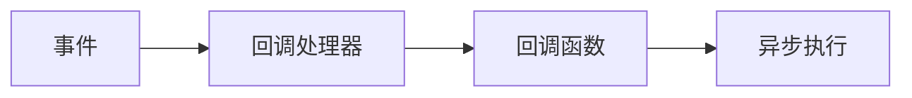

# 【LangChain编程：从入门到实践】回调处理器

## 1. 背景介绍
在现代软件开发中，异步编程和事件驱动架构已成为主流趋势。而回调(Callback)作为一种常见的异步编程模式，在各种编程语言和框架中得到广泛应用。LangChain作为一个强大的自然语言处理(NLP)编程框架，同样提供了灵活的回调处理机制，方便开发者实现定制化的功能扩展。

本文将深入探讨LangChain中的回调处理器(CallbackHandler)，从基本概念出发，结合实际代码示例，详细讲解其工作原理和使用方法。通过学习回调处理器，读者可以更好地理解和运用LangChain进行NLP任务开发，提升编程效率和代码质量。

### 1.1 异步编程与回调模式
#### 1.1.1 异步编程的优势
#### 1.1.2 回调模式的基本原理
#### 1.1.3 回调在各编程语言中的应用

### 1.2 LangChain简介
#### 1.2.1 LangChain的主要特性
#### 1.2.2 LangChain在NLP领域的应用
#### 1.2.3 LangChain的整体架构

## 2. 核心概念与联系
要深入理解LangChain的回调处理器，首先需要掌握几个核心概念及其之间的联系。

### 2.1 回调函数(Callback Function)
#### 2.1.1 回调函数的定义
#### 2.1.2 回调函数的参数和返回值
#### 2.1.3 回调函数的异步执行机制

### 2.2 事件(Event)
#### 2.2.1 事件的定义
#### 2.2.2 事件的分类
#### 2.2.3 事件与回调函数的关系

### 2.3 回调处理器(CallbackHandler)
#### 2.3.1 回调处理器的作用
#### 2.3.2 回调处理器的接口定义
#### 2.3.3 回调处理器与事件的交互

### 2.4 概念之间的联系
通过一个简单的示意图，我们可以更清晰地看出这些核心概念之间的联系：



## 3. 核心算法原理与具体操作步骤
LangChain的回调处理器内部采用了事件分发和回调函数注册的机制，实现了高效灵活的异步处理。

### 3.1 事件分发算法
#### 3.1.1 事件类型的枚举
#### 3.1.2 事件对象的构造
#### 3.1.3 事件分发的实现

### 3.2 回调函数注册算法 
#### 3.2.1 回调函数签名的定义
#### 3.2.2 回调函数的注册流程
#### 3.2.3 回调函数的存储结构

### 3.3 异步执行算法
#### 3.3.1 多线程/协程的选择
#### 3.3.2 异步任务的调度策略 
#### 3.3.3 异步结果的同步机制

### 3.4 具体操作步骤
结合上述算法原理，使用LangChain的回调处理器一般遵循以下步骤：

1. 定义事件类型和事件对象
2. 实现自定义的回调函数
3. 创建回调处理器实例
4. 将回调函数注册到处理器
5. 在适当的时机触发事件
6. 事件被分发到注册的回调函数
7. 回调函数异步执行，返回结果

## 4. 数学模型和公式详细讲解举例说明
为了更好地理解LangChain回调处理器的工作原理，我们可以借助数学模型和公式来进行形式化描述。

### 4.1 事件集合与回调函数集合
我们定义事件集合 $E$ 和回调函数集合 $C$，其中：

$$
E = \{e_1, e_2, ..., e_n\} \\
C = \{c_1, c_2, ..., c_m\}
$$

其中，$e_i$ 表示第 $i$ 个事件，$c_j$ 表示第 $j$ 个回调函数。

### 4.2 事件与回调函数的映射关系
对于每一个事件 $e_i$，都有一个对应的回调函数子集 $C_i$，表示该事件触发时需要执行的回调函数。因此，我们可以定义一个映射函数 $f$：

$$
f: E \rightarrow 2^C \\
f(e_i) = C_i \subseteq C
$$

其中，$2^C$ 表示 $C$ 的幂集，即 $C$ 的所有子集构成的集合。

举例说明，假设有事件 $e_1$，对应的回调函数子集为 $C_1 = \{c_1, c_2, c_3\}$，则有：

$$
f(e_1) = \{c_1, c_2, c_3\}
$$

### 4.3 回调函数的异步执行
对于每个回调函数 $c_j$，我们可以用一个函数 $g$ 来表示其执行过程：

$$
g: C \rightarrow R \\
g(c_j) = r_j
$$

其中，$R$ 表示回调函数的返回值集合，$r_j$ 表示回调函数 $c_j$ 的返回值。

由于回调函数是异步执行的，因此 $g(c_j)$ 的计算是非阻塞的，不会影响主流程的继续执行。

## 5. 项目实践：代码实例和详细解释说明
下面通过一个具体的代码实例，演示如何在LangChain中使用回调处理器。

### 5.1 定义事件类型
首先定义一个枚举类型，表示不同的事件类型：

```python
from enum import Enum

class EventType(Enum):
    EVENT_A = 1
    EVENT_B = 2
    EVENT_C = 3
```

### 5.2 实现回调函数
然后实现几个回调函数，用于处理不同的事件：

```python
async def callback_a(event):
    print(f"Callback A triggered by {event}")
    # 执行异步任务
    await asyncio.sleep(1)
    print("Callback A finished")

async def callback_b(event):
    print(f"Callback B triggered by {event}")
    # 执行异步任务 
    await asyncio.sleep(2)
    print("Callback B finished")

async def callback_c(event): 
    print(f"Callback C triggered by {event}")
    # 执行异步任务
    await asyncio.sleep(3)
    print("Callback C finished")
```

### 5.3 创建回调处理器实例
接下来创建一个回调处理器实例：

```python
from langchain.callbacks import AsyncCallbackHandler

handler = AsyncCallbackHandler()
```

### 5.4 注册回调函数
将上面实现的回调函数注册到处理器中：

```python
handler.add_event_callback(EventType.EVENT_A, callback_a)
handler.add_event_callback(EventType.EVENT_B, callback_b)
handler.add_event_callback(EventType.EVENT_C, callback_c)
```

### 5.5 触发事件
在适当的时机触发事件，事件会被自动分发到注册的回调函数：

```python
await handler.dispatch(EventType.EVENT_A, event="Event A")
await handler.dispatch(EventType.EVENT_B, event="Event B") 
await handler.dispatch(EventType.EVENT_C, event="Event C")
```

### 5.6 运行结果
最后，运行上述代码，可以看到类似如下的输出结果：

```
Callback A triggered by Event A
Callback B triggered by Event B
Callback C triggered by Event C
Callback A finished
Callback B finished
Callback C finished
```

可以看出，三个回调函数是并发异步执行的，互不阻塞，提高了事件处理的效率。

## 6. 实际应用场景
LangChain的回调处理器在实际的NLP任务中有广泛的应用，下面列举几个典型场景：

### 6.1 文本预处理
在对文本数据进行预处理时，可以将不同的预处理步骤（如分词、去停用词、词干提取等）封装为回调函数，通过事件触发来完成预处理流程。

### 6.2 模型训练
在训练机器学习模型时，可以将数据加载、特征提取、模型训练、模型评估等步骤抽象为事件，通过回调函数来实现每个步骤的具体逻辑，实现训练流程的模块化和解耦。

### 6.3 推理服务
在基于LangChain构建的NLP推理服务中，可以利用回调处理器来实现请求的异步处理，提高服务的并发能力和响应速度。

### 6.4 管道构建
对于复杂的NLP管道，可以将每个处理环节抽象为事件，通过回调函数来组装管道，实现灵活的功能组合和配置。

## 7. 工具和资源推荐
对于LangChain的回调处理器，以下是一些有用的工具和资源：

- [LangChain官方文档](https://langchain.readthedocs.io/)：提供了详细的API参考和使用指南
- [LangChain Github仓库](https://github.com/hwchase17/langchain)：可以找到LangChain的源码实现和示例代码
- [Python异步编程指南](https://realpython.com/async-io-python/)：系统介绍了Python中的异步编程模型和最佳实践
- [事件驱动架构设计模式](https://www.enterpriseintegrationpatterns.com/patterns/messaging/EventDrivenConsumer.html)：详细讲解了事件驱动架构的设计模式和实现方法

## 8. 总结：未来发展趋势与挑战
LangChain的回调处理器为NLP任务开发提供了强大的异步处理能力，极大地提升了开发效率和系统性能。未来随着NLP技术的不断发展，回调处理器也将面临新的机遇和挑战。

一方面，随着语言模型的不断增大，对数据处理和计算性能的要求也越来越高，回调处理器需要不断优化，以支持更大规模的异步并发。另一方面，随着NLP应用场景的不断丰富，回调处理器也需要支持更加灵活多样的事件类型和处理逻辑，以适应不同的业务需求。

此外，回调处理器与其他异步编程框架（如asyncio、Trio等）的集成与协作也是未来的一个重要方向，通过借鉴和融合不同框架的优势，打造更加高效和易用的NLP开发生态。

总之，作为NLP开发的重要工具，LangChain的回调处理器还有很大的发展空间，需要持续关注和学习。

## 9. 附录：常见问题与解答
### Q1: 回调函数可以同步执行吗？
A1: 虽然回调处理器主要用于异步场景，但也可以注册同步的回调函数。只需要在注册时使用普通函数而非异步函数即可。

### Q2: 同一个事件可以注册多个回调函数吗？
A2: 可以。LangChain的回调处理器支持为同一个事件注册多个回调函数，触发事件时会依次执行这些函数。

### Q3: 如何取消已注册的回调函数？
A3: 可以使用`remove_event_callback`方法来移除已注册的回调函数，传入事件类型和回调函数对象即可。

### Q4: 回调处理器是线程安全的吗？
A4: LangChain的回调处理器是线程安全的，内部使用了线程锁来保护共享数据。但在编写回调函数时，仍需要注意线程安全问题，避免竞态条件。

### Q5: 异步回调函数的异常如何处理？
A5: 可以在回调函数中使用`try/except`语句来捕获和处理异常。也可以为回调处理器注册全局的异常处理函数，集中处理所有回调函数抛出的异常。

作者：禅与计算机程序设计艺术 / Zen and the Art of Computer Programming