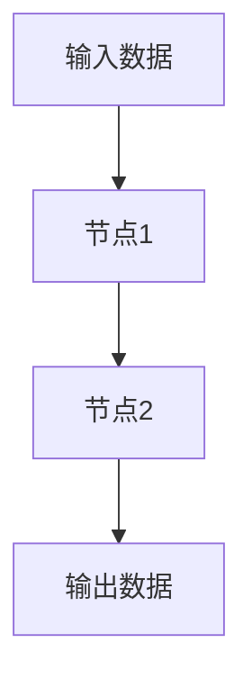

# 【LangChain编程：从入门到实践】官方博客

## 1.背景介绍

在当今的人工智能和自然语言处理领域，语言模型（Language Models）已经成为了不可或缺的工具。LangChain作为一种新兴的编程范式，旨在通过链式结构来增强语言模型的功能和灵活性。本文将深入探讨LangChain编程的核心概念、算法原理、数学模型、实际应用场景以及未来发展趋势。

## 2.核心概念与联系

### 2.1 什么是LangChain？

LangChain是一种编程范式，旨在通过链式结构来增强语言模型的功能。它允许开发者将多个语言模型和处理步骤串联起来，以实现更复杂的任务。

### 2.2 LangChain的基本结构

LangChain的基本结构包括节点（Node）和链（Chain）。每个节点代表一个处理步骤，可以是一个语言模型、数据预处理步骤或后处理步骤。链则是这些节点的有序组合。

### 2.3 LangChain与传统编程的区别

与传统编程不同，LangChain更注重数据流的处理和节点之间的依赖关系。这使得它在处理复杂的自然语言任务时具有更高的灵活性和可扩展性。

### 2.4 核心概念的联系

LangChain的核心概念包括节点、链、数据流和依赖关系。这些概念相互联系，共同构成了LangChain编程的基础。

## 3.核心算法原理具体操作步骤

### 3.1 节点的定义与实现

每个节点可以看作是一个独立的处理单元。节点的实现可以是一个函数、一个类或一个外部服务。

```python
class Node:
    def __init__(self, process_function):
        self.process_function = process_function

    def execute(self, input_data):
        return self.process_function(input_data)
```

### 3.2 链的构建与执行

链是由多个节点组成的有序结构。链的构建需要定义节点的执行顺序和数据流的传递方式。

```python
class Chain:
    def __init__(self):
        self.nodes = []

    def add_node(self, node):
        self.nodes.append(node)

    def execute(self, input_data):
        data = input_data
        for node in self.nodes:
            data = node.execute(data)
        return data
```

### 3.3 数据流与依赖关系

数据流是指数据在节点之间的传递过程。依赖关系则是指节点之间的依赖性，即一个节点的输出是另一个节点的输入。



### 3.4 错误处理与调试

在LangChain编程中，错误处理和调试是非常重要的。可以通过日志记录和异常处理来实现。

```python
class Node:
    def __init__(self, process_function):
        self.process_function = process_function

    def execute(self, input_data):
        try:
            return self.process_function(input_data)
        except Exception as e:
            print(f"Error in node: {e}")
            return None
```

## 4.数学模型和公式详细讲解举例说明

### 4.1 语言模型的数学基础

语言模型的核心是概率论和统计学。常见的语言模型包括n-gram模型和神经网络模型。

### 4.2 n-gram模型

n-gram模型通过计算词序列的联合概率来预测下一个词。其数学公式为：

$$
P(w_i | w_{i-n+1}, ..., w_{i-1}) = \frac{C(w_{i-n+1}, ..., w_i)}{C(w_{i-n+1}, ..., w_{i-1})}
$$

### 4.3 神经网络模型

神经网络模型通过训练一个多层感知器（MLP）或循环神经网络（RNN）来预测下一个词。其损失函数通常为交叉熵损失：

$$
L = -\sum_{i=1}^{N} y_i \log(\hat{y}_i)
$$

### 4.4 LangChain中的数学模型

在LangChain中，每个节点可以包含一个独立的数学模型。这些模型可以是简单的统计模型，也可以是复杂的神经网络模型。

### 4.5 举例说明

假设我们有一个简单的LangChain，包括一个数据预处理节点、一个n-gram模型节点和一个后处理节点。其数学模型可以表示为：

$$
P(w_i | w_{i-n+1}, ..., w_{i-1}) = \frac{C(w_{i-n+1}, ..., w_i)}{C(w_{i-n+1}, ..., w_{i-1})}
$$

## 5.项目实践：代码实例和详细解释说明

### 5.1 项目概述

我们将构建一个简单的LangChain项目，用于文本生成。项目包括数据预处理、语言模型和文本后处理三个节点。

### 5.2 数据预处理节点

数据预处理节点用于清洗和规范化输入数据。

```python
def preprocess(text):
    # 清洗和规范化文本
    text = text.lower()
    text = re.sub(r'\W+', ' ', text)
    return text

preprocess_node = Node(preprocess)
```

### 5.3 语言模型节点

语言模型节点用于生成文本。我们将使用一个简单的n-gram模型。

```python
def ngram_model(text):
    # 简单的n-gram模型
    words = text.split()
    ngrams = zip(*[words[i:] for i in range(2)])
    ngram_freq = Counter(ngrams)
    return ngram_freq

ngram_node = Node(ngram_model)
```

### 5.4 文本后处理节点

文本后处理节点用于格式化生成的文本。

```python
def postprocess(ngram_freq):
    # 格式化生成的文本
    generated_text = ' '.join([' '.join(ngram) for ngram in ngram_freq])
    return generated_text

postprocess_node = Node(postprocess)
```

### 5.5 构建与执行链

```python
chain = Chain()
chain.add_node(preprocess_node)
chain.add_node(ngram_node)
chain.add_node(postprocess_node)

input_text = "This is a sample text for LangChain."
output_text = chain.execute(input_text)
print(output_text)
```

## 6.实际应用场景

### 6.1 文本生成

LangChain可以用于生成高质量的文本，例如新闻文章、技术文档和小说。

### 6.2 数据清洗与预处理

LangChain可以用于数据清洗和预处理，特别是在处理大规模文本数据时。

### 6.3 复杂任务的分解与组合

LangChain可以将复杂的自然语言处理任务分解为多个简单的步骤，并通过链式结构进行组合。

### 6.4 多语言支持

LangChain可以支持多种语言的处理，适用于全球化应用。

## 7.工具和资源推荐

### 7.1 开发工具

- **Python**：LangChain的主要编程语言。
- **Jupyter Notebook**：用于实验和调试。
- **VSCode**：强大的代码编辑器。

### 7.2 资源推荐

- **LangChain官方文档**：详细的API和使用指南。
- **GitHub**：开源项目和示例代码。
- **在线课程**：如Coursera和Udacity上的自然语言处理课程。

## 8.总结：未来发展趋势与挑战

### 8.1 未来发展趋势

- **更强大的语言模型**：随着计算能力的提升，语言模型将变得更加强大和智能。
- **自动化链构建**：未来可能会出现自动化的工具，用于构建和优化LangChain。
- **跨领域应用**：LangChain将不仅限于自然语言处理，还可以应用于其他领域，如图像处理和数据分析。

### 8.2 挑战

- **计算资源**：复杂的LangChain可能需要大量的计算资源。
- **数据隐私**：在处理敏感数据时，需要特别注意数据隐私和安全问题。
- **模型解释性**：复杂的链式结构可能导致模型的解释性下降，需要开发新的方法来提高解释性。

## 9.附录：常见问题与解答

### 9.1 LangChain适合哪些应用场景？

LangChain适合处理复杂的自然语言处理任务，如文本生成、数据清洗和多语言支持。

### 9.2 如何调试LangChain？

可以通过日志记录和异常处理来调试LangChain。此外，使用Jupyter Notebook进行实验和调试也是一个好方法。

### 9.3 LangChain的性能如何？

LangChain的性能取决于节点的复杂性和链的长度。可以通过优化节点的实现和减少不必要的步骤来提高性能。

### 9.4 LangChain是否支持并行处理？

是的，LangChain可以通过多线程或多进程来实现并行处理，从而提高处理速度。

### 9.5 如何扩展LangChain？

可以通过添加新的节点和链来扩展LangChain。此外，还可以集成外部服务和API来增强功能。

---

作者：禅与计算机程序设计艺术 / Zen and the Art of Computer Programming