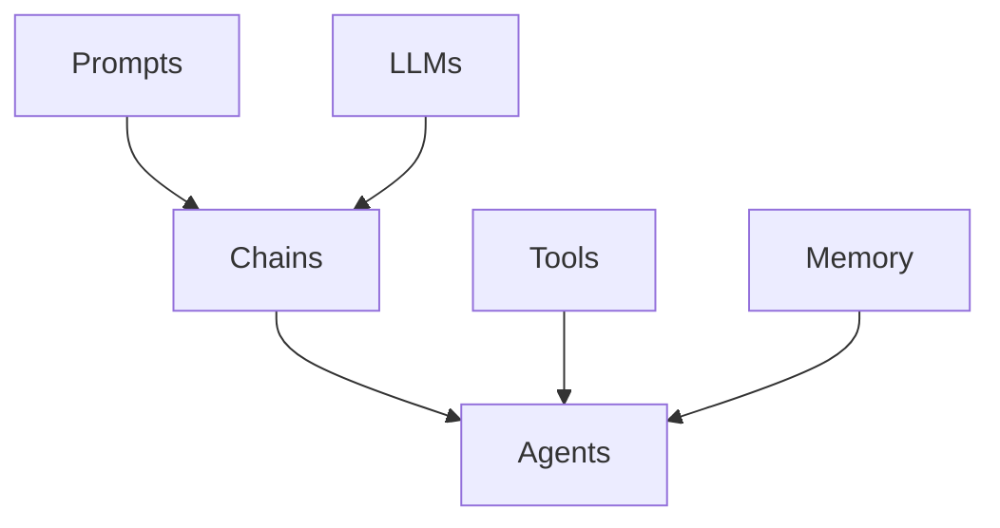

# 【LangChain编程：从入门到实践】消息处理框架

## 1. 背景介绍
### 1.1 什么是LangChain
LangChain是一个用于开发由语言模型驱动的应用程序的框架。它可以帮助开发者更容易地集成语言模型，并构建基于对话的应用。

### 1.2 LangChain的主要特点
- 模块化和可组合的组件
- 支持多种LLM(大语言模型)和聊天模型
- 内置常见的提示模板和链式调用
- 工具集成，如搜索引擎、数据库等
- 记忆管理，可维护对话状态

### 1.3 为什么选择LangChain
在构建对话式AI应用时，开发者面临许多挑战，如提示工程、多轮对话管理、外部工具集成等。LangChain通过提供一套完整的框架和工具，大大降低了开发门槛，提高了开发效率。

## 2. 核心概念与联系
### 2.1 Prompts(提示)
Prompts是LLM的输入文本，通过编写Prompt来指导LLM生成期望的输出。LangChain提供了一系列Prompt模板。

### 2.2 Chains(链)
Chains将多个组件如Prompts、LLMs、Tools等组合在一起，形成一个完整的执行流程。常见的Chain有LLMChain、SequentialChain等。

### 2.3 Agents(代理)
Agent是一种特殊的Chain，可以根据用户输入自主决策调用哪些Tools，完成更加复杂的任务。

### 2.4 Memory(记忆)
Memory用于在多轮对话中维护对话状态，常见的有ConversationBufferMemory,ConversationSummaryMemory等。

### 2.5 Tools(工具)
Tools是LangChain中集成的外部工具，如搜索引擎、数据库、API等。Agent可以调用这些工具执行任务。

### 2.6 核心概念之间的关系
下面是一个简单的Mermaid图，展示了LangChain中几个核心概念之间的关系:


## 3. 核心算法原理具体操作步骤
### 3.1 创建Prompt
```python
from langchain import PromptTemplate

prompt = PromptTemplate(
    input_variables=["product"],
    template="What is a good name for a company that makes {product}?",
)
```

### 3.2 创建LLMChain
```python
from langchain.llms import OpenAI
from langchain.chains import LLMChain

llm = OpenAI(temperature=0.9)
chain = LLMChain(llm=llm, prompt=prompt)
```

### 3.3 运行Chain
```python
chain.run("colorful socks")
```

### 3.4 创建带Memory的ConversationChain
```python
from langchain import OpenAI, ConversationChain

llm = OpenAI(temperature=0)
conversation = ConversationChain(llm=llm, verbose=True)
```

### 3.5 多轮对话
```python
conversation.predict(input="Hi there!")
conversation.predict(input="I'm doing well! Just having a conversation with an AI.")
```

### 3.6 创建Agent
```python
from langchain.agents import load_tools
from langchain.agents import initialize_agent

tools = load_tools(["serpapi", "llm-math"], llm=llm)
agent = initialize_agent(tools, llm, agent="zero-shot-react-description", verbose=True)
```

### 3.7 运行Agent
```python
agent.run("What was the high temperature in SF yesterday in Fahrenheit? What is that number raised to the .023 power?")
```

## 4. 数学模型和公式详细讲解举例说明
LangChain本身作为一个框架，并没有涉及太多数学模型和公式。它主要是提供了一种组织语言模型应用的方式。

但在使用LangChain集成的语言模型如OpenAI的GPT系列时，就会涉及一些数学原理。以GPT-3为例，它使用了Transformer的注意力机制，其中的核心是计算注意力分数 $\alpha_{ij}$：

$$
\alpha_{ij} = \frac{\exp(e_{ij})}{\sum_{k=1}^{n} \exp(e_{ik})}
$$

其中，$e_{ij}$ 是查询向量 $q_i$ 和键向量 $k_j$ 的相关性分数：

$$
e_{ij} = \frac{q_i k_j^T}{\sqrt{d_k}}
$$

这里，$d_k$ 是键向量的维度。

通过注意力机制，模型可以在编码输入序列时，动态地为不同位置分配不同的权重，从而捕捉到序列中的长距离依赖关系，生成更加合理和连贯的文本。

## 5. 项目实践：代码实例和详细解释说明
下面我们通过一个具体的项目实践，来演示如何使用LangChain构建一个问答应用。

### 5.1 准备数据
首先，我们需要准备一些文本数据作为知识库。这里我们使用一段简单的文本：

```python
text = """
Elon Musk is the CEO of Tesla, a company that makes electric cars and solar panels. 
He is also the founder and CEO of SpaceX, a company that makes rockets and spacecraft.
"""
```

### 5.2 创建向量存储
为了方便查询，我们将文本切分成段落，并使用OpenAI的embedding模型将其转换为向量，存储在向量数据库中：

```python
from langchain.text_splitter import CharacterTextSplitter
from langchain.vectorstores import FAISS
from langchain.embeddings import OpenAIEmbeddings

text_splitter = CharacterTextSplitter(chunk_size=100, chunk_overlap=0)
texts = text_splitter.split_text(text)

embeddings = OpenAIEmbeddings()
vectorstore = FAISS.from_texts(texts, embeddings)
```

### 5.3 创建问答Chain
接下来，我们创建一个问答Chain，它使用RetrievalQA组合文档检索和问答生成：

```python
from langchain.chains import RetrievalQA
from langchain.llms import OpenAI

qa = RetrievalQA.from_chain_type(
    llm=OpenAI(), 
    chain_type="stuff", 
    retriever=vectorstore.as_retriever()
)
```

### 5.4 运行问答
现在，我们可以使用问答Chain来回答问题了：

```python
query = "What companies does Elon Musk run?"
qa.run(query)
```

输出结果：
```
Elon Musk is the CEO of Tesla, a company that makes electric cars and solar panels. He is also the founder and CEO of SpaceX, a company that makes rockets and spacecraft.
```

这个例子展示了如何使用LangChain快速构建一个基于文档检索的问答应用。通过向量数据库和检索器，我们可以从大量文本中找到与问题最相关的段落，然后使用语言模型根据这些段落生成答案。

## 6. 实际应用场景
LangChain可以应用于各种场景，下面是一些常见的应用：

### 6.1 客户服务聊天机器人
利用LangChain，可以构建一个基于知识库的客户服务聊天机器人。通过检索相关的文档，机器人可以回答客户的常见问题，提供产品信息、故障排查步骤等。

### 6.2 个人助理
LangChain可以用于构建个人助理应用，如日程管理、邮件自动回复、信息查询等。通过集成各种工具和服务，助理可以自动完成各种日常任务。

### 6.3 内容生成
LangChain可以帮助生成各种类型的内容，如文章、摘要、脚本等。通过提供适当的Prompt和数据，LangChain可以生成高质量的内容。

### 6.4 代码辅助
LangChain可以集成到IDE中，为开发者提供智能的代码建议、错误修复、文档生成等辅助功能，提高开发效率。

## 7. 工具和资源推荐
### 7.1 官方文档
LangChain的官方文档是学习和使用该框架的最佳资源，提供了详尽的教程、API参考和最佳实践。
https://docs.langchain.com/

### 7.2 示例项目
LangChain的GitHub仓库中包含了大量的示例项目，涵盖了各种应用场景和技术组合，是学习和参考的绝佳资料。 
https://github.com/hwchase17/langchain/tree/master/docs/use_cases

### 7.3 社区支持
LangChain有一个活跃的社区，可以在GitHub的Issue和Discussion中提问和讨论。官方的Discord频道也是获得帮助和交流的好地方。

### 7.4 相关工具
- OpenAI API: LangChain常用的LLM
- Pinecone、Weaviate: 向量数据库
- Serper API、Google Search API: 搜索引擎API
- Zapier、Steamship: 工具集成平台

## 8. 总结：未来发展趋势与挑战
LangChain正处于快速发展的阶段，未来有几个主要的发展方向：

### 8.1 更多的LLM和工具集成
LangChain将继续集成更多的语言模型和工具，如Anthropic的Claude、AI21的Jurassic等，以及各种数据库、API服务。这将使得开发者有更多的选择，能够构建更加强大的应用。

### 8.2 对话状态管理
目前LangChain的对话状态管理还比较简单，未来将引入更加复杂和灵活的机制，如对话主题跟踪、上下文感知等，以支持更加自然和连贯的多轮对话。

### 8.3 可视化开发
为了降低开发门槛，LangChain可能会推出可视化的开发工具，让非技术背景的用户也能快速构建应用。类似于Voiceflow、Botpress等平台。

### 8.4 挑战
LangChain的发展也面临一些挑战：

- 提示工程：如何编写高质量的Prompt仍然是一个难题，需要大量的实践和总结。
- 数据安全：在使用LLM时，如何确保数据的隐私和安全是一个重要问题。
- 伦理考量：如何避免LLM生成有害、偏见或歧视性的内容，是一个需要持续关注的问题。

尽管存在这些挑战，但LangChain作为一个连接LLM和应用的桥梁，有着广阔的前景。它将帮助更多的开发者和企业快速构建基于LLM的应用，推动自然语言交互的普及。

## 9. 附录：常见问题与解答
### 9.1 LangChain可以与哪些语言模型配合使用？
LangChain支持各种主流的语言模型，如OpenAI的GPT系列，Anthropic的Claude，AI21的Jurassic，Cohere，Hugging Face等。你可以根据需要选择合适的模型。

### 9.2 LangChain支持哪些编程语言？
目前LangChain主要支持Python。但由于它的设计理念是通用的，未来可能会支持更多的编程语言。

### 9.3 LangChain适合什么样的应用场景？
LangChain适合各种基于语言交互的应用，如聊天机器人、智能助手、知识库问答、内容生成等。它特别适合需要集成多个工具和服务的复杂应用。

### 9.4 使用LangChain需要哪些先决条件？
要使用LangChain，你需要具备以下条件：

- 熟悉Python编程
- 了解语言模型的基本原理
- 准备好语言模型的API密钥，如OpenAI API
- 根据需要准备其他工具和服务的密钥，如搜索引擎API等

满足这些条件后，你就可以开始使用LangChain构建应用了。

### 9.5 如何学习LangChain？
学习LangChain的最佳方式是阅读官方文档，然后动手实践示例项目。你可以从简单的例子入手，如问答系统，然后逐步尝试更加复杂的应用。在实践中遇到问题时，可以在社区中寻求帮助。

随着对LangChain的理解加深，你可以尝试构建自己的应用，探索更多的可能性。LangChain的设计理念鼓励创新和实验，相信你一定能够创造出令人惊叹的应用！

作者：禅与计算机程序设计艺术 / Zen and the Art of Computer Programming