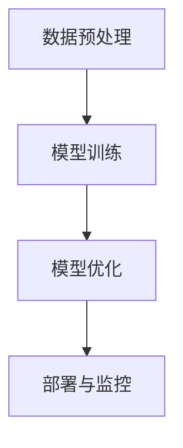

# 【大模型应用开发 动手做AI Agent】AutoGen实战

## 1.背景介绍

在人工智能领域，特别是自然语言处理（NLP）和生成模型方面，近年来取得了显著的进展。大模型（如GPT-3、BERT等）已经展示了其在文本生成、翻译、对话系统等方面的强大能力。随着这些技术的成熟，开发AI Agent（人工智能代理）成为了一个热门话题。AI Agent可以在各种应用场景中自动执行任务，从客户服务到内容生成，再到数据分析。

本篇文章将深入探讨如何使用大模型来开发AI Agent，特别是通过AutoGen框架进行实战操作。我们将从核心概念、算法原理、数学模型、项目实践、实际应用场景、工具和资源推荐等多个方面进行详细讲解，帮助读者全面掌握这一技术。

## 2.核心概念与联系

### 2.1 大模型

大模型是指具有大量参数的深度学习模型，通常是通过大规模数据训练得到的。它们在处理复杂任务时表现出色，特别是在NLP领域。常见的大模型包括GPT-3、BERT、T5等。

### 2.2 AI Agent

AI Agent是一种能够自主执行任务的智能系统。它可以感知环境、做出决策并采取行动。AI Agent通常由多个模块组成，包括感知模块、决策模块和执行模块。

### 2.3 AutoGen框架

AutoGen是一个用于自动生成代码和模型的框架。它利用大模型的强大能力，自动生成符合特定需求的代码和模型，从而大大简化了开发过程。

### 2.4 核心联系

大模型是AI Agent的核心技术，提供了强大的感知和决策能力。AutoGen框架则是将大模型应用于实际开发中的工具，帮助开发者快速构建和部署AI Agent。

## 3.核心算法原理具体操作步骤

### 3.1 数据预处理

数据预处理是开发AI Agent的第一步。包括数据清洗、数据标注和数据增强等步骤。数据的质量直接影响模型的性能。

### 3.2 模型训练

模型训练是核心步骤。通过大规模数据训练大模型，使其具备强大的感知和决策能力。训练过程包括模型选择、超参数调优和模型评估。

### 3.3 模型优化

模型优化是提高模型性能的关键步骤。包括模型剪枝、量化和蒸馏等技术。优化后的模型在保持性能的同时，具有更高的效率和更低的资源消耗。

### 3.4 部署与监控

部署是将训练好的模型应用于实际场景的过程。部署后需要对模型进行监控，确保其在实际应用中的表现稳定可靠。

以下是一个简单的Mermaid流程图，展示了上述步骤：



## 4.数学模型和公式详细讲解举例说明

### 4.1 语言模型

大模型通常是基于语言模型构建的。语言模型的目标是预测给定上下文的下一个词。常见的语言模型包括n-gram模型和神经网络语言模型。

$$
P(w_t | w_{t-1}, w_{t-2}, ..., w_1) = \frac{P(w_1, w_2, ..., w_t)}{P(w_1, w_2, ..., w_{t-1})}
$$

### 4.2 变换器模型

变换器（Transformer）是当前最流行的模型架构之一。它通过自注意力机制（Self-Attention）来捕捉序列中的长距离依赖关系。

自注意力机制的计算公式如下：

$$
\text{Attention}(Q, K, V) = \text{softmax}\left(\frac{QK^T}{\sqrt{d_k}}\right)V
$$

其中，$Q$、$K$、$V$分别表示查询（Query）、键（Key）和值（Value）矩阵，$d_k$是键的维度。

### 4.3 损失函数

训练模型时需要定义损失函数。常见的损失函数包括交叉熵损失（Cross-Entropy Loss）和均方误差（Mean Squared Error）。

交叉熵损失的计算公式如下：

$$
L = -\sum_{i=1}^{N} y_i \log(\hat{y}_i)
$$

其中，$y_i$是实际标签，$\hat{y}_i$是预测概率。

## 5.项目实践：代码实例和详细解释说明

### 5.1 环境配置

首先，我们需要配置开发环境。安装必要的库和工具，如TensorFlow、PyTorch、Transformers等。

```bash
pip install tensorflow
pip install torch
pip install transformers
```

### 5.2 数据准备

准备训练数据。这里以一个简单的文本分类任务为例，使用IMDB电影评论数据集。

```python
from datasets import load_dataset

dataset = load_dataset("imdb")
train_data = dataset['train']
test_data = dataset['test']
```

### 5.3 模型定义

定义一个基于BERT的文本分类模型。

```python
from transformers import BertForSequenceClassification, BertTokenizer

model = BertForSequenceClassification.from_pretrained("bert-base-uncased")
tokenizer = BertTokenizer.from_pretrained("bert-base-uncased")
```

### 5.4 模型训练

训练模型。

```python
from transformers import Trainer, TrainingArguments

training_args = TrainingArguments(
    output_dir='./results',
    num_train_epochs=3,
    per_device_train_batch_size=8,
    per_device_eval_batch_size=8,
    warmup_steps=500,
    weight_decay=0.01,
    logging_dir='./logs',
)

trainer = Trainer(
    model=model,
    args=training_args,
    train_dataset=train_data,
    eval_dataset=test_data
)

trainer.train()
```

### 5.5 模型评估

评估模型性能。

```python
results = trainer.evaluate()
print(results)
```

### 5.6 模型部署

将训练好的模型部署到生产环境。可以使用如TensorFlow Serving或TorchServe等工具。

```bash
torchserve --start --model-store model_store --models my_model.mar
```

## 6.实际应用场景

### 6.1 客户服务

AI Agent可以用于客户服务，自动回答客户问题，提高服务效率。

### 6.2 内容生成

AI Agent可以用于生成高质量的内容，如新闻文章、产品描述等。

### 6.3 数据分析

AI Agent可以用于自动化数据分析，生成数据报告和洞察。

### 6.4 智能助手

AI Agent可以作为智能助手，帮助用户完成各种任务，如日程安排、信息查询等。

## 7.工具和资源推荐

### 7.1 开发工具

- TensorFlow
- PyTorch
- Transformers
- TensorFlow Serving
- TorchServe

### 7.2 数据集

- IMDB电影评论数据集
- SQuAD问答数据集
- MNIST手写数字数据集

### 7.3 学习资源

- 《深度学习》 by Ian Goodfellow
- 《自然语言处理入门》 by Jacob Eisenstein
- Coursera上的深度学习课程

## 8.总结：未来发展趋势与挑战

### 8.1 未来发展趋势

- 更大规模的模型：未来的大模型将会更加庞大，具备更强的感知和决策能力。
- 多模态学习：结合文本、图像、音频等多种模态的数据，提升AI Agent的综合能力。
- 自监督学习：减少对标注数据的依赖，通过自监督学习提升模型性能。

### 8.2 挑战

- 计算资源：训练和部署大模型需要大量的计算资源。
- 数据隐私：在处理敏感数据时，需要确保数据隐私和安全。
- 模型解释性：大模型的复杂性使得其决策过程难以解释，需要开发更好的解释方法。

## 9.附录：常见问题与解答

### 9.1 如何选择合适的大模型？

选择大模型时需要考虑任务需求、计算资源和数据量。对于文本生成任务，GPT-3是一个不错的选择；对于文本分类任务，BERT表现优异。

### 9.2 如何优化模型性能？

可以通过模型剪枝、量化和蒸馏等技术优化模型性能。此外，超参数调优也是提升模型性能的重要手段。

### 9.3 如何确保模型的公平性和透明性？

需要在数据收集和模型训练过程中注意公平性，避免数据偏差。可以使用解释性AI技术，提升模型的透明性。

### 9.4 如何处理模型的更新和维护？

需要定期更新模型，确保其在实际应用中的表现。可以使用持续学习技术，使模型能够不断学习新知识。

### 9.5 如何应对模型的安全性问题？

需要在模型部署过程中采取安全措施，如数据加密、访问控制等。此外，可以使用对抗训练技术，提升模型的鲁棒性。

---

作者：禅与计算机程序设计艺术 / Zen and the Art of Computer Programming