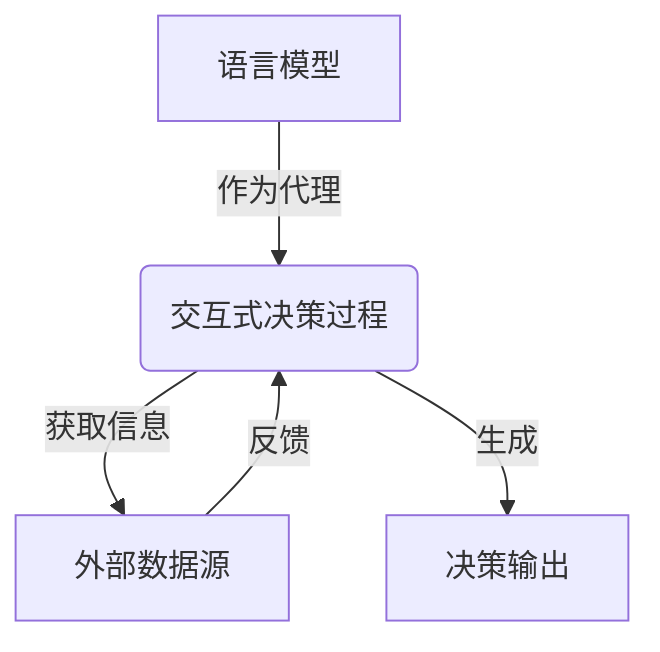
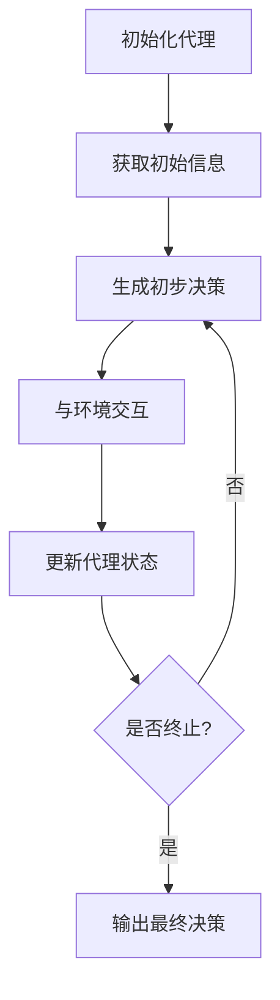

# 【大模型应用开发 动手做AI Agent】CAMEL论文中的股票交易场景

## 1. 背景介绍

### 1.1 人工智能在金融领域的应用

随着人工智能技术的不断发展,金融领域已成为人工智能应用的热门领域之一。传统的金融交易过程通常依赖于人工分析和决策,效率较低且容易受到人为因素的影响。而人工智能技术则可以通过建模和算法,实现自动化的数据分析和决策,提高交易效率和收益。

### 1.2 CAMEL:大型语言模型在决策中的应用

CAMEL(Communicating Agents Modeling External Language)是斯坦福大学提出的一种基于大型语言模型的决策框架。它旨在利用大型语言模型的强大语义理解和生成能力,构建智能代理,在复杂的决策场景中进行交互和决策。CAMEL框架将语言模型作为代理的核心,通过与外部数据源和环境交互,生成相应的决策输出。

### 1.3 股票交易:复杂决策场景

股票交易是一个典型的复杂决策场景,需要综合考虑多种因素,如公司基本面、技术指标、市场行情等。传统的交易策略往往依赖于人工经验,难以全面把握所有影响因素。而CAMEL框架则可以通过语言模型的强大理解和生成能力,结合各种数据源,为股票交易提供更加智能化的决策支持。

## 2. 核心概念与联系

### 2.1 语言模型

语言模型是自然语言处理领域的核心技术,旨在学习和表示语言的统计规律。大型语言模型通过在海量文本数据上训练,获得对自然语言的深层理解和生成能力。常见的大型语言模型包括GPT、BERT等。

### 2.2 决策代理

决策代理是一种智能系统,能够根据环境状态和目标,自主做出决策并执行相应的行为。在CAMEL框架中,语言模型就扮演了决策代理的角色,通过与外部数据源交互,生成决策输出。

### 2.3 交互式决策

交互式决策是CAMEL框架的核心概念。代理(语言模型)不是一次性生成决策,而是通过与外部环境的持续交互,不断获取新的信息并更新决策。这种交互式决策过程更加贴近真实场景,有助于提高决策的质量和鲁棒性。



## 3. 核心算法原理具体操作步骤

CAMEL框架的核心算法原理可以概括为以下几个步骤:

### 3.1 初始化代理

首先,需要初始化一个大型语言模型作为决策代理。常见的语言模型包括GPT、BERT等,可以根据具体场景选择合适的模型。

### 3.2 获取初始信息

代理需要获取与决策相关的初始信息,如场景描述、目标、约束条件等。这些信息将作为代理的初始输入。

### 3.3 交互式决策循环

1. 代理根据当前信息生成一个初步决策输出。
2. 将决策输出发送给外部环境,获取环境反馈。
3. 根据环境反馈,代理更新内部状态和知识库。
4. 重复上述过程,直至满足终止条件。

在这个循环过程中,代理不断获取新的信息,更新决策,直至达到满意的决策结果。



### 3.4 输出最终决策

当满足终止条件时(如达到预期目标、超出最大迭代次数等),代理输出当前的最终决策结果。

## 4. 数学模型和公式详细讲解举例说明

在CAMEL框架中,语言模型的核心是通过概率模型来学习和生成语言。常见的语言模型包括N-gram模型、神经网络模型等。以下将详细介绍基于神经网络的语言模型的数学原理。

### 4.1 语言模型的概率形式化

给定一个文本序列 $X = (x_1, x_2, \dots, x_T)$,语言模型的目标是估计该序列的概率 $P(X)$。根据链式法则,我们可以将 $P(X)$ 分解为:

$$P(X) = P(x_1, x_2, \dots, x_T) = \prod_{t=1}^T P(x_t | x_1, \dots, x_{t-1})$$

其中 $P(x_t | x_1, \dots, x_{t-1})$ 表示在给定前面的词 $x_1, \dots, x_{t-1}$ 的条件下,当前词 $x_t$ 出现的条件概率。

### 4.2 神经网络语言模型

神经网络语言模型旨在使用神经网络来估计上述条件概率。常见的模型包括基于循环神经网络(RNN)的模型和基于Transformer的模型。

以RNN为例,模型的核心思想是使用一个隐藏状态 $h_t$ 来捕获前面词的信息,然后基于 $h_t$ 和当前词 $x_t$ 来预测下一个词的概率分布:

$$h_t = f_\theta(x_t, h_{t-1})$$
$$P(x_{t+1} | x_1, \dots, x_t) = g_\phi(h_t)$$

其中 $f_\theta$ 和 $g_\phi$ 分别表示RNN的递归函数和输出函数,它们都是可学习的神经网络。通过在大量语料上训练,可以学习到参数 $\theta$ 和 $\phi$,从而获得一个强大的语言模型。

### 4.3 交互式决策中的语言模型应用

在CAMEL框架的交互式决策过程中,语言模型被用于两个关键步骤:

1. **理解输入**:语言模型可以对来自外部环境的自然语言输入(如场景描述、约束条件等)进行理解和表示,将其转化为模型可处理的形式。

2. **生成决策输出**:语言模型可以基于当前的内部状态,生成自然语言形式的决策输出,并将其发送给外部环境。

通过将语言模型融入交互式决策循环,CAMEL框架实现了人机自然交互的决策过程,提高了决策的质量和可解释性。

## 5. 项目实践:代码实例和详细解释说明

为了更好地理解CAMEL框架在股票交易场景中的应用,我们将通过一个简化的Python代码示例来演示其实现过程。

### 5.1 导入所需库

```python
import torch
from transformers import GPT2LMHeadModel, GPT2Tokenizer
import yfinance as yf
import pandas as pd
```

我们将使用Hugging Face的Transformers库来加载预训练的GPT-2语言模型,以及Yahoo Finance库来获取股票数据。

### 5.2 加载语言模型和tokenizer

```python
model = GPT2LMHeadModel.from_pretrained('gpt2')
tokenizer = GPT2Tokenizer.from_pretrained('gpt2')
```

我们加载预训练的GPT-2语言模型和对应的tokenizer。

### 5.3 定义交互式决策函数

```python
def interactive_decision(stock_code, start_date, end_date):
    # 获取股票数据
    stock_data = yf.download(stock_code, start=start_date, end=end_date)
    
    # 初始化决策上下文
    context = f"分析{stock_code}股票从{start_date}到{end_date}的走势并给出交易建议。"
    
    while True:
        # 对话交互
        input_text = input("Human: " + context + "\n\nAssistant: ")
        input_ids = tokenizer.encode(input_text, return_tensors='pt')
        
        # 生成决策输出
        output = model.generate(input_ids, max_length=1024, num_return_sequences=1)
        output_text = tokenizer.decode(output[0], skip_special_tokens=True)
        
        print("Assistant: " + output_text)
        
        # 更新决策上下文
        context += "\nHuman: " + input_text + "\nAssistant: " + output_text
        
        # 检查是否终止交互
        if "结束交互" in output_text:
            break
```

这个函数实现了CAMEL框架的交互式决策过程。它首先获取指定时间段的股票数据,然后初始化一个决策上下文。接下来,它进入一个循环,在每次迭代中:

1. 获取用户输入,将其添加到决策上下文中。
2. 使用语言模型生成决策输出。
3. 打印决策输出,并将其添加到决策上下文中。
4. 检查是否需要终止交互。

通过这种交互式的方式,代理(语言模型)可以不断获取新的信息,更新决策,直至达到满意的结果。

### 5.4 运行示例

```python
interactive_decision('AAPL', '2022-01-01', '2022-12-31')
```

我们可以运行上述代码,为苹果公司(AAPL)在2022年的股票数据进行交易决策分析。在交互过程中,用户可以不断输入新的信息和要求,代理将根据当前上下文生成相应的决策输出,直至用户满意为止。

通过这个简化的示例,我们可以直观地感受到CAMEL框架在股票交易场景中的应用,以及语言模型在交互式决策中的作用。在实际应用中,我们可以进一步扩展和优化这个框架,以满足更加复杂的需求。

## 6. 实际应用场景

CAMEL框架及其在股票交易场景中的应用,具有广阔的实际应用前景:

### 6.1 智能投资顾问系统

将CAMEL框架集成到投资顾问系统中,可以实现人机交互式的投资决策过程。投资者可以与系统进行自然语言交互,描述自己的投资目标、风险偏好等,系统则可以基于多种数据源(如公司财报、市场行情等)给出投资建议。相比传统的人工投资顾问,这种系统可以提供更加个性化和智能化的服务。

### 6.2 量化交易策略优化

在量化交易领域,CAMEL框架可以用于优化交易策略。传统的量化策略往往基于固定的规则和参数,难以适应市场的动态变化。而CAMEL框架则可以通过与市场数据的持续交互,动态调整策略参数,提高策略的灵活性和适应性。

### 6.3 金融风险管理

CAMEL框架也可以应用于金融风险管理领域。通过与各种风险数据源(如市场数据、新闻事件等)交互,框架可以实时评估风险水平,并提出相应的风险缓解措施。这种交互式的风险管理方式,可以更好地应对复杂的金融环境。

### 6.4 其他领域的决策支持

除了金融领域,CAMEL框架还可以应用于其他需要复杂决策的领域,如医疗诊断、法律判决等。通过与领域知识库和数据源交互,框架可以为专家决策提供智能化的支持和辅助。

## 7. 工具和资源推荐

在实现和应用CAMEL框架时,可以利用以下工具和资源:

### 7.1 语言模型库

- Hugging Face Transformers: 提供了多种预训练语言模型及相关工具,是实现CAMEL框架的首选库。
- PyTorch/TensorFlow: 作为深度学习框架,可用于fine-tune和定制语言模型。

### 7.2 金融数据源

- Yahoo Finance: 提供免费的历史股票数据和实时行情数据。
- Alpha Vantage: 提供包括股票、外汇、加密货币在内的各种金融数据API。
- Quandl: 集成了多种金融和经济数据源,提供付费订阅服务。

### 7.3 量化交易平台

- Quantopian: 提供基于Python的量化交易平台和社区。
- Quantconnect: 支持多种语言的量化交易平台,提供历史数据和模拟交易环境。

### 7.4 在线学习资源

- Coursera/edX: 提供了多门