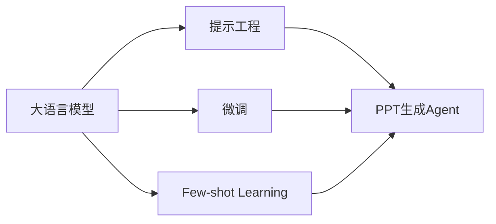

# 【大模型应用开发 动手做AI Agent】创建一个简短的虚构PPT

## 1.背景介绍
人工智能技术的快速发展,尤其是大语言模型的出现,为构建智能化的AI Agent提供了新的机遇。利用大模型的强大语言理解和生成能力,我们可以创建具有自然交互、知识学习、任务执行等能力的AI助手,应用于客服、教育、办公等诸多领域。本文将介绍如何利用大模型技术,快速开发一个简短的PPT生成AI Agent。

### 1.1 大语言模型概述
#### 1.1.1 Transformer架构
#### 1.1.2 预训练与微调
#### 1.1.3 主流大模型介绍

### 1.2 AI Agent的应用场景
#### 1.2.1 智能客服
#### 1.2.2 个人助理 
#### 1.2.3 教育助手

### 1.3 PPT生成Agent的价值
#### 1.3.1 提高工作效率
#### 1.3.2 降低制作门槛
#### 1.3.3 创意灵感激发

## 2.核心概念与联系
构建PPT生成AI Agent,需要理解以下几个核心概念:

### 2.1 大模型(Large Language Model)
大模型是指参数量达到数亿、数十亿甚至更多的语言模型。它们通过在海量文本数据上进行预训练,学习到了丰富的语言知识和世界知识,具备强大的语言理解、生成、推理等能力。代表模型有GPT系列、BERT系列等。

### 2.2 提示工程(Prompt Engineering) 
提示工程是指如何设计输入给AI模型的提示(Prompt),以引导其生成我们期望的输出。通过精心设计的提示,可以控制AI模型的行为,实现特定任务。提示工程是应用大模型的关键技术之一。

### 2.3 微调(Fine-tuning)
微调是在特定任务数据上,对预训练好的大模型进行二次训练,使其更好地适应该任务。对于PPT生成任务,我们可以在高质量的PPT数据上微调模型,提升其生成效果。微调使得通用大模型转化为适用于特定场景的专用模型。

### 2.4 Few-shot Learning
Few-shot learning指的是模型在很少量样本的情况下就能快速学习新任务的能力。优秀的大模型具备少样本学习能力,无需大量数据和训练即可适应新任务。对PPT生成Agent而言,我们可以通过少量示例来指导模型生成我们想要的PPT。

这些概念之间紧密关联,构成了大模型应用开发的基础。在实践中,我们需要综合运用提示工程、微调、少样本学习等技术,充分发挥大模型的能力,打造高质量的AI Agent应用。



## 3.核心算法原理具体操作步骤
构建PPT生成AI Agent的核心是基于大语言模型的文本生成算法。以下是该算法的主要步骤:

### 3.1 模型选择与环境准备
1. 选择合适的大语言模型,如GPT-3、BART、T5等 
2. 准备运行环境,安装必要的深度学习框架和库,如PyTorch、Transformers等

### 3.2 数据准备
1. 收集高质量的PPT数据,包括PPT文件和相应的文本描述
2. 对数据进行清洗、格式化,转换为模型可接受的形式
3. 划分训练集、验证集和测试集

### 3.3 提示模板设计
1. 分析PPT的结构特点,提取关键要素如标题、页面布局、文本内容等
2. 设计提示模板,将关键要素组织成自然语言形式的输入
3. 提示模板需涵盖不同的PPT生成需求,如主题、页数、色彩风格等

### 3.4 模型微调
1. 使用准备好的PPT数据对预训练模型进行微调
2. 将输入提示和目标PPT作为训练数据,对模型进行监督学习
3. 微调过程通过反向传播不断更新模型参数,使其适应PPT生成任务

### 3.5 生成PPT
1. 给定输入提示,使用微调后的模型进行推理生成
2. 采用Beam Search、Top-k Sampling等解码策略,得到尽可能优质的输出
3. 对生成的文本进行后处理,转换为PPT格式并填充到对应页面中

### 3.6 人工评估与反馈优化
1. 对生成的PPT进行人工检查,评估其质量与提示的匹配度
2. 收集用户反馈,总结常见问题与改进点
3. 迭代优化提示模板和微调策略,不断提升模型性能

通过以上步骤,我们可以基于大语言模型构建一个PPT生成AI Agent。在实践中,还需要考虑提示工程、Few-shot learning等因素,合理设计输入输出接口,打造良好的用户体验。

## 4.数学模型和公式详细讲解举例说明
大语言模型的核心是Transformer架构和自注意力机制。以下详细介绍相关数学原理。

### 4.1 Transformer架构
Transformer由编码器(Encoder)和解码器(Decoder)组成,每个部分都包含多个相同的层。
编码器层包括两个子层:
- 多头自注意力(Multi-head Self-attention)层
- 前馈神经网络(Feed Forward Neural Network)层

解码器层包括三个子层:  
- Masked 多头自注意力层
- 编码器-解码器注意力(Encoder-Decoder Attention)层
- 前馈神经网络层

各层之间使用残差连接(Residual Connection)和层归一化(Layer Normalization)。

### 4.2 自注意力机制
自注意力机制用于计算序列中元素之间的关联度,捕捉长距离依赖关系。以下是其数学表达:

给定输入序列 $\mathbf{X} \in \mathbb{R}^{n \times d}$,自注意力计算过程为:

$$
\begin{aligned}
\mathbf{Q} &= \mathbf{X} \mathbf{W}^Q \\
\mathbf{K} &= \mathbf{X} \mathbf{W}^K \\ 
\mathbf{V} &= \mathbf{X} \mathbf{W}^V \\
\text{Attention}(\mathbf{Q}, \mathbf{K}, \mathbf{V}) &= \text{softmax}(\frac{\mathbf{Q}\mathbf{K}^T}{\sqrt{d_k}})\mathbf{V}
\end{aligned}
$$

其中,$\mathbf{Q}$、$\mathbf{K}$、$\mathbf{V}$分别为查询(Query)、键(Key)、值(Value)矩阵,$\mathbf{W}^Q$、$\mathbf{W}^K$、$\mathbf{W}^V$为对应的权重矩阵。$d_k$为键向量的维度,用于缩放点积结果。

多头自注意力通过并行计算多个注意力头,增强模型的表达能力:

$$
\begin{aligned}
\text{MultiHead}(\mathbf{Q}, \mathbf{K}, \mathbf{V}) &= \text{Concat}(\text{head}_1, ..., \text{head}_h)\mathbf{W}^O \\
\text{head}_i &= \text{Attention}(\mathbf{Q}\mathbf{W}_i^Q, \mathbf{K}\mathbf{W}_i^K, \mathbf{V}\mathbf{W}_i^V)
\end{aligned}
$$

其中,$h$为注意力头数,$\mathbf{W}_i^Q$、$\mathbf{W}_i^K$、$\mathbf{W}_i^V$为每个头的权重矩阵,$\mathbf{W}^O$用于将多头结果映射回原始维度。

### 4.3 位置编码
为了引入序列的位置信息,Transformer在输入嵌入中加入位置编码(Positional Encoding)。位置编码通过三角函数计算:

$$
\begin{aligned}
PE_{(pos,2i)} &= \sin(pos / 10000^{2i/d_{model}}) \\
PE_{(pos,2i+1)} &= \cos(pos / 10000^{2i/d_{model}})
\end{aligned}
$$

其中,$pos$为位置索引,$i$为维度索引,$d_{model}$为嵌入维度。

通过以上数学原理,Transformer能够高效地建模序列数据,挖掘词语间的关联特征。在PPT生成任务中,我们利用Transformer的强大建模能力,学习PPT的内容组织和页面布局规律,生成连贯、美观的幻灯片。

## 5.项目实践：代码实例和详细解释说明
下面通过代码实例,演示如何使用Hugging Face的Transformers库实现PPT生成AI Agent。

### 5.1 环境准备
首先安装必要的库:
```bash
pip install transformers torch datasets
```

### 5.2 加载预训练模型
这里我们使用GPT-2作为基础模型:
```python
from transformers import GPT2LMHeadModel, GPT2Tokenizer

model_name = "gpt2-large"
tokenizer = GPT2Tokenizer.from_pretrained(model_name)
model = GPT2LMHeadModel.from_pretrained(model_name)
```

### 5.3 定义PPT数据集
假设我们有一个PPT数据集,每个样本包含PPT的文本描述和对应的PPT文件:
```python
class PPTDataset(torch.utils.data.Dataset):
    def __init__(self, texts, ppts):
        self.texts = texts
        self.ppts = ppts
    
    def __len__(self):
        return len(self.texts)
    
    def __getitem__(self, idx):
        text = self.texts[idx]
        ppt = self.ppts[idx]
        return text, ppt
```

### 5.4 微调模型
使用准备好的数据集对模型进行微调:
```python
from transformers import Trainer, TrainingArguments

train_texts = [...]  # 训练集文本
train_ppts = [...]   # 训练集PPT
val_texts = [...]    # 验证集文本
val_ppts = [...]     # 验证集PPT

train_dataset = PPTDataset(train_texts, train_ppts)
val_dataset = PPTDataset(val_texts, val_ppts)

training_args = TrainingArguments(
    output_dir="./results",
    num_train_epochs=3,
    per_device_train_batch_size=4,
    per_device_eval_batch_size=4,
    warmup_steps=500,
    weight_decay=0.01,
    logging_dir="./logs",
)

trainer = Trainer(
    model=model,
    args=training_args,
    train_dataset=train_dataset,
    eval_dataset=val_dataset,
)

trainer.train()
```

### 5.5 生成PPT
给定输入提示,使用微调后的模型生成PPT:
```python
def generate_ppt(prompt, max_length=1000):
    input_ids = tokenizer.encode(prompt, return_tensors="pt")
    output = model.generate(
        input_ids, 
        max_length=max_length, 
        num_beams=5,
        no_repeat_ngram_size=2,
        early_stopping=True
    )
    ppt_text = tokenizer.decode(output[0], skip_special_tokens=True)
    return ppt_text

prompt = "Create a PPT about AI and future work"
ppt_text = generate_ppt(prompt)
print(ppt_text)
```

以上代码展示了如何使用Hugging Face的Transformers库快速构建PPT生成AI Agent。在实际应用中,我们还需要将生成的文本转换为PPT格式,可以使用python-pptx等库实现。此外,还可以引入Few-shot learning、提示优化等技术,进一步提升生成效果。

## 6.实际应用场景
PPT生成AI Agent可应用于多个场景,提升工作效率和创意水平:

### 6.1 商务办公
- 自动生成会议、培训、销售等常用PPT
- 根据文字大纲快速生成幻灯片
- 提供多种版式、配色、动画等设计选择

### 6.2 教育培训
- 辅助教师制作教学课件
- 为学生提供学习资料和知识总结
- 支持插入图表、多媒体等丰富元素

### 6.3 设计创意
- 激发创意灵感,提供多样化的设计方案
- 自动优化版面布局和视觉风格
- 与设计师协作,提升工作效率

### 6.4 个人助理
- 根据个人需求定制PPT内容
- 支持语音输入,实现便捷交互
- 集成知识库,提供专业建议和素材推荐

通过在以上场景中应用PPT生成AI