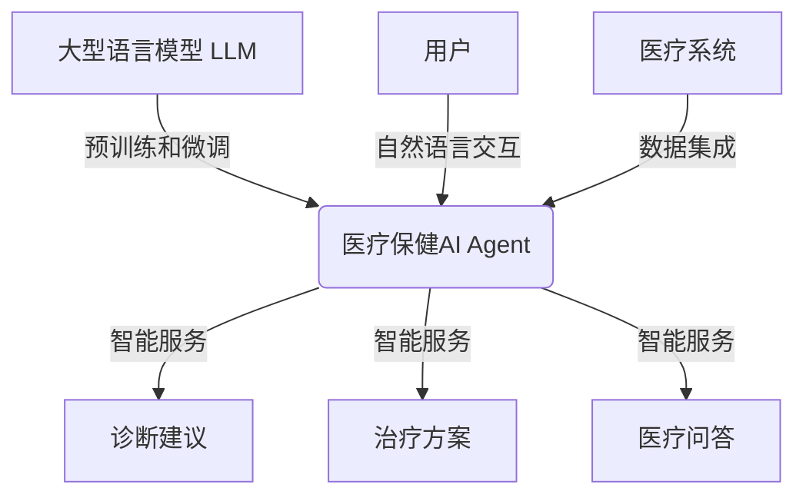

# 【大模型应用开发 动手做AI Agent】医疗保健的变革

## 1.背景介绍

### 1.1 医疗保健行业的现状与挑战

医疗保健行业一直是人类社会最关注和重视的领域之一。随着人口老龄化、慢性病患病率上升以及医疗资源的不均衡分布,医疗保健系统面临着前所未有的压力和挑战。传统的医疗模式已经难以满足日益增长的需求,迫切需要通过创新技术来提高医疗服务的可及性、质量和效率。

### 1.2 人工智能在医疗保健中的作用

人工智能(AI)技术在医疗保健领域的应用正在引领着一场深刻的变革。大型语言模型(Large Language Model,LLM)作为人工智能的重要组成部分,凭借其强大的自然语言处理能力和知识库,为医疗保健带来了前所未有的机遇。通过训练和部署高质量的医疗保健AI Agent,我们可以提高诊断准确性、优化治疗方案、加速药物研发、改善患者体验等,从而推动整个医疗保健生态系统的进步。

## 2.核心概念与联系

### 2.1 大型语言模型(LLM)

大型语言模型是一种基于深度学习的自然语言处理(NLP)模型,能够从大量文本数据中学习语言模式和知识表示。LLM通过预训练和微调两个阶段,可以获得广泛的语言理解和生成能力,为各种自然语言处理任务提供强大的基础。

### 2.2 医疗保健AI Agent

医疗保健AI Agent是一种特殊的AI应用程序,旨在利用LLM的能力为医疗保健领域提供智能化服务。它可以与用户(患者、医生等)进行自然语言交互,回答医疗相关问题、提供诊断建议、推荐治疗方案等。同时,医疗保健AI Agent还可以与其他医疗系统(如电子病历系统、医学影像系统等)集成,提高整体医疗服务的效率和质量。



## 3.核心算法原理具体操作步骤

### 3.1 预训练阶段

LLM的预训练阶段是通过自监督学习方式在大规模文本语料库上进行训练,目标是学习通用的语言表示。常见的预训练算法包括:

1. **Masked Language Modeling (MLM)**: 随机掩码部分输入tokens,模型需要预测被掩码的tokens。
2. **Next Sentence Prediction (NSP)**: 判断两个句子是否为连续的句子对。
3. **Permuted Language Modeling**: 打乱输入序列的顺序,模型需要重建原始顺序。

### 3.2 微调阶段

在特定任务上微调LLM,使其适应特定领域的语言模式和知识。常见的微调方法包括:

1. **监督微调**: 使用标注好的任务数据(如问答对、文本分类等)对LLM进行监督式微调。
2. **Few-shot学习**: 利用少量的示例数据对LLM进行快速适应。
3. **Prompt学习**: 通过设计合适的Prompt,引导LLM生成所需的输出。

### 3.3 部署与优化

将微调后的LLM部署为医疗保健AI Agent,并进行以下优化:

1. **知识蒸馏**: 将LLM的知识迁移到更小的模型,以提高部署效率。
2. **模型压缩**: 通过量化、剪枝等技术压缩模型大小。
3. **在线学习**: 利用用户交互数据持续优化模型。
4. **安全与隐私**: 采取措施确保模型输出的安全性和隐私保护。

## 4.数学模型和公式详细讲解举例说明

### 4.1 Transformer模型

Transformer是LLM的核心模型架构,它基于自注意力(Self-Attention)机制,可以有效捕获长距离依赖关系。自注意力机制的计算过程如下:

$$
\begin{aligned}
\text{Attention}(Q, K, V) &= \text{softmax}\left(\frac{QK^T}{\sqrt{d_k}}\right)V \\
\text{MultiHead}(Q, K, V) &= \text{Concat}(\text{head}_1, \ldots, \text{head}_h)W^O\\
\text{where}\ \text{head}_i &= \text{Attention}(QW_i^Q, KW_i^K, VW_i^V)
\end{aligned}
$$

其中 $Q$、$K$、$V$ 分别表示查询(Query)、键(Key)和值(Value)。$d_k$ 是缩放因子,用于防止点积的过大导致的梯度不稳定问题。MultiHead Attention通过将输入线性投影到不同的子空间,并对每个子空间计算注意力,最后将结果拼接起来,可以更好地关注不同的位置信息。

### 4.2 BERT模型

BERT(Bidirectional Encoder Representations from Transformers)是一种基于Transformer的双向编码器模型,通过MLM和NSP两个预训练任务,学习到了深层次的语义表示。BERT的损失函数为:

$$
\mathcal{L} = \mathcal{L}_{\text{MLM}} + \lambda \mathcal{L}_{\text{NSP}}
$$

其中 $\mathcal{L}_{\text{MLM}}$ 是Masked Language Model的损失, $\mathcal{L}_{\text{NSP}}$ 是Next Sentence Prediction的损失, $\lambda$ 是平衡两个损失的超参数。

在医疗保健领域,我们可以在BERT的基础上,利用医疗文本语料和标注数据进行进一步的微调,获得适用于医疗任务的BERT模型。

## 5.项目实践:代码实例和详细解释说明

以下是一个使用Hugging Face的Transformers库对BERT模型进行微调的Python代码示例:

```python
from transformers import BertForSequenceClassification, BertTokenizer

# 加载预训练模型和分词器
model = BertForSequenceClassification.from_pretrained('bert-base-uncased')
tokenizer = BertTokenizer.from_pretrained('bert-base-uncased')

# 准备训练数据
train_texts = [...] # 训练文本列表
train_labels = [...] # 训练标签列表

# 对数据进行tokenize和编码
train_encodings = tokenizer(train_texts, truncation=True, padding=True)
train_dataset = MyDataset(train_encodings, train_labels)

# 定义训练参数
optimizer = AdamW(model.parameters(), lr=2e-5)
num_epochs = 3

# 开始训练
for epoch in range(num_epochs):
    model.train()
    for batch in train_dataloader:
        # 获取输入
        input_ids = batch['input_ids']
        attention_mask = batch['attention_mask']
        labels = batch['labels']
        
        # 前向传播
        outputs = model(input_ids, attention_mask=attention_mask, labels=labels)
        loss = outputs.loss
        
        # 反向传播
        loss.backward()
        optimizer.step()
        optimizer.zero_grad()

# 保存微调后的模型
model.save_pretrained('my_medical_bert')
```

在这个示例中,我们首先加载了BERT的预训练模型和分词器。然后,我们准备了医疗文本分类任务的训练数据,并使用分词器对文本进行tokenize和编码。接下来,我们定义了优化器和训练参数,并使用PyTorch的训练循环对模型进行了微调。最后,我们将微调后的模型保存到磁盘。

在实际应用中,我们可以将微调后的BERT模型集成到医疗保健AI Agent中,用于各种自然语言处理任务,如医疗问答、病历分析、医疗报告生成等。

## 6.实际应用场景

### 6.1 智能医疗问答系统

医疗保健AI Agent可以作为智能医疗问答系统,为患者和医护人员提供准确、及时的医疗信息查询服务。用户可以通过自然语言提出各种医疗相关问题,AI Agent会根据其所掌握的医学知识库给出相应的回答。

此外,智能问答系统还可以与其他医疗系统集成,如电子病历系统、医学影像系统等,从而提供更加全面和个性化的问答服务。

### 6.2 辅助诊断和治疗决策

利用医疗保健AI Agent的自然语言处理和推理能力,我们可以构建辅助诊断和治疗决策系统。医生可以向AI Agent输入患者的症状、病史、检查结果等信息,AI Agent会根据其所掌握的医学知识,提供可能的诊断建议和治疗方案供医生参考。

这种人机协作模式可以提高诊断的准确性,减少医疗差错,同时也为医生提供了宝贵的第二意见,有助于制定更加优化的治疗策略。

### 6.3 医疗报告生成和解读

医疗保健AI Agent可以应用于医疗报告的自动生成和解读。例如,在影像诊断领域,AI Agent可以根据CT、MRI等医学影像,自动生成结构化的报告。同时,AI Agent还可以为患者解读这些专业报告的内容,使其更好地理解自身的病情。

此外,AI Agent还可以用于病历书写、出院小结生成等场景,减轻医护人员的文书工作负担,提高医疗服务的效率。

### 6.4 药物研发和临床试验

在药物研发和临床试验领域,医疗保健AI Agent可以发挥重要作用。AI Agent可以通过分析大量的医学文献、临床试验数据,发现潜在的药物靶点和新的治疗方法。同时,AI Agent还可以优化临床试验的设计,提高试验的效率和成功率。

此外,AI Agent还可以用于药物安全性监测、不良反应预测等任务,为患者的用药安全提供保障。

## 7.工具和资源推荐

### 7.1 开源框架和库

- **Hugging Face Transformers**: 提供了多种预训练语言模型,以及用于微调和部署的工具。
- **AllenNLP**: 一个强大的NLP开源库,包含了各种模型和任务。
- **spaCy**: 一个用于自然语言处理的开源库,提供了快速、生产级的模型。

### 7.2 数据集和知识库

- **PubMed**: 生物医学文献数据库,包含了大量的医学论文和期刊。
- **MIMIC-III**: 一个综合的临床数据集,包含了匿名化的病历、生理学数据等。
- **Unified Medical Language System (UMLS)**: 一个集成了多种医学词汇表的知识库。

### 7.3 云服务和API

- **Amazon Comprehend Medical**: AWS提供的医疗自然语言处理服务。
- **Google Cloud Healthcare API**: Google Cloud提供的医疗数据管理和分析服务。
- **Microsoft Azure Cognitive Services for Healthcare**: Microsoft Azure提供的医疗认知服务。

## 8.总结:未来发展趋势与挑战

### 8.1 多模态融合

未来的医疗保健AI Agent将不仅仅局限于处理文本数据,还需要能够整合图像、声音等多种模态的信息,以提供更加全面的智能服务。例如,结合医学影像和病历数据进行诊断,或者通过语音交互为患者提供指导。

### 8.2 知识图谱构建

构建高质量的医学知识图谱是未来医疗保健AI Agent发展的关键。知识图谱可以将分散的医学知识以结构化的形式表示,方便AI Agent进行推理和决策。构建知识图谱需要从海量的医学文献、临床数据中提取实体、关系和规则,这是一个巨大的挑战。

### 8.3 人机协作

医疗保健AI Agent的目标不是取代人类医生,而是作为辅助工具,与医生形成良性的人机协作关系。未来需要探索更好的人机交互模式,使AI Agent能够更好地理解医生的意图,并提供更加人性化的服务。

### 8.4 隐私和安全

医疗数据涉及患者的隐私,因此在开发和部署医疗保健AI Agent时,必须采取严格的隐私保护措施,确保患者数据的安全性。同时,还需要防范AI Agent被误用或滥用的风险,保证其输出的安全