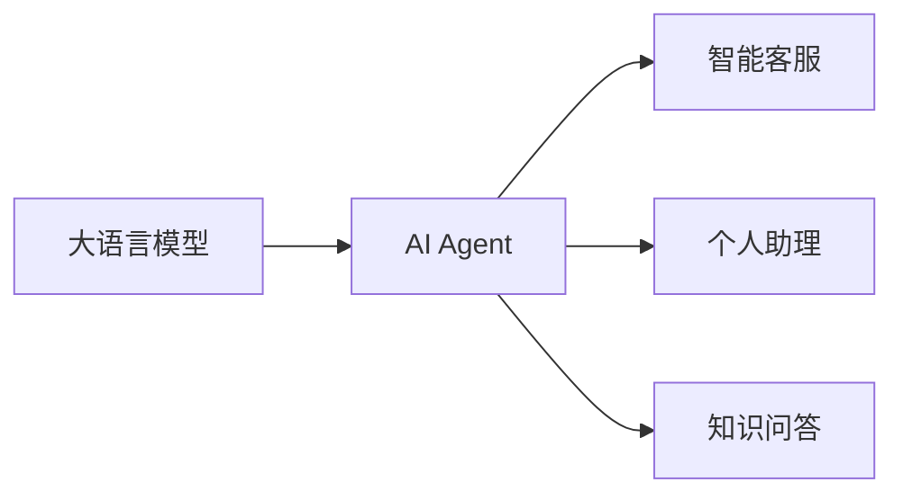
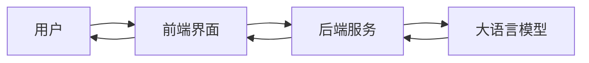

# 【大模型应用开发 动手做AI Agent】客户服务革命

## 1. 背景介绍
### 1.1 人工智能发展现状
#### 1.1.1 人工智能技术日新月异
#### 1.1.2 人工智能应用领域不断拓展
#### 1.1.3 人工智能正在深刻改变我们的生活

### 1.2 大语言模型的崛起 
#### 1.2.1 大语言模型的发展历程
#### 1.2.2 大语言模型的技术特点
#### 1.2.3 大语言模型带来的机遇与挑战

### 1.3 客户服务行业面临的痛点
#### 1.3.1 客户服务成本高昂
#### 1.3.2 客户服务质量参差不齐
#### 1.3.3 客户服务效率有待提升

## 2. 核心概念与联系
### 2.1 大语言模型
#### 2.1.1 大语言模型的定义
#### 2.1.2 大语言模型的原理
#### 2.1.3 主流大语言模型介绍

### 2.2 AI Agent
#### 2.2.1 AI Agent的概念
#### 2.2.2 AI Agent的特点
#### 2.2.3 AI Agent的应用场景

### 2.3 大语言模型与AI Agent的关系
#### 2.3.1 大语言模型是AI Agent的基础
#### 2.3.2 AI Agent赋能大语言模型落地应用
#### 2.3.3 二者结合推动人工智能发展



## 3. 核心算法原理与具体操作步骤
### 3.1 Transformer模型
#### 3.1.1 Transformer模型架构
#### 3.1.2 Self-Attention机制
#### 3.1.3 Transformer模型训练流程

### 3.2 BERT模型
#### 3.2.1 BERT模型原理
#### 3.2.2 BERT模型的预训练与微调
#### 3.2.3 BERT模型的应用实践

### 3.3 GPT模型
#### 3.3.1 GPT模型发展历程
#### 3.3.2 GPT模型的生成式预训练
#### 3.3.3 GPT模型在对话生成中的应用

### 3.4 Prompt Engineering
#### 3.4.1 Prompt的概念与作用
#### 3.4.2 Prompt设计的基本原则
#### 3.4.3 Prompt优化与改进策略

## 4. 数学模型和公式详细讲解举例说明
### 4.1 Transformer中的数学原理
#### 4.1.1 Self-Attention的数学表示
$Attention(Q,K,V) = softmax(\frac{QK^T}{\sqrt{d_k}})V$

#### 4.1.2 Multi-Head Attention的计算过程
$$MultiHead(Q,K,V) = Concat(head_1, ..., head_h)W^O$$
$$head_i = Attention(QW_i^Q, KW_i^K, VW_i^V)$$

#### 4.1.3 Layer Normalization的数学表达
$\mu_B = \frac{1}{m}\sum_{i=1}^mx_i$ 
$\sigma_B^2 = \frac{1}{m}\sum_{i=1}^m(x_i - \mu_B)^2$
$\hat{x_i} = \frac{x_i - \mu_B}{\sqrt{\sigma_B^2 + \epsilon}}$
$y_i = \gamma\hat{x_i} + \beta$

### 4.2 语言模型的概率计算
#### 4.2.1 N-gram语言模型
$P(w_1, w_2, ..., w_n) = \prod_{i=1}^nP(w_i|w_1, ..., w_{i-1}) \approx \prod_{i=1}^nP(w_i|w_{i-n+1}, ..., w_{i-1})$

#### 4.2.2 神经网络语言模型
$P(w_1, w_2, ..., w_n) = \prod_{i=1}^nP(w_i|w_1, ..., w_{i-1}) = \prod_{i=1}^np(w_i|h_i)$
$h_i = f(w_{i-1}, h_{i-1})$

### 4.3 损失函数与优化算法
#### 4.3.1 交叉熵损失函数
$L(y, \hat{y}) = -\sum_{i=1}^ny_ilog\hat{y_i}$

#### 4.3.2 Adam优化算法
$m_t = \beta_1m_{t-1} + (1 - \beta_1)g_t$
$v_t = \beta_2v_{t-1} + (1 - \beta_2)g_t^2$
$\hat{m_t} = \frac{m_t}{1 - \beta_1^t}$
$\hat{v_t} = \frac{v_t}{1 - \beta_2^t}$
$\theta_t = \theta_{t-1} - \frac{\eta}{\sqrt{\hat{v_t}} + \epsilon}\hat{m_t}$

## 5. 项目实践：代码实例和详细解释说明
### 5.1 使用Hugging Face Transformers库
#### 5.1.1 加载预训练模型
```python
from transformers import AutoTokenizer, AutoModel

tokenizer = AutoTokenizer.from_pretrained("bert-base-uncased")
model = AutoModel.from_pretrained("bert-base-uncased")
```

#### 5.1.2 文本编码与向量化
```python
text = "This is a sample sentence."
encoded_input = tokenizer(text, return_tensors='pt')
output = model(**encoded_input)
```

#### 5.1.3 Fine-tuning模型
```python
from transformers import TrainingArguments, Trainer

training_args = TrainingArguments(
    output_dir='./results',
    num_train_epochs=3,
    per_device_train_batch_size=16,
    per_device_eval_batch_size=64,
    warmup_steps=500,
    weight_decay=0.01,
    logging_dir='./logs',
)

trainer = Trainer(
    model=model,
    args=training_args,
    train_dataset=train_dataset,
    eval_dataset=val_dataset,
)

trainer.train()
```

### 5.2 使用OpenAI API
#### 5.2.1 安装openai库
```bash
pip install openai
```

#### 5.2.2 设置API密钥
```python
import openai
openai.api_key = "your_api_key"
```

#### 5.2.3 调用API生成文本
```python
prompt = "Translate the following English text to French: 'Hello, how are you?'"
response = openai.Completion.create(
    engine="text-davinci-002",
    prompt=prompt,
    max_tokens=60
)

print(response.choices[0].text.strip())
```

### 5.3 搭建AI Agent系统
#### 5.3.1 系统架构设计
#### 5.3.2 前端界面开发
#### 5.3.3 后端服务搭建
#### 5.3.4 模型部署与调用



## 6. 实际应用场景
### 6.1 智能客服
#### 6.1.1 客户问题自动应答
#### 6.1.2 多轮对话能力
#### 6.1.3 情感分析与态度识别

### 6.2 个人助理
#### 6.2.1 日程管理与提醒
#### 6.2.2 信息检索与知识问答
#### 6.2.3 个性化推荐

### 6.3 智能写作助手
#### 6.3.1 文章自动生成
#### 6.3.2 文本纠错与润色
#### 6.3.3 写作风格迁移

## 7. 工具和资源推荐
### 7.1 开源框架与库
#### 7.1.1 Hugging Face Transformers
#### 7.1.2 OpenAI GPT-3
#### 7.1.3 Google BERT

### 7.2 数据集资源
#### 7.2.1 Wikipedia
#### 7.2.2 Common Crawl
#### 7.2.3 Reddit Comments

### 7.3 学习资料
#### 7.3.1 《Attention is All You Need》论文
#### 7.3.2 《BERT: Pre-training of Deep Bidirectional Transformers for Language Understanding》论文
#### 7.3.3 《Language Models are Few-Shot Learners》论文

## 8. 总结：未来发展趋势与挑战
### 8.1 大语言模型的发展趋势
#### 8.1.1 模型规模不断增大
#### 8.1.2 训练数据更加丰富多样
#### 8.1.3 模型性能不断提升

### 8.2 AI Agent面临的挑战
#### 8.2.1 数据隐私与安全问题
#### 8.2.2 模型偏见与公平性问题
#### 8.2.3 可解释性与可控性问题

### 8.3 未来展望
#### 8.3.1 多模态AI Agent的崛起
#### 8.3.2 人机协作新范式
#### 8.3.3 AI Agent推动产业智能化升级

## 9. 附录：常见问题与解答
### 9.1 大语言模型是如何训练的？
### 9.2 如何选择合适的预训练模型？
### 9.3 Prompt Engineering有哪些技巧？
### 9.4 如何评估AI Agent的性能？
### 9.5 AI Agent会取代人工客服吗？

作者：禅与计算机程序设计艺术 / Zen and the Art of Computer Programming