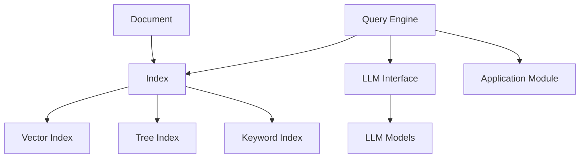

# 【大模型应用开发 动手做AI Agent】说说LlamaIndex

## 1. 背景介绍

近年来,大语言模型(LLM)的快速发展和广泛应用,为人工智能(AI)领域带来了革命性的变革。LLM通过在海量文本数据上进行预训练,能够生成连贯、流畅且富有语义的文本,在自然语言处理(NLP)任务中取得了显著的成果。然而,如何有效地利用LLM构建实用的AI应用,仍然是一个具有挑战性的问题。

LlamaIndex是一个基于LLM的开源库,旨在简化LLM在各种应用场景中的使用。它提供了一套灵活、易用的工具和接口,帮助开发者快速构建基于LLM的AI应用,如智能问答系统、知识图谱、文本摘要等。LlamaIndex的核心思想是将非结构化的文本数据组织成结构化的索引,并利用LLM对索引进行查询和推理,从而实现高效、准确的信息检索和知识提取。

### 1.1 大语言模型(LLM)的发展历程

#### 1.1.1 早期的语言模型
- N-gram模型
- 隐马尔可夫模型(HMM)

#### 1.1.2 神经网络语言模型(NNLM)
- 前馈神经网络(FNN)
- 循环神经网络(RNN)
- 长短期记忆网络(LSTM)

#### 1.1.3 Transformer模型和预训练技术
- Transformer架构
- GPT系列模型
- BERT系列模型

### 1.2 LLM在AI应用中的挑战

#### 1.2.1 数据组织和管理
- 非结构化文本数据的处理
- 知识表示和存储

#### 1.2.2 查询和推理效率
- 海量文本数据的检索
- 实时响应的要求

#### 1.2.3 可解释性和可控性
- LLM生成结果的可解释性
- 对LLM输出的控制和引导

### 1.3 LlamaIndex的诞生

#### 1.3.1 LlamaIndex的设计理念
- 简化LLM在应用中的使用
- 提供灵活、易用的工具和接口

#### 1.3.2 LlamaIndex的主要功能
- 文本数据的索引构建
- 基于LLM的查询和推理
- 支持多种应用场景

## 2. 核心概念与联系

### 2.1 文档(Document)
- 表示输入的文本数据
- 包含文本内容和元数据

### 2.2 索引(Index)
- 将文档组织成结构化的形式
- 支持高效的查询和检索

#### 2.2.1 向量索引(Vector Index)
- 基于向量表示的索引
- 利用向量相似度进行检索

#### 2.2.2 树形索引(Tree Index)
- 基于树形结构的索引
- 支持层次化的文档组织

#### 2.2.3 关键词索引(Keyword Index)
- 基于关键词的索引
- 支持关键词匹配和查询

### 2.3 查询引擎(Query Engine)
- 接收用户查询
- 在索引中检索相关文档
- 利用LLM生成查询结果

### 2.4 LLM接口(LLM Interface)
- 与LLM进行交互
- 支持多种LLM模型(如GPT-3、BERT等)

### 2.5 应用模块(Application Module)
- 基于LlamaIndex构建的应用
- 如智能问答、知识图谱等

下图展示了LlamaIndex的核心概念及其之间的关系:



## 3. 核心算法原理具体操作步骤

### 3.1 文档预处理

#### 3.1.1 文本分割
- 将长文档分割成较短的片段
- 确保每个片段的长度适合LLM处理

#### 3.1.2 文本清洗
- 去除噪声和无用信息
- 如HTML标签、特殊字符等

#### 3.1.3 文本规范化
- 统一文本格式和编码
- 如小写转换、Unicode规范化等

### 3.2 索引构建

#### 3.2.1 向量索引构建
- 将文档片段转换为向量表示
- 使用向量编码器如Word2Vec、BERT等
- 建立向量索引如FAISS、Annoy等

#### 3.2.2 树形索引构建  
- 根据文档内容构建树形结构
- 每个节点表示一个文档片段
- 子节点表示更细粒度的片段

#### 3.2.3 关键词索引构建
- 提取文档中的关键词
- 建立关键词到文档的映射
- 使用倒排索引等技术

### 3.3 查询处理

#### 3.3.1 查询理解
- 对用户查询进行分析
- 提取查询意图和关键信息

#### 3.3.2 相关性检索
- 在索引中检索与查询相关的文档
- 使用向量相似度、关键词匹配等方法

#### 3.3.3 查询结果生成
- 将检索到的文档片段传入LLM
- 利用LLM生成最终的查询结果

### 3.4 LLM交互

#### 3.4.1 LLM输入构建
- 将文档片段和用户查询组合成LLM输入
- 添加必要的上下文信息和提示

#### 3.4.2 LLM推理
- 将构建好的输入传入LLM
- 获取LLM生成的输出结果

#### 3.4.3 结果后处理
- 对LLM生成的结果进行筛选和优化
- 如去除重复信息、提取关键词等

## 4. 数学模型和公式详细讲解举例说明

### 4.1 向量空间模型(Vector Space Model)

在LlamaIndex中,文档和查询都被表示为向量空间中的向量。向量空间模型将文本数据映射到高维向量空间,通过计算向量之间的相似度来衡量文本之间的相关性。

假设有n个文档 $D=\{d_1,d_2,...,d_n\}$,每个文档 $d_i$ 表示为一个m维向量 $\vec{d_i}=(w_{i1},w_{i2},...,w_{im})$,其中 $w_{ij}$ 表示第i个文档在第j个维度上的权重。

查询 $q$ 也被表示为一个m维向量 $\vec{q}=(q_1,q_2,...,q_m)$。

文档 $d_i$ 与查询 $q$ 的相似度可以使用余弦相似度计算:

$$sim(d_i,q)=\frac{\vec{d_i}\cdot\vec{q}}{\|\vec{d_i}\|\|\vec{q}\|}=\frac{\sum_{j=1}^m w_{ij}q_j}{\sqrt{\sum_{j=1}^m w_{ij}^2}\sqrt{\sum_{j=1}^m q_j^2}}$$

其中 $\|\vec{d_i}\|$ 和 $\|\vec{q}\|$ 分别表示文档向量和查询向量的L2范数。

### 4.2 TF-IDF权重(Term Frequency-Inverse Document Frequency)

在构建文档向量时,常用的权重计算方法是TF-IDF。TF-IDF考虑了词语在文档中的出现频率(TF)和词语在整个文档集合中的出现频率(IDF)。

对于文档 $d_i$ 中的词语 $t_j$,其TF-IDF权重计算公式为:

$$w_{ij}=tf_{ij}\cdot idf_j$$

其中,$tf_{ij}$ 表示词语 $t_j$ 在文档 $d_i$ 中的出现频率,可以使用词频(Term Frequency)计算:

$$tf_{ij}=\frac{n_{ij}}{\sum_k n_{ik}}$$

$n_{ij}$ 表示词语 $t_j$ 在文档 $d_i$ 中的出现次数,$\sum_k n_{ik}$ 表示文档 $d_i$ 的总词数。

$idf_j$ 表示词语 $t_j$ 的逆文档频率(Inverse Document Frequency),计算公式为:

$$idf_j=\log\frac{N}{df_j}$$

$N$ 表示文档集合中的总文档数,$df_j$ 表示包含词语 $t_j$ 的文档数。

### 4.3 PageRank算法

LlamaIndex中的树形索引可以使用PageRank算法来计算每个节点的重要性得分。PageRank算法最初用于计算网页的重要性,通过网页之间的链接关系来确定网页的权重。

假设有n个节点 $V=\{v_1,v_2,...,v_n\}$,每个节点 $v_i$ 的PageRank值 $PR(v_i)$ 可以通过以下公式迭代计算:

$$PR(v_i)=\frac{1-d}{n}+d\sum_{v_j\in M(v_i)}\frac{PR(v_j)}{L(v_j)}$$

其中,$d$ 是阻尼因子,通常取值为0.85。$M(v_i)$ 表示指向节点 $v_i$ 的节点集合,$L(v_j)$ 表示节点 $v_j$ 的出度,即从节点 $v_j$ 指向其他节点的链接数。

PageRank算法通过多次迭代,使得节点的PageRank值收敛到稳定值。节点的PageRank值越高,表示该节点在树形结构中的重要性越高。

## 5. 项目实践：代码实例和详细解释说明

下面通过一个简单的示例来演示如何使用LlamaIndex构建一个基于LLM的智能问答系统。

```python
from llama_index import SimpleDirectoryReader, GPTSimpleVectorIndex, LLMPredictor, PromptHelper
from langchain import OpenAI

# 读取文档数据
documents = SimpleDirectoryReader('data').load_data()

# 初始化LLM预测器
llm_predictor = LLMPredictor(llm=OpenAI(temperature=0, model_name="text-davinci-002"))

# 初始化提示模板
prompt_helper = PromptHelper(max_input_size=4096, num_output=256, max_chunk_overlap=20)

# 构建索引
index = GPTSimpleVectorIndex(documents, llm_predictor=llm_predictor, prompt_helper=prompt_helper)

# 保存索引到磁盘
index.save_to_disk('index.json')

# 从磁盘加载索引
index = GPTSimpleVectorIndex.load_from_disk('index.json')

# 查询索引
query = "What is the capital of France?"
response = index.query(query)

print(response)
```

代码解释:

1. 首先,我们使用`SimpleDirectoryReader`读取指定目录下的文档数据。

2. 然后,我们初始化一个LLM预测器`LLMPredictor`,指定使用OpenAI的`text-davinci-002`模型。

3. 接着,我们初始化一个提示模板`PromptHelper`,设置最大输入大小、输出token数和最大chunk重叠数。

4. 使用`GPTSimpleVectorIndex`构建一个简单的向量索引,传入文档数据、LLM预测器和提示模板。

5. 我们可以将构建好的索引保存到磁盘,以便后续加载使用。

6. 从磁盘加载之前保存的索引。

7. 最后,我们可以使用`query`方法对索引进行查询,传入用户的查询字符串。

8. 索引会在后台使用LLM对查询进行处理,并返回生成的查询结果。

通过这个示例,我们可以看到使用LlamaIndex构建一个基本的智能问答系统非常简单,只需要几行代码就可以实现。LlamaIndex提供了丰富的接口和工具,使得开发者可以快速搭建基于LLM的AI应用。

## 6. 实际应用场景

LlamaIndex可以应用于各种场景,以下是一些常见的应用示例:

### 6.1 智能客服系统
- 使用LlamaIndex构建知识库索引
- 用户提出问题,系统自动检索相关知识并生成回答

### 6.2 个性化推荐系统
- 将用户行为数据组织成索引
- 根据用户的查询和历史行为,推荐相关的内容

### 6.3 智能搜索引擎  
- 对网页内容建立索引
- 用户输入搜索关键词,系统返回相关的网页结果

### 6.4 自动文档摘要
- 将长文档切分成片段并建立索引