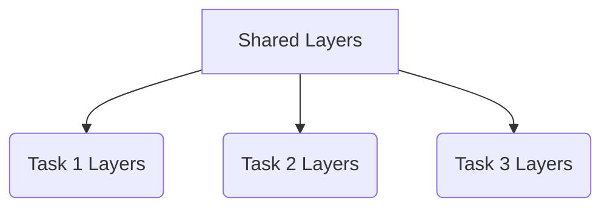

# 一切皆是映射：DQN与多任务学习：共享网络结构的效果分析

## 1. 背景介绍

### 1.1 强化学习与深度Q网络

强化学习是机器学习中一个重要的分支,旨在让智能体(Agent)通过与环境(Environment)的交互来学习如何采取最优策略,从而最大化预期的累积奖励。深度Q网络(Deep Q-Network, DQN)是将深度神经网络应用于强化学习中的一种突破性方法,它能够直接从高维观测数据(如视频游戏画面)中学习出一个有效的行为策略,而无需人工设计特征。

### 1.2 多任务学习

在现实世界中,智能体往往需要同时学习多个不同但相关的任务。传统的机器学习方法通常是为每个任务单独训练一个模型,这种做法效率低下且难以利用不同任务之间的相关性。多任务学习(Multi-Task Learning, MTL)则试图让智能体在同一个模型中同时学习多个相关任务,从而提高数据利用效率,减少重复学习,并促进知识在不同任务之间的迁移。

### 1.3 网络结构共享

在多任务学习中,一种常见的做法是让不同任务共享底层网络的一部分结构,利用这些共享层来学习多个任务之间的共同特征。在DQN中,这种共享网络结构可以应用于多个相关但不同的Atari游戏环境,从而实现知识迁移和提高数据利用效率。

## 2. 核心概念与联系

### 2.1 深度Q网络(DQN)

DQN将深度神经网络应用于Q-Learning算法,用于估计状态-行为对的Q值。它的核心思想是使用一个参数化的函数拟合器(即深度神经网络)来近似Q函数:

$$Q(s,a;\theta) \approx Q^*(s,a)$$

其中$\theta$为神经网络的参数,通过minimizing下式来进行参数更新:

$$L(\theta) = \mathbb{E}_{(s,a,r,s')\sim U(D)}\left[(r + \gamma\max_{a'}Q(s',a';\theta^-) - Q(s,a;\theta))^2\right]$$

这里$\theta^-$是目标网络的参数,用于估计下一状态的最大Q值,以改善训练稳定性。

```mermaid
graph TD
    A[Agent] -->|Observe State s| B(Deep Q Network)
    B --> |Q(s,a)| C{Epsilon Greedy Policy}
    C -->|Action a| D[Environment]
    D -->|Reward r, Next State s'| E[Experience Replay Buffer]
    E --> F[Sample Minibatch]
    F --> G[Optimize Network]
    G --> B
```

### 2.2 多任务学习(MTL)

多任务学习旨在同时学习多个相关但不同的任务,以提高数据利用效率和促进知识迁移。在深度学习中,MTL通常通过硬参数共享或软参数共享来实现。硬参数共享指不同任务共享部分网络层的参数,而软参数共享则是在损失函数中加入参数正则化项,促使不同任务的参数相似。

对于DQN而言,我们可以构建一个共享网络结构,其底层用于提取不同游戏环境中的共同特征,而顶层则对应于每个具体的游戏,如下所示:



在训练过程中,我们可以交替优化不同任务的损失函数,以实现多任务的同步学习。

## 3. 核心算法原理具体操作步骤 

### 3.1 DQN算法

DQN算法的核心步骤如下:

1. 初始化replay buffer D和Q网络参数$\theta$
2. 对于每个episode:
    1. 初始化状态s
    2. 对于每个时间步:
        1. 使用$\epsilon$-greedy策略从Q网络中选择动作a
        2. 在环境中执行动作a,获得奖励r和下一状态s'
        3. 将(s,a,r,s')存入replay buffer D
        4. 从D中采样一个minibatch
        5. 优化损失函数L(theta)并更新Q网络参数theta
        6. s = s'
    3. 结束episode

### 3.2 多任务DQN算法

对于多任务DQN算法,我们需要维护多个任务的Q网络和replay buffer。算法步骤如下:

1. 初始化共享层参数$\theta_s$,以及每个任务的Q网络参数$\theta_1, \theta_2, ..., \theta_n$
2. 初始化每个任务的replay buffer $D_1, D_2, ..., D_n$
3. 对于每个episode:
    1. 随机选择一个任务t
    2. 初始化t任务的状态$s_t$  
    3. 对于每个时间步:
        1. 使用$\epsilon$-greedy策略从Q网络中选择动作$a_t$
        2. 在t任务的环境中执行动作$a_t$,获得奖励$r_t$和下一状态$s_t'$
        3. 将$(s_t, a_t, r_t, s_t')$存入$D_t$
        4. 从$D_t$中采样一个minibatch
        5. 优化损失函数$L_t(\theta_s, \theta_t)$并更新$\theta_s$和$\theta_t$
        6. $s_t = s_t'$
    4. 结束episode

在第5步中,我们需要构造一个多任务损失函数,例如:

$$L_{total}(\theta_s, \theta_1, ..., \theta_n) = \sum_{t=1}^n \lambda_t L_t(\theta_s, \theta_t)$$

其中$\lambda_t$是每个任务的权重系数,可以根据任务的重要性进行调节。

## 4. 数学模型和公式详细讲解举例说明

在DQN算法中,我们使用一个深度神经网络来近似Q函数,即状态-行为值函数。对于给定的状态s和行为a,Q(s,a)表示在当前状态s下执行行为a,之后能获得的预期的累积奖励。我们的目标是找到一个最优的Q函数$Q^*$,使得:

$$Q^*(s,a) = \mathbb{E}\left[r_t + \gamma r_{t+1} + \gamma^2 r_{t+2} + ... | s_t=s, a_t=a, \pi\right]$$

其中$\gamma$是折现因子,用于平衡当前奖励和未来奖励的权重;$\pi$是策略函数,即在给定状态下选择行为的概率分布。

然而,直接估计$Q^*$是困难的,因此我们使用一个可训练的函数拟合器(即深度神经网络)来近似Q函数:

$$Q(s,a;\theta) \approx Q^*(s,a)$$

其中$\theta$是神经网络的参数。我们通过minimizing下式来更新网络参数$\theta$:

$$L(\theta) = \mathbb{E}_{(s,a,r,s')\sim U(D)}\left[(r + \gamma\max_{a'}Q(s',a';\theta^-) - Q(s,a;\theta))^2\right]$$

这里$(s,a,r,s')$是从经验回放池(Experience Replay Buffer)D中均匀采样得到的转换样本,$\theta^-$是目标网络的参数,用于估计下一状态的最大Q值,以改善训练稳定性。

在多任务DQN中,我们将不同任务的Q网络共享底层的特征提取层,如下所示:

```mermaid
graph TD
    A[Input] --> B[Shared Layers]
    B --> C1(Task 1 Layers)
    B --> C2(Task 2 Layers)
    B --> C3(Task 3 Layers)
    C1 --> D1[Q(s,a) for Task 1]
    C2 --> D2[Q(s,a) for Task 2] 
    C3 --> D3[Q(s,a) for Task 3]
```

在训练过程中,我们交替优化不同任务的损失函数,例如:

$$L_{total}(\theta_s, \theta_1, \theta_2, \theta_3) = \lambda_1 L_1(\theta_s, \theta_1) + \lambda_2 L_2(\theta_s, \theta_2) + \lambda_3 L_3(\theta_s, \theta_3)$$

其中$\theta_s$是共享层的参数,$\theta_1, \theta_2, \theta_3$分别是每个任务特有层的参数,$\lambda_1, \lambda_2, \lambda_3$是每个任务的权重系数。通过这种方式,不同任务可以共享底层的特征表示,从而提高数据利用效率和促进知识迁移。

## 5. 项目实践:代码实例和详细解释说明

以下是一个简单的PyTorch实现,展示了如何构建一个共享网络结构的多任务DQN:

```python
import torch
import torch.nn as nn
import torch.optim as optim

# 定义共享层
class SharedLayers(nn.Module):
    def __init__(self, input_size, hidden_size):
        super(SharedLayers, self).__init__()
        self.fc1 = nn.Linear(input_size, hidden_size)
        self.fc2 = nn.Linear(hidden_size, hidden_size)
        
    def forward(self, x):
        x = torch.relu(self.fc1(x))
        x = torch.relu(self.fc2(x))
        return x

# 定义任务特有层
class TaskLayers(nn.Module):
    def __init__(self, hidden_size, output_size):
        super(TaskLayers, self).__init__()
        self.fc1 = nn.Linear(hidden_size, hidden_size)
        self.fc2 = nn.Linear(hidden_size, output_size)
        
    def forward(self, x):
        x = torch.relu(self.fc1(x))
        x = self.fc2(x)
        return x

# 定义多任务DQN
class MultiTaskDQN(nn.Module):
    def __init__(self, input_size, hidden_size, output_sizes):
        super(MultiTaskDQN, self).__init__()
        self.shared_layers = SharedLayers(input_size, hidden_size)
        self.task_layers = nn.ModuleList([TaskLayers(hidden_size, output_size) for output_size in output_sizes])
        
    def forward(self, x, task_idx):
        x = self.shared_layers(x)
        x = self.task_layers[task_idx](x)
        return x

# 示例用法
input_size = 10
hidden_size = 64
output_sizes = [4, 6, 8]  # 三个任务的输出维度

model = MultiTaskDQN(input_size, hidden_size, output_sizes)
optimizer = optim.Adam(model.parameters())

# 训练
for epoch in range(num_epochs):
    for task_idx, (inputs, labels) in enumerate(data_loaders):
        outputs = model(inputs, task_idx)
        loss = loss_fn(outputs, labels)
        optimizer.zero_grad()
        loss.backward()
        optimizer.step()
```

在这个示例中,我们定义了一个`SharedLayers`模块和一个`TaskLayers`模块,分别用于构建共享层和任务特有层。`MultiTaskDQN`模块将这两个模块组合在一起,形成一个多任务网络结构。

在训练过程中,我们遍历每个任务的数据加载器,将输入数据传入网络,并根据当前任务索引`task_idx`选择对应的任务特有层进行前向传播。然后,我们计算损失函数,并使用优化器更新网络参数。

需要注意的是,这只是一个简单的示例,实际应用中可能需要进行一些修改和优化,例如添加目标网络、经验回放池等DQN的标准组件。此外,还可以尝试不同的共享层和任务特有层的结构,以及不同的损失函数组合方式,来获得更好的性能。

## 6. 实际应用场景

共享网络结构的多任务DQN在以下场景中具有潜在的应用价值:

1. **通用游戏AI**:在Atari游戏等视频游戏环境中,不同的游戏往往具有一些共同的底层规则和特征,例如物理引擎、图像处理等。通过共享网络结构的多任务学习,我们可以提高数据利用效率,实现知识迁移,从而训练出一个通用的游戏AI代理,能够在多个不同的游戏环境中表现良好。

2. **机器人控制**:在机器人控制领域,不同的机器人可能具有相似的底层动力学模型,但需要执行不同的任务,例如行走、抓取、推动等。通过共享网络结构的多任务学习,我们可以让机器人同时学习这些不同但相关的任务,从而提高数据利用效率和泛化能力。

3. **自然语言处理**:在自然语言处理领域,不同的任务如机器翻译、文本摘要、问答系统等,往往需