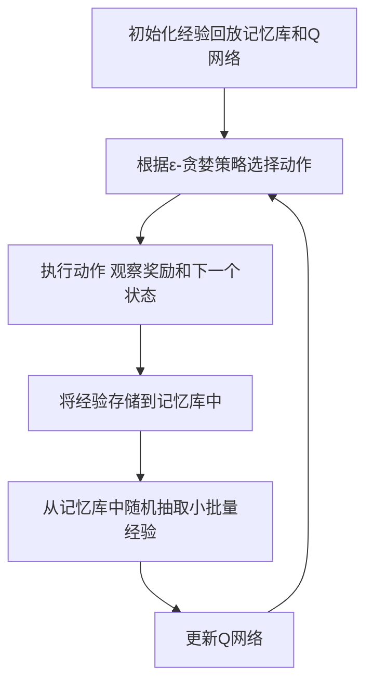

# 一切皆是映射：DQN算法的行业标准化：走向商业化应用

## 1.背景介绍

深度强化学习（Deep Reinforcement Learning, DRL）近年来在人工智能领域取得了显著的进展。作为DRL的代表性算法之一，深度Q网络（Deep Q-Network, DQN）在解决复杂决策问题方面展现了强大的能力。DQN算法通过结合深度学习和Q学习，成功地在多个领域实现了突破。然而，尽管DQN算法在学术界取得了巨大成功，其在商业化应用中的推广仍面临诸多挑战。本文旨在探讨DQN算法的行业标准化及其走向商业化应用的路径。

## 2.核心概念与联系

### 2.1 强化学习基础

强化学习是一种通过与环境交互来学习策略的机器学习方法。其核心概念包括状态（State）、动作（Action）、奖励（Reward）和策略（Policy）。智能体通过在不同状态下选择动作，获得奖励，从而优化其策略。

### 2.2 Q学习

Q学习是一种无模型的强化学习算法，通过学习状态-动作值函数（Q函数）来指导智能体的决策。Q函数表示在给定状态下采取某一动作的预期累积奖励。

### 2.3 深度学习

深度学习是一种基于人工神经网络的机器学习方法，能够自动提取数据的高层次特征。深度学习在图像识别、自然语言处理等领域取得了显著成果。

### 2.4 深度Q网络（DQN）

DQN算法将深度学习与Q学习相结合，通过深度神经网络逼近Q函数，从而解决高维状态空间下的决策问题。DQN算法的核心在于使用经验回放和目标网络来稳定训练过程。

## 3.核心算法原理具体操作步骤

### 3.1 算法框架

DQN算法的核心框架包括以下几个步骤：

1. 初始化经验回放记忆库和Q网络。
2. 在每个时间步，智能体根据ε-贪婪策略选择动作。
3. 执行动作，观察奖励和下一个状态。
4. 将经验（状态、动作、奖励、下一个状态）存储到记忆库中。
5. 从记忆库中随机抽取小批量经验，更新Q网络。

### 3.2 经验回放

经验回放通过存储智能体的经验，并在训练时随机抽取小批量经验，打破了数据的相关性，提升了训练的稳定性和效率。

### 3.3 目标网络

目标网络是DQN算法中的一个关键组件，用于生成稳定的目标值。目标网络的参数每隔一段时间才会更新，从而避免了训练过程中的震荡。

### 3.4 ε-贪婪策略

ε-贪婪策略是一种平衡探索和利用的方法。智能体以ε的概率随机选择动作，以1-ε的概率选择当前Q值最大的动作。



## 4.数学模型和公式详细讲解举例说明

### 4.1 Q函数

Q函数表示在状态 $s$ 下采取动作 $a$ 的预期累积奖励。其更新公式为：

$$
Q(s, a) \leftarrow Q(s, a) + \alpha [r + \gamma \max_{a'} Q(s', a') - Q(s, a)]
$$

其中，$\alpha$ 是学习率，$r$ 是即时奖励，$\gamma$ 是折扣因子，$s'$ 是下一个状态，$a'$ 是下一个状态下的动作。

### 4.2 深度Q网络

在DQN算法中，Q函数由深度神经网络逼近。假设Q网络的参数为 $\theta$，目标网络的参数为 $\theta^-$，则损失函数为：

$$
L(\theta) = \mathbb{E}_{(s, a, r, s') \sim D} \left[ \left( r + \gamma \max_{a'} Q(s', a'; \theta^-) - Q(s, a; \theta) \right)^2 \right]
$$

通过最小化损失函数，更新Q网络的参数：

$$
\theta \leftarrow \theta - \alpha \nabla_\theta L(\theta)
$$

### 4.3 经验回放

经验回放通过存储智能体的经验，并在训练时随机抽取小批量经验，打破了数据的相关性，提升了训练的稳定性和效率。经验回放记忆库 $D$ 的更新过程如下：

1. 将新的经验 $(s, a, r, s')$ 存储到记忆库中。
2. 从记忆库中随机抽取小批量经验 $(s, a, r, s')$。
3. 使用抽取的经验更新Q网络。

### 4.4 目标网络

目标网络的参数 $\theta^-$ 每隔一段时间才会更新，从而避免了训练过程中的震荡。目标网络的更新过程如下：

$$
\theta^- \leftarrow \theta
$$

## 5.项目实践：代码实例和详细解释说明

### 5.1 环境设置

首先，我们需要安装必要的库：

```bash
pip install gym
pip install tensorflow
```

### 5.2 DQN算法实现

以下是一个简单的DQN算法实现示例：

```python
import gym
import numpy as np
import tensorflow as tf
from collections import deque
import random

# 创建环境
env = gym.make('CartPole-v1')

# 超参数
state_size = env.observation_space.shape[0]
action_size = env.action_space.n
batch_size = 64
n_episodes = 1000
output_dir = 'model_output/cartpole'

# DQN网络
class DQN:
    def __init__(self, state_size, action_size):
        self.state_size = state_size
        self.action_size = action_size
        self.memory = deque(maxlen=2000)
        self.gamma = 0.95
        self.epsilon = 1.0
        self.epsilon_decay = 0.995
        self.epsilon_min = 0.01
        self.learning_rate = 0.001
        self.model = self._build_model()

    def _build_model(self):
        model = tf.keras.Sequential()
        model.add(tf.keras.layers.Dense(24, input_dim=self.state_size, activation='relu'))
        model.add(tf.keras.layers.Dense(24, activation='relu'))
        model.add(tf.keras.layers.Dense(self.action_size, activation='linear'))
        model.compile(loss='mse', optimizer=tf.keras.optimizers.Adam(lr=self.learning_rate))
        return model

    def remember(self, state, action, reward, next_state, done):
        self.memory.append((state, action, reward, next_state, done))

    def act(self, state):
        if np.random.rand() <= self.epsilon:
            return random.randrange(self.action_size)
        act_values = self.model.predict(state)
        return np.argmax(act_values[0])

    def replay(self, batch_size):
        minibatch = random.sample(self.memory, batch_size)
        for state, action, reward, next_state, done in minibatch:
            target = reward
            if not done:
                target = reward + self.gamma * np.amax(self.model.predict(next_state)[0])
            target_f = self.model.predict(state)
            target_f[0][action] = target
            self.model.fit(state, target_f, epochs=1, verbose=0)
        if self.epsilon > self.epsilon_min:
            self.epsilon *= self.epsilon_decay

# 训练DQN
dqn = DQN(state_size, action_size)
for e in range(n_episodes):
    state = env.reset()
    state = np.reshape(state, [1, state_size])
    for time in range(500):
        action = dqn.act(state)
        next_state, reward, done, _ = env.step(action)
        reward = reward if not done else -10
        next_state = np.reshape(next_state, [1, state_size])
        dqn.remember(state, action, reward, next_state, done)
        state = next_state
        if done:
            print(f"episode: {e}/{n_episodes}, score: {time}, e: {dqn.epsilon:.2}")
            break
        if len(dqn.memory) > batch_size:
            dqn.replay(batch_size)
```

### 5.3 代码解释

1. **环境设置**：使用OpenAI Gym创建CartPole环境。
2. **DQN网络**：定义DQN类，包括网络结构、记忆库、动作选择和经验回放。
3. **训练过程**：在每个回合中，智能体根据ε-贪婪策略选择动作，执行动作并存储经验，使用经验回放更新Q网络。

## 6.实际应用场景

### 6.1 游戏AI

DQN算法在游戏AI中取得了显著成果。例如，DQN成功地在Atari游戏中击败了人类玩家。通过不断与游戏环境交互，DQN能够学习到最优策略，从而在游戏中取得高分。

### 6.2 自动驾驶

在自动驾驶领域，DQN算法可以用于路径规划和决策。通过与模拟环境交互，DQN能够学习到在不同交通状况下的最优驾驶策略，从而提高自动驾驶系统的安全性和效率。

### 6.3 机器人控制

DQN算法在机器人控制中也有广泛应用。例如，在机械臂控制中，DQN可以通过与环境交互，学习到最优的抓取和放置策略，从而提高机械臂的操作精度和效率。

### 6.4 金融交易

在金融交易中，DQN算法可以用于优化交易策略。通过与市场环境交互，DQN能够学习到在不同市场状况下的最优交易策略，从而提高投资回报率。

## 7.工具和资源推荐

### 7.1 开源库

- **TensorFlow**：一个广泛使用的深度学习框架，支持DQN算法的实现。
- **PyTorch**：另一个流行的深度学习框架，具有灵活的动态计算图，适合DQN算法的研究和应用。
- **OpenAI Gym**：一个用于开发和比较强化学习算法的工具包，提供了丰富的环境和接口。

### 7.2 在线课程

- **Coursera**：提供了多门关于深度学习和强化学习的在线课程，例如Andrew Ng的深度学习专项课程。
- **Udacity**：提供了强化学习纳米学位课程，涵盖了DQN算法的详细讲解和实践。

### 7.3 书籍推荐

- **《深度强化学习》**：详细介绍了深度强化学习的理论和实践，包括DQN算法。
- **《强化学习：原理与实践》**：一本经典的强化学习教材，涵盖了Q学习和深度Q网络的内容。

## 8.总结：未来发展趋势与挑战

### 8.1 未来发展趋势

随着计算能力的提升和算法的不断改进，DQN算法在商业化应用中的前景广阔。未来，DQN算法有望在更多领域实现突破，例如智能制造、医疗诊断和个性化推荐等。

### 8.2 挑战

尽管DQN算法在学术界取得了巨大成功，其在商业化应用中仍面临诸多挑战。例如，DQN算法对计算资源的需求较高，训练过程较为复杂。此外，DQN算法在实际应用中可能面临数据稀缺和环境变化等问题。

## 9.附录：常见问题与解答

### 9.1 DQN算法的优势是什么？

DQN算法通过结合深度学习和Q学习，能够在高维状态空间下实现高效的决策。其优势在于能够自动提取数据的高层次特征，从而提高决策的准确性和效率。

### 9.2 如何解决DQN算法的过拟合问题？

可以通过增加经验回放记忆库的容量、使用目标网络和正则化技术来解决DQN算法的过拟合问题。此外，适当调整网络结构和超参数也有助于提高模型的泛化能力。

### 9.3 DQN算法在实际应用中有哪些限制？

DQN算法在实际应用中可能面临计算资源需求高、训练过程复杂和数据稀缺等问题。此外，DQN算法在环境变化较大的情况下可能表现不佳，需要进行适应性调整。

---

作者：禅与计算机程序设计艺术 / Zen and the Art of Computer Programming