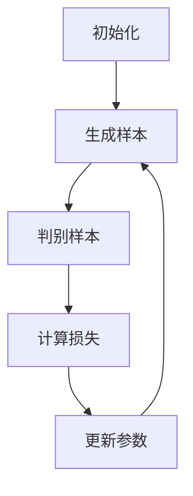

# 一切皆是映射：GANs生成对抗网络的原理和应用

## 1.背景介绍

生成对抗网络（Generative Adversarial Networks，简称GANs）自2014年由Ian Goodfellow等人提出以来，迅速成为机器学习和人工智能领域的热门研究方向。GANs的核心思想是通过两个神经网络——生成器（Generator）和判别器（Discriminator）之间的对抗训练，来生成逼真的数据样本。其应用范围广泛，包括图像生成、图像修复、数据增强等。

## 2.核心概念与联系

### 2.1 生成器与判别器

生成器和判别器是GANs的两个核心组件。生成器的任务是从随机噪声中生成逼真的数据样本，而判别器的任务是区分真实数据和生成数据。两者通过对抗训练不断提升各自的能力。

### 2.2 对抗训练

对抗训练是GANs的关键机制。生成器和判别器通过交替优化各自的损失函数来进行训练。生成器试图最大化判别器的错误率，而判别器则试图最小化其错误率。

### 2.3 损失函数

GANs的损失函数由生成器和判别器的损失函数组成。生成器的损失函数通常是判别器对生成样本的判别结果，而判别器的损失函数则是对真实样本和生成样本的判别结果之和。

## 3.核心算法原理具体操作步骤

### 3.1 初始化

初始化生成器和判别器的参数，并定义损失函数和优化器。

### 3.2 生成样本

生成器从随机噪声中生成样本。

### 3.3 判别样本

判别器对生成样本和真实样本进行判别，计算损失。

### 3.4 更新参数

根据损失函数，使用反向传播算法更新生成器和判别器的参数。

### 3.5 重复训练

重复上述步骤，直到生成器生成的样本足够逼真。



## 4.数学模型和公式详细讲解举例说明

### 4.1 生成器的损失函数

生成器的目标是最大化判别器对生成样本的错误率，其损失函数为：

$$
L_G = -\mathbb{E}_{z \sim p_z(z)}[\log D(G(z))]
$$

### 4.2 判别器的损失函数

判别器的目标是最小化对真实样本和生成样本的判别错误率，其损失函数为：

$$
L_D = -\mathbb{E}_{x \sim p_{data}(x)}[\log D(x)] - \mathbb{E}_{z \sim p_z(z)}[\log (1 - D(G(z)))]
$$

### 4.3 优化过程

生成器和判别器的优化过程可以表示为：

$$
\min_G \max_D V(D, G) = \mathbb{E}_{x \sim p_{data}(x)}[\log D(x)] + \mathbb{E}_{z \sim p_z(z)}[\log (1 - D(G(z)))]
$$

## 5.项目实践：代码实例和详细解释说明

### 5.1 环境准备

首先，确保安装了必要的库，如TensorFlow或PyTorch。

```python
import tensorflow as tf
from tensorflow.keras import layers
```

### 5.2 定义生成器

```python
def build_generator():
    model = tf.keras.Sequential()
    model.add(layers.Dense(256, input_dim=100))
    model.add(layers.LeakyReLU(alpha=0.2))
    model.add(layers.Dense(512))
    model.add(layers.LeakyReLU(alpha=0.2))
    model.add(layers.Dense(1024))
    model.add(layers.LeakyReLU(alpha=0.2))
    model.add(layers.Dense(28 * 28 * 1, activation='tanh'))
    model.add(layers.Reshape((28, 28, 1)))
    return model
```

### 5.3 定义判别器

```python
def build_discriminator():
    model = tf.keras.Sequential()
    model.add(layers.Flatten(input_shape=(28, 28, 1)))
    model.add(layers.Dense(512))
    model.add(layers.LeakyReLU(alpha=0.2))
    model.add(layers.Dense(256))
    model.add(layers.LeakyReLU(alpha=0.2))
    model.add(layers.Dense(1, activation='sigmoid'))
    return model
```

### 5.4 训练模型

```python
def train(generator, discriminator, epochs, batch_size, z_dim):
    for epoch in range(epochs):
        # 训练判别器
        real_images = get_real_images(batch_size)
        fake_images = generator.predict(get_random_noise(batch_size, z_dim))
        d_loss_real = discriminator.train_on_batch(real_images, np.ones((batch_size, 1)))
        d_loss_fake = discriminator.train_on_batch(fake_images, np.zeros((batch_size, 1)))
        d_loss = 0.5 * np.add(d_loss_real, d_loss_fake)
        
        # 训练生成器
        noise = get_random_noise(batch_size, z_dim)
        g_loss = gan.train_on_batch(noise, np.ones((batch_size, 1)))
        
        # 输出损失
        print(f"{epoch} [D loss: {d_loss}] [G loss: {g_loss}]")
```

## 6.实际应用场景

### 6.1 图像生成

GANs可以生成高质量的图像，广泛应用于艺术创作、广告设计等领域。

### 6.2 图像修复

GANs可以用于图像修复，如去除图像中的噪声、修复损坏的图像等。

### 6.3 数据增强

GANs可以生成新的数据样本，用于数据增强，提升模型的泛化能力。

## 7.工具和资源推荐

### 7.1 开源框架

- TensorFlow
- PyTorch

### 7.2 在线资源

- GitHub上的GANs项目
- 相关的学术论文和教程

## 8.总结：未来发展趋势与挑战

GANs在生成数据方面展现了巨大的潜力，但也面临一些挑战，如训练不稳定、模式崩溃等。未来的研究方向包括改进训练算法、探索新的应用场景等。

## 9.附录：常见问题与解答

### 9.1 GANs的训练为什么不稳定？

GANs的训练不稳定主要是因为生成器和判别器的对抗训练过程容易导致梯度消失或爆炸。

### 9.2 如何解决模式崩溃问题？

可以通过改进损失函数、使用更复杂的网络结构等方法来解决模式崩溃问题。

### 9.3 GANs可以应用于哪些领域？

GANs可以应用于图像生成、图像修复、数据增强、文本生成等多个领域。

---

作者：禅与计算机程序设计艺术 / Zen and the Art of Computer Programming