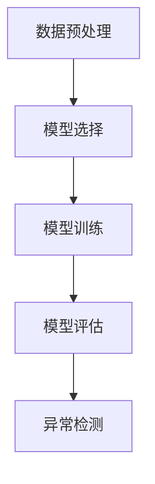

# 一切皆是映射：使用神经网络进行异常检测

## 1.背景介绍

在现代数据驱动的世界中，异常检测已经成为各个领域的关键任务。无论是金融欺诈检测、网络安全威胁识别，还是工业设备故障预测，异常检测都扮演着至关重要的角色。传统的异常检测方法，如统计学方法和基于规则的方法，虽然在某些场景下有效，但在面对复杂和高维数据时往往力不从心。随着深度学习的兴起，神经网络在异常检测中的应用逐渐成为研究热点。

神经网络，尤其是深度神经网络，具有强大的特征提取和模式识别能力，使其在处理复杂数据时表现出色。通过将异常检测问题转化为映射问题，神经网络可以学习数据的正常模式，并识别出偏离这些模式的异常数据点。

## 2.核心概念与联系

### 2.1 异常检测的定义

异常检测是指识别数据集中与大多数数据显著不同的数据点的过程。这些异常数据点可能代表错误、欺诈、故障或其他感兴趣的事件。

### 2.2 神经网络的基本概念

神经网络是一种模拟人脑结构和功能的计算模型，由多个神经元（节点）和连接（权重）组成。通过训练，神经网络可以学习输入数据与输出结果之间的复杂映射关系。

### 2.3 映射的概念

在数学中，映射是指将一个集合中的元素关联到另一个集合中的元素的过程。在神经网络中，映射是指将输入数据通过网络层层传递，最终得到输出结果的过程。

### 2.4 神经网络与异常检测的联系

神经网络可以通过学习正常数据的模式，建立输入数据到正常模式的映射。当新的数据输入时，网络可以判断其是否符合已学到的正常模式，从而识别出异常数据。

## 3.核心算法原理具体操作步骤

### 3.1 数据预处理

数据预处理是异常检测的第一步。包括数据清洗、归一化、特征提取等步骤。数据预处理的质量直接影响到后续模型的性能。

### 3.2 模型选择

根据具体应用场景选择合适的神经网络模型。常用的模型包括自编码器、卷积神经网络（CNN）、循环神经网络（RNN）等。

### 3.3 模型训练

使用正常数据对神经网络进行训练，使其学习正常数据的模式。训练过程中需要调整网络的超参数，如学习率、批量大小等。

### 3.4 模型评估

使用验证集对训练好的模型进行评估，确保其能够准确识别正常数据和异常数据。常用的评估指标包括准确率、召回率、F1分数等。

### 3.5 异常检测

将新数据输入训练好的模型，判断其是否为异常数据。可以通过计算重构误差、预测误差等方式来判断。



## 4.数学模型和公式详细讲解举例说明

### 4.1 自编码器

自编码器是一种无监督学习模型，通过将输入数据编码为低维表示，再解码为原始数据，从而学习数据的特征。自编码器的重构误差可以用于异常检测。

$$
L(x, \hat{x}) = \| x - \hat{x} \|^2
$$

其中，$x$ 是输入数据，$\hat{x}$ 是重构数据，$L$ 是重构误差。

### 4.2 卷积神经网络

卷积神经网络（CNN）通过卷积层提取数据的局部特征，适用于图像数据的异常检测。卷积操作可以表示为：

$$
y_{i,j} = \sum_{m=0}^{M-1} \sum_{n=0}^{N-1} x_{i+m,j+n} \cdot w_{m,n}
$$

其中，$x$ 是输入数据，$w$ 是卷积核，$y$ 是卷积结果。

### 4.3 循环神经网络

循环神经网络（RNN）适用于时间序列数据的异常检测。RNN通过循环结构捕捉数据的时间依赖性。RNN的状态更新公式为：

$$
h_t = \sigma(W_h h_{t-1} + W_x x_t + b)
$$

其中，$h_t$ 是当前时刻的隐藏状态，$x_t$ 是当前时刻的输入，$W_h$ 和 $W_x$ 是权重矩阵，$b$ 是偏置，$\sigma$ 是激活函数。

## 5.项目实践：代码实例和详细解释说明

### 5.1 数据预处理

```python
import numpy as np
from sklearn.preprocessing import StandardScaler

# 生成示例数据
data = np.random.rand(1000, 20)

# 数据归一化
scaler = StandardScaler()
data_normalized = scaler.fit_transform(data)
```

### 5.2 自编码器模型

```python
import tensorflow as tf
from tensorflow.keras import layers, models

# 构建自编码器模型
input_dim = data_normalized.shape[1]
encoding_dim = 10

input_layer = layers.Input(shape=(input_dim,))
encoded = layers.Dense(encoding_dim, activation='relu')(input_layer)
decoded = layers.Dense(input_dim, activation='sigmoid')(encoded)

autoencoder = models.Model(input_layer, decoded)
autoencoder.compile(optimizer='adam', loss='mse')

# 模型训练
autoencoder.fit(data_normalized, data_normalized, epochs=50, batch_size=32, validation_split=0.2)
```

### 5.3 异常检测

```python
# 生成新数据
new_data = np.random.rand(10, 20)
new_data_normalized = scaler.transform(new_data)

# 重构新数据
reconstructed_data = autoencoder.predict(new_data_normalized)

# 计算重构误差
reconstruction_error = np.mean(np.square(new_data_normalized - reconstructed_data), axis=1)

# 判断是否为异常数据
threshold = 0.1
anomalies = reconstruction_error > threshold
print("Anomalies:", anomalies)
```

## 6.实际应用场景

### 6.1 金融欺诈检测

在金融领域，异常检测可以用于识别信用卡欺诈、洗钱等行为。通过分析交易数据，神经网络可以识别出异常的交易模式，从而预防欺诈行为。

### 6.2 网络安全

在网络安全领域，异常检测可以用于识别网络攻击、恶意软件等威胁。通过分析网络流量数据，神经网络可以识别出异常的流量模式，从而保护网络安全。

### 6.3 工业设备故障预测

在工业领域，异常检测可以用于预测设备故障。通过分析设备的传感器数据，神经网络可以识别出异常的运行模式，从而提前预警设备故障，减少停机时间。

## 7.工具和资源推荐

### 7.1 开源框架

- TensorFlow：一个开源的深度学习框架，支持构建和训练神经网络。
- PyTorch：另一个流行的深度学习框架，具有灵活的动态计算图。

### 7.2 数据集

- KDD Cup 1999：一个用于网络入侵检测的数据集。
- Credit Card Fraud Detection：一个用于信用卡欺诈检测的数据集。

### 7.3 在线课程和书籍

- 《深度学习》：一本由Ian Goodfellow等人编写的经典深度学习教材。
- Coursera上的深度学习课程：由Andrew Ng教授讲授的深度学习课程，涵盖了神经网络的基础知识和应用。

## 8.总结：未来发展趋势与挑战

神经网络在异常检测中的应用前景广阔，但也面临一些挑战。首先，数据的高维性和复杂性要求更强大的模型和更高效的训练算法。其次，异常数据的稀缺性和多样性使得模型的泛化能力成为关键问题。未来，随着深度学习技术的不断发展，神经网络在异常检测中的应用将更加广泛和深入。

## 9.附录：常见问题与解答

### 9.1 如何选择合适的神经网络模型？

选择合适的神经网络模型需要考虑数据的类型和特征。例如，自编码器适用于无标签数据，CNN适用于图像数据，RNN适用于时间序列数据。

### 9.2 如何确定异常检测的阈值？

异常检测的阈值可以通过分析重构误差的分布来确定。通常，可以选择一个合适的百分位数作为阈值，例如95%或99%。

### 9.3 如何处理数据不平衡问题？

数据不平衡是异常检测中的常见问题。可以通过数据增强、重采样等方法来平衡数据集。此外，可以使用加权损失函数来提高模型对异常数据的敏感性。

---

作者：禅与计算机程序设计艺术 / Zen and the Art of Computer Programming