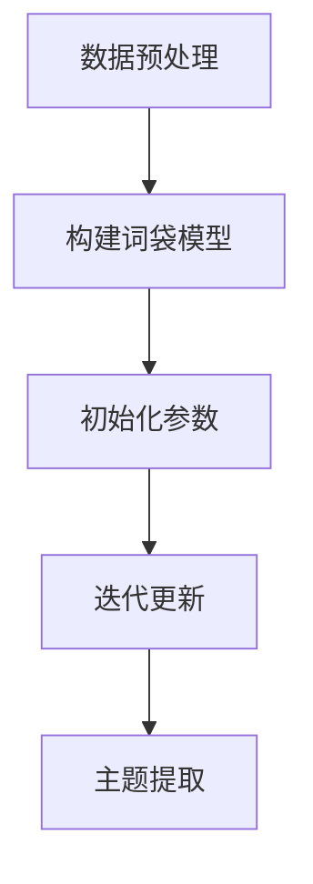

# 主题模型原理与代码实战案例讲解

## 1.背景介绍

在大数据时代，文本数据的爆炸性增长使得从中提取有价值的信息变得尤为重要。主题模型（Topic Modeling）作为一种无监督学习方法，能够自动从大量文本中发现隐藏的主题结构。它在自然语言处理（NLP）、信息检索和文本挖掘等领域有着广泛的应用。

主题模型的核心思想是将文档表示为主题的概率分布，而每个主题又是词汇的概率分布。通过这种方式，我们可以从大量文本中提取出潜在的主题，从而更好地理解和组织文本数据。

## 2.核心概念与联系

### 2.1 文档和词袋模型

在主题模型中，文档被视为词的集合，这种表示方式被称为词袋模型（Bag of Words Model）。在这种模型中，文档的顺序被忽略，只关注词的频率。

### 2.2 主题

主题是词的概率分布。每个主题由一组词及其对应的概率组成，这些词在该主题中出现的概率较高。

### 2.3 文档-主题分布

每个文档可以表示为多个主题的概率分布。即，一个文档可以由多个主题混合而成，每个主题在文档中出现的概率不同。

### 2.4 词-主题分布

每个词可以表示为多个主题的概率分布。即，一个词可以在多个主题中出现，每个主题中该词出现的概率不同。

### 2.5 潜在狄利克雷分配（LDA）

潜在狄利克雷分配（Latent Dirichlet Allocation, LDA）是最常用的主题模型之一。LDA假设文档是由潜在主题生成的，而每个主题是由词生成的。LDA通过贝叶斯推断来估计文档-主题分布和词-主题分布。

## 3.核心算法原理具体操作步骤

### 3.1 数据预处理

在进行主题建模之前，需要对文本数据进行预处理。常见的预处理步骤包括：

- 去除停用词
- 词干提取
- 词形还原
- 分词

### 3.2 构建词袋模型

将预处理后的文本数据转换为词袋模型，即将每个文档表示为词的频率向量。

### 3.3 初始化参数

在LDA中，需要初始化文档-主题分布和词-主题分布的参数。通常使用狄利克雷分布进行初始化。

### 3.4 迭代更新

通过吉布斯采样（Gibbs Sampling）或变分推断（Variational Inference）等方法，迭代更新文档-主题分布和词-主题分布的参数，直到收敛。

### 3.5 主题提取

在参数收敛后，从文档-主题分布和词-主题分布中提取主题。每个主题由一组高概率词组成。

以下是LDA算法的Mermaid流程图：



## 4.数学模型和公式详细讲解举例说明

### 4.1 LDA的生成过程

LDA的生成过程可以描述为以下步骤：

1. 对于每个文档 $d$：
   - 从狄利克雷分布 $Dir(\alpha)$ 采样得到文档-主题分布 $\theta_d$。
   - 对于文档中的每个词 $w$：
     - 从多项式分布 $Mult(\theta_d)$ 采样得到主题 $z$。
     - 从多项式分布 $Mult(\beta_z)$ 采样得到词 $w$。

### 4.2 数学公式

LDA的概率模型可以表示为：

$$
P(w, z, \theta, \beta | \alpha, \eta) = P(\theta | \alpha) \prod_{d=1}^D \left( P(z_d | \theta_d) \prod_{n=1}^{N_d} P(w_{dn} | z_{dn}, \beta) \right)
$$

其中：
- $w$ 是词的集合
- $z$ 是主题的集合
- $\theta$ 是文档-主题分布
- $\beta$ 是词-主题分布
- $\alpha$ 和 $\eta$ 是狄利克雷分布的超参数

### 4.3 吉布斯采样

吉布斯采样是一种常用的参数估计方法。其基本思想是通过迭代更新每个变量的条件分布来逼近联合分布。在LDA中，吉布斯采样的更新公式为：

$$
P(z_{dn} = k | z_{-dn}, w, \alpha, \eta) \propto \frac{n_{dk}^{-dn} + \alpha_k}{\sum_{k'} (n_{dk'}^{-dn} + \alpha_{k'})} \cdot \frac{n_{kw}^{-dn} + \eta_w}{\sum_{w'} (n_{kw'}^{-dn} + \eta_{w'})}
$$

其中：
- $n_{dk}^{-dn}$ 表示文档 $d$ 中除去词 $w_{dn}$ 后属于主题 $k$ 的词数
- $n_{kw}^{-dn}$ 表示主题 $k$ 中除去词 $w_{dn}$ 后词 $w$ 的词数

## 5.项目实践：代码实例和详细解释说明

### 5.1 数据集准备

我们将使用20 Newsgroups数据集，这是一个常用的文本分类数据集，包含20个不同主题的新闻组文档。

### 5.2 数据预处理

```python
import nltk
from sklearn.datasets import fetch_20newsgroups
from sklearn.feature_extraction.text import CountVectorizer
from nltk.corpus import stopwords

# 下载停用词
nltk.download('stopwords')

# 加载数据集
newsgroups = fetch_20newsgroups(subset='all')
documents = newsgroups.data

# 数据预处理
stop_words = stopwords.words('english')
vectorizer = CountVectorizer(stop_words=stop_words)
X = vectorizer.fit_transform(documents)
```

### 5.3 构建LDA模型

```python
from sklearn.decomposition import LatentDirichletAllocation

# 设置主题数
n_topics = 20

# 构建LDA模型
lda = LatentDirichletAllocation(n_components=n_topics, random_state=42)
lda.fit(X)
```

### 5.4 主题提取

```python
def print_top_words(model, feature_names, n_top_words):
    for topic_idx, topic in enumerate(model.components_):
        print(f"Topic #{topic_idx}:")
        print(" ".join([feature_names[i] for i in topic.argsort()[:-n_top_words - 1:-1]]))
    print()

# 打印每个主题的前10个词
n_top_words = 10
tf_feature_names = vectorizer.get_feature_names_out()
print_top_words(lda, tf_feature_names, n_top_words)
```

### 5.5 结果分析

通过上述代码，我们可以得到每个主题的前10个高概率词，从而理解每个主题的含义。

## 6.实际应用场景

### 6.1 文档分类

主题模型可以用于文档分类，通过提取文档的主题分布，将文档归类到相应的主题类别中。

### 6.2 信息检索

在信息检索系统中，主题模型可以用于改进搜索结果的相关性。通过分析用户查询和文档的主题分布，可以更准确地匹配用户需求。

### 6.3 推荐系统

主题模型可以用于推荐系统，通过分析用户的历史行为，提取用户的兴趣主题，从而推荐相关内容。

### 6.4 社交媒体分析

在社交媒体分析中，主题模型可以用于发现热点话题，分析用户的兴趣和情感倾向。

## 7.工具和资源推荐

### 7.1 工具

- **Gensim**：一个用于主题建模的Python库，支持LDA等多种主题模型。
- **Scikit-learn**：一个常用的机器学习库，包含LDA的实现。
- **Mallet**：一个Java工具包，提供高效的LDA实现。

### 7.2 资源

- **20 Newsgroups**：一个常用的文本分类数据集。
- **NIPS Papers**：一个包含NIPS会议论文的文本数据集。
- **Gensim Documentation**：Gensim库的官方文档，提供详细的使用说明和示例。

## 8.总结：未来发展趋势与挑战

### 8.1 发展趋势

随着深度学习的发展，基于神经网络的主题模型（如神经主题模型、变分自编码器等）逐渐成为研究热点。这些模型能够捕捉更复杂的主题结构，提高主题建模的效果。

### 8.2 挑战

- **大规模数据处理**：在处理大规模文本数据时，主题模型的计算复杂度较高，需要高效的算法和分布式计算框架。
- **主题解释性**：如何提高主题的解释性，使得主题更具可读性和可解释性，是一个重要的研究方向。
- **多语言支持**：在多语言环境中，如何构建跨语言的主题模型，是一个具有挑战性的任务。

## 9.附录：常见问题与解答

### 9.1 主题数如何确定？

主题数是LDA的一个超参数，可以通过交叉验证、困惑度（Perplexity）等方法进行选择。

### 9.2 如何提高主题模型的效果？

可以通过以下方法提高主题模型的效果：
- 进行更好的数据预处理，如去除噪音词、进行词形还原等。
- 调整超参数，如主题数、狄利克雷分布的超参数等。
- 使用更复杂的模型，如神经主题模型等。

### 9.3 主题模型的结果如何解释？

主题模型的结果通常以每个主题的高概率词来表示。通过分析这些高概率词，可以理解每个主题的含义。

### 9.4 主题模型的计算复杂度如何？

LDA的计算复杂度较高，尤其是在处理大规模文本数据时。可以使用分布式计算框架（如Spark）来提高计算效率。

### 9.5 主题模型的应用场景有哪些？

主题模型在文档分类、信息检索、推荐系统、社交媒体分析等领域有广泛的应用。

---

作者：禅与计算机程序设计艺术 / Zen and the Art of Computer Programming