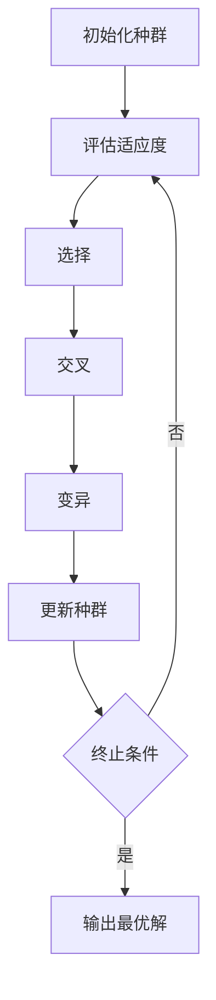
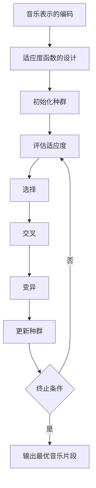

# 从基因算法到生成音乐：一个简要的历史回顾

## 1.背景介绍

基因算法（Genetic Algorithm, GA）是一种基于自然选择和遗传学原理的优化算法。自20世纪60年代以来，基因算法在解决复杂优化问题方面展现了强大的能力。随着计算机技术的发展，基因算法的应用范围不断扩大，从最初的工程优化到如今的生成音乐，基因算法的应用场景越来越广泛。

生成音乐（Generative Music）是指利用算法和计算机技术自动生成音乐作品的过程。生成音乐不仅在音乐创作中提供了新的可能性，还在音乐治疗、游戏音效、电影配乐等领域展现了广阔的应用前景。

本文将从基因算法的基本概念出发，探讨其在生成音乐中的应用，详细介绍核心算法原理、数学模型、项目实践、实际应用场景、工具和资源推荐，并展望未来的发展趋势与挑战。

## 2.核心概念与联系

### 2.1 基因算法的基本概念

基因算法是一种模拟自然进化过程的搜索算法。其基本思想是通过选择、交叉和变异等操作，不断优化种群中的个体，使其逐步接近最优解。基因算法的核心概念包括：

- **种群（Population）**：由多个个体组成，每个个体代表一个潜在解。
- **个体（Individual）**：种群中的一个成员，通常用一个字符串或数组表示。
- **适应度函数（Fitness Function）**：用于评估个体优劣的函数。
- **选择（Selection）**：根据适应度函数选择优良个体进行繁殖。
- **交叉（Crossover）**：将两个个体的部分基因交换，生成新的个体。
- **变异（Mutation）**：随机改变个体的部分基因，增加种群的多样性。

### 2.2 生成音乐的基本概念

生成音乐是利用算法和计算机技术自动生成音乐作品的过程。其核心概念包括：

- **音乐表示（Music Representation）**：将音乐信息表示为计算机可处理的形式，如MIDI文件、音符序列等。
- **生成算法（Generative Algorithm）**：用于生成音乐的算法，如基因算法、神经网络等。
- **评价函数（Evaluation Function）**：用于评估生成音乐质量的函数。

### 2.3 基因算法与生成音乐的联系

基因算法在生成音乐中的应用主要体现在以下几个方面：

- **音乐表示的编码**：将音乐信息编码为基因算法可处理的形式。
- **适应度函数的设计**：设计适应度函数评估生成音乐的质量。
- **进化过程的控制**：通过选择、交叉和变异等操作，不断优化生成音乐的质量。

## 3.核心算法原理具体操作步骤

### 3.1 基因算法的基本步骤

基因算法的基本步骤如下：

1. **初始化种群**：随机生成初始种群。
2. **评估适应度**：计算种群中每个个体的适应度值。
3. **选择**：根据适应度值选择优良个体进行繁殖。
4. **交叉**：将选择的个体进行交叉操作，生成新的个体。
5. **变异**：对新生成的个体进行变异操作。
6. **更新种群**：用新生成的个体替换旧种群。
7. **终止条件**：判断是否满足终止条件，若满足则输出最优解，否则返回步骤2。

以下是基因算法的流程图：



### 3.2 生成音乐的具体操作步骤

生成音乐的具体操作步骤如下：

1. **音乐表示的编码**：将音乐信息编码为基因算法可处理的形式，如音符序列。
2. **适应度函数的设计**：设计适应度函数评估生成音乐的质量，如旋律的和谐度、节奏的多样性等。
3. **初始化种群**：随机生成初始种群，每个个体表示一个音乐片段。
4. **评估适应度**：计算种群中每个个体的适应度值。
5. **选择**：根据适应度值选择优良个体进行繁殖。
6. **交叉**：将选择的个体进行交叉操作，生成新的个体。
7. **变异**：对新生成的个体进行变异操作。
8. **更新种群**：用新生成的个体替换旧种群。
9. **终止条件**：判断是否满足终止条件，若满足则输出最优音乐片段，否则返回步骤4。

以下是生成音乐的流程图：



## 4.数学模型和公式详细讲解举例说明

### 4.1 基因算法的数学模型

基因算法的数学模型主要包括以下几个方面：

#### 4.1.1 适应度函数

适应度函数用于评估个体的优劣，通常表示为 $f(x)$，其中 $x$ 表示个体的基因序列。适应度函数的设计直接影响到基因算法的优化效果。

#### 4.1.2 选择操作

选择操作根据个体的适应度值选择优良个体进行繁殖。常用的选择方法包括轮盘赌选择、锦标赛选择等。轮盘赌选择的概率计算公式为：

$$
P_i = \frac{f(x_i)}{\sum_{j=1}^{N} f(x_j)}
$$

其中，$P_i$ 表示个体 $i$ 被选择的概率，$f(x_i)$ 表示个体 $i$ 的适应度值，$N$ 表示种群大小。

#### 4.1.3 交叉操作

交叉操作将两个个体的部分基因交换，生成新的个体。常用的交叉方法包括单点交叉、多点交叉等。单点交叉的数学表示为：

$$
\begin{aligned}
&\text{父代1: } x_1 = (x_{11}, x_{12}, \ldots, x_{1k}, \ldots, x_{1n}) \\
&\text{父代2: } x_2 = (x_{21}, x_{22}, \ldots, x_{2k}, \ldots, x_{2n}) \\
&\text{子代1: } y_1 = (x_{11}, x_{12}, \ldots, x_{2k}, \ldots, x_{2n}) \\
&\text{子代2: } y_2 = (x_{21}, x_{22}, \ldots, x_{1k}, \ldots, x_{1n})
\end{aligned}
$$

#### 4.1.4 变异操作

变异操作随机改变个体的部分基因，增加种群的多样性。变异操作的数学表示为：

$$
x_i' = (x_{i1}, x_{i2}, \ldots, x_{ik}', \ldots, x_{in})
$$

其中，$x_{ik}'$ 表示变异后的基因值。

### 4.2 生成音乐的数学模型

生成音乐的数学模型主要包括以下几个方面：

#### 4.2.1 音乐表示的编码

将音乐信息编码为基因算法可处理的形式，如音符序列。假设一个音乐片段由 $n$ 个音符组成，每个音符表示为 $x_i$，则音乐片段表示为：

$$
X = (x_1, x_2, \ldots, x_n)
$$

#### 4.2.2 适应度函数的设计

适应度函数用于评估生成音乐的质量，常用的适应度函数包括旋律的和谐度、节奏的多样性等。假设适应度函数表示为 $f(X)$，则适应度值计算公式为：

$$
f(X) = \sum_{i=1}^{n} f(x_i)
$$

其中，$f(x_i)$ 表示音符 $x_i$ 的适应度值。

#### 4.2.3 选择、交叉和变异操作

选择、交叉和变异操作与基因算法的基本操作类似，只是操作对象变为音乐片段。具体操作步骤如下：

1. **选择**：根据适应度值选择优良音乐片段进行繁殖。
2. **交叉**：将选择的音乐片段进行交叉操作，生成新的音乐片段。
3. **变异**：对新生成的音乐片段进行变异操作。

## 5.项目实践：代码实例和详细解释说明

### 5.1 基因算法的代码实例

以下是一个简单的基因算法Python实现，用于求解最大化函数 $f(x) = x^2$ 的问题：

```python
import random

# 适应度函数
def fitness(x):
    return x ** 2

# 初始化种群
def init_population(size, gene_length):
    population = []
    for _ in range(size):
        individual = [random.randint(0, 1) for _ in range(gene_length)]
        population.append(individual)
    return population

# 选择操作
def selection(population, fitness_values):
    total_fitness = sum(fitness_values)
    probabilities = [f / total_fitness for f in fitness_values]
    selected = random.choices(population, probabilities, k=len(population))
    return selected

# 交叉操作
def crossover(parent1, parent2):
    point = random.randint(1, len(parent1) - 1)
    child1 = parent1[:point] + parent2[point:]
    child2 = parent2[:point] + parent1[point:]
    return child1, child2

# 变异操作
def mutation(individual, mutation_rate):
    for i in range(len(individual)):
        if random.random() < mutation_rate:
            individual[i] = 1 - individual[i]
    return individual

# 基因算法
def genetic_algorithm(pop_size, gene_length, generations, mutation_rate):
    population = init_population(pop_size, gene_length)
    for _ in range(generations):
        fitness_values = [fitness(int("".join(map(str, ind)), 2)) for ind in population]
        population = selection(population, fitness_values)
        next_population = []
        for i in range(0, len(population), 2):
            parent1, parent2 = population[i], population[i + 1]
            child1, child2 = crossover(parent1, parent2)
            next_population.append(mutation(child1, mutation_rate))
            next_population.append(mutation(child2, mutation_rate))
        population = next_population
    best_individual = max(population, key=lambda ind: fitness(int("".join(map(str, ind)), 2)))
    return best_individual

# 参数设置
pop_size = 10
gene_length = 5
generations = 20
mutation_rate = 0.01

# 运行基因算法
best_individual = genetic_algorithm(pop_size, gene_length, generations, mutation_rate)
best_value = int("".join(map(str, best_individual)), 2)
print(f"最优个体: {best_individual}, 最优值: {best_value}")
```

### 5.2 生成音乐的代码实例

以下是一个简单的基因算法生成音乐的Python实现，使用MIDI文件表示音乐片段：

```python
import random
from midiutil import MIDIFile

# 适应度函数
def fitness(melody):
    # 简单的适应度函数，计算音符的和谐度
    return sum(melody)

# 初始化种群
def init_population(size, gene_length):
    population = []
    for _ in range(size):
        individual = [random.randint(60, 72) for _ in range(gene_length)]
        population.append(individual)
    return population

# 选择操作
def selection(population, fitness_values):
    total_fitness = sum(fitness_values)
    probabilities = [f / total_fitness for f in fitness_values]
    selected = random.choices(population, probabilities, k=len(population))
    return selected

# 交叉操作
def crossover(parent1, parent2):
    point = random.randint(1, len(parent1) - 1)
    child1 = parent1[:point] + parent2[point:]
    child2 = parent2[:point] + parent1[point:]
    return child1, child2

# 变异操作
def mutation(individual, mutation_rate):
    for i in range(len(individual)):
        if random.random() < mutation_rate:
            individual[i] = random.randint(60, 72)
    return individual

# 基因算法
def genetic_algorithm(pop_size, gene_length, generations, mutation_rate):
    population = init_population(pop_size, gene_length)
    for _ in range(generations):
        fitness_values = [fitness(ind) for ind in population]
        population = selection(population, fitness_values)
        next_population = []
        for i in range(0, len(population), 2):
            parent1, parent2 = population[i], population[i + 1]
            child1, child2 = crossover(parent1, parent2)
            next_population.append(mutation(child1, mutation_rate))
            next_population.append(mutation(child2, mutation_rate))
        population = next_population
    best_individual = max(population, key=fitness)
    return best_individual

# 参数设置
pop_size = 10
gene_length = 8
generations = 20
mutation_rate = 0.01

# 运行基因算法
best_melody = genetic_algorithm(pop_size, gene_length, generations, mutation_rate)
print(f"最优旋律: {best_melody}")

# 生成MIDI文件
midi = MIDIFile(1)
track = 0
time = 0
midi.addTrackName(track, time, "Generated Melody")
midi.addTempo(track, time, 120)

channel = 0
volume = 100
duration = 1

for i, pitch in enumerate(best_melody):
    midi.addNote(track, channel, pitch, time + i, duration, volume)

with open("generated_melody.mid", "wb") as output_file:
    midi.writeFile(output_file)
```

## 6.实际应用场景

### 6.1 音乐创作

基因算法可以用于自动生成旋律、和弦进程等音乐元素，辅助音乐创作。通过设计适应度函数，可以生成符合特定风格和情感的音乐作品。

### 6.2 音乐治疗

生成音乐在音乐治疗中具有广泛的应用前景。通过生成个性化的音乐片段，可以帮助患者放松、减轻压力、改善情绪。

### 6.3 游戏音效

在游戏开发中，生成音乐可以用于自动生成背景音乐和音效，提升游戏的沉浸感和体验。

### 6.4 电影配乐

生成音乐可以用于电影配乐，自动生成符合剧情和情感的音乐片段，节省配乐时间和成本。

## 7.工具和资源推荐

### 7.1 工具推荐

- **Python**：Python是一种广泛使用的编程语言，具有丰富的库和工具，适合实现基因算法和生成音乐。
- **MIDIUtil**：MIDIUtil是一个Python库，用于生成MIDI文件，适合用于生成音乐项目。
- **Jupyter Notebook**：Jupyter Notebook是一个交互式编程环境，适合用于代码实验和数据可视化。

### 7.2 资源推荐

- **《遗传算法导论》**：这本书详细介绍了基因算法的基本原理和应用，适合初学者学习。
- **《生成音乐：理论与实践》**：这本书介绍了生成音乐的基本概念和算法，适合对生成音乐感兴趣的读者。
- **GitHub**：GitHub上有许多基因算法和生成音乐的开源项目，可以参考和学习。

## 8.总结：未来发展趋势与挑战

基因算法和生成音乐是两个充满潜力的研究领域。随着计算机技术的发展，基因算法在生成音乐中的应用将越来越广泛。未来的发展趋势和挑战包括：

### 8.1 发展趋势

- **多模态生成**：结合图像、文本等多模态信息，生成更加丰富和多样的音乐作品。
- **个性化生成**：根据用户的喜好和需求，生成个性化的音乐片段。
- **实时生成**：实现实时生成音乐，应用于现场演出、互动游戏等场景。

### 8.2 挑战

- **适应度函数设计**：设计适应度函数评估生成音乐的质量是一个难点，需要结合音乐理论和听众反馈。
- **计算资源需求**：基因算法的计算复杂度较高，需要大量的计算资源和时间。
- **音乐风格多样性**：生成不同风格和情感的音乐作品需要复杂的算法和模型。

## 9.附录：常见问题与解答

### 9.1 基因算法的适应