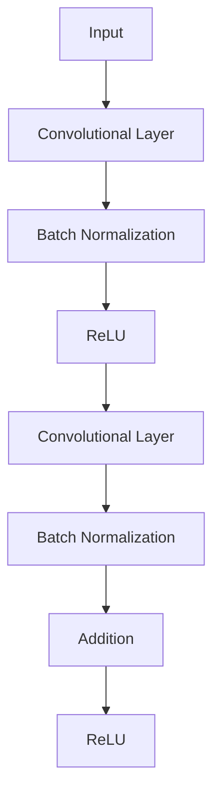

## 1. 背景介绍

深度学习在计算机视觉领域的应用已经取得了很大的成功，但是在训练深度神经网络时，会遇到梯度消失和梯度爆炸等问题，导致网络无法收敛。为了解决这些问题，ResNet（Residual Network）被提出，它是一种深度残差网络，可以有效地解决梯度消失和梯度爆炸问题，同时还可以提高网络的准确率。

本文将介绍ResNet的基础原理和程序设计基础，帮助读者了解ResNet的核心概念和算法原理，掌握ResNet的实现方法和应用场景。

## 2. 核心概念与联系

ResNet是一种深度残差网络，它的核心概念是残差块（Residual Block）。残差块是由两个卷积层和一个跳跃连接（Shortcut Connection）组成的，其中跳跃连接将输入直接加到输出上，使得网络可以学习残差（Residual）。

ResNet的结构如下图所示：



其中，输入经过一个卷积层、Batch Normalization和ReLU激活函数后，再经过另一个卷积层和Batch Normalization，然后将输入和输出相加，最后再经过ReLU激活函数。

ResNet的核心思想是学习残差，即网络的输出与输入之间的差异。通过跳跃连接，网络可以直接学习残差，而不需要通过多层卷积层来学习。

## 3. 核心算法原理具体操作步骤

ResNet的核心算法原理是残差块，残差块由两个卷积层和一个跳跃连接组成。具体操作步骤如下：

1. 输入经过一个卷积层、Batch Normalization和ReLU激活函数后，再经过另一个卷积层和Batch Normalization。
2. 将输入和输出相加，得到残差。
3. 将残差与输入相加，得到输出。
4. 输出经过ReLU激活函数。

ResNet的训练过程与其他深度神经网络相似，使用反向传播算法更新网络参数，使得网络的损失函数最小化。

## 4. 数学模型和公式详细讲解举例说明

ResNet的数学模型和公式如下：

$$y = F(x, \{W_i\}) + x$$

其中，$x$是输入，$y$是输出，$F(x, \{W_i\})$是残差函数，$W_i$是网络参数。

ResNet的数学模型和公式表达了网络的核心思想，即学习残差。通过残差函数，网络可以直接学习输入和输出之间的差异，而不需要通过多层卷积层来学习。

## 5. 项目实践：代码实例和详细解释说明

下面是使用PyTorch实现ResNet的代码示例：

```python
import torch
import torch.nn as nn

class ResidualBlock(nn.Module):
    def __init__(self, in_channels, out_channels, stride=1):
        super(ResidualBlock, self).__init__()
        self.conv1 = nn.Conv2d(in_channels, out_channels, kernel_size=3, stride=stride, padding=1, bias=False)
        self.bn1 = nn.BatchNorm2d(out_channels)
        self.conv2 = nn.Conv2d(out_channels, out_channels, kernel_size=3, stride=1, padding=1, bias=False)
        self.bn2 = nn.BatchNorm2d(out_channels)
        self.relu = nn.ReLU(inplace=True)
        self.stride = stride

    def forward(self, x):
        identity = x

        out = self.conv1(x)
        out = self.bn1(out)
        out = self.relu(out)

        out = self.conv2(out)
        out = self.bn2(out)

        if self.stride != 1 or identity.shape[1] != out.shape[1]:
            identity = nn.Conv2d(identity.shape[1], out.shape[1], kernel_size=1, stride=self.stride, bias=False)(identity)
            identity = nn.BatchNorm2d(out.shape[1])(identity)

        out += identity
        out = self.relu(out)

        return out

class ResNet(nn.Module):
    def __init__(self, block, layers, num_classes=10):
        super(ResNet, self).__init__()
        self.in_channels = 64

        self.conv1 = nn.Conv2d(3, 64, kernel_size=3, stride=1, padding=1, bias=False)
        self.bn1 = nn.BatchNorm2d(64)
        self.relu = nn.ReLU(inplace=True)
        self.maxpool = nn.MaxPool2d(kernel_size=3, stride=2, padding=1)

        self.layer1 = self.make_layer(block, 64, layers[0], stride=1)
        self.layer2 = self.make_layer(block, 128, layers[1], stride=2)
        self.layer3 = self.make_layer(block, 256, layers[2], stride=2)
        self.layer4 = self.make_layer(block, 512, layers[3], stride=2)

        self.avgpool = nn.AdaptiveAvgPool2d((1, 1))
        self.fc = nn.Linear(512, num_classes)

    def make_layer(self, block, out_channels, blocks, stride=1):
        layers = []
        layers.append(block(self.in_channels, out_channels, stride))
        self.in_channels = out_channels
        for i in range(1, blocks):
            layers.append(block(out_channels, out_channels))
        return nn.Sequential(*layers)

    def forward(self, x):
        x = self.conv1(x)
        x = self.bn1(x)
        x = self.relu(x)
        x = self.maxpool(x)

        x = self.layer1(x)
        x = self.layer2(x)
        x = self.layer3(x)
        x = self.layer4(x)

        x = self.avgpool(x)
        x = x.view(x.size(0), -1)
        x = self.fc(x)

        return x
```

上述代码实现了ResNet的残差块和ResNet网络。其中，ResidualBlock是残差块，ResNet是ResNet网络。在ResNet网络中，使用了四个残差块，每个残差块包含多个ResidualBlock。

## 6. 实际应用场景

ResNet在计算机视觉领域的应用非常广泛，例如图像分类、目标检测、语义分割等任务。在图像分类任务中，ResNet可以达到非常高的准确率，甚至超过人类的识别能力。

## 7. 工具和资源推荐

- PyTorch：深度学习框架，可以方便地实现ResNet网络。
- ImageNet：一个大规模的图像数据库，可以用于训练和测试ResNet网络。
- ResNet论文：ResNet的原始论文，详细介绍了ResNet的设计和实现。

## 8. 总结：未来发展趋势与挑战

ResNet是深度学习领域的重要进展之一，它的成功证明了深度残差网络的有效性。未来，深度残差网络将继续发展，解决更加复杂的计算机视觉问题。

同时，深度残差网络也面临着一些挑战，例如训练时间长、计算资源消耗大等问题。未来的研究将集中在如何提高深度残差网络的训练效率和性能。

## 9. 附录：常见问题与解答

Q: ResNet的核心思想是什么？

A: ResNet的核心思想是学习残差，即网络的输出与输入之间的差异。通过跳跃连接，网络可以直接学习残差，而不需要通过多层卷积层来学习。

Q: ResNet在计算机视觉领域的应用有哪些？

A: ResNet在计算机视觉领域的应用非常广泛，例如图像分类、目标检测、语义分割等任务。在图像分类任务中，ResNet可以达到非常高的准确率，甚至超过人类的识别能力。

Q: 如何实现ResNet网络？

A: 可以使用深度学习框架，例如PyTorch，实现ResNet网络。需要实现ResidualBlock和ResNet两个类，其中ResidualBlock是残差块，ResNet是ResNet网络。在ResNet网络中，使用了多个残差块，每个残差块包含多个ResidualBlock。