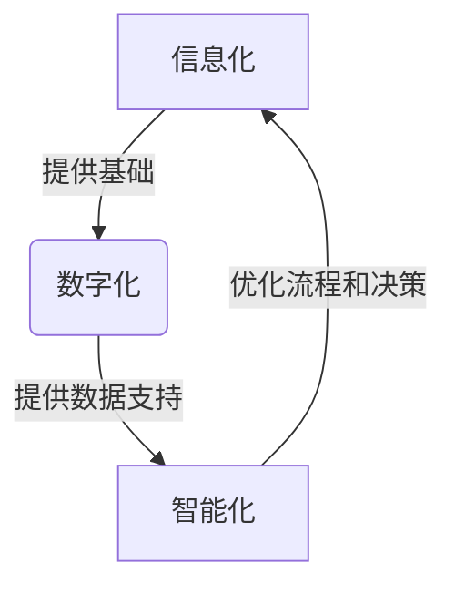
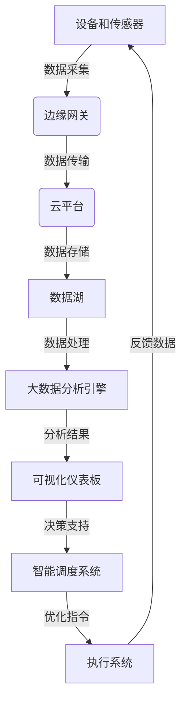

# 公司中长期信息化数字化智能化规划方案

## 1.背景介绍

在当今快速发展的数字时代，信息化、数字化和智能化已经成为企业保持竞争力和可持续发展的关键驱动力。随着技术的不断进步和商业环境的变化,企业需要制定一个全面的中长期信息化、数字化和智能化规划,以确保其能够顺利地适应新的挑战和机遇。

本文将探讨如何为企业制定一个全面的中长期信息化、数字化和智能化规划方案,包括确定目标和优先事项、评估现有基础设施、选择合适的技术解决方案、制定实施计划、管理变革过程以及持续优化和改进。

## 2.核心概念与联系

### 2.1 信息化(Informatization)

信息化是指利用现代信息技术,实现信息资源的高效采集、传输、存储、加工和利用,以支持企业的各项业务活动和决策过程。它包括建立统一的数据中心、部署企业资源计划(ERP)系统、客户关系管理(CRM)系统、供应链管理(SCM)系统等,实现信息的集成和共享。

### 2.2 数字化(Digitalization)

数字化是指将传统的物理资产、产品、服务和流程转换为数字形式,以提高效率、降低成本并创造新的价值。它包括利用物联网(IoT)技术实现设备的互联互通、采用云计算和大数据分析等技术优化业务流程、建立在线销售渠道和电子商务平台等。

### 2.3 智能化(Intelligentization)

智能化是指利用人工智能(AI)、机器学习、深度学习等技术,赋予系统智能化的能力,实现自动化决策、预测分析和优化调度等功能。它包括应用自然语言处理(NLP)技术优化客户服务、利用计算机视觉技术实现智能监控、采用机器学习算法进行预测性维护等。

这三个概念紧密相连,相互促进,构成了企业数字化转型的核心内容。信息化为数字化和智能化奠定了基础,数字化则为智能化提供了数据支持,而智能化又可以反过来优化信息化和数字化的流程和决策。



## 3.核心算法原理具体操作步骤

制定中长期信息化、数字化和智能化规划方案需要遵循一定的系统流程和方法论,以确保规划的全面性、一致性和可执行性。以下是一个常见的操作步骤:

1. **确定目标和优先事项**
   - 明确企业的战略目标和发展方向
   - 识别关键业务痛点和机遇
   - 确定信息化、数字化和智能化的优先领域

2. **评估现有基础设施**
   - 审计现有IT基础设施、系统和数据资产
   - 分析现有系统的性能、安全性和可扩展性
   - 识别需要升级或替换的组件

3. **选择合适的技术解决方案**
   - 研究和评估市场上的技术选择
   - 考虑技术的成熟度、兼容性和总体拥有成本
   - 制定技术路线图和架构蓝图

4. **制定实施计划**
   - 分解规划为可执行的项目和里程碑
   - 估算所需资源和预算
   - 建立项目管理和风险管理机制

5. **管理变革过程**
   - 培养企业数字化文化
   - 提供员工培训和变革管理
   - 有效沟通和管理利益相关方期望

6. **持续优化和改进**
   - 监控实施进度和效果
   - 收集反馈并进行必要的调整
   - 持续优化和改进流程和系统

在整个过程中,需要注重与企业战略的一致性,确保规划能够支持和推动企业的长期发展目标。同时,还需要关注安全性、合规性和数据隐私等重要方面。

## 4.数学模型和公式详细讲解举例说明

在制定中长期信息化、数字化和智能化规划时,可能需要利用一些数学模型和公式来量化和优化决策过程。以下是一些常见的模型和公式:

### 4.1 投资回报率(ROI)模型

投资回报率模型用于评估信息化、数字化和智能化项目的经济效益。它计算项目的净现值(NPV)和内部收益率(IRR),以确定投资是否合理。

$$
\text{NPV} = \sum_{t=0}^{T} \frac{C_t}{(1+r)^t}
$$

其中,
- $C_t$ 是第 $t$ 年的现金流量
- $r$ 是折现率
- $T$ 是项目的持续时间(年)

如果 NPV 大于 0,则项目是有利可图的。IRR 则是使 NPV 等于 0 的折现率,通常需要高于企业的资金成本率。

### 4.2 总拥有成本(TCO)模型

总拥有成本模型用于估算信息化、数字化和智能化解决方案在整个生命周期内的总体成本,包括采购、实施、运营、维护和最终退役等各个阶段的费用。

$$
\text{TCO} = C_\text{cap} + \sum_{t=1}^{T} \frac{C_\text{op}(t) + C_\text{main}(t)}{(1+r)^t}
$$

其中,
- $C_\text{cap}$ 是资本支出(采购和实施成本)
- $C_\text{op}(t)$ 是第 $t$ 年的运营成本
- $C_\text{main}(t)$ 是第 $t$ 年的维护成本
- $r$ 是折现率
- $T$ 是解决方案的预期使用年限

通过计算和比较不同解决方案的 TCO,企业可以做出更明智的投资决策。

### 4.3 业务连续性规划(BCP)模型

业务连续性规划模型用于评估信息系统中断对企业运营的影响,并制定相应的恢复策略和程序,以最大限度地减少业务中断造成的损失。

$$
\text{Loss} = R_\text{op} \times \text{MTTR} + R_\text{rep} + C_\text{rec}
$$

其中,
- $R_\text{op}$ 是每小时的营业收入
- MTTR 是平均修复时间
- $R_\text{rep}$ 是声誉损失
- $C_\text{rec}$ 是恢复成本

通过最小化 Loss,企业可以确定合适的容灾和备份策略,并优化恢复流程。

这些模型和公式只是信息化、数字化和智能化规划中的一小部分,还有许多其他模型和方法可以应用,如数据建模、流程优化、机器学习等。在实际应用中,需要根据具体情况选择合适的模型和方法。

## 5.项目实践:代码实例和详细解释说明

为了更好地说明信息化、数字化和智能化规划的实施,我们将通过一个具体的项目实例来进行演示和说明。

### 5.1 项目背景

某制造企业希望通过数字化转型来提高生产效率、优化供应链管理和改善客户体验。他们计划建立一个基于物联网(IoT)和大数据分析的智能制造系统,实现设备的实时监控、预测性维护和智能调度。

### 5.2 系统架构

该系统的总体架构如下所示:



1. **设备和传感器**: 安装在生产线上的各种设备和传感器,用于采集实时数据,如温度、振动、能耗等。

2. **边缘网关**: 收集并预处理来自设备的数据,并将其传输到云平台。

3. **云平台**: 提供计算、存储和网络资源,用于数据处理和分析。

4. **数据湖**: 存储来自各种来源的原始数据。

5. **大数据分析引擎**: 使用机器学习和数据挖掘算法对数据进行分析,如异常检测、故障预测和优化建议。

6. **可视化仪表板**: 以直观的方式呈现分析结果,帮助决策者了解生产状况。

7. **智能调度系统**: 基于分析结果,自动生成优化的生产计划和调度指令。

8. **执行系统**: 将优化指令下发到生产线上的设备,并收集反馈数据。

### 5.3 关键技术

该项目涉及多种关键技术,包括:

1. **物联网(IoT)**: 用于连接和管理大量的设备和传感器。

2. **边缘计算**: 在靠近数据源的位置进行数据预处理,减轻云端的计算压力。

3. **大数据处理**: 使用Apache Spark等框架对海量数据进行高效处理和分析。

4. **机器学习**: 应用监督学习和非监督学习算法进行异常检测、故障预测和优化建议。

5. **优化算法**: 使用遗传算法、蚁群算法等智能优化算法生成最优的生产计划和调度方案。

6. **可视化技术**: 利用D3.js等可视化库开发直观的仪表板和报告。

### 5.4 代码示例

以下是一个使用 Python 和 Apache Spark 进行异常检测的简单示例:

```python
from pyspark.sql import SparkSession
from pyspark.ml.feature import VectorAssembler
from pyspark.ml.clustering import GaussianMixture

# 创建 Spark 会话
spark = SparkSession.builder.appName("AnomalyDetection").getOrCreate()

# 加载数据
data = spark.read.csv("production_data.csv", header=True, inferSchema=True)

# 准备特征向量
assembler = VectorAssembler(inputCols=["temp", "vibration", "energy"], outputCol="features")
data = assembler.transform(data)

# 训练高斯混合模型
gmm = GaussianMixture(k=3, tol=0.001, maxIter=100)
model = gmm.fit(data.select("features"))

# 检测异常
anomalies = model.transform(data).filter("probability < 0.01")
anomalies.show()
```

在这个示例中,我们使用高斯混合模型(GMM)对生产数据(温度、振动和能耗)进行聚类,并将低概率的数据点标记为异常。

1. 首先,我们从 CSV 文件加载生产数据,并使用 `VectorAssembler` 将特征组合成向量。

2. 然后,我们使用 `GaussianMixture` estimator 训练一个 GMM 模型,假设数据由三个高斯分布的混合组成。

3. 最后,我们使用训练好的模型对数据进行评分,并过滤出概率小于 0.01 的异常数据点。

这只是一个简单的示例,在实际项目中,您可能需要使用更复杂的算法和技术,如深度学习、时间序列分析等。但是,基本的思路是相似的:收集数据、构建模型、训练模型、应用模型并解释结果。

## 6.实际应用场景

信息化、数字化和智能化规划在各个行业都有广泛的应用场景,以下是一些典型的例子:

1. **制造业**:
   - 智能制造:利用物联网、大数据和人工智能技术实现生产线的实时监控、预测性维护和智能调度,提高效率和产品质量。
   - 数字孪生:构建产品和生产线的虚拟模型,用于设计优化、过程模拟和虚拟测试。

2. **零售业**:
   - 智能供应链:利用大数据分析和机器学习算法优化库存管理、需求预测和物流路线规划。
   - 个性化营销:基于客户数据和行为分析,提供个性化的产品推荐和营销活动。

3. **金融业**:
   - 智能风控:应用机器学习和自然语言处理技术,实现实时的欺