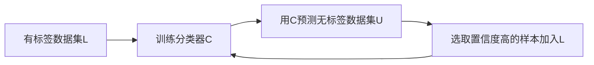
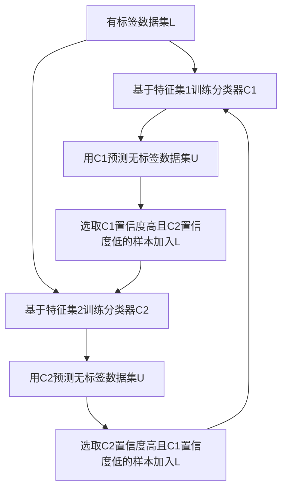
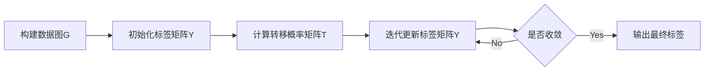

# 半监督学习(Semi-Supervised Learning) - 原理与代码实例讲解

## 1. 背景介绍
### 1.1 机器学习的发展历程
### 1.2 半监督学习的起源与发展
### 1.3 半监督学习的重要意义

## 2. 核心概念与联系
### 2.1 监督学习、无监督学习与半监督学习的区别
### 2.2 半监督学习的基本假设
#### 2.2.1 平滑性假设
#### 2.2.2 聚类假设 
#### 2.2.3 流形假设
### 2.3 半监督学习的分类
#### 2.3.1 生成式方法
#### 2.3.2 半监督SVM
#### 2.3.3 图半监督学习
#### 2.3.4 基于分歧的方法

## 3. 核心算法原理具体操作步骤
### 3.1 自训练(Self-Training)
#### 3.1.1 算法流程

#### 3.1.2 算法优缺点分析
### 3.2 协同训练(Co-Training) 
#### 3.2.1 算法流程

#### 3.2.2 算法优缺点分析
### 3.3 半监督SVM(S3VM)
#### 3.3.1 S3VM模型
#### 3.3.2 TSVM算法
### 3.4 标签传播(Label Propagation)
#### 3.4.1 算法流程

#### 3.4.2 算法优缺点分析

## 4. 数学模型和公式详细讲解举例说明
### 4.1 自训练的数学模型
### 4.2 协同训练的数学模型
### 4.3 S3VM的数学模型
#### 4.3.1 目标函数
$$ \min_{w,b} \frac{1}{2} \lVert w \rVert^2 + C_1 \sum_{i=1}^l \xi_i + C_2 \sum_{j=l+1}^{l+u} \xi_j^* $$
$$ s.t. \quad y_i(w^Tx_i+b) \geq 1-\xi_i, \quad i=1,\dots,l $$
$$ \lvert w^Tx_j+b \rvert \geq 1-\xi_j^*, \quad j=l+1,\dots,l+u $$
$$ \xi_i \geq 0, \quad \xi_j^* \geq 0 $$
#### 4.3.2 求解算法
### 4.4 标签传播的数学模型 
#### 4.4.1 图的构建
#### 4.4.2 标签传播过程

## 5. 项目实践：代码实例和详细解释说明
### 5.1 自训练代码实例
```python
from sklearn.base import BaseEstimator, ClassifierMixin
class SelfTrainingClassifier(BaseEstimator, ClassifierMixin):
    def __init__(self, base_classifier, threshold=0.75, max_iterations=10):
        self.base_classifier = base_classifier
        self.threshold = threshold
        self.max_iterations = max_iterations
        
    def fit(self, X, y):
        # 省略具体实现
        return self
        
    def predict(self, X):
        return self.base_classifier.predict(X)
        
    def predict_proba(self, X):
        return self.base_classifier.predict_proba(X)
```
### 5.2 协同训练代码实例
```python
class CoTrainingClassifier(BaseEstimator, ClassifierMixin):
    def __init__(self, estimator1, estimator2, unlabeled_pool_size=75, max_iterations=50):
        self.estimator1 = estimator1
        self.estimator2 = estimator2
        self.unlabeled_pool_size = unlabeled_pool_size
        self.max_iterations = max_iterations
        
    def fit(self, X1, X2, y):  
        # 省略具体实现
        return self
        
    def predict(self, X1, X2):
        y1 = self.estimator1.predict(X1)
        y2 = self.estimator2.predict(X2)
        return np.array([y1[i] if y1[i] == y2[i] else self.classes_[0] for i in range(X1.shape[0])])
```
### 5.3 标签传播代码实例
```python
from sklearn.semi_supervised import LabelPropagation
label_prop_model = LabelPropagation()
label_prop_model.fit(X, y)
predicted_labels = label_prop_model.predict(X)
```

## 6. 实际应用场景
### 6.1 半监督文本分类
### 6.2 半监督图像分类
### 6.3 半监督语音识别
### 6.4 半监督生物信息学

## 7. 工具和资源推荐
### 7.1 scikit-learn中的半监督学习工具
### 7.2 TensorFlow和PyTorch中的半监督学习实现
### 7.3 常用的半监督学习数据集
### 7.4 半监督学习相关的学习资源

## 8. 总结：未来发展趋势与挑战
### 8.1 半监督深度学习的兴起
### 8.2 半监督学习与迁移学习的结合
### 8.3 半监督学习在联邦学习中的应用
### 8.4 半监督学习面临的挑战

## 9. 附录：常见问题与解答
### 9.1 半监督学习适用的场景有哪些？
### 9.2 半监督学习的优点和局限性是什么？
### 9.3 如何选择合适的半监督学习算法？
### 9.4 半监督学习的研究前景如何？

作者：禅与计算机程序设计艺术 / Zen and the Art of Computer Programming