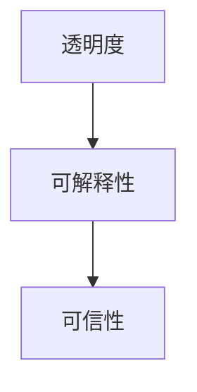

# 可解释人工智能原理与代码实战案例讲解

## 1. 背景介绍

### 1.1 人工智能的发展历程

人工智能(Artificial Intelligence, AI)自1956年达特茅斯会议提出以来，经历了从早期的符号主义、专家系统，到上世纪80年代的知识工程和机器学习，再到近年来的深度学习和强化学习等阶段。AI技术取得了长足的进步，在计算机视觉、自然语言处理、语音识别、机器人等领域实现了广泛应用。

### 1.2 可解释AI的提出背景

尽管AI取得了巨大成功，但目前大多数AI系统仍是"黑箱"模型，其内部决策过程对人类而言是不透明的。这导致了AI系统的不可解释性，使得人们难以理解、信任和依赖AI的判断。为了解决这一问题，可解释人工智能(Explainable Artificial Intelligence, XAI)应运而生。

### 1.3 可解释AI的重要意义 

可解释AI旨在构建能够解释自身决策过程、与人类进行有效交互的AI系统。它不仅能提高AI的可解释性和透明度，增强人们对AI的信任，还能帮助我们发现AI系统存在的问题，促进人机协作，推动AI在医疗、金融、司法等关键领域的应用。因此，可解释AI已成为当前AI研究的重要方向之一。

## 2. 核心概念与联系

### 2.1 可解释性

可解释性是指AI系统能够以人类可理解的方式解释其决策过程和结果的能力。一个可解释的AI系统应该能够回答"做了什么"、"为什么这样做"以及"如何做到的"等问题。可解释性可分为全局可解释性和局部可解释性两个层次。

### 2.2 透明度 

透明度是指AI系统对其内部工作机制的公开程度。一个透明的AI系统应该向用户和相关方披露其使用的算法、模型结构、训练数据等关键信息。透明度是实现可解释性的基础。

### 2.3 可信性

可信性反映了人们对AI系统的信任程度。一个可信的AI系统应该具备稳定性、鲁棒性、公平性等特性，其决策应符合人类价值观和伦理准则。可解释性是建立可信AI系统的重要手段。

### 2.4 概念关系

下图展示了可解释性、透明度和可信性三者之间的关系：



透明度是可解释性的基础，而可解释性又是建立可信AI系统的关键。三者相辅相成，共同推动着可解释AI的发展。

## 3. 核心算法原理具体操作步骤

### 3.1 基于规则的解释方法

基于规则的解释方法利用预定义的规则来解释AI系统的决策过程。主要步骤如下：

1. 定义解释规则：根据领域知识，设计一系列if-then形式的解释规则。
2. 匹配触发规则：将AI系统的输入和输出与解释规则进行匹配，找出被触发的规则。
3. 生成解释：根据触发的规则，生成对应的自然语言解释。

### 3.2 基于特征重要性的解释方法

基于特征重要性的解释方法通过分析各特征对模型输出的贡献来解释AI系统。以SHAP(SHapley Additive exPlanations)为例，其主要步骤如下：

1. 定义解释问题：将解释问题形式化为对特征重要性的求解问题。
2. 计算Shapley值：对每个特征计算其Shapley值，即该特征对模型输出的平均贡献度。
3. 生成解释：根据特征的Shapley值生成自然语言解释，重要性高的特征在解释中占据重要地位。

### 3.3 基于反事实解释的方法

基于反事实的解释方法通过构建反事实样本来解释AI系统的决策。以CEM(Contrastive Explanation Method)为例，其主要步骤如下：

1. 生成反事实：针对待解释的样本，通过优化目标函数生成一个反事实样本。
2. 提取关键特征：比较原始样本和反事实样本，提取导致二者分类结果不同的关键特征。
3. 生成解释：基于提取的关键特征，生成形如"如果特征X改变为Y，分类结果将变为Z"的反事实解释。

## 4. 数学模型和公式详细讲解举例说明

### 4.1 LIME(Local Interpretable Model-agnostic Explanations)

LIME是一种通过局部近似来解释黑盒模型的方法。其核心思想是在待解释样本附近生成一系列扰动样本，基于这些样本训练一个可解释的线性模型来近似黑盒模型在局部的行为。

给定待解释样本$x$，LIME的目标是学习一个解释模型$g$使得：

$$g=\arg\min_{g\in G} \mathcal{L}(f,g,\pi_x)+\Omega(g)$$

其中$f$为黑盒模型，$\pi_x$为以$x$为中心的局部分布，$\Omega(g)$为解释模型的复杂度。通常采用带$L_1$正则化的线性模型作为解释模型：

$$g(z')=w_0+\sum_{i=1}^d w_iz_i'$$

其中$z'\in\{0,1\}^d$为样本$x$的二值化表示。

### 4.2 SHAP(SHapley Additive exPlanations)

SHAP将解释问题建模为博弈论中的合作博弈，通过Shapley值来衡量特征的重要性。对于模型$f$和待解释样本$x$，SHAP解释模型定义为：

$$g(z')=\phi_0+\sum_{i=1}^d \phi_iz_i'$$

其中$\phi_i$为特征$i$的Shapley值，表示该特征对模型输出的平均贡献度。Shapley值的定义为：

$$\phi_i=\sum_{S\subseteq F\setminus\{i\}} \frac{|S|!(|F|-|S|-1)!}{|F|!}(f_{S\cup\{i\}}(x_{S\cup\{i\}})-f_S(x_S))$$

其中$F$为特征集合，$S$为$F$的子集，$f_S(x_S)$表示在特征子集$S$上训练的模型在$x_S$上的预测值。

举例来说，假设我们有一个预测房价的模型，输入特征包括面积、位置、房龄等。对于一个具体的房屋样本，SHAP可以计算出各特征对房价预测值的贡献度。例如，面积的Shapley值为10000，表明面积平均使房价上升了10000元。这样的解释有助于我们理解模型的决策逻辑，知道房价预测主要受哪些因素影响。

## 5. 项目实践：代码实例和详细解释说明

下面我们通过一个基于SHAP的房价预测可解释性分析项目来演示可解释AI的实践。

### 5.1 数据准备

首先导入必要的库并加载数据集：

```python
import shap
import numpy as np
import pandas as pd
from sklearn.ensemble import RandomForestRegressor

# 加载波士顿房价数据集
data = pd.read_csv('housing.csv') 
X, y = data.iloc[:,:-1], data.iloc[:,-1]
```

### 5.2 模型训练

接着，我们使用随机森林模型来训练房价预测模型：

```python
# 训练随机森林模型
model = RandomForestRegressor(n_estimators=100, max_depth=5)  
model.fit(X, y)
```

### 5.3 计算SHAP值

利用SHAP库，我们可以方便地计算特征的Shapley值：

```python
# 计算SHAP值
explainer = shap.TreeExplainer(model)
shap_values = explainer.shap_values(X)
```

### 5.4 可视化解释结果

最后，我们使用SHAP的可视化函数来直观地展示解释结果：

```python
# 可视化特征重要性
shap.summary_plot(shap_values, X)

# 可视化单个样本的解释
shap.force_plot(explainer.expected_value, shap_values[0,:], X.iloc[0,:])  
```

`summary_plot`函数绘制了各特征的重要性排序，`force_plot`函数则展示了单个样本各特征对预测值的正负贡献。

通过上述分析，我们可以清晰地看出影响房价预测的关键特征及其作用方向和大小。这种可解释性分析使得我们对模型的决策过程有了更直观的理解，有助于我们优化模型、识别潜在风险。

## 6. 实际应用场景

可解释AI在许多实际场景中具有广阔的应用前景，包括：

### 6.1 医疗诊断

在医疗诊断中，可解释AI可以帮助医生理解AI系统给出诊断结果的原因，识别关键的症状和体征，从而提高诊断的可信度，减少误诊风险。

### 6.2 金融风控

在金融风控领域，可解释AI可以解释信用评分、欺诈检测等模型的决策过程，帮助金融机构识别风险因素，同时提升模型的透明度，满足监管要求。

### 6.3 自动驾驶

在自动驾驶场景下，可解释AI可以解释车辆的决策和行为，例如为什么要减速、为什么要转向等，增强人们对自动驾驶系统的信任，促进人车交互。

### 6.4 犯罪预测

在犯罪预测中，可解释AI可以分析影响犯罪风险评估的关键因素，帮助法官、警察理解模型预测的依据，从而做出更公正的决策，减少偏见和歧视。

## 7. 工具和资源推荐

以下是一些常用的可解释AI工具和资源：

- SHAP(SHapley Additive exPlanations)：一个统一的可解释性框架，支持多种模型的可解释性分析。
- LIME(Local Interpretable Model-agnostic Explanations)：一种通过局部近似来解释黑盒模型的算法。
- ELI5：一个Python库，支持多种机器学习模型的可解释性分析和可视化。
- Skater：一个统一的框架，用于模型解释、模型评估和模型可视化。
- InterpretML：一个开源的Python软件包，提供了多种可解释性算法和可视化工具。
- AI Explainability 360：IBM开源的一套可解释AI工具箱，包括多种算法和案例。

此外，相关的学术会议如ICML、NeurIPS、AAAI、IJCAI等每年都有大量关于可解释AI的研究论文发表，是了解前沿进展的重要渠道。

## 8. 总结：未来发展趋势与挑战

可解释AI作为一个新兴的研究方向，未来的发展趋势主要体现在以下几个方面：

1. 多模态可解释性：探索视觉、语音、文本等不同模态数据的可解释性分析方法，实现跨模态的解释。

2. 人机协作式解释：开发交互式的可解释性工具，支持人机对话、反馈等交互方式，提升解释的有效性。

3. 因果可解释性：引入因果推理，探索AI系统决策背后的因果机制，实现更深层次的可解释性。

4. 面向特定领域的可解释性：针对医疗、金融等特定领域开发定制化的可解释性方法，满足领域应用需求。

同时，可解释AI的发展也面临着一些挑战：

1. 衡量标准缺失：缺乏统一的可解释性评估标准和指标，难以客观衡量不同解释方法的优劣。

2. 解释的可用性：如何生成有用、易懂、易操作的解释，使非专业用户也能理解和应用AI系统。

3. 解释与性能的权衡：可解释性分析可能带来额外的计算开销，如何在保证性能的同时提高可解释性是一个挑战。

4. 隐私与安全：避免解释泄露敏感信息，防止解释被恶意利用，是可解释AI需要关注的重要问题。

## 9. 附录：常见问题与解答

### 9.1 可解释AI与传统AI有何区别？

传统AI主要关注模型的性能，而可解释AI则更关注模型的透明度和可理解性。可解释AI不仅