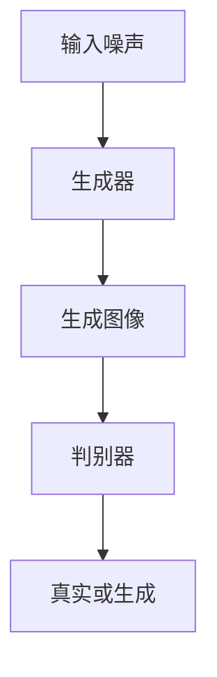
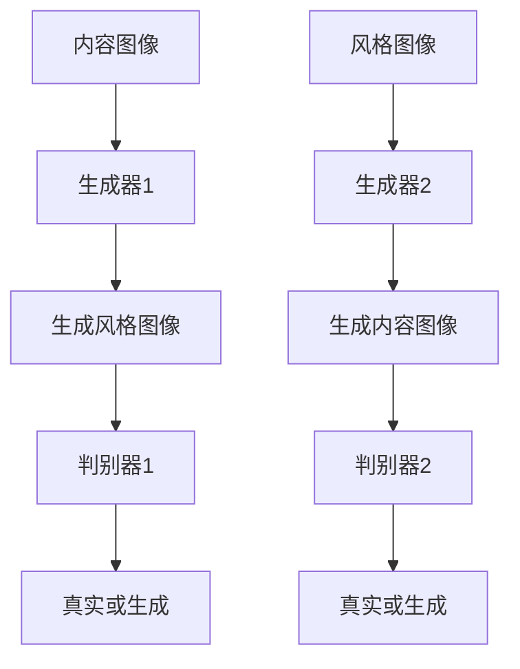

# 基于生成对抗网络的图像风格迁移竞赛平台建设

## 1.背景介绍

图像风格迁移是一种将一种图像的风格应用到另一种图像上的技术。自从2015年Gatys等人提出基于卷积神经网络（CNN）的图像风格迁移方法以来，这一领域迅速发展。生成对抗网络（GAN）作为一种强大的生成模型，已经在图像生成和风格迁移中展示了其卓越的性能。本文将探讨如何构建一个基于GAN的图像风格迁移竞赛平台，以促进这一领域的研究和应用。

## 2.核心概念与联系

### 2.1 生成对抗网络（GAN）

GAN由生成器（Generator）和判别器（Discriminator）组成。生成器试图生成逼真的图像，而判别器则试图区分真实图像和生成图像。两者通过对抗训练，最终生成器能够生成非常逼真的图像。

### 2.2 图像风格迁移

图像风格迁移的目标是将一幅图像的内容与另一幅图像的风格相结合。传统方法依赖于CNN的特征提取，而基于GAN的方法则通过生成对抗的方式实现更高质量的风格迁移。

### 2.3 竞赛平台

竞赛平台是一个在线系统，允许研究人员和开发者提交他们的算法，并在统一的评测标准下进行比较。一个好的竞赛平台不仅需要提供公平的评测环境，还需要提供丰富的工具和资源，帮助参赛者提升他们的算法性能。

## 3.核心算法原理具体操作步骤

### 3.1 GAN的基本结构

GAN的基本结构如下图所示：



### 3.2 图像风格迁移的GAN模型

图像风格迁移的GAN模型通常包括两个生成器和两个判别器，分别用于内容图像和风格图像的生成和判别。其结构如下：



### 3.3 训练步骤

1. 初始化生成器和判别器的参数。
2. 从训练数据中采样内容图像和风格图像。
3. 使用生成器生成风格图像和内容图像。
4. 使用判别器对生成图像和真实图像进行判别。
5. 计算生成器和判别器的损失函数。
6. 更新生成器和判别器的参数。
7. 重复步骤2-6，直到损失函数收敛。

## 4.数学模型和公式详细讲解举例说明

### 4.1 GAN的损失函数

GAN的损失函数由生成器损失和判别器损失组成。生成器损失函数 $L_G$ 和判别器损失函数 $L_D$ 分别定义如下：

$$
L_G = -\mathbb{E}_{z \sim p_z(z)}[\log D(G(z))]
$$

$$
L_D = -\mathbb{E}_{x \sim p_{data}(x)}[\log D(x)] - \mathbb{E}_{z \sim p_z(z)}[\log (1 - D(G(z)))]
$$

其中，$G$ 是生成器，$D$ 是判别器，$z$ 是输入噪声，$x$ 是真实图像。

### 4.2 图像风格迁移的损失函数

图像风格迁移的损失函数通常包括内容损失和风格损失。内容损失 $L_{content}$ 和风格损失 $L_{style}$ 分别定义如下：

$$
L_{content} = \frac{1}{2} \sum_{i,j} (F_{ij}^C - F_{ij}^G)^2
$$

$$
L_{style} = \frac{1}{4N^2M^2} \sum_{i,j} (G_{ij}^S - G_{ij}^G)^2
$$

其中，$F_{ij}^C$ 和 $F_{ij}^G$ 分别是内容图像和生成图像在第 $i$ 层第 $j$ 个特征图上的激活值，$G_{ij}^S$ 和 $G_{ij}^G$ 分别是风格图像和生成图像的Gram矩阵。

## 5.项目实践：代码实例和详细解释说明

### 5.1 环境配置

首先，我们需要配置Python环境，并安装必要的库：

```bash
pip install torch torchvision
```

### 5.2 数据准备

我们使用COCO数据集作为内容图像，使用WikiArt数据集作为风格图像。可以通过以下代码下载数据集：

```python
import torchvision.datasets as dsets
import torchvision.transforms as transforms

transform = transforms.Compose([
    transforms.Resize((256, 256)),
    transforms.ToTensor()
])

content_dataset = dsets.CocoDetection(root='path_to_coco', transform=transform)
style_dataset = dsets.ImageFolder(root='path_to_wikiart', transform=transform)
```

### 5.3 模型定义

我们定义生成器和判别器模型：

```python
import torch.nn as nn

class Generator(nn.Module):
    def __init__(self):
        super(Generator, self).__init__()
        # 定义生成器网络结构

    def forward(self, x):
        # 前向传播
        return x

class Discriminator(nn.Module):
    def __init__(self):
        super(Discriminator, self).__init__()
        # 定义判别器网络结构

    def forward(self, x):
        # 前向传播
        return x
```

### 5.4 训练过程

我们定义训练过程，包括损失函数的计算和参数的更新：

```python
import torch.optim as optim

generator = Generator()
discriminator = Discriminator()

criterion = nn.BCELoss()
optimizer_G = optim.Adam(generator.parameters(), lr=0.0002)
optimizer_D = optim.Adam(discriminator.parameters(), lr=0.0002)

for epoch in range(num_epochs):
    for i, (content, style) in enumerate(zip(content_dataset, style_dataset)):
        # 训练判别器
        optimizer_D.zero_grad()
        real_labels = torch.ones(batch_size, 1)
        fake_labels = torch.zeros(batch_size, 1)
        outputs = discriminator(content)
        d_loss_real = criterion(outputs, real_labels)
        d_loss_real.backward()

        fake_images = generator(style)
        outputs = discriminator(fake_images.detach())
        d_loss_fake = criterion(outputs, fake_labels)
        d_loss_fake.backward()
        optimizer_D.step()

        # 训练生成器
        optimizer_G.zero_grad()
        outputs = discriminator(fake_images)
        g_loss = criterion(outputs, real_labels)
        g_loss.backward()
        optimizer_G.step()

        if (i+1) % 100 == 0:
            print(f'Epoch [{epoch}/{num_epochs}], Step [{i+1}/{len(content_dataset)}], d_loss: {d_loss_real.item()+d_loss_fake.item()}, g_loss: {g_loss.item()}')
```

## 6.实际应用场景

### 6.1 艺术创作

图像风格迁移可以用于艺术创作，将著名画家的风格应用到照片上，生成具有艺术感的图像。

### 6.2 广告设计

广告设计中，图像风格迁移可以帮助设计师快速生成不同风格的广告图像，提高设计效率。

### 6.3 游戏开发

在游戏开发中，图像风格迁移可以用于生成不同风格的游戏场景和角色，提高游戏的视觉效果。

## 7.工具和资源推荐

### 7.1 开源框架

- **PyTorch**：一个流行的深度学习框架，支持动态计算图，适合GAN的实现。
- **TensorFlow**：另一个流行的深度学习框架，提供了丰富的工具和资源。

### 7.2 数据集

- **COCO**：一个大规模的图像数据集，包含丰富的内容图像。
- **WikiArt**：一个艺术作品数据集，包含不同风格的艺术作品。

### 7.3 在线资源

- **Kaggle**：一个数据科学竞赛平台，提供丰富的数据集和竞赛资源。
- **GitHub**：一个代码托管平台，提供大量的开源项目和代码示例。

## 8.总结：未来发展趋势与挑战

图像风格迁移作为一个重要的研究方向，未来有望在更多领域得到应用。然而，当前的技术仍然存在一些挑战，如生成图像的质量和多样性、训练过程的稳定性等。未来的研究将致力于解决这些问题，并探索更多的应用场景。

## 9.附录：常见问题与解答

### 9.1 如何选择合适的生成器和判别器结构？

选择合适的生成器和判别器结构需要根据具体的应用场景和数据集进行实验。一般来说，生成器需要具备较强的生成能力，而判别器需要具备较强的判别能力。

### 9.2 如何解决训练过程中的不稳定性问题？

训练过程中的不稳定性问题可以通过调整学习率、使用不同的优化器、增加正则化等方法来解决。

### 9.3 如何评估图像风格迁移的效果？

图像风格迁移的效果可以通过主观评估和客观评估相结合的方法进行。主观评估可以通过人眼观察生成图像的质量，客观评估可以通过计算生成图像与目标图像的相似度等指标进行。

---

作者：禅与计算机程序设计艺术 / Zen and the Art of Computer Programming