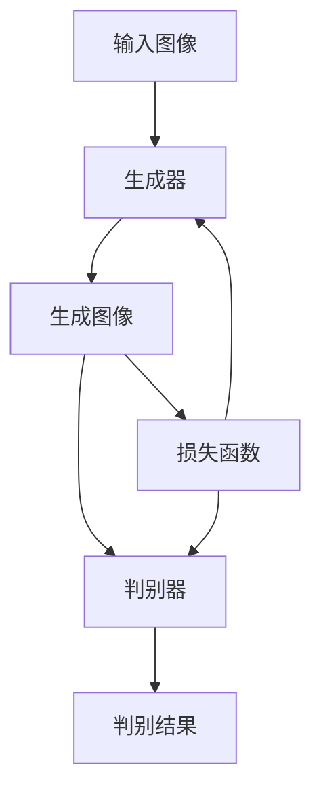

# 基于生成对抗网络的跨域图像风格迁移网络架构设计

## 1.背景介绍

在计算机视觉领域，图像风格迁移是一项重要的研究课题。它的目标是将一种图像的风格应用到另一种图像上，而不改变其内容。生成对抗网络（GANs）作为一种强大的生成模型，已经在图像生成和转换任务中取得了显著的成果。本文将探讨如何基于生成对抗网络设计一个跨域图像风格迁移的网络架构。

## 2.核心概念与联系

### 2.1 生成对抗网络（GANs）

生成对抗网络由两个主要部分组成：生成器（Generator）和判别器（Discriminator）。生成器的目标是生成逼真的图像，而判别器的目标是区分真实图像和生成图像。两者通过对抗训练，逐步提升生成图像的质量。

### 2.2 图像风格迁移

图像风格迁移的核心在于将一种图像的风格特征应用到另一种图像上。常见的方法包括基于卷积神经网络（CNN）的方法和基于生成对抗网络的方法。

### 2.3 跨域迁移

跨域迁移指的是在不同领域之间进行迁移学习。例如，将艺术风格应用到现实世界的图像上，或者将白天的图像转换为夜晚的图像。

## 3.核心算法原理具体操作步骤

### 3.1 网络架构设计

一个典型的跨域图像风格迁移网络架构包括以下几个部分：

- 生成器：负责生成目标风格的图像。
- 判别器：负责区分生成图像和真实图像。
- 损失函数：用于指导生成器和判别器的训练。

### 3.2 生成器设计

生成器通常采用编码器-解码器结构。编码器将输入图像编码为特征向量，解码器将特征向量解码为目标风格的图像。

### 3.3 判别器设计

判别器通常采用卷积神经网络结构，用于区分生成图像和真实图像。判别器的输出是一个二分类结果，表示图像是真实的还是生成的。

### 3.4 损失函数设计

损失函数是生成对抗网络训练的关键。常见的损失函数包括对抗损失、内容损失和风格损失。



## 4.数学模型和公式详细讲解举例说明

### 4.1 对抗损失

对抗损失用于指导生成器和判别器的对抗训练。生成器的目标是最小化对抗损失，而判别器的目标是最大化对抗损失。

$$
L_{GAN}(G, D) = \mathbb{E}_{x \sim p_{data}(x)}[\log D(x)] + \mathbb{E}_{z \sim p_z(z)}[\log(1 - D(G(z)))]
$$

### 4.2 内容损失

内容损失用于保持生成图像的内容与输入图像一致。常见的内容损失是基于特征提取器的欧氏距离。

$$
L_{content}(G) = \mathbb{E}_{x \sim p_{data}(x), y \sim p_{data}(y)}[\| \phi(G(x)) - \phi(y) \|_2^2]
$$

### 4.3 风格损失

风格损失用于保持生成图像的风格与目标风格一致。常见的风格损失是基于Gram矩阵的欧氏距离。

$$
L_{style}(G) = \mathbb{E}_{x \sim p_{data}(x), y \sim p_{data}(y)}[\| G_{\phi}(G(x)) - G_{\phi}(y) \|_2^2]
$$

## 5.项目实践：代码实例和详细解释说明

### 5.1 环境配置

首先，确保你已经安装了必要的库，如TensorFlow或PyTorch。

```python
import torch
import torch.nn as nn
import torch.optim as optim
from torchvision import datasets, transforms
```

### 5.2 生成器和判别器的实现

```python
class Generator(nn.Module):
    def __init__(self):
        super(Generator, self).__init__()
        # 定义生成器的网络结构
        self.encoder = nn.Sequential(
            nn.Conv2d(3, 64, kernel_size=4, stride=2, padding=1),
            nn.ReLU()
            # 其他层
        )
        self.decoder = nn.Sequential(
            nn.ConvTranspose2d(64, 3, kernel_size=4, stride=2, padding=1),
            nn.Tanh()
            # 其他层
        )

    def forward(self, x):
        x = self.encoder(x)
        x = self.decoder(x)
        return x

class Discriminator(nn.Module):
    def __init__(self):
        super(Discriminator, self).__init__()
        # 定义判别器的网络结构
        self.model = nn.Sequential(
            nn.Conv2d(3, 64, kernel_size=4, stride=2, padding=1),
            nn.LeakyReLU(0.2)
            # 其他层
        )

    def forward(self, x):
        return self.model(x)
```

### 5.3 损失函数的实现

```python
def adversarial_loss(output, target):
    return nn.BCELoss()(output, target)

def content_loss(output, target):
    return nn.MSELoss()(output, target)

def style_loss(output, target):
    return nn.MSELoss()(output, target)
```

### 5.4 训练过程

```python
def train(generator, discriminator, dataloader, num_epochs, device):
    optimizer_G = optim.Adam(generator.parameters(), lr=0.0002, betas=(0.5, 0.999))
    optimizer_D = optim.Adam(discriminator.parameters(), lr=0.0002, betas=(0.5, 0.999))

    for epoch in range(num_epochs):
        for i, (imgs, _) in enumerate(dataloader):
            real_imgs = imgs.to(device)
            valid = torch.ones((imgs.size(0), 1), requires_grad=False).to(device)
            fake = torch.zeros((imgs.size(0), 1), requires_grad=False).to(device)

            # 训练生成器
            optimizer_G.zero_grad()
            gen_imgs = generator(real_imgs)
            g_loss = adversarial_loss(discriminator(gen_imgs), valid) + content_loss(gen_imgs, real_imgs)
            g_loss.backward()
            optimizer_G.step()

            # 训练判别器
            optimizer_D.zero_grad()
            real_loss = adversarial_loss(discriminator(real_imgs), valid)
            fake_loss = adversarial_loss(discriminator(gen_imgs.detach()), fake)
            d_loss = (real_loss + fake_loss) / 2
            d_loss.backward()
            optimizer_D.step()

            print(f"[Epoch {epoch}/{num_epochs}] [Batch {i}/{len(dataloader)}] [D loss: {d_loss.item()}] [G loss: {g_loss.item()}]")
```

## 6.实际应用场景

### 6.1 艺术风格迁移

将著名艺术家的风格应用到现实世界的图像上，生成具有艺术风格的图像。

### 6.2 图像增强

将低质量的图像转换为高质量的图像，例如将黑白图像转换为彩色图像。

### 6.3 医学图像处理

在医学图像处理中，跨域图像风格迁移可以用于不同模态的图像转换，例如将CT图像转换为MRI图像。

## 7.工具和资源推荐

### 7.1 开源框架

- TensorFlow
- PyTorch

### 7.2 数据集

- COCO
- ImageNet

### 7.3 参考文献

- Goodfellow, I., et al. "Generative Adversarial Nets." Advances in Neural Information Processing Systems. 2014.
- Johnson, J., et al. "Perceptual Losses for Real-Time Style Transfer and Super-Resolution." European Conference on Computer Vision. 2016.

## 8.总结：未来发展趋势与挑战

### 8.1 未来发展趋势

随着生成对抗网络的不断发展，跨域图像风格迁移的效果将会越来越好。未来的研究可能会集中在以下几个方面：

- 更高效的网络架构设计
- 更稳定的训练方法
- 更广泛的应用场景

### 8.2 挑战

尽管生成对抗网络在图像风格迁移中取得了显著的成果，但仍然存在一些挑战：

- 训练不稳定
- 模型泛化能力不足
- 计算资源需求高

## 9.附录：常见问题与解答

### 9.1 生成对抗网络的训练为什么不稳定？

生成对抗网络的训练不稳定主要是因为生成器和判别器的对抗训练过程。可以通过调整学习率、使用不同的优化器和损失函数来改善训练稳定性。

### 9.2 如何选择合适的损失函数？

选择合适的损失函数需要根据具体的应用场景来决定。一般来说，对抗损失用于生成器和判别器的对抗训练，内容损失用于保持图像内容一致，风格损失用于保持图像风格一致。

### 9.3 如何提高模型的泛化能力？

提高模型的泛化能力可以通过数据增强、正则化和使用更复杂的网络架构来实现。

---

作者：禅与计算机程序设计艺术 / Zen and the Art of Computer Programming