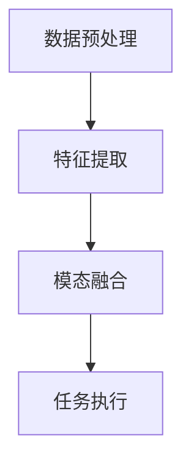

# 多模态大模型：技术原理与实战 方法论介绍

## 1.背景介绍

在人工智能领域，多模态大模型（Multimodal Large Models, MLMs）正逐渐成为研究和应用的热点。多模态大模型是指能够处理和理解多种类型数据（如文本、图像、音频等）的模型。这些模型通过融合不同模态的数据，能够实现更为复杂和智能的任务，如图像描述生成、视频理解、跨模态检索等。

### 1.1 多模态大模型的起源

多模态大模型的概念源于人类的多感官信息处理能力。人类在日常生活中会同时使用视觉、听觉、触觉等多种感官来理解和互动世界。类似地，多模态大模型通过融合不同类型的数据，能够更全面地理解和处理信息。

### 1.2 发展历程

多模态大模型的发展经历了几个重要阶段：
- **早期阶段**：主要是单模态模型的研究，如图像分类、文本生成等。
- **融合阶段**：开始尝试将不同模态的数据进行简单融合，如图像描述生成。
- **深度融合阶段**：利用深度学习技术，实现了更为复杂的多模态数据融合和理解。

### 1.3 重要性和应用前景

多模态大模型在多个领域具有广泛的应用前景，如自动驾驶、智能医疗、智能家居等。通过融合多种模态的数据，这些模型能够提供更为智能和全面的解决方案。

## 2.核心概念与联系

在深入探讨多模态大模型的技术原理之前，我们需要了解一些核心概念和它们之间的联系。

### 2.1 模态

模态是指数据的类型或形式，如文本、图像、音频等。每种模态的数据都有其独特的特征和处理方法。

### 2.2 多模态融合

多模态融合是指将不同模态的数据进行结合，以实现更为复杂的任务。多模态融合的方法主要包括早期融合、晚期融合和中期融合。

### 2.3 表示学习

表示学习是指通过模型学习数据的特征表示。在多模态大模型中，表示学习是实现多模态融合的关键技术。

### 2.4 生成模型与判别模型

生成模型是指能够生成数据的模型，如生成对抗网络（GANs）。判别模型是指能够对数据进行分类或判断的模型，如卷积神经网络（CNNs）。在多模态大模型中，生成模型和判别模型常常结合使用。

## 3.核心算法原理具体操作步骤

多模态大模型的核心算法主要包括数据预处理、特征提取、模态融合和任务执行等步骤。下面我们详细介绍每个步骤的具体操作。

### 3.1 数据预处理

数据预处理是多模态大模型的第一步。不同模态的数据需要进行不同的预处理操作，如图像的归一化、文本的分词等。

### 3.2 特征提取

特征提取是指从数据中提取有用的特征表示。对于图像数据，可以使用卷积神经网络（CNNs）进行特征提取；对于文本数据，可以使用词嵌入（Word Embedding）技术。

### 3.3 模态融合

模态融合是多模态大模型的核心步骤。常见的模态融合方法包括：
- **早期融合**：在特征提取之前进行数据融合。
- **中期融合**：在特征提取之后、任务执行之前进行特征融合。
- **晚期融合**：在任务执行之后进行结果融合。

### 3.4 任务执行

任务执行是多模态大模型的最终步骤。根据具体任务的不同，可以使用不同的模型和算法，如分类、生成、检索等。

以下是一个简单的多模态大模型流程图：



## 4.数学模型和公式详细讲解举例说明

在多模态大模型中，数学模型和公式是理解其工作原理的关键。下面我们通过一些具体的例子来详细讲解。

### 4.1 特征提取的数学模型

对于图像数据，常用的特征提取模型是卷积神经网络（CNNs）。其基本操作是卷积运算，数学公式如下：

$$
y_{i,j} = \sum_{m=0}^{M-1} \sum_{n=0}^{N-1} x_{i+m,j+n} \cdot w_{m,n}
$$

其中，$x$ 是输入图像，$w$ 是卷积核，$y$ 是输出特征图。

### 4.2 模态融合的数学模型

模态融合的数学模型可以通过多层感知机（MLP）实现。假设有两个模态的特征表示 $h_1$ 和 $h_2$，其融合表示 $h_f$ 可以表示为：

$$
h_f = \sigma(W_1 h_1 + W_2 h_2 + b)
$$

其中，$W_1$ 和 $W_2$ 是权重矩阵，$b$ 是偏置，$\sigma$ 是激活函数。

### 4.3 任务执行的数学模型

以分类任务为例，常用的模型是软最大回归（Softmax Regression）。其数学公式如下：

$$
P(y=j|x) = \frac{e^{W_j \cdot x + b_j}}{\sum_{k=1}^{K} e^{W_k \cdot x + b_k}}
$$

其中，$W_j$ 和 $b_j$ 是分类器的参数，$x$ 是输入特征，$P(y=j|x)$ 是输入属于类别 $j$ 的概率。

## 5.项目实践：代码实例和详细解释说明

为了更好地理解多模态大模型的实际应用，我们通过一个具体的项目实例来进行详细解释。假设我们要实现一个图像描述生成模型，该模型能够根据输入的图像生成相应的文本描述。

### 5.1 数据预处理

首先，我们需要对图像和文本数据进行预处理。以下是一个简单的代码示例：

```python
import tensorflow as tf
from tensorflow.keras.preprocessing.image import ImageDataGenerator
from tensorflow.keras.preprocessing.text import Tokenizer

# 图像数据预处理
image_gen = ImageDataGenerator(rescale=1./255)
image_data = image_gen.flow_from_directory('path/to/images', target_size=(224, 224))

# 文本数据预处理
tokenizer = Tokenizer(num_words=5000)
tokenizer.fit_on_texts(text_data)
text_sequences = tokenizer.texts_to_sequences(text_data)
```

### 5.2 特征提取

接下来，我们使用预训练的卷积神经网络（如VGG16）进行图像特征提取：

```python
from tensorflow.keras.applications import VGG16

# 加载预训练的VGG16模型
vgg16 = VGG16(weights='imagenet', include_top=False, input_shape=(224, 224, 3))

# 提取图像特征
image_features = vgg16.predict(image_data)
```

### 5.3 模态融合

我们使用多层感知机（MLP）进行图像和文本特征的融合：

```python
from tensorflow.keras.layers import Dense, Concatenate
from tensorflow.keras.models import Model

# 定义文本特征提取模型
text_input = tf.keras.Input(shape=(max_sequence_length,))
text_features = Dense(256, activation='relu')(text_input)

# 定义图像特征提取模型
image_input = tf.keras.Input(shape=(7, 7, 512))
image_features = Dense(256, activation='relu')(image_input)

# 模态融合
merged_features = Concatenate()([text_features, image_features])
output = Dense(num_classes, activation='softmax')(merged_features)

# 定义最终模型
model = Model(inputs=[text_input, image_input], outputs=output)
model.compile(optimizer='adam', loss='categorical_crossentropy', metrics=['accuracy'])
```

### 5.4 任务执行

最后，我们训练模型并进行图像描述生成任务：

```python
# 训练模型
model.fit([text_sequences, image_features], labels, epochs=10, batch_size=32)

# 生成图像描述
predictions = model.predict([new_text_sequence, new_image_feature])
```

## 6.实际应用场景

多模态大模型在多个实际应用场景中具有广泛的应用。以下是一些典型的应用场景：

### 6.1 自动驾驶

在自动驾驶中，多模态大模型可以融合摄像头、激光雷达、雷达等多种传感器的数据，实现更为精准的环境感知和决策。

### 6.2 智能医疗

在智能医疗中，多模态大模型可以融合医学影像、电子病历、基因数据等多种模态的数据，提供更为全面的诊断和治疗方案。

### 6.3 智能家居

在智能家居中，多模态大模型可以融合语音、图像、传感器等多种数据，实现更为智能的家居控制和用户交互。

### 6.4 跨模态检索

在跨模态检索中，多模态大模型可以实现图像到文本、文本到图像等多种跨模态检索任务，提供更为便捷的信息检索服务。

## 7.工具和资源推荐

为了更好地进行多模态大模型的研究和应用，我们推荐以下一些工具和资源：

### 7.1 深度学习框架

- **TensorFlow**：谷歌开发的开源深度学习框架，支持多模态数据处理和模型训练。
- **PyTorch**：Facebook开发的开源深度学习框架，具有灵活的动态计算图和强大的社区支持。

### 7.2 数据集

- **COCO**：一个大规模的图像数据集，包含丰富的图像和文本描述。
- **Flickr30k**：一个包含3万张图像和相应文本描述的数据集，常用于图像描述生成任务。

### 7.3 预训练模型

- **VGG16**：一个常用的图像特征提取模型，预训练于ImageNet数据集。
- **BERT**：一个强大的文本特征提取模型，预训练于大规模文本数据。

## 8.总结：未来发展趋势与挑战

多模态大模型在人工智能领域具有广阔的发展前景，但也面临一些挑战。

### 8.1 未来发展趋势

- **更高效的模态融合方法**：未来的研究将致力于开发更高效的模态融合方法，以提高多模态大模型的性能。
- **更大规模的数据集**：随着数据量的增加，多模态大模型将能够处理更为复杂和多样化的任务。
- **更智能的应用场景**：多模态大模型将在更多智能应用场景中发挥重要作用，如智能城市、智能制造等。

### 8.2 面临的挑战

- **数据标注成本高**：多模态数据的标注成本较高，限制了大规模数据集的获取。
- **计算资源需求大**：多模态大模型的训练和推理需要大量的计算资源，限制了其在实际应用中的推广。
- **模型解释性差**：多模态大模型的复杂性使得其解释性较差，难以理解其内部工作原理。

## 9.附录：常见问题与解答

### 9.1 多模态大模型的优势是什么？

多模态大模型能够融合不同模态的数据，提供更为全面和智能的解决方案。例如，在自动驾驶中，多模态大模型可以融合摄像头、激光雷达等多种传感器的数据，实现更为精准的环境感知和决策。

### 9.2 如何选择合适的多模态融合方法？

选择合适的多模态融合方法需要根据具体任务的需求和数据特点。早期融合适用于数据之间具有较强相关性的情况；中期融合适用于数据之间具有一定相关性但需要独立处理的情况；晚期融合适用于数据之间相关性较弱的情况。

### 9.3 多模态大模型的训练需要哪些资源？

多模态大模型的训练需要大量的计算资源和存储资源。通常需要使用高性能的GPU或TPU进行训练，并且需要大规模的存储空间来存储数据和模型。

### 9.4 如何提高多模态大模型的性能？

提高多模态大模型的性能可以从以下几个方面入手：
- **优化模型结构**：设计更为高效的模型结构，提高模型的计算效率。
- **增加数据量**：使用更多的训练数据，提高模型的泛化能力。
- **使用预训练模型**：利用预训练模型进行特征提取，减少训练时间和计算资源需求。

### 9.5 多模态大模型的未来发展方向是什么？

多模态大模型的未来发展方向包括更高效的模态融合方法、更大规模的数据集和更智能的应用场景。随着技术的不断进步，多模态大模型将在更多领域发挥重要作用。

---

作者：禅与计算机程序设计艺术 / Zen and the Art of Computer Programming