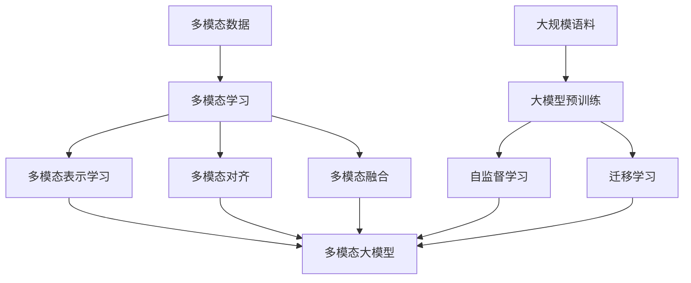

# 多模态大模型：技术原理与实战 自然语言处理的发展历程

## 1.背景介绍
### 1.1 自然语言处理的发展历程
#### 1.1.1 早期的自然语言处理
#### 1.1.2 基于统计学习的自然语言处理
#### 1.1.3 深度学习时代的自然语言处理
### 1.2 多模态学习的兴起
#### 1.2.1 多模态数据的特点
#### 1.2.2 多模态学习的优势
#### 1.2.3 多模态学习的挑战
### 1.3 大模型的崛起
#### 1.3.1 大模型的定义和特点  
#### 1.3.2 大模型的发展历程
#### 1.3.3 大模型在自然语言处理中的应用

## 2.核心概念与联系
### 2.1 多模态学习
#### 2.1.1 多模态数据融合
#### 2.1.2 多模态表示学习
#### 2.1.3 多模态对齐
### 2.2 大模型
#### 2.2.1 预训练模型
#### 2.2.2 自监督学习
#### 2.2.3 迁移学习
### 2.3 多模态大模型
#### 2.3.1 多模态预训练
#### 2.3.2 多模态迁移学习
#### 2.3.3 多模态推理



## 3.核心算法原理具体操作步骤
### 3.1 多模态数据预处理
#### 3.1.1 文本数据预处理
#### 3.1.2 图像数据预处理
#### 3.1.3 语音数据预处理
### 3.2 多模态表示学习算法
#### 3.2.1 多模态自编码器
#### 3.2.2 多模态对抗生成网络
#### 3.2.3 多模态注意力机制
### 3.3 多模态对齐算法
#### 3.3.1 多模态对齐损失函数
#### 3.3.2 多模态互信息最大化
#### 3.3.3 多模态对比学习
### 3.4 多模态融合算法
#### 3.4.1 多模态特征拼接
#### 3.4.2 多模态交互融合
#### 3.4.3 多模态高层语义融合

## 4.数学模型和公式详细讲解举例说明
### 4.1 多模态自编码器的数学模型
多模态自编码器的目标是学习一个联合表示，将不同模态的数据映射到一个共同的低维空间。假设有两个模态的数据$x_1$和$x_2$，多模态自编码器的数学模型可以表示为：

$$
\begin{aligned}
z &= f_{\theta}(x_1, x_2) \\
\hat{x}_1 &= g_{\phi_1}(z) \\ 
\hat{x}_2 &= g_{\phi_2}(z)
\end{aligned}
$$

其中，$f_{\theta}$是编码器，将两个模态的数据映射到共同的表示$z$，$g_{\phi_1}$和$g_{\phi_2}$是两个解码器，分别将$z$重构回原始的模态数据。

损失函数可以定义为重构误差和正则化项的加权和：

$$
L = \lambda_1 \|x_1 - \hat{x}_1\|^2 + \lambda_2 \|x_2 - \hat{x}_2\|^2 + \Omega(\theta, \phi_1, \phi_2)
$$

其中，$\lambda_1$和$\lambda_2$是平衡两个模态重构误差的权重，$\Omega$是正则化项，用于防止过拟合并鼓励学习到有意义的表示。

### 4.2 多模态对抗生成网络的数学模型
多模态对抗生成网络的目标是学习生成逼真的多模态数据。假设有两个模态的数据$x_1$和$x_2$，以及对应的条件信息$c$，多模态对抗生成网络的数学模型可以表示为：

$$
\begin{aligned}
z &\sim p(z) \\
\hat{x}_1, \hat{x}_2 &= G(z, c) \\
p_1, p_2 &= D(x_1, x_2, c) \\
\hat{p}_1, \hat{p}_2 &= D(\hat{x}_1, \hat{x}_2, c)
\end{aligned}
$$

其中，$G$是生成器，以随机噪声$z$和条件信息$c$为输入，生成两个模态的数据$\hat{x}_1$和$\hat{x}_2$。$D$是判别器，以两个模态的数据和条件信息为输入，输出它们是真实数据的概率$p_1$和$p_2$。

生成器和判别器的目标函数可以定义为：

$$
\begin{aligned}
\min_G \max_D \quad &\mathbb{E}_{x_1, x_2, c \sim p_{\text{data}}} [\log D(x_1, x_2, c)] \\
+ &\mathbb{E}_{z \sim p(z), c \sim p_{\text{data}}} [\log (1 - D(G(z, c)))]
\end{aligned}
$$

生成器的目标是最小化判别器将生成数据判断为假的概率，而判别器的目标是最大化将真实数据判断为真、将生成数据判断为假的概率。

### 4.3 多模态注意力机制的数学模型
多模态注意力机制的目标是学习不同模态之间的交互和对齐。假设有两个模态的数据$x_1$和$x_2$，多模态注意力机制的数学模型可以表示为：

$$
\begin{aligned}
Q &= W_Q x_1 \\
K &= W_K x_2 \\
V &= W_V x_2 \\
\text{Attention}(Q, K, V) &= \text{softmax}(\frac{QK^T}{\sqrt{d_k}})V
\end{aligned}
$$

其中，$Q$、$K$、$V$分别表示查询、键、值，通过线性变换将两个模态的数据映射到同一空间。$\text{Attention}$函数计算查询和键的相似度，并使用softmax归一化得到注意力权重，然后将注意力权重应用于值，得到对齐后的表示。

多模态注意力机制可以扩展到多个头，每个头学习不同的对齐方式：

$$
\begin{aligned}
\text{MultiHead}(Q, K, V) &= \text{Concat}(\text{head}_1, ..., \text{head}_h)W^O \\
\text{head}_i &= \text{Attention}(QW_i^Q, KW_i^K, VW_i^V)
\end{aligned}
$$

其中，$W_i^Q$、$W_i^K$、$W_i^V$是第$i$个头的线性变换矩阵，$W^O$是输出的线性变换矩阵。

## 5.项目实践：代码实例和详细解释说明
下面是一个使用PyTorch实现多模态自编码器的示例代码：

```python
import torch
import torch.nn as nn

class MultimodalAutoencoder(nn.Module):
    def __init__(self, input_dim1, input_dim2, hidden_dim):
        super(MultimodalAutoencoder, self).__init__()
        self.encoder1 = nn.Sequential(
            nn.Linear(input_dim1, hidden_dim),
            nn.ReLU()
        )
        self.encoder2 = nn.Sequential(
            nn.Linear(input_dim2, hidden_dim),
            nn.ReLU()
        )
        self.decoder1 = nn.Sequential(
            nn.Linear(hidden_dim, input_dim1),
            nn.Sigmoid()
        )
        self.decoder2 = nn.Sequential(
            nn.Linear(hidden_dim, input_dim2),
            nn.Sigmoid()
        )

    def forward(self, x1, x2):
        z1 = self.encoder1(x1)
        z2 = self.encoder2(x2)
        z = torch.cat((z1, z2), dim=1)
        x1_recon = self.decoder1(z)
        x2_recon = self.decoder2(z)
        return x1_recon, x2_recon

# 定义模型
model = MultimodalAutoencoder(input_dim1=1024, input_dim2=2048, hidden_dim=512)

# 定义损失函数和优化器
criterion = nn.MSELoss()
optimizer = torch.optim.Adam(model.parameters(), lr=0.001)

# 训练模型
for epoch in range(num_epochs):
    for x1_batch, x2_batch in dataloader:
        optimizer.zero_grad()
        x1_recon, x2_recon = model(x1_batch, x2_batch)
        loss = criterion(x1_recon, x1_batch) + criterion(x2_recon, x2_batch)
        loss.backward()
        optimizer.step()
```

这个示例代码实现了一个简单的多模态自编码器，包含两个编码器和两个解码器，分别对应两个模态的数据。编码器将每个模态的数据映射到一个共同的隐空间，然后解码器从隐空间重构出原始数据。

模型的前向传播过程如下：
1. 输入两个模态的数据`x1`和`x2`。
2. 使用编码器`encoder1`和`encoder2`分别将`x1`和`x2`映射到隐空间，得到`z1`和`z2`。
3. 将`z1`和`z2`拼接得到共同的表示`z`。
4. 使用解码器`decoder1`和`decoder2`分别从`z`重构出`x1_recon`和`x2_recon`。
5. 返回重构后的数据`x1_recon`和`x2_recon`。

在训练过程中，使用均方误差损失函数`MSELoss`计算重构误差，并使用Adam优化器优化模型参数。每个批次的数据通过数据加载器`dataloader`获取，对每个批次的数据进行前向传播、计算损失、反向传播和参数更新。

这只是一个简单的示例，实际应用中可以根据具体任务和数据特点设计更复杂的模型结构和损失函数。

## 6.实际应用场景
多模态大模型在许多实际应用场景中发挥着重要作用，下面列举几个典型的应用：

### 6.1 图像描述生成
图像描述生成是指根据给定的图像自动生成自然语言描述。多模态大模型可以学习图像和文本之间的对齐关系，通过编码图像特征和解码文本序列，生成准确、流畅的图像描述。这在图像搜索、无障碍辅助等领域有广泛应用。

### 6.2 视频问答
视频问答是指根据给定的视频和问题，自动生成问题的答案。多模态大模型可以同时编码视频的视觉信息和语音信息，并与问题文本进行对齐，通过跨模态推理生成准确的答案。这在视频内容分析、智能教育等领域有重要应用。

### 6.3 语音合成
语音合成是指根据给定的文本自动生成自然、流畅的语音。多模态大模型可以学习文本和语音之间的对齐关系，通过编码文本特征和解码语音信号，生成高质量的合成语音。这在智能助手、有声读物等领域有广泛应用。

### 6.4 多模态情感分析
多模态情感分析是指根据文本、图像、语音等多模态数据判断情感倾向。多模态大模型可以学习不同模态之间的情感对齐，通过融合多模态特征进行情感分类或情感强度预测。这在舆情监测、客户服务等领域有重要应用。

### 6.5 多模态推荐系统
多模态推荐系统是指利用多种模态的数据为用户提供个性化推荐。多模态大模型可以学习用户行为、物品属性等多模态信息之间的关联，通过跨模态推理生成准确、多样的推荐结果。这在电商平台、内容平台等领域有广泛应用。

## 7.工具和资源推荐
以下是一些常用的多模态大模型相关的工具和资源：

### 7.1 开源工具包
- Multimodal Transformer: 一个基于Transformer的多模态学习工具包，支持图像、文本、音频等多种模态。
- MMF: Facebook开源的多模态框架，提供了多种多模态任务的模型和数据集。
- LXMERT: 一个基于Transformer的跨模态预训练模型，用于视觉和语言任务。

### 7.2 数据集
- MS COCO: 一个大规模