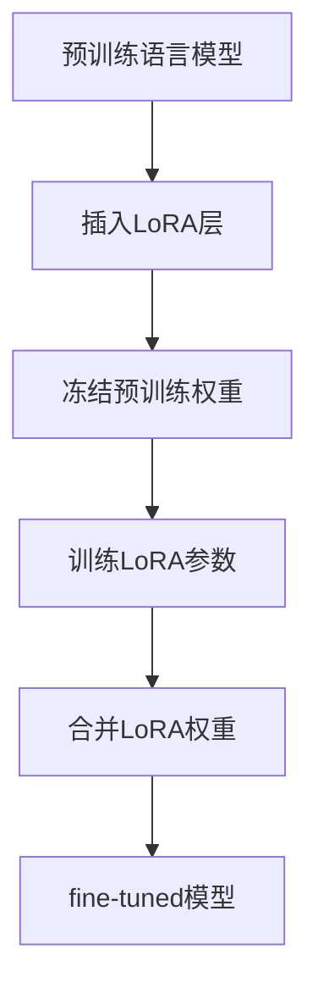

# 大规模语言模型从理论到实践 LoRA

## 1. 背景介绍
### 1.1 大规模语言模型的发展历程
#### 1.1.1 早期语言模型
#### 1.1.2 Transformer时代的语言模型 
#### 1.1.3 大规模预训练语言模型的兴起
### 1.2 LoRA技术的提出
#### 1.2.1 fine-tuning的局限性
#### 1.2.2 LoRA的优势
#### 1.2.3 LoRA的应用前景

## 2. 核心概念与联系
### 2.1 大规模语言模型
#### 2.1.1 定义与特点  
#### 2.1.2 主流模型架构
#### 2.1.3 预训练与fine-tuning
### 2.2 LoRA技术
#### 2.2.1 Low-Rank Adaptation的含义
#### 2.2.2 LoRA的核心思想
#### 2.2.3 LoRA与fine-tuning的区别
### 2.3 LoRA在大模型中的应用
#### 2.3.1 减少参数量 
#### 2.3.2 加速训练与推理
#### 2.3.3 降低资源消耗

## 3. 核心算法原理具体操作步骤
### 3.1 LoRA的数学原理
#### 3.1.1 低秩分解
#### 3.1.2 参数高效更新
#### 3.1.3 前向传播与反向传播
### 3.2 LoRA算法流程
#### 3.2.1 模型层面修改
#### 3.2.2 训练过程
#### 3.2.3 推理阶段
### 3.3 LoRA的实现细节
#### 3.3.1 秩r的选择
#### 3.3.2 LoRA层的插入位置
#### 3.3.3 LoRA的初始化策略



## 4. 数学模型和公式详细讲解举例说明
### 4.1 传统fine-tuning的数学表示
#### 4.1.1 预训练阶段目标函数
#### 4.1.2 fine-tuning阶段目标函数
#### 4.1.3 完整的参数更新公式
### 4.2 LoRA的数学表示 
#### 4.2.1 LoRA层的定义
$$W_{lora} = W + \Delta W = W + AB^T$$
其中$W$是原始权重矩阵，$A$和$B$是低秩矩阵，$r$是秩的大小。
#### 4.2.2 只更新LoRA参数
$$\Delta W = AB^T$$
冻结$W$，只更新$A$和$B$，参数量为$2 \times d \times r$。
#### 4.2.3 前向传播与反向传播公式
前向：$h_{out} = h_{in} \cdot W_{lora}$
反向：$\frac{\partial L}{\partial A},\frac{\partial L}{\partial B^T}$
### 4.3 LoRA相比fine-tuning的优势
#### 4.3.1 参数量大幅减少
fine-tuning参数量：$d^2$
LoRA参数量：$2 \times d \times r$
$r \ll d$，因此$2 \times d \times r \ll d^2$
#### 4.3.2 加速训练与推理
由于参数量减少，训练与推理耗时大幅降低。
#### 4.3.3 更灵活与高效
可以在多个任务间共享预训练权重，只保存LoRA参数。

## 5. 项目实践：代码实例和详细解释说明
### 5.1 基于PyTorch的LoRA实现
#### 5.1.1 定义LoRA层

```python
class LoRALayer(nn.Module):
    def __init__(self, r, lora_alpha, lora_dropout=0.1):
        super().__init__()
        self.r = r
        self.lora_alpha = lora_alpha
        self.lora_dropout = nn.Dropout(p=lora_dropout)
        self.A = nn.Parameter(torch.zeros(r, d))  
        self.B = nn.Parameter(torch.zeros(d, r))
        self.scaling = self.lora_alpha / self.r

    def forward(self, x):
        result = torch.mm(x, self.lora_dropout(self.A)) * self.scaling
        result = torch.mm(result, self.lora_dropout(self.B))
        return x + result
```
#### 5.1.2 在Transformer块中插入LoRA层

```python
class LoRATransformerBlock(nn.Module):
    def __init__(self, hidden_size, num_attention_heads, 
                 intermediate_size, r, lora_alpha, lora_dropout):
        super().__init__()
        self.attention = BertAttention(hidden_size, num_attention_heads)
        self.lora_attn_Wq = LoRALayer(r, lora_alpha, lora_dropout) 
        self.lora_attn_Wk = LoRALayer(r, lora_alpha, lora_dropout)
        self.lora_attn_Wv = LoRALayer(r, lora_alpha, lora_dropout)
        self.lora_attn_Wo = LoRALayer(r, lora_alpha, lora_dropout)
        self.intermediate = BertIntermediate(hidden_size, intermediate_size)
        self.lora_intermediate_W = LoRALayer(r, lora_alpha, lora_dropout)
        self.output = BertOutput(intermediate_size, hidden_size)
        self.lora_output_W = LoRALayer(r, lora_alpha, lora_dropout)

    def forward(self, hidden_states):
        attn_output = self.attention(
            hidden_states,
            Wq=self.lora_attn_Wq(self.attention.Wq),
            Wk=self.lora_attn_Wk(self.attention.Wk),
            Wv=self.lora_attn_Wv(self.attention.Wv),
            Wo=self.lora_attn_Wo(self.attention.Wo)
        )
        intermediate_output = self.intermediate(attn_output, 
                                               W=self.lora_intermediate_W(self.intermediate.W))
        layer_output = self.output(intermediate_output, attn_output,
                                   W=self.lora_output_W(self.output.W))
        return layer_output
```
#### 5.1.3 冻结预训练权重，只更新LoRA参数

```python
model = LoRATransformerModel(...)
for name, param in model.named_parameters():
    if "lora" not in name:
        param.requires_grad = False
```
### 5.2 基于Hugging Face的LoRA实现
#### 5.2.1 加载预训练模型

```python
from transformers import AutoModelForCausalLM, AutoTokenizer

model = AutoModelForCausalLM.from_pretrained("EleutherAI/gpt-neo-1.3B")
tokenizer = AutoTokenizer.from_pretrained("EleutherAI/gpt-neo-1.3B")
```
#### 5.2.2 使用PEFT库插入LoRA层

```python
from peft import LoraConfig, get_peft_model 

config = LoraConfig(
    r=16,
    lora_alpha=32,
    target_modules=["q_proj", "v_proj"],
    lora_dropout=0.05,
    bias="none",
    task_type="CAUSAL_LM"
)

model = get_peft_model(model, config)
model.print_trainable_parameters()
```
#### 5.2.3 训练与推理

```python
from transformers import TrainingArguments, Trainer

training_args = TrainingArguments(
    output_dir="./checkpoint",
    per_device_train_batch_size=8,
    gradient_accumulation_steps=4,
    max_steps=800,
    save_strategy="steps",
    save_steps=200,
    learning_rate=2e-4,
    fp16=True,
    logging_steps=10,
    optim="adamw_torch"
)

trainer = Trainer(
    model=model,
    args=training_args,
    train_dataset=train_dataset,
    eval_dataset=eval_dataset,
    data_collator=data_collator
)

trainer.train()

model.save_pretrained("./checkpoint/final")

model = AutoModelForCausalLM.from_pretrained(
    "./checkpoint/final", 
    device_map="auto",
    torch_dtype=torch.float16
)

inputs = tokenizer.encode("Prompt: ", return_tensors="pt").to("cuda")
outputs = model.generate(inputs, max_length=100, do_sample=True, top_p=0.9)
print(tokenizer.decode(outputs[0]))
```

## 6. 实际应用场景
### 6.1 个性化对话系统
#### 6.1.1 基于角色的对话生成
#### 6.1.2 多轮交互中的一致性保持
#### 6.1.3 情感识别与同情回复
### 6.2 低资源领域的文本分类
#### 6.2.1 医疗领域的疾病分类
#### 6.2.2 法律领域的案例分类
#### 6.2.3 金融领域的情感分析
### 6.3 知识增强的问答系统
#### 6.3.1 基于知识库的问答
#### 6.3.2 多跳推理
#### 6.3.3 可解释性与可信度

## 7. 工具和资源推荐
### 7.1 LoRA相关的开源实现
#### 7.1.1 PEFT: 基于PyTorch的LoRA实现
#### 7.1.2 Hugging Face PEFT: 基于Transformers库的LoRA实现 
#### 7.1.3 FastChat: 支持LoRA的开源对话系统
### 7.2 大规模语言模型的开源资源
#### 7.2.1 GPT-Neo系列模型
#### 7.2.2 BLOOM系列模型
#### 7.2.3 LLaMA系列模型
### 7.3 相关论文与教程
#### 7.3.1 LoRA原始论文
#### 7.3.2 Hugging Face LoRA使用教程
#### 7.3.3 PEFT文档

## 8. 总结：未来发展趋势与挑战
### 8.1 LoRA技术的发展趋势
#### 8.1.1 模块化与组合式的LoRA
#### 8.1.2 多任务LoRA
#### 8.1.3 跨模态LoRA
### 8.2 大规模语言模型的发展趋势
#### 8.2.1 模型规模的持续增长
#### 8.2.2 多模态语言模型
#### 8.2.3 可解释与可控的语言模型
### 8.3 面临的挑战
#### 8.3.1 计算资源的限制
#### 8.3.2 数据隐私与安全
#### 8.3.3 模型的公平性与伦理性

## 9. 附录：常见问题与解答
### 9.1 LoRA相比其他参数高效微调方法有何优势？
### 9.2 LoRA的适用场景有哪些？
### 9.3 如何选择LoRA的超参数？
### 9.4 LoRA能否用于其他类型的神经网络？
### 9.5 使用LoRA的注意事项有哪些？

作者：禅与计算机程序设计艺术 / Zen and the Art of Computer Programming