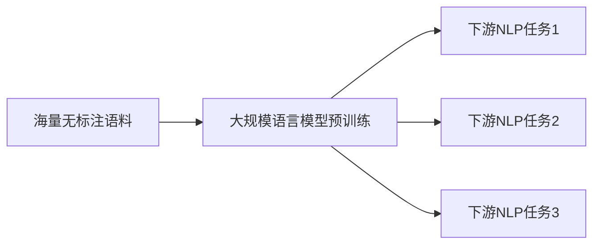

# 大规模语言模型从理论到实践 实践思考

## 1.背景介绍
### 1.1 大规模语言模型的发展历程
#### 1.1.1 早期的语言模型
#### 1.1.2 神经网络语言模型的兴起  
#### 1.1.3 Transformer的出现与发展
### 1.2 大规模语言模型的意义
#### 1.2.1 自然语言处理领域的里程碑
#### 1.2.2 推动人工智能走向通用人工智能
#### 1.2.3 为各行各业带来巨大价值

## 2.核心概念与联系
### 2.1 语言模型的定义与原理
#### 2.1.1 语言模型的数学定义
#### 2.1.2 语言模型的概率解释
#### 2.1.3 语言模型的评估指标
### 2.2 大规模语言模型的特点 
#### 2.2.1 参数量巨大
#### 2.2.2 训练数据量庞大
#### 2.2.3 模型架构复杂
### 2.3 大规模语言模型与其他NLP任务的关系
#### 2.3.1 作为预训练模型
#### 2.3.2 Few-shot与Zero-shot学习
#### 2.3.3 统一各类NLP任务



## 3.核心算法原理具体操作步骤
### 3.1 Transformer结构详解
#### 3.1.1 Self-Attention
#### 3.1.2 Multi-Head Attention
#### 3.1.3 Feed Forward Network
#### 3.1.4 残差连接与Layer Normalization
### 3.2 预训练目标与损失函数
#### 3.2.1 Language Modeling
#### 3.2.2 Masked Language Modeling
#### 3.2.3 Next Sentence Prediction
#### 3.2.4 Permutation Language Modeling
### 3.3 训练优化技巧
#### 3.3.1 学习率调度策略
#### 3.3.2 优化器选择
#### 3.3.3 梯度累积
#### 3.3.4 混合精度训练
#### 3.3.5 模型并行与数据并行

## 4.数学模型和公式详细讲解举例说明
### 4.1 Transformer的数学推导
#### 4.1.1 Self-Attention计算过程
给定查询矩阵$Q$,键矩阵$K$,值矩阵$V$,Self-Attention的计算公式为:

$$Attention(Q,K,V)=softmax(\frac{QK^T}{\sqrt{d_k}})V$$

其中$d_k$为键向量的维度。

#### 4.1.2 Multi-Head Attention计算过程
Multi-Head Attention将$Q$,$K$,$V$通过线性变换投影到$h$个不同的子空间,然后在每个子空间内并行计算Scaled Dot-Product Attention,最后将所有结果拼接起来再经过一个线性变换得到最终输出。公式如下:

$$MultiHead(Q,K,V)=Concat(head_1,...,head_h)W^O$$

$$head_i=Attention(QW_i^Q,KW_i^K,VW_i^V)$$

其中$W_i^Q \in \mathbb{R}^{d_model \times d_k}, W_i^K \in \mathbb{R}^{d_model \times d_k}, W_i^V \in \mathbb{R}^{d_model \times d_v}, W^O \in \mathbb{R}^{hd_v \times d_model}$

### 4.2 预训练目标的数学解释
#### 4.2.1 Language Modeling目标
给定上文单词序列$w_1,w_2,...,w_t$,语言模型的目标是最大化下一个单词$w_{t+1}$的条件概率:
$$\mathcal{L}_{LM}=\sum_{i=1}^{n}\log P(w_i|w_1,...,w_{i-1};\theta)$$

#### 4.2.2 Masked Language Modeling目标
随机Mask掉输入序列中的部分单词,然后最大化被Mask单词的条件概率:
$$\mathcal{L}_{MLM}=\sum_{i=1}^{|\mathcal{C}|}\log P(w_i|\mathcal{C}_{\setminus i};\theta)$$
其中$\mathcal{C}$为输入序列,$\mathcal{C}_{\setminus i}$表示去掉位置$i$的输入序列。

## 5.项目实践：代码实例和详细解释说明
### 5.1 使用Hugging Face Transformers库加载预训练模型
```python
from transformers import AutoTokenizer, AutoModel

tokenizer = AutoTokenizer.from_pretrained("bert-base-uncased")
model = AutoModel.from_pretrained("bert-base-uncased")
```
以上代码使用Hugging Face的Transformers库加载了预训练的BERT模型。`AutoTokenizer`会自动检测模型类型并加载对应的tokenizer,`AutoModel`则加载模型本身。`from_pretrained`方法指定了模型名称,这里使用的是未经过case的BERT Base模型。

### 5.2 使用预训练模型进行特征提取
```python
inputs = tokenizer("Hello world!", return_tensors="pt")
outputs = model(**inputs)
last_hidden_states = outputs.last_hidden_state 
```
将输入文本传递给tokenizer进行编码,然后将编码结果传给预训练模型,即可得到模型的输出。`last_hidden_state`表示模型最后一层的隐藏状态,可以作为下游任务的输入特征。

### 5.3 微调预训练模型用于下游任务
```python
from transformers import AutoModelForSequenceClassification

model = AutoModelForSequenceClassification.from_pretrained("bert-base-uncased", num_labels=2)

outputs = model(**inputs, labels=labels)
loss = outputs.loss
loss.backward()
optimizer.step()
```
加载用于序列分类任务的BERT模型,然后将任务的标签数传给`num_labels`参数。训练时将编码后的输入以及对应的标签传给模型,即可计算loss并进行梯度回传和参数更新。通过这种方式在下游任务的数据集上微调,可以使预训练模型适应具体任务。

## 6.实际应用场景
### 6.1 智能客服
#### 6.1.1 客户意图识别
#### 6.1.2 问题自动应答
#### 6.1.3 情感分析
### 6.2 金融领域
#### 6.2.1 金融文本分类
#### 6.2.2 金融知识图谱构建
#### 6.2.3 股市预测
### 6.3 医疗健康
#### 6.3.1 医疗文献分析
#### 6.3.2 药物说明书解析
#### 6.3.3 医患对话理解
### 6.4 教育领域  
#### 6.4.1 智能作文批改
#### 6.4.2 知识点自动总结
#### 6.4.3 试题自动生成

## 7.工具和资源推荐
### 7.1 开源工具包
- Hugging Face Transformers
- Fairseq
- OpenAI GPT-3 API
### 7.2 预训练模型
- BERT
- GPT
- XLNet
- RoBERTa
- ALBERT
### 7.3 相关论文
- Attention Is All You Need
- BERT: Pre-training of Deep Bidirectional Transformers for Language Understanding
- Language Models are Unsupervised Multitask Learners
- XLNet: Generalized Autoregressive Pretraining for Language Understanding
- RoBERTa: A Robustly Optimized BERT Pretraining Approach

## 8.总结：未来发展趋势与挑战
### 8.1 模型参数量持续增长,训练成本不断提高
### 8.2 模型效率与性能的权衡
### 8.3 低资源语言的建模
### 8.4 多模态大模型的探索 
### 8.5 大模型的可解释性与可控性
### 8.6 大模型的安全与伦理问题

## 9.附录：常见问题与解答
### 9.1 预训练与微调的区别是什么?
预训练是在大规模无标注语料上进行自监督学习,学习通用的语言表征;微调是在特定任务的标注数据集上训练,使预训练模型适应下游任务。预训练是通用的,可用于各种任务;微调是针对特定任务的定制。
### 9.2 如何选择合适的预训练模型?
主要考虑以下因素:
1)模型大小与性能的平衡
2)与任务的相关性,如任务类型、语言、领域等
3)资源限制,如显存、推理速度要求等
一般来说,在资源允许的情况下,优先考虑大模型。对于特定领域的任务,使用该领域的预训练模型效果会更好。
### 9.3 预训练的模型是否还需要在下游任务上从头训练?  
不需要从头训练,这是预训练的优势所在。预训练模型已经学习了大量语言知识,在下游任务上只需要进行简单的微调即可。当然,如果下游任务的数据与预训练数据差异很大,为了获得更好的效果,也可以考虑增大微调的力度。
### 9.4 大规模语言模型是否有助于推动AGI的发展?
大规模语言模型在通用自然语言理解与生成方面展现了强大的能力,一定程度上体现了通用人工智能的特点。但目前的模型仍然有很多局限性,如常识推理能力不足,缺乏可解释性,难以适应全新的任务等。未来仍需在认知、推理、学习、交互等多个层面取得突破,才有望最终实现AGI。大规模语言模型为其提供了重要的基础,但仍有很长的路要走。

作者：禅与计算机程序设计艺术 / Zen and the Art of Computer Programming