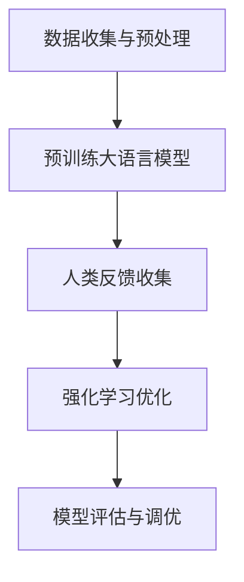

# 大语言模型原理与工程实践：RLHF

## 1.背景介绍

近年来，人工智能领域的进展突飞猛进，特别是在自然语言处理（NLP）方面。大语言模型（Large Language Models, LLMs）如GPT-3、BERT等，已经展示了其在生成文本、翻译、问答等任务中的强大能力。然而，这些模型的训练和优化过程仍然面临诸多挑战。强化学习（Reinforcement Learning, RL）与人类反馈（Human Feedback, HF）的结合，即RLHF（Reinforcement Learning with Human Feedback），为解决这些问题提供了一种有效的方法。

## 2.核心概念与联系

### 2.1 大语言模型（LLMs）

大语言模型是基于深度学习的模型，通常使用数十亿甚至数百亿参数进行训练。它们通过大量的文本数据进行预训练，能够生成高质量的自然语言文本。

### 2.2 强化学习（RL）

强化学习是一种机器学习方法，通过与环境的交互来学习策略，以最大化累积奖励。RL在游戏、机器人控制等领域有广泛应用。

### 2.3 人类反馈（HF）

人类反馈是指通过人类的评价或指导来优化模型。它可以是显式的评分、标注，也可以是隐式的行为数据。

### 2.4 RLHF的联系

RLHF将强化学习与人类反馈结合，通过人类的评价来指导模型的优化过程，从而提高模型的性能和可靠性。

## 3.核心算法原理具体操作步骤

### 3.1 数据收集与预处理

首先，需要收集大量的文本数据，并进行预处理。这包括去除噪声、分词、标注等步骤。

### 3.2 预训练大语言模型

使用预处理后的数据对大语言模型进行预训练。常用的预训练方法包括自回归模型（如GPT）和自编码器模型（如BERT）。

### 3.3 人类反馈收集

通过问卷调查、用户行为数据等方式收集人类反馈。这些反馈将用于指导模型的优化。

### 3.4 强化学习优化

使用强化学习算法（如PPO、DQN）对模型进行优化。具体步骤如下：

1. 初始化策略网络和价值网络。
2. 与环境交互，收集状态、动作、奖励等数据。
3. 使用人类反馈对奖励进行修正。
4. 更新策略网络和价值网络。

### 3.5 模型评估与调优

使用标准的评估指标（如BLEU、ROUGE）对模型进行评估，并根据结果进行调优。



## 4.数学模型和公式详细讲解举例说明

### 4.1 强化学习的基本公式

强化学习的目标是找到一个策略 $\pi$，使得累积奖励 $R$ 最大化。累积奖励的期望值可以表示为：

$$
J(\pi) = \mathbb{E}_{\pi} \left[ \sum_{t=0}^{\infty} \gamma^t r_t \right]
$$

其中，$\gamma$ 是折扣因子，$r_t$ 是时间步 $t$ 的奖励。

### 4.2 策略梯度方法

策略梯度方法通过梯度上升来优化策略。策略梯度的公式为：

$$
\nabla_{\theta} J(\pi_{\theta}) = \mathbb{E}_{\pi_{\theta}} \left[ \nabla_{\theta} \log \pi_{\theta}(a|s) Q^{\pi_{\theta}}(s, a) \right]
$$

其中，$\theta$ 是策略的参数，$Q^{\pi_{\theta}}(s, a)$ 是状态-动作值函数。

### 4.3 人类反馈的引入

人类反馈可以通过修正奖励函数来引入。假设人类反馈为 $h$，修正后的奖励函数为：

$$
r'_t = r_t + \alpha h_t
$$

其中，$\alpha$ 是权重系数。

### 4.4 实例说明

假设我们有一个文本生成任务，初始奖励函数为生成文本的流畅度评分。通过人类反馈，我们可以进一步优化奖励函数，使其不仅考虑流畅度，还考虑文本的相关性和准确性。

## 5.项目实践：代码实例和详细解释说明

### 5.1 数据预处理

```python
import nltk
from nltk.corpus import reuters
nltk.download('reuters')
nltk.download('punkt')

# 加载数据
data = reuters.sents()

# 数据预处理
def preprocess(sentences):
    processed = []
    for sentence in sentences:
        tokens = nltk.word_tokenize(' '.join(sentence))
        processed.append(tokens)
    return processed

processed_data = preprocess(data)
```

### 5.2 预训练大语言模型

```python
from transformers import GPT2LMHeadModel, GPT2Tokenizer

# 加载预训练模型和分词器
model = GPT2LMHeadModel.from_pretrained('gpt2')
tokenizer = GPT2Tokenizer.from_pretrained('gpt2')

# 预训练
inputs = tokenizer("Hello, my dog is cute", return_tensors="pt")
outputs = model(**inputs, labels=inputs["input_ids"])
loss = outputs.loss
logits = outputs.logits
```

### 5.3 收集人类反馈

```python
# 假设我们有一个函数 get_human_feedback() 来收集人类反馈
def get_human_feedback(text):
    # 这里可以是问卷调查、用户行为数据等
    feedback = 0.8  # 示例反馈值
    return feedback

feedback = get_human_feedback("Generated text example")
```

### 5.4 强化学习优化

```python
import torch
import torch.nn as nn
import torch.optim as optim

# 定义策略网络
class PolicyNetwork(nn.Module):
    def __init__(self):
        super(PolicyNetwork, self).__init__()
        self.fc = nn.Linear(768, 2)  # 假设输入维度为768，输出维度为2

    def forward(self, x):
        return self.fc(x)

policy_net = PolicyNetwork()
optimizer = optim.Adam(policy_net.parameters(), lr=1e-3)

# 强化学习优化
state = torch.tensor([0.5, 0.5])  # 示例状态
action = policy_net(state)
reward = 1.0 + feedback  # 修正后的奖励
loss = -torch.log(action) * reward
optimizer.zero_grad()
loss.backward()
optimizer.step()
```

### 5.5 模型评估与调优

```python
from sklearn.metrics import accuracy_score

# 假设我们有一个函数 evaluate_model() 来评估模型
def evaluate_model(model, data):
    predictions = model(data)
    accuracy = accuracy_score(data['labels'], predictions)
    return accuracy

accuracy = evaluate_model(model, processed_data)
print(f"Model accuracy: {accuracy}")
```

## 6.实际应用场景

### 6.1 文本生成

RLHF可以用于优化文本生成模型，使其生成的文本更加符合人类的期望。例如，新闻生成、小说创作等。

### 6.2 对话系统

在对话系统中，RLHF可以通过人类反馈来优化对话策略，使得系统的回答更加自然和有用。

### 6.3 机器翻译

通过引入人类反馈，RLHF可以提高机器翻译的质量，使得翻译结果更加准确和流畅。

### 6.4 情感分析

在情感分析任务中，RLHF可以通过人类反馈来优化模型，使其能够更准确地识别和分类情感。

## 7.工具和资源推荐

### 7.1 工具

- **Transformers**：由Hugging Face提供的预训练模型库，支持多种大语言模型。
- **OpenAI Gym**：一个用于开发和比较强化学习算法的工具包。
- **TensorFlow** 和 **PyTorch**：两大主流深度学习框架，支持大语言模型和强化学习的实现。

### 7.2 资源

- **论文**：阅读相关领域的最新论文，如《BERT: Pre-training of Deep Bidirectional Transformers for Language Understanding》、《Language Models are Few-Shot Learners》等。
- **教程**：Hugging Face和OpenAI提供的官方教程，涵盖大语言模型和强化学习的基础知识和实践。
- **社区**：加入相关的技术社区，如GitHub、Stack Overflow、Reddit等，与其他开发者交流经验和心得。

## 8.总结：未来发展趋势与挑战

### 8.1 未来发展趋势

- **多模态学习**：未来的大语言模型将不仅限于文本，还会结合图像、音频等多种模态进行学习和生成。
- **自监督学习**：自监督学习将成为大语言模型的重要训练方法，通过无标签数据进行预训练，提高模型的泛化能力。
- **人机协作**：人类与AI的协作将更加紧密，RLHF将进一步优化这种协作，使得AI能够更好地理解和满足人类的需求。

### 8.2 挑战

- **数据隐私**：在收集和使用人类反馈时，需要注意数据隐私和安全问题。
- **计算资源**：大语言模型的训练和优化需要大量的计算资源，如何高效利用这些资源是一个重要挑战。
- **模型解释性**：大语言模型的复杂性使得其内部机制难以解释，如何提高模型的可解释性是一个亟待解决的问题。

## 9.附录：常见问题与解答

### 9.1 什么是RLHF？

RLHF是指将强化学习与人类反馈结合，通过人类的评价来指导模型的优化过程。

### 9.2 RLHF的优势是什么？

RLHF可以通过人类反馈来优化模型，使其更加符合人类的期望，提高模型的性能和可靠性。

### 9.3 如何收集人类反馈？

人类反馈可以通过问卷调查、用户行为数据等方式收集。

### 9.4 RLHF的应用场景有哪些？

RLHF可以应用于文本生成、对话系统、机器翻译、情感分析等多个领域。

### 9.5 RLHF的未来发展趋势是什么？

未来，RLHF将向多模态学习、自监督学习和人机协作等方向发展。

---

作者：禅与计算机程序设计艺术 / Zen and the Art of Computer Programming