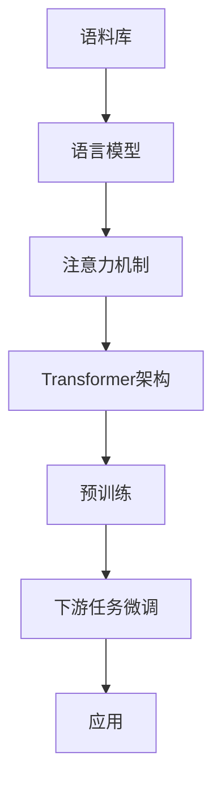

# 大语言模型原理与工程实践：ROOTS

## 1. 背景介绍

### 1.1 大语言模型的发展历程

#### 1.1.1 早期的语言模型
#### 1.1.2 神经网络语言模型的兴起  
#### 1.1.3 Transformer 的革命性突破

### 1.2 大语言模型的应用领域

#### 1.2.1 自然语言处理
#### 1.2.2 对话系统
#### 1.2.3 文本生成

### 1.3 大语言模型面临的挑战

#### 1.3.1 计算资源的限制
#### 1.3.2 数据质量和多样性不足
#### 1.3.3 模型泛化能力有待提高

## 2. 核心概念与联系

### 2.1 语言模型

#### 2.1.1 定义与目标
#### 2.1.2 统计语言模型
#### 2.1.3 神经网络语言模型

### 2.2 注意力机制

#### 2.2.1 注意力机制的基本原理 
#### 2.2.2 自注意力机制
#### 2.2.3 多头注意力机制

### 2.3 Transformer 架构

#### 2.3.1 编码器-解码器结构
#### 2.3.2 位置编码
#### 2.3.3 残差连接与层归一化

### 2.4 预训练与微调

#### 2.4.1 无监督预训练
#### 2.4.2 有监督微调
#### 2.4.3 零样本学习与少样本学习



## 3. 核心算法原理具体操作步骤

### 3.1 Transformer 的编码器

#### 3.1.1 输入嵌入与位置编码
#### 3.1.2 多头自注意力层
#### 3.1.3 前馈神经网络层

### 3.2 Transformer 的解码器  

#### 3.2.1 目标序列的输入嵌入与位置编码
#### 3.2.2 遮挡的多头自注意力层
#### 3.2.3 编码-解码注意力层
#### 3.2.4 前馈神经网络层

### 3.3 预训练目标与损失函数

#### 3.3.1 语言模型目标
#### 3.3.2 去噪自编码目标
#### 3.3.3 对比学习目标

### 3.4 微调与推理

#### 3.4.1 下游任务的微调策略 
#### 3.4.2 提示学习
#### 3.4.3 推理加速技术

## 4. 数学模型和公式详细讲解举例说明

### 4.1 Transformer 的数学表示

#### 4.1.1 自注意力机制的数学推导
$$
Attention(Q,K,V) = softmax(\frac{QK^T}{\sqrt{d_k}})V
$$
其中，$Q$、$K$、$V$ 分别表示查询、键、值矩阵，$d_k$ 为键向量的维度。

#### 4.1.2 多头注意力的数学表示
$$
MultiHead(Q,K,V) = Concat(head_1, ..., head_h)W^O \\
head_i = Attention(QW_i^Q, KW_i^K, VW_i^V)
$$
其中，$W_i^Q$、$W_i^K$、$W_i^V$ 为第 $i$ 个头的权重矩阵，$W^O$ 为输出的线性变换矩阵。

#### 4.1.3 前馈神经网络层的数学表示 
$$
FFN(x) = max(0, xW_1 + b_1)W_2 + b_2
$$
其中，$W_1$、$W_2$ 为权重矩阵，$b_1$、$b_2$ 为偏置项。

### 4.2 语言模型的概率计算

#### 4.2.1 序列概率的分解
$$
P(x_1, ..., x_n) = \prod_{i=1}^n P(x_i|x_1, ..., x_{i-1})
$$

#### 4.2.2 交叉熵损失函数
$$
L_{LM} = -\frac{1}{n}\sum_{i=1}^n \log P(x_i|x_1, ..., x_{i-1})
$$

### 4.3 预训练目标的数学表示

#### 4.3.1 去噪自编码目标
$$
L_{DAE} = -\frac{1}{n}\sum_{i=1}^n \log P(x_i|\tilde{x}_1, ..., \tilde{x}_n)
$$
其中，$\tilde{x}_1, ..., \tilde{x}_n$ 为加入噪声的输入序列。

#### 4.3.2 对比学习目标
$$
L_{CL} = -\frac{1}{N}\sum_{i=1}^N \log \frac{e^{sim(h_i, h_i^+)/\tau}}{\sum_{j=1}^N e^{sim(h_i, h_j)/\tau}}
$$
其中，$h_i$ 为第 $i$ 个样本的表示，$h_i^+$ 为其正样本，$\tau$ 为温度超参数。

## 5. 项目实践：代码实例和详细解释说明

### 5.1 使用 PyTorch 实现 Transformer

#### 5.1.1 定义 Transformer 模型类
```python
class Transformer(nn.Module):
    def __init__(self, ...):
        super().__init__()
        self.encoder = TransformerEncoder(...)
        self.decoder = TransformerDecoder(...)
        ...
```

#### 5.1.2 实现自注意力机制
```python
class SelfAttention(nn.Module):
    def forward(self, query, key, value, mask=None):
        scores = torch.matmul(query, key.transpose(-2, -1)) / math.sqrt(d_k)
        if mask is not None:
            scores = scores.masked_fill(mask == 0, -1e9)
        p_attn = F.softmax(scores, dim=-1)
        return torch.matmul(p_attn, value)
```

#### 5.1.3 实现前馈神经网络层
```python
class PositionwiseFeedForward(nn.Module):
    def forward(self, x):
        return self.w_2(F.relu(self.w_1(x)))
```

### 5.2 使用 TensorFlow 实现 BERT 预训练

#### 5.2.1 定义 BERT 模型类
```python
class BERT(tf.keras.Model):
    def __init__(self, ...):
        super().__init__()
        self.embedding = BERTEmbedding(...)
        self.encoder = TransformerEncoder(...)
        ...
```

#### 5.2.2 实现 MLM 和 NSP 损失函数
```python
def mlm_loss(labels, logits):
    loss = tf.keras.losses.sparse_categorical_crossentropy(labels, logits, from_logits=True)
    return tf.reduce_mean(loss)

def nsp_loss(labels, logits):
    loss = tf.keras.losses.sparse_categorical_crossentropy(labels, logits, from_logits=True)
    return tf.reduce_mean(loss)
```

#### 5.2.3 定义预训练流程
```python
@tf.function
def train_step(inputs):
    with tf.GradientTape() as tape:
        mlm_logits, nsp_logits = model(inputs)
        mlm_loss_val = mlm_loss(inputs["masked_lm_ids"], mlm_logits)
        nsp_loss_val = nsp_loss(inputs["next_sentence_label"], nsp_logits)
        total_loss = mlm_loss_val + nsp_loss_val
    gradients = tape.gradient(total_loss, model.trainable_variables)
    optimizer.apply_gradients(zip(gradients, model.trainable_variables))
    return total_loss
```

## 6. 实际应用场景

### 6.1 文本分类

#### 6.1.1 情感分析
#### 6.1.2 主题分类
#### 6.1.3 意图识别

### 6.2 命名实体识别

#### 6.2.1 人名识别
#### 6.2.2 地名识别
#### 6.2.3 组织机构名识别

### 6.3 问答系统

#### 6.3.1 阅读理解式问答
#### 6.3.2 知识库问答
#### 6.3.3 对话式问答

### 6.4 机器翻译

#### 6.4.1 神经机器翻译
#### 6.4.2 无监督机器翻译
#### 6.4.3 多语言机器翻译

## 7. 工具和资源推荐

### 7.1 开源工具包

#### 7.1.1 Hugging Face Transformers
#### 7.1.2 Fairseq
#### 7.1.3 OpenNMT

### 7.2 预训练模型

#### 7.2.1 BERT
#### 7.2.2 GPT 系列
#### 7.2.3 T5

### 7.3 数据集

#### 7.3.1 Wikipedia
#### 7.3.2 BookCorpus
#### 7.3.3 Common Crawl

### 7.4 计算资源

#### 7.4.1 Google Colab
#### 7.4.2 AWS EC2
#### 7.4.3 TPU

## 8. 总结：未来发展趋势与挑战

### 8.1 模型规模的增长

#### 8.1.1 参数量的增加
#### 8.1.2 计算效率的提升
#### 8.1.3 模型压缩与加速

### 8.2 多模态学习

#### 8.2.1 文本-图像预训练模型
#### 8.2.2 文本-语音预训练模型
#### 8.2.3 多模态融合与对齐

### 8.3 知识增强

#### 8.3.1 知识图谱的融合
#### 8.3.2 常识推理能力
#### 8.3.3 可解释性与可控性

### 8.4 人机交互

#### 8.4.1 对话系统的进展
#### 8.4.2 人机协作与反馈学习
#### 8.4.3 伦理与安全考量

## 9. 附录：常见问题与解答

### 9.1 如何选择合适的预训练模型？
根据任务的特点和数据的性质，选择适合的预训练模型架构和规模。考虑模型的性能、效率和可用资源。

### 9.2 预训练模型的微调有哪些技巧？
合理设置学习率、批次大小和训练轮数。根据任务的特点，选择合适的微调策略，如特定层的微调、提示学习等。

### 9.3 如何处理预训练模型的过拟合问题？
采用正则化技术，如权重衰减、dropout等。合理控制微调的步数和学习率。必要时进行数据增强和交叉验证。

### 9.4 大语言模型在实际应用中还有哪些局限性？
模型的泛化能力有待提高，对于领域外的数据可能表现欠佳。推理速度和资源消耗较大，不适合部署在资源受限的环境中。此外，模型可能产生有偏见、不道德或有害的输出，需要谨慎地进行引导和约束。

作者：禅与计算机程序设计艺术 / Zen and the Art of Computer Programming