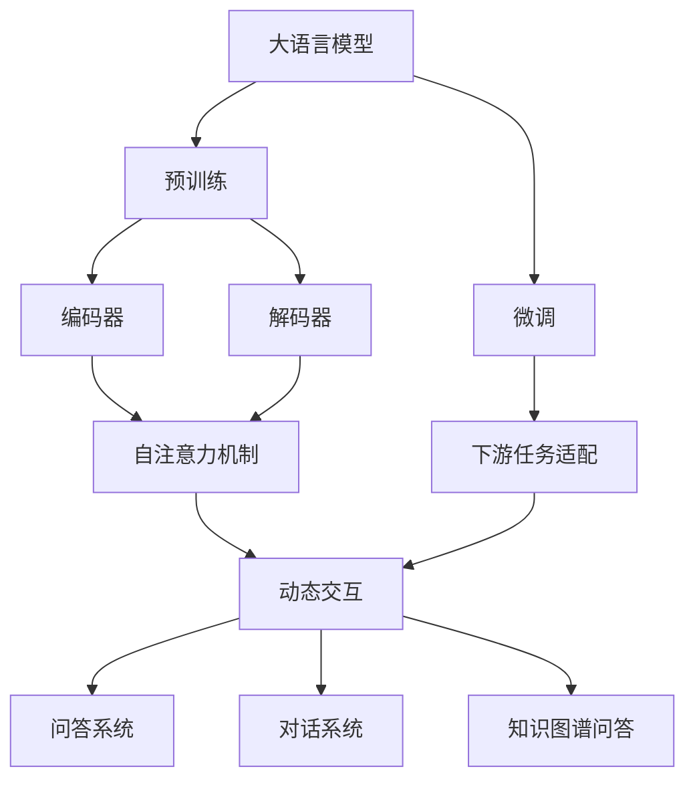

# 大语言模型原理与工程实践：动态交互

## 1. 背景介绍
### 1.1 大语言模型的发展历程
#### 1.1.1 早期的语言模型
#### 1.1.2 Transformer的出现
#### 1.1.3 预训练语言模型的崛起

### 1.2 动态交互的重要性
#### 1.2.1 传统语言模型的局限性  
#### 1.2.2 动态交互带来的机遇
#### 1.2.3 动态交互在实际应用中的价值

### 1.3 本文的主要内容和贡献
#### 1.3.1 探讨大语言模型的原理 
#### 1.3.2 阐述动态交互的实现方法
#### 1.3.3 分享工程实践经验

## 2. 核心概念与联系
### 2.1 大语言模型
#### 2.1.1 定义和特点
#### 2.1.2 主要架构和技术路线
#### 2.1.3 预训练和微调

### 2.2 动态交互
#### 2.2.1 定义和内涵
#### 2.2.2 与传统静态交互的区别
#### 2.2.3 实现动态交互的关键技术

### 2.3 大语言模型与动态交互的关系
#### 2.3.1 大语言模型为动态交互提供基础
#### 2.3.2 动态交互拓展了大语言模型的应用空间
#### 2.3.3 两者相辅相成、互为促进



## 3. 核心算法原理具体操作步骤
### 3.1 Transformer结构详解
#### 3.1.1 编码器
#### 3.1.2 解码器  
#### 3.1.3 自注意力机制

### 3.2 预训练算法
#### 3.2.1 BERT
#### 3.2.2 GPT
#### 3.2.3 XLNet

### 3.3 微调算法
#### 3.3.1 Adapter
#### 3.3.2 Prompt Learning
#### 3.3.3 Prefix-Tuning

### 3.4 动态交互算法
#### 3.4.1 基于检索的方法
#### 3.4.2 基于知识图谱的方法
#### 3.4.3 基于强化学习的方法

## 4. 数学模型和公式详细讲解举例说明
### 4.1 Transformer的数学表示
#### 4.1.1 编码器的数学表示
编码器的计算过程可以用以下公式表示：

$$
\begin{aligned}
Q &= X W^Q \\
K &= X W^K \\
V &= X W^V \\
Z &= \text{softmax}(\frac{QK^T}{\sqrt{d_k}})V
\end{aligned}
$$

其中，$X$为输入序列的嵌入表示，$W^Q$、$W^K$、$W^V$为可学习的权重矩阵，$d_k$为$K$的维度。

#### 4.1.2 解码器的数学表示
解码器的计算过程与编码器类似，但多了一个masked self-attention：

$$
\begin{aligned}
Q &= Y W^Q \\
K &= Y W^K \\
V &= Y W^V \\
Z &= \text{softmax}(\frac{QK^T}{\sqrt{d_k}} + M)V
\end{aligned}
$$

其中，$Y$为目标序列的嵌入表示，$M$为mask矩阵，用于防止解码器看到未来的信息。

#### 4.1.3 自注意力机制的数学表示
自注意力机制可以用下面的公式来表示：

$$
\text{Attention}(Q, K, V) = \text{softmax}(\frac{QK^T}{\sqrt{d_k}})V
$$

它计算query和key的相似度，然后用相似度对value进行加权求和。

### 4.2 预训练的数学原理
#### 4.2.1 BERT的数学原理
BERT的预训练损失函数由两部分组成：

$$
\mathcal{L} = \mathcal{L}_{MLM} + \mathcal{L}_{NSP}
$$

其中，$\mathcal{L}_{MLM}$为masked language model的损失，$\mathcal{L}_{NSP}$为next sentence prediction的损失。

#### 4.2.2 GPT的数学原理 
GPT的预训练损失函数为language modeling的负对数似然：

$$
\mathcal{L}_{LM} = -\sum_{i=1}^n \log P(w_i|w_{<i})
$$

其中，$w_i$为第$i$个token，$w_{<i}$为$w_i$之前的所有token。

### 4.3 微调的数学原理
#### 4.3.1 Adapter的数学原理
Adapter在Transformer的每一层中加入了一个bottleneck结构：

$$
\begin{aligned}
h &= \text{LN}(x) \\
h_a &= \text{ReLU}(h W_{down}) W_{up} \\
x' &= x + h_a
\end{aligned}
$$

其中，$x$为输入，$W_{down}$和$W_{up}$为可学习的参数矩阵，$\text{LN}$为layer normalization。

#### 4.3.2 Prompt Learning的数学原理
Prompt Learning将下游任务转化为语言建模任务。以分类任务为例，模型的输出概率为：

$$
P(y|x) = \frac{\exp(w_y^T h_{[\text{MASK}]})}{\sum_{y' \in \mathcal{Y}} \exp(w_{y'}^T h_{[\text{MASK}]})}
$$

其中，$h_{[\text{MASK}]}$为[MASK]位置的隐藏状态，$w_y$为标签$y$对应的向量。

## 5. 项目实践：代码实例和详细解释说明
下面是一个使用PyTorch实现BERT预训练的代码示例：

```python
import torch
import torch.nn as nn

class BertPretraining(nn.Module):
    def __init__(self, bert_model):
        super().__init__()
        self.bert = bert_model
        self.cls = nn.Linear(self.bert.config.hidden_size, 2)
        self.lm = nn.Linear(self.bert.config.hidden_size, self.bert.config.vocab_size)
        
    def forward(self, input_ids, attention_mask, token_type_ids, masked_lm_labels, next_sentence_label):
        outputs = self.bert(input_ids, attention_mask=attention_mask, token_type_ids=token_type_ids)
        
        # MLM的输出
        sequence_output = outputs[0]  
        prediction_scores = self.lm(sequence_output)
        
        # NSP的输出
        pooled_output = outputs[1]
        seq_relationship_score = self.cls(pooled_output)
        
        total_loss = None
        if masked_lm_labels is not None and next_sentence_label is not None:
            loss_fct = nn.CrossEntropyLoss()
            masked_lm_loss = loss_fct(prediction_scores.view(-1, self.bert.config.vocab_size), masked_lm_labels.view(-1))
            next_sentence_loss = loss_fct(seq_relationship_score.view(-1, 2), next_sentence_label.view(-1))
            total_loss = masked_lm_loss + next_sentence_loss
            
        return total_loss, prediction_scores, seq_relationship_score
```

这段代码定义了一个`BertPretraining`类，用于BERT的预训练。它包含以下几个部分：

1. `__init__`方法：初始化BERT模型、MLM的输出层和NSP的输出层。
2. `forward`方法：定义前向传播的计算过程。它首先将输入传入BERT模型，然后分别计算MLM和NSP的输出。如果提供了标签，则计算MLM和NSP的损失，并将它们相加得到总损失。

在实际使用时，我们可以将这个模型放到PyTorch的训练流程中，并使用大规模无监督数据进行预训练。预训练完成后，我们可以将BERT模型应用到下游任务中，并进行微调。

## 6. 实际应用场景
### 6.1 智能客服
大语言模型与动态交互技术可以应用于智能客服系统，提供个性化、上下文相关的客户服务。系统可以理解客户的问题，并根据知识库和历史对话信息动态生成回复。

### 6.2 智能教育
在智能教育领域，大语言模型可以用于开发智能辅导系统。系统可以根据学生的提问和学习进度，动态生成解释和练习题，提供个性化的学习体验。

### 6.3 医疗问答
大语言模型在医疗领域也有广泛的应用前景。通过在医学知识库上进行预训练，系统可以回答患者的问题，提供可靠的医疗信息。动态交互技术可以让系统根据患者的描述生成个性化的建议。

### 6.4 金融投资分析
在金融领域，大语言模型可以用于分析财经新闻和公司报告，提取关键信息并生成投资建议。动态交互技术可以让系统根据用户的问题和当前市场状况，提供实时的投资分析。

## 7. 工具和资源推荐
### 7.1 开源框架
- Hugging Face Transformers：包含各种预训练语言模型的PyTorch实现。
- OpenAI GPT-3：强大的语言模型API，可用于各种自然语言处理任务。
- Google BERT：Google官方的BERT实现。
- Facebook fairseq：Facebook AI Research的序列建模工具包。

### 7.2 数据集
- Wikipedia：可用于预训练的大规模文本数据集。
- BookCorpus：大量未经过版权保护的书籍数据集。
- Common Crawl：网络爬取得到的大规模文本数据集。
- 领域特定数据集：如医学、金融、法律等领域的文本数据集。

### 7.3 预训练模型
- BERT：适用于各种NLP任务的预训练模型。
- GPT-2/GPT-3：强大的生成式预训练模型。
- XLNet：通过排列语言建模改进的预训练模型。
- RoBERTa：对BERT进行优化改进的预训练模型。

### 7.4 社区与教程  
- Hugging Face社区：分享各种预训练模型和NLP应用的社区。
- PyTorch官方教程：PyTorch的官方入门教程，包括使用Transformer的示例。
- 吴恩达的《深度学习》课程：深入浅出地讲解深度学习的基础知识。
- CS224n：斯坦福大学的自然语言处理课程，涵盖了各种经典和前沿的NLP技术。

## 8. 总结：未来发展趋势与挑战
### 8.1 模型的持续改进
随着计算能力的提升和数据规模的增长，大语言模型的性能还将不断提高。未来的模型会更加强大，能够处理更加复杂的语言理解和生成任务。

### 8.2 多模态交互
未来的语言模型不仅能处理文本，还能与图像、语音等其他模态进行交互。多模态语言模型将为人机交互带来更自然、更丰富的体验。

### 8.3 个性化与适应性
动态交互技术的发展将使语言模型能够更好地适应不同用户的个性化需求。模型将能够根据用户的反馈和行为，不断调整和优化交互策略。

### 8.4 隐私与安全
大语言模型在带来便利的同时，也引发了隐私和安全方面的担忧。如何在保护用户隐私的前提下开发和应用语言模型，将是一个重要的研究课题。

### 8.5 可解释性与可控性
当前的大语言模型还是一个"黑盒"，其内部工作机制难以解释。提高模型的可解释性和可控性，将有助于我们更好地理解和信任语言模型的输出。

## 9. 附录：常见问题与解答
### 9.1 预训练和微调的区别是什么？
预训练是在大规模无监督数据上训练通用的语言表示，而微调是在特定任务的有标注数据上调整预训练模型的参数。预训练是通用的，微调是任务特定的。

### 9.2 为什么要使用动态交互？
动态交互可以让语言模型根据上下文和用户反馈动态地生成回复，提供更加个性化和智能的交互体验。传统的静态交互则是预先定义好的，缺乏灵活性。

### 9.3 大语言模型需要多大的数据集和计算资源？  
训练大语言模型通常需要TB级别的文本数据和数百