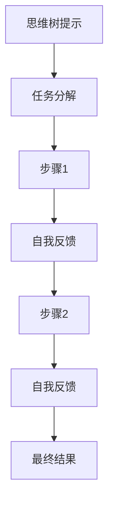
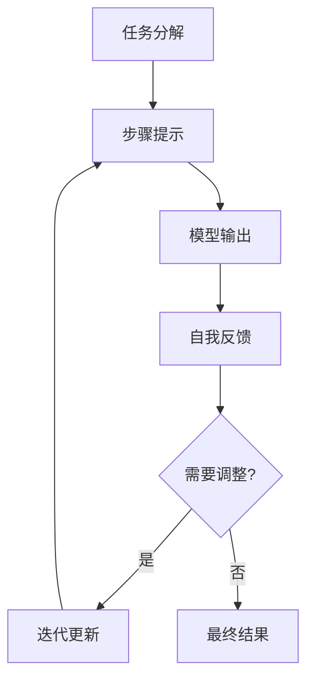

# 大语言模型原理与工程实践：思维树提示

## 1.背景介绍

### 1.1 大语言模型的兴起

近年来,大型语言模型(Large Language Models, LLMs)在自然语言处理(NLP)领域掀起了一场革命。这种基于深度学习的模型能够从海量文本数据中学习语言模式,展现出惊人的语言生成和理解能力。著名的大语言模型包括GPT-3、BERT、XLNet等,它们在机器翻译、文本摘要、问答系统等多个领域取得了突破性进展。

### 1.2 思维树提示的重要性

然而,大语言模型也面临着一些挑战,如缺乏持久记忆、难以理解上下文等。为了充分发挥大语言模型的潜力,思维树提示(Thought-Tree Prompting)应运而生。这种新颖的提示范式旨在引导模型进行多步推理,模拟人类的思维过程,从而提高模型的理解和推理能力。

## 2.核心概念与联系

### 2.1 思维树提示概述

思维树提示是一种交互式提示范式,它将复杂任务分解为一系列可解释的步骤。模型需要逐步完成每个步骤,并在每个步骤后进行自我反馈和调整,最终得出最终结果。这种分步骤的方式模拟了人类的思维过程,有助于提高模型的透明度和可解释性。



### 2.2 与其他提示范式的关系

思维树提示与其他提示范式有着密切联系,但也有独特之处。例如,链式思考(Chain-of-Thought)提示也鼓励模型分步推理,但缺乏自我反馈和调整机制。而反事实提示(Counterfactual Prompting)则侧重于探索不同情景下的结果,而非分步推理。

## 3.核心算法原理具体操作步骤

### 3.1 思维树提示的生成过程

思维树提示的生成过程可分为以下几个步骤:

1. **任务分解**: 将原始任务分解为一系列可解释的子任务或步骤。
2. **步骤提示**: 为每个子任务或步骤生成相应的提示,引导模型完成该步骤。
3. **自我反馈**: 在完成每个步骤后,模型需要对自己的输出进行评估和反馈,确定是否需要调整。
4. **迭代更新**: 根据自我反馈,模型可能需要修正之前的步骤或生成新的步骤,直至得出最终结果。



### 3.2 自我反馈机制

自我反馈机制是思维树提示的关键组成部分。它允许模型在每个步骤后评估自己的输出,并根据需要进行调整。常见的自我反馈方式包括:

1. **输出评估**: 模型评估自己的输出是否合理、完整,是否符合任务要求。
2. **缺失信息识别**: 模型识别自己缺少哪些信息或知识来完成当前步骤。
3. **矛盾检测**: 模型检测自己的输出是否与之前的步骤或背景知识存在矛盾。
4. **不确定性量化**: 模型量化自己对当前输出的不确定程度,以决定是否需要进一步调整。

### 3.3 迭代更新策略

根据自我反馈的结果,模型可能需要采取以下迭代更新策略:

1. **回溯修正**: 模型回溯到之前的步骤,修正存在问题的输出。
2. **插入新步骤**: 模型插入新的步骤来补充缺失的信息或知识。
3. **重新规划**: 模型重新规划后续步骤的执行顺序或内容。
4. **放弃重试**: 如果多次尝试仍无法得到满意结果,模型可能需要放弃当前任务,重新开始。

## 4.数学模型和公式详细讲解举例说明

思维树提示的数学模型通常基于序列生成模型,如GPT等。给定一个提示序列 $X = (x_1, x_2, \dots, x_n)$,模型需要生成相应的输出序列 $Y = (y_1, y_2, \dots, y_m)$。模型的目标是最大化条件概率 $P(Y|X)$,即给定提示序列 $X$ 时,输出序列 $Y$ 的概率。

$$P(Y|X) = \prod_{t=1}^m P(y_t | y_{<t}, X)$$

其中 $y_{<t}$ 表示序列 $Y$ 中位于 $t$ 之前的所有标记。

为了实现思维树提示,我们需要在原始序列生成模型的基础上引入一些额外的机制,如任务分解、自我反馈和迭代更新等。

### 4.1 任务分解模块

任务分解模块的目标是将原始任务分解为一系列子任务或步骤。我们可以将任务分解过程建模为一个序列到序列的转换问题,其中输入是原始任务描述,输出是子任务或步骤的序列。

设原始任务描述为 $T$,子任务序列为 $S = (s_1, s_2, \dots, s_k)$,我们需要最大化条件概率 $P(S|T)$:

$$P(S|T) = \prod_{i=1}^k P(s_i | s_{<i}, T)$$

### 4.2 自我反馈模块

自我反馈模块的目标是评估模型在每个步骤的输出,并生成相应的反馈。我们可以将自我反馈过程建模为一个序列到序列的转换问题,其中输入是当前步骤的输出和相关上下文信息,输出是反馈序列。

设当前步骤的输出为 $O$,上下文信息为 $C$,反馈序列为 $F = (f_1, f_2, \dots, f_l)$,我们需要最大化条件概率 $P(F|O,C)$:

$$P(F|O,C) = \prod_{j=1}^l P(f_j | f_{<j}, O, C)$$

### 4.3 迭代更新模块

迭代更新模块的目标是根据自我反馈的结果,决定是否需要修正之前的步骤或生成新的步骤。我们可以将迭代更新过程建模为一个序列到序列的转换问题,其中输入是当前步骤的输出、自我反馈和相关上下文信息,输出是修正后的步骤序列或新的步骤序列。

设当前步骤的输出为 $O$,自我反馈为 $F$,上下文信息为 $C$,修正后的步骤序列为 $S' = (s'_1, s'_2, \dots, s'_k)$,我们需要最大化条件概率 $P(S'|O,F,C)$:

$$P(S'|O,F,C) = \prod_{i=1}^k P(s'_i | s'_{<i}, O, F, C)$$

通过上述数学模型,我们可以将思维树提示的各个组成部分统一到一个框架中,并利用序列生成模型和强化学习等技术进行训练和优化。

## 5.项目实践:代码实例和详细解释说明

为了更好地理解思维树提示的实现,我们将提供一个基于Python和Hugging Face Transformers库的代码示例。该示例将引导模型完成一个简单的算术问题,并展示思维树提示的分步推理过程。

### 5.1 导入必要的库

```python
import torch
from transformers import AutoModelForCausalLM, AutoTokenizer
```

### 5.2 加载预训练语言模型和分词器

```python
model_name = "gpt2"
model = AutoModelForCausalLM.from_pretrained(model_name)
tokenizer = AutoTokenizer.from_pretrained(model_name)
```

### 5.3 定义思维树提示函数

```python
def thought_tree_prompting(prompt, max_steps=5):
    outputs = []
    current_prompt = prompt
    
    for step in range(max_steps):
        input_ids = tokenizer.encode(current_prompt, return_tensors="pt")
        output = model.generate(input_ids, max_length=1024, num_return_sequences=1)
        output_text = tokenizer.decode(output[0], skip_special_tokens=True)
        outputs.append(output_text)
        
        # 自我反馈和迭代更新
        feedback = input("反馈 (y/n)? ")
        if feedback.lower() == "n":
            break
        else:
            current_prompt = f"{current_prompt}\n{output_text}\n下一步:"
    
    return "\n".join(outputs)
```

这个函数实现了思维树提示的核心逻辑:

1. 将提示编码为模型可以理解的输入张量。
2. 使用语言模型生成输出序列。
3. 解码输出序列,并将其添加到输出列表中。
4. 提示用户提供反馈,如果反馈为"n",则结束迭代;否则,将当前输出添加到提示中,作为下一步的输入。

### 5.4 运行示例

```python
prompt = "计算 3 + 5 的结果。"
output = thought_tree_prompting(prompt)
print(output)
```

预期输出:

```
3 + 5 = 8

反馈 (y/n)? y
下一步:
3 + 5 = 8
因此,3 + 5 的结果是 8。

反馈 (y/n)? n
3 + 5 = 8
因此,3 + 5 的结果是 8。
```

在这个示例中,模型首先计算出 3 + 5 的结果为 8。然后,用户提供反馈"y",表示需要进一步推理。模型随后生成了一个总结性的句子,确认了最终结果。最后,用户提供反馈"n",表示推理过程完成。

通过这个简单的示例,我们可以看到思维树提示如何引导模型进行分步推理,并通过自我反馈和迭代更新来完成任务。在实际应用中,思维树提示可以应用于更复杂的任务,如问答系统、文本摘要等。

## 6.实际应用场景

思维树提示在多个领域都有潜在的应用前景:

### 6.1 问答系统

在问答系统中,思维树提示可以帮助模型更好地理解复杂的问题,并分步骤地推理出答案。通过自我反馈和迭代更新,模型可以不断调整和完善自己的推理过程,提高答案的准确性和可解释性。

### 6.2 文本摘要

对于文本摘要任务,思维树提示可以引导模型先识别文本的主要话题和关键信息,然后逐步生成摘要。自我反馈机制可以帮助模型评估生成的摘要是否完整、连贯,并进行相应的调整。

### 6.3 机器翻译

在机器翻译领域,思维树提示可以帮助模型更好地捕捉源语言和目标语言之间的语义差异。模型可以先分析源语言句子的结构和含义,然后分步骤地将其转换为目标语言。自我反馈机制可以帮助模型检测和纠正翻译过程中的错误或矛盾。

### 6.4 写作辅助

思维树提示也可以应用于写作辅助系统,帮助用户组织思路、构建大纲和撰写文章。模型可以根据用户的输入,分步骤地生成文章的不同部分,如引言、正文和结论。用户可以通过自我反馈机制评估生成的内容,并进行必要的修改和完善。

## 7.工具和资源推荐

### 7.1 开源库和框架

- **Hugging Face Transformers**: 一个流行的自然语言处理库,提供了大量预训练语言模型和相关工具。
- **Anthropic Constitutional AI**: 一个专注于可解释和可控AI的开源库,包含了思维树提示等技术的实现。
- **OpenAI InstructGPT**: 一个基于GPT-3的开源模型,支持思维链式推理和自我反馈机制。

### 7.2 在线演示和教程

- **Anthropic Constitutional AI Playground**: 一个在线演示平台,允许用户